# BetterCMS — Engineering Handoff and Production Architecture Plan

> Generated by auditing the complete repository ("Content Canvas") against the master brief in `ENGINEERING_HANDOFF_PROMPT.md`. The frontend application is the product specification: every screen, flow, store, and guard described here exists and runs in the browser today. This document tells an engineering team exactly what exists, what is simulated, what is missing, and how to build the production platform.

**How to read this document**

- Every capability is labeled with one of four statuses:
  - **[EXISTING]** — implemented and working in the browser today (client-side).
  - **[SIMULATED]** — the full UX exists and works, but the behavior is faked client-side (in-memory or localStorage); production needs a real service behind the same contract.
  - **[MISSING]** — not present in any form; must be designed and built.
  - **[RECOMMENDED]** — our proposed production implementation or decision.
- The module stores in `src/lib/**` are the draft API contract. Production work is, in one sentence: replace each store's internals with a real backend while keeping the same action signatures, so the UI barely changes.
- Companion documents in the repo: `APPLICATION_BLUEPRINT.md` (product overview), `DESIGN_SYSTEM.md` (visual tokens), `AGENT_PLAN.md` (AI subsystem background), `WORKSPACE_AUDIT.md` (settings audit), `DESIGN_CONTROLS.md` (section design decisions), `SEARCH_PLAN.md` (search decisions), `COPY_GUIDE.md` (product copy rules).
- Diagrams are Mermaid; any renderer (GitHub, VS Code, Notion) displays them.

**Document map**

- Part I — The product today: §2 repository audit, §3 frontend architecture, §4 feature inventory, §5–6 screen-by-screen (every button).
- Part II — Foundations: §7 roles and permissions, §8 security and auth, §9 multi-tenancy, §10 domain model, §11 database design.
- Part III — Services: §12 backend architecture, §13 application API, §14 content delivery API, §15 MCP server specification.
- Part IV — Subsystem deep dives: §16 rich text and markdown, §17 visual design mode, §18 schema management, §19 workflows, §20 publishing, §21 search.
- Part V — Platform systems: §22 assets, §23 notifications, §24 integrations and webhooks, §25 AI architecture, §26 real-time collaboration, §27 background jobs, §28 billing and metering, §29 analytics, §30 audit logs.
- Part VI — Production readiness: §31 errors, §32 observability, §33 testing, §34 devops, §35 stack, §36 build vs buy, §37 costs, §38 estimates, §39 roadmap (including the three-day plan), §40 first tickets, §41 founder decisions, §42 risks, §43 definition of done, §44 the path from demo to production.

---
## 1. Executive Summary

**What this is.** BetterCMS is a multi-workspace, multi-project, AI-first CMS competing in the Sanity / Contentful / Webflow / BaseHub space, with four product pillars: structured content with true visual editing, an AI agent that plans before it acts, AI-answer-engine delivery (every page also ships as markdown), and enterprise-grade controls (roles, governance, audit). The repository audited here is a **frontend-complete product specification**: 84 routes, roughly 40 domain stores, and every screen, button, permission gate, and state of the intended product, all working in the browser against seeded demo data.

**The single most important engineering fact.** The application's module stores (`src/lib/**`) are not throwaway prototype code — they are the draft API contract. Each store exposes action functions with clean signatures (`entryActions.publish(id)`, `workflowActions.request(entryId, {kind, memberIds, note, due})`, `searchActions.setField(projectId, collectionId, field, on)`); production work is to stand up services behind those same signatures and swap store internals for API clients, feature by feature, without rewriting the UI. Section 13 derives ~90 REST endpoints directly from these actions; the three-day plan in §39 proves the seam by strangling one store (pages) first.

**What is real today vs simulated.** Only a few subsystems touch a real backend: Supabase email auth, a partially-real Supabase comments layer (with SQL migrations and realtime), Supabase-backed member/role queries, and one real API route (`POST /api/public/forms/:formId/submit`). Everything else — publishing, media uploads, AI runs, presence, analytics, billing, webhooks, transfers, search infrastructure — is a **high-fidelity simulation**: the UX is finished and correct, the persistence is in-memory or localStorage. This is a strength: engineering inherits a fully specified product with zero ambiguity about intended behavior, and this document labels every capability [EXISTING], [SIMULATED], [MISSING], or [RECOMMENDED] so nothing is overpromised.

**The two architectural debts to settle first.** The audit confirmed (and this document resolves, in §10 and §16–18) two duplications that must be unified before backend work scales:
1. **Two section systems** — the Visual editor's `SectionInstance` model (used by every project, now carrying the design-token system) and an older CMS-store `Section` model (Northwind demo only). The unified target keeps `SectionInstance` as the spine.
2. **Two schema systems** — the `/schema` builder's `ModelField` and the content store's `SchemaField`. A visible symptom: the schema builder's "Searchable" flag is authored in one system while the search index reads the other. The unified target is a superset model registry that drives validation, list columns, API types, and the Typesense index schema.

**Security posture.** The audit found concrete items for the security backlog: the visual editor's rich inline editing commits raw `innerHTML` (stored-XSS vector; the block editor's `sanitizeInlineHtml` shows the fix pattern but misses `javascript:` hrefs), share-preview tokens are self-encoded rather than server-issued, client-side role gates have no server counterpart yet, and the demo guest door bypasses auth entirely by design. §8 carries the full checklist; none of these are surprising for a prototype, all are must-fix before GA.

**The plan in numbers** (assumptions labeled in §37–38): a unified Postgres design of ~45 tables (§11); ~90 application endpoints plus a public delivery API with markdown content negotiation (§13–14); a 20-tool MCP server with governance enforcement (§15); Typesense-backed search per SEARCH_PLAN.md (§21); ~94 engineer-weeks across 14 epics with a 4→6 engineer team, GA in roughly 6–7 months, infra costs modeled at ~$915/mo (100 projects) to ~$48k/mo (10k projects); the first 20 tickets are fully written in §40 and the strangler path from demo to production closes the document in §44.

**How to use this document.** Engineers: start at §2–3 (what exists), then §10–11 (data), then §13 (contract), then §40 (tickets). The founder: §41 lists the nine decisions only you can make — pricing enforcement strictness, AI provider defaults, the hosted-rendering strategy for managed sites, self-hosting, data residency, SLAs, which editor and schema systems win, and demo-content migration. Everything else has a recommended default so work can start immediately.

## Feature Overview (at a glance)

Every capability the product ships today, grouped for a quick read. Almost all of it works in the browser now; the status labels ([EXISTING] / [SIMULATED]) and code paths are in §4–6, and each area has a deep dive later. This list is the "what's in the box."

**Content creation & editing**

- Visual editor with Form and Visual modes, live device previews (desktop / tablet / mobile / landscape), edit vs comment interaction modes, x-ray mode, and accessibility vision filters (grayscale / color-blind / blurred).
- Section library with live rendered previews; insert between sections, reorder, duplicate, delete, swap layout/variant; page templates and save-page-as-template.
- Per-section **Design panel** (token-based): theme (light/dark), background presets + custom color, independent top/bottom/side spacing, content max-width, alignment, section opacity, corner radius, shadow, borders, full-viewport height, background image with overlay-opacity slider.
- Inline click-to-edit text with a rich bubble toolbar: H1–H6, bold / italic / underline, and a link editor with an internal page picker, rel and new-tab options.
- Notion-style entry **BlockEditor**: two-level slash menu (Featured + Basic, drilling into AI / Components / Embeds with scoped search); 20+ block types (headings, lists, to-do, quote, callout with tones, code, table, toggle, button, bookmark, divider); AI commands with prompt inputs (write, continue, summarize, improve, longer/shorter, generate image); reusable component instances; embeds (YouTube, Vimeo, Loom, Figma, CodePen, CodeSandbox, Spotify, generic); a full image block (media-library picker, upload, paste URL, caption, alt text, alignment, hyperlink, crop); Markdown paste (Notion-compatible) and a Markdown view/edit toggle; inline bold/italic and heading turn-into from the text-selection toolbar; per-paragraph presence avatars.
- Page settings: meta title/description, **canonical URL**, OG image, index/noindex, and JSON-LD with validation.

**Content modeling**

- Schema builder (`/schema`): page / collection / block model kinds; inline field rows with settings for type, required, **searchable**, help text, select options, references, and allowed sections; field groups and section zones; a live JSON + API preview panel.
- Collections workspace: Table and Gallery views, CSV import/export, column hiding, density, per-entry publish menu, pagination.
- A realistic 15-field blog example schema (references, multi-reference, select, date, number, URL, image, SEO fields).

**Publishing & workflow**

- Draft / publish / schedule / staging for both pages and entries; unpublish and unschedule.
- Published snapshots with **Compare versions** (word-level diff, per-field restore).
- Editorial workflow: customizable stages, a kanban board with drag-between-stages and filters, and publish gates.
- **Typed requests** — Review / Approval / Feedback — with people suggested by seat, a context note, a due date, and an open-request list you can mark done or withdraw.
- Copy document / paste document.

**AI & agents**

- Built-in agent (dock + `/agent` page): Plan Mode that plans first, stages drafts, waits for human approval, applies, and offers one-click undo, fully audited.
- Named agent roster, a skills catalog, and multi-document change review with per-field before/after diffs and a live document preview.
- BYOK model picker, AI credits, and tiers (Lite / Balanced / Max); runs history and an undo journal.
- Page generators: SEO pages from keywords (with CSV bulk) and an ABM page builder from an accounts list.
- **External agents / MCP**: a Connect-your-AI dialog (per-editor install commands for Claude Code, Cursor, VS Code, Windsurf, Claude Desktop) reachable from the top bar and ⌘K, scoped one-time-reveal keys, an MCP endpoint, and project + workspace connected-agent pages.
- **AI governance** page (credit budget, tier ceiling, per-skill and per-generator toggles, BYOK/external switches) that is actually enforced.

**Delivery, SEO & search**

- Headless API delivery and managed hosting (per project).
- SEO section: meta / SERP preview, sitemap, redirects, RSS feed, a schema-markup builder with `{{field}}` token chips, and AEO / AI-traffic surfaces.
- Markdown delivery: `.md` twins of every page, `llms.txt` and `llms-full.txt` (auto or custom), and standalone `.md` files with a draft/publish lifecycle.
- **Site search**: enable per project, choose what's searchable per collection and per field, a live playground over your real content, install surfaces (hosted embed, REST, React SearchBox), query analytics (top searches, no-result searches), and a plan-gated AI (semantic + typo-tolerant) mode.

**Media**

- Media library with folders, image/video/PDF/Lottie/GIF kinds, favorites and tags; upload; an image **crop** dialog with aspect presets; and a reusable picker dialog.

**Forms**

- Form builder with a field library (including a phone field with a country-code picker and a business-email-only toggle) and a Cloudflare Turnstile option; after-submit config (thank-you, redirect, error); a CRM-style submissions table (a column per field, multi-select bulk actions, IP, Submissions vs Spam tabs); an integrations panel; and an Embed & API code panel (endpoint, HTML, fetch, React).

**Collaboration**

- Simulated multiplayer presence: a top-bar avatar stack with jump-to, live canvas cursors and section outlines, and row / field / paragraph avatars.
- Comment system: field-anchored threads with pins, reactions, @-mentions, image attachments, reply, and resolve — shown in both visual and form modes.

**Team, roles & access**

- Workspace roles (owner / developer / marketer / editor / reviewer) with a cascading "view as" control.
- Custom roles with scoped capabilities (including markdown and generators, with element-level depth gated to Enterprise).
- Members with billable seats, invites, and agency **guest teams** with plan caps.
- An Access page with the role model and an audit-log table.

**Multi-tenancy & sharing**

- Workspaces → projects → content, with project folders and a projects-first dashboard.
- Public **share links** (`/p/$token`) as a read-only sandbox (pages render, content model, collections) with a cloneable-template toggle.
- Project **transfers** (instant within your workspace; email accept-banner loop across workspaces) and project **clone**.

**Billing & usage**

- Two-layer plans (workspace + per-site: free / basic / pro / team / enterprise) with a feature matrix, seats, and AI-credit meters.
- Split Plan and Usage pages; buy/switch site plans in project settings; deep usage (bandwidth, storage, API requests, AI credits, asset breakdown, export, compute for Cloud sites).

**Brand**

- Brand kit (`/brand`): a token store with a live preview, `design.md` import, an API bar, and versioning; ties into agent voice.

**Platform, settings & shell**

- New Project wizard (headless vs managed/Cloud fork); project card menus (share / transfer / clone).
- Domains: project-owned domains with SSL status, plus a workspace roll-up grouped by project.
- Workspace settings: general, members, roles, plans, billing, usage, domains, notifications, AI controls, connected agents, **API keys and webhooks with one-time secret reveal**, audit log, integrations.
- Project settings: general, access, plan, usage, domains, external agents, a per-framework Integration guide, hosting (repo/build config), transfer.
- Account area (`/account`): profile, login & security (password, 2FA, sessions), email, connected accounts, preferences (including a working reduce-motion setting).
- Auth (split-screen sign-in/up, simulated SSO, real Supabase email, guest door), onboarding flow, and standalone workspace creation.
- Notifications center (per-item and mark-all read, bell badge), command palette (⌘K), shortcut cheatsheet, theme toggle, and the Connect-your-AI dialog.

**Foundations**

- Dark mode (Graphite neutral system, with a dark-remap layer; preview canvases stay light).
- Device tiers (mobile / tablet / desktop) with capability allow-lists and a "needs a larger screen" interstitial.
- A module-store architecture where every store's action functions are the draft production API contract.

## 2. Repository Audit

The repository at `Content Canvas/` is a Lovable-exported TanStack Start application. It is a frontend-complete v1 skeleton: every screen and workflow runs in the browser, and almost all data lives in in-memory module stores seeded from mock data. The audit below is code-verified; where the in-repo `APPLICATION_BLUEPRINT.md` and the code disagree, the code was trusted.

### 2.1 Directory map

| Path | Purpose |
|---|---|
| `src/routes/` | [EXISTING] 84 file-based TanStack Start route modules (+ a `README.md`). File names encode URL segments with dots (`w.$workspace.p.$project.visual.tsx` → `/w/:workspace/p/:project/visual`). One real server API route lives under `src/routes/api/public/`. |
| `src/components/ui/` | [EXISTING] 47 shadcn-style Radix wrappers (button, dialog, dropdown, popover, table, slider, etc.). The generic design-system layer; no product logic. |
| `src/components/cms/` | [EXISTING] The product itself, grouped by feature: `shell/` (AppShell, GlobalTopBar, Sidebar, `shell/project/` ProjectHeader/Nav/Sidebar/Breadcrumb), `editor/` (the largest tree: block editor `document/`, `sections/` SectionSystem, `views/`, `fields/`, `inspector/`, `comments/` CommentSystem, PublishMenu, EntryWorkflowBar, PageSettingsDialog), plus `pages/`, `media/`, `forms/`, `seo/`, `search/`, `markdown/`, `generate/` (page generators), `domains/`, `billing/`, `analytics/`, `workspace/` (members/roles/invites), `workflow/`, `presence/`, `comments/` (Supabase-backed thread layer), `account/`, `project/` (NewProjectWizard), `layout/` (PageShell/Section/Surface primitives), `settings/`, `data-table/`, `modals/`, `headless/`, `icons/`, and shared one-offs (CommandPalette, ListToolbar, Paginator, LargerScreen, ShortcutCheatsheet, EmptyState, SettingsSubNav). |
| `src/components/agent/` | [EXISTING] The AI agent surface: AgentComposer, AgentDock, AgentThread, ChangeReview, AgentRoster, AgentHistory, ConnectedAgents, ConnectAiDialog. |
| `src/components/onboarding/` | [EXISTING] Shared step components for the `/onboarding` question flow. |
| `src/lib/cms/` | [EXISTING] Core domain layer: the central store (`store.ts`, 2,441 lines), pages/schema/folders/share/comments-UI stores, section catalog (`section-schema.ts`, `sections.ts`), block editor model (`blocks/`), publishing/snapshot/diff helpers, `mock-data.ts` seeds (915 lines), event buses, types (`types.ts`, 850 lines). |
| `src/lib/agent/` | [EXISTING] Agent subsystem: runs store, skills catalog, local simulation engine, generators, governance, BYOK, MCP client catalog. |
| `src/lib/workspace/` | [EXISTING] Identity and org layer: roles/view-as, custom roles, guests, transfers, tokens/webhooks, presence engine, account store, and `queries.ts` (real Supabase React Query hooks for members/roles/invitations). |
| `src/lib/forms/`, `src/lib/brand/`, `src/lib/billing/`, `src/lib/search/`, `src/lib/md/`, `src/lib/seo/`, `src/lib/onboarding/`, `src/lib/hosting/`, `src/lib/comments/`, `src/lib/api/` | [EXISTING] One folder per feature domain; see the store catalog in §3.2. `lib/comments/` is notable: real Supabase server functions, not a mock. |
| `src/lib/` (root files) | [EXISTING] Cross-cutting utilities: `device.ts` + `device-caps.ts` (viewport tiers), `guest.ts`, `utils.ts` (cn), `config.server.ts`, `error-capture.ts`/`error-page.ts` (SSR error wrapper), `lovable-error-reporting.ts`. |
| `src/integrations/supabase/` | [EXISTING] Supabase browser client, server (service-role) client, auth middleware/attacher, generated DB types. |
| `src/hooks/` | [EXISTING] `use-mobile.tsx`, `use-session.ts` (Supabase session). |
| `src/server.ts`, `src/start.ts`, `src/router.tsx`, `src/routeTree.gen.ts`, `src/styles.css` | [EXISTING] Custom SSR entry (error normalization + `X-Robots-Tag: noindex` on every response), app entry, router factory (with React Query context), generated route tree (1,927 lines), and the entire token/theme system. |
| `supabase/` | [EXISTING] `config.toml` + 14 SQL migrations (workspace/members/roles/invitations, comment threads/messages/reactions/read-state, `form`/`form_submission` tables). These back the few genuinely server-persisted features. |
| `tests/`, `public/`, `docs/adr/` | Playwright-style test area, static assets, and one ADR (`0001-content-delivery.md`). |

### 2.2 Complete route inventory

All 84 route modules in `src/routes/` (the 85th file is `src/routes/README.md`, not a route). Layout routes render shells and an `<Outlet/>`; leaf routes render feature screens. Everything below is [EXISTING] and works in the browser today; the data behind it is [SIMULATED] unless noted.

**Top-level and account**

| File | URL pattern | Renders |
|---|---|---|
| `__root.tsx` | (root) | HTML document shell, appearance boot script, providers, error boundary. |
| `index.tsx` | `/` | Session/guest gate; redirects to `/w/flowtrix` (hardcoded default) or `/auth`. |
| `auth.tsx` | `/auth` | Split-screen sign-in: simulated SSO, real Supabase email/password, guest door ("Continue without signing in"). |
| `reset-password.tsx` | `/reset-password` | Supabase password-reset completion form. |
| `onboarding.tsx` | `/onboarding` | 6-step question flow (role, usage, team, source, workspace name, invites); click-to-advance cards; persists to localStorage. |
| `workspace.new.tsx` | `/workspace/new` | Create-workspace flow (kind → name → invites) from the workspace switcher. |
| `p.$token.tsx` | `/p/:token` | Public read-only share sandbox: pages render, content model, collections; clone-as-template if enabled. |
| `dev.scrollbars.tsx` | `/dev/scrollbars` | Internal dev playground for scrollbar/theme QA. Exclude from production. |
| `account.tsx` | `/account` | Standalone account shell (own top bar + sub-nav), wraps children. |
| `account.index.tsx` | `/account/` | Redirect/landing into the profile section. |
| `account.profile.tsx` | `/account/profile` | Name, avatar color, contact fields. |
| `account.security.tsx` | `/account/security` | Password change, 2FA enable/disable, backup codes, session list (all simulated except the stored flags). |
| `account.email.tsx` | `/account/email` | Email address management. |
| `account.connections.tsx` | `/account/connections` | Connected accounts (Google/GitHub/Slack/Figma/Notion/Linear), simulated OAuth. |
| `account.preferences.tsx` | `/account/preferences` | Appearance, reduce-motion (real effect via `data-reduce-motion`), locale-ish prefs. |
| `api/public/forms.$formId.submit.ts` | `POST /api/public/forms/:formId/submit` | The one real API endpoint: CORS-open form submission handler writing to Supabase `form_submission` (validates form is published; captures UTM, referer, user agent). |

**Workspace scope (`/w/:workspace`)**

| File | URL pattern | Renders |
|---|---|---|
| `w.$workspace.tsx` | `/w/:workspace` | Workspace layout: AppShell (top bar + sidebar + command palette + device gate). |
| `w.$workspace.index.tsx` | `/w/:workspace/` | Projects-first dashboard with localStorage project folders. |
| `w.$workspace.projects.tsx` | `/w/:workspace/projects` | Full projects list; New Project wizard entry; project menus (share/transfer/clone). |
| `w.$workspace.members.tsx` | `/w/:workspace/members` | Members + invitations + guest teams (members/roles backed by real Supabase hooks in `workspace/queries.ts`). |
| `w.$workspace.roles.tsx` | `/w/:workspace/roles` | Role model overview + custom workspace roles (Supabase-backed rows). |
| `w.$workspace.agent.tsx` | `/w/:workspace/agent` | Workspace-level agent (requires `@project` chip; hands off to project agent via `?run=`). |
| `w.$workspace.settings.tsx` | `/w/:workspace/settings` | Settings layout with sub-nav. |
| `w.$workspace.settings.general.tsx` | `.../settings/general` | Workspace identity: name, slug, logo (persisted to localStorage overrides). |
| `w.$workspace.settings.domains.tsx` | `.../settings/domains` | Read-only roll-up of project domains grouped by project; Add-domain dialog with project picker. |
| `w.$workspace.settings.notifications.tsx` | `.../settings/notifications` | Notification preference switches (cosmetic; do not persist — known gap). |
| `w.$workspace.settings.ai.tsx` | `.../settings/ai` | AI governance: credit budget, tier ceiling, per-skill/per-generator toggles, BYOK/external switches — enforced in the runs store. |
| `w.$workspace.settings.agents.tsx` | `.../settings/agents` | Connected external agents (MCP endpoint, clients, per-project grants). |
| `w.$workspace.settings.api-keys.tsx` | `.../settings/api-keys` | Personal + machine tokens with one-time reveal and revoke. |
| `w.$workspace.settings.webhooks.tsx` | `.../settings/webhooks` | Webhook endpoints: URL + event checkboxes, `whsec_` one-time secret, pause/delete. |
| `w.$workspace.settings.plans.tsx` | `.../settings/plans` | Workspace plan matrix and switch flows. |
| `w.$workspace.settings.billing.tsx` | `.../settings/billing` | Billing layout. |
| `w.$workspace.settings.billing.index.tsx` | `.../settings/billing/` | Billing overview (plan, seats, credits). |
| `w.$workspace.settings.billing.invoices.tsx` | `.../settings/billing/invoices` | Seeded invoice table. |
| `w.$workspace.settings.billing.payment.tsx` | `.../settings/billing/payment` | Payment method management (simulated). |
| `w.$workspace.settings.billing.usage.tsx` | `.../settings/billing/usage` | Billing-side usage meters. |
| `w.$workspace.settings.usage.tsx` | `.../settings/usage` | Deep usage: bandwidth, storage, API requests, AI credits, per-site breakdown. |
| `w.$workspace.settings.integrations.tsx` | `.../settings/integrations` | Honest "coming soon" integration cards. |

**Project scope (`/w/:workspace/p/:project`)**

| File | URL pattern | Renders |
|---|---|---|
| `w.$workspace.p.$project.tsx` | `/w/:ws/p/:proj` | Project layout: ProjectHeader + ProjectNav + ProjectSidebar + AgentDock. |
| `w.$workspace.p.$project.index.tsx` | `.../` | Pure redirect to `/editor`. |
| `w.$workspace.p.$project.content.tsx` | `.../content?view=pages\|content\|markdown&batch=` | Pages hub: nested folder table, status filters, Pages\|Markdown switcher, Generate menu, generation batch bar. |
| `w.$workspace.p.$project.editor.tsx` | `.../editor?scope&node&section` | Collections workspace + entry editor (block editor, workflow bar) + Northwind-only section workspace. |
| `w.$workspace.p.$project.visual.tsx` | `.../visual?page&new` | Visual editor: section canvas, form/visual modes, device previews, design panel, comments (React-state threads seeded per page), publish menu, compare versions. |
| `w.$workspace.p.$project.workflow.tsx` | `.../workflow` | Kanban board by workflow stage; drag between stages; customize-stages dialog. |
| `w.$workspace.p.$project.schema.tsx` | `.../schema` | Dev-only visual model builder (page/collection/block kinds, inline field rows, live JSON/API panel). |
| `w.$workspace.p.$project.media.tsx` | `.../media` | Media library: folders, grid, favorites, tags, simulated upload, crop dialog. |
| `w.$workspace.p.$project.agent.tsx` | `.../agent?run` | Agent page: composer, skills gallery, generators, roster, history with undo. |
| `w.$workspace.p.$project.ai.tsx` | `.../ai` | Project AI credits/settings surface (credit meter, tier info). |
| `w.$workspace.p.$project.search.tsx` | `.../search` | Search hub (`SearchHub`): enable toggle, per-collection/field searchable config, playground, install snippets, query analytics. |
| `w.$workspace.p.$project.analytics.tsx` | `.../analytics` | Seeded charts + shared date-range picker. |
| `w.$workspace.p.$project.hosting.tsx` | `.../hosting` | Managed-site hosting: deploy history + simulated live build log (`lib/hosting/demo.ts`). |
| `w.$workspace.p.$project.forms.index.tsx` | `.../forms` | Forms dashboard with stats and form list. |
| `w.$workspace.p.$project.forms.$formId.tsx` | `.../forms/:formId` | Form builder + submissions CRM table + integrations + Embed & API panel. |
| `w.$workspace.p.$project.seo.tsx` | `.../seo` | SEO section layout with sub-nav; meta/SERP overview. |
| `w.$workspace.p.$project.seo.pages.tsx` | `.../seo/pages` | Per-page meta table (localStorage-backed `seo/site-pages.ts`). |
| `w.$workspace.p.$project.seo.issues.tsx` | `.../seo/issues` | SEO audit findings (`lib/seo/issues.ts`). |
| `w.$workspace.p.$project.seo.redirects.tsx` | `.../seo/redirects` | Redirect rules table. |
| `w.$workspace.p.$project.seo.robots.tsx` | `.../seo/robots` | robots.txt editor. |
| `w.$workspace.p.$project.seo.rss.tsx` | `.../seo/rss` | RSS feed configuration. |
| `w.$workspace.p.$project.seo.schema.tsx` | `.../seo/schema` | Schema-markup builder with `{{field}}` TokenField chips. |
| `w.$workspace.p.$project.seo.sitemap.tsx` | `.../seo/sitemap` | Sitemap configuration/preview. |
| `w.$workspace.p.$project.pages.$pageId.seo.tsx` | `.../pages/:pageId/seo` | Per-page SEO detail editor. |

**Project settings (children of `.../settings`)**

| File | URL segment | Renders |
|---|---|---|
| `...settings.tsx` | `settings` | Project settings layout + sub-nav. |
| `...settings.general.tsx` | `general` | Name, slug, icon, danger zone (delete/transfer entry points). |
| `...settings.access.tsx` | `access` | Project access + custom roles builder (Team+; element scoping Enterprise). Uses Supabase project-access hooks. |
| `...settings.brand.tsx` | `brand` | Brand kit: colors, fonts, radius, logos, voice, design.md import. |
| `...settings.plan.tsx` | `plan` | Per-site plan buy/switch flows. |
| `...settings.usage.tsx` | `usage` | Site usage meters (bandwidth/storage/API/AI/compute). |
| `...settings.delivery.tsx` | `delivery` | Markdown delivery + content-negotiation settings. |
| `...settings.domains.tsx` | `domains` | Project domains: primary, DNS rows, set-primary/remove, SSL status. |
| `...settings.redirects.tsx` | `redirects` | Redirect management (settings variant). |
| `...settings.seo.tsx` | `seo` | Project-level SEO defaults. |
| `...settings.sitemap.tsx` | `sitemap` | Sitemap settings. |
| `...settings.robots.tsx` | `robots` | Robots settings. |
| `...settings.code.tsx` | `code` | Custom code injection blocks. |
| `...settings.env.tsx` | `env` | Environment variables (managed sites). |
| `...settings.backups.tsx` | `backups` | Backup list/restore (seeded). |
| `...settings.integrations.tsx` | `integrations` | Per-framework integration guide. |
| `...settings.webhooks.tsx` | `webhooks` | Project webhooks. |
| `...settings.api.tsx` | `api` | Content API keys/reference for headless delivery. |
| `...settings.publishing.tsx` | `publishing` | Publishing/environment settings. |
| `...settings.deployment.tsx` | `deployment` | Deploy configuration (repo/build for managed sites). |
| `...settings.setup.tsx` | `setup` | Initial hosting/setup wizard surface. |
| `...settings.agents.tsx` | `agents` | Project external agents: MCP endpoint, scoped grants, one-time keys. |

Nothing is truncated: 16 top-level/account/api + 22 workspace + 24 project + 22 project-settings = 84 route modules.

### 2.3 Build and tooling

- **Runtime/package manager: Bun.** `bun install && bun dev` is the documented path (`bun.lock`, `bunfig.toml`). Scripts are plain Vite: `dev`, `build`, `build:dev`, `preview`, `lint`, `format`.
- **Vite 7 via `@lovable.dev/vite-tanstack-config`** (`vite.config.ts`): this wrapper bundles the TanStack Start plugin, React plugin, Tailwind v4, tsconfig paths, Nitro, dev-only component tagger, `@` alias, and dedupe. The config file warns not to re-add these plugins manually (duplicate-plugin breakage). The only local overrides are `server.entry: "server"` (routing SSR through `src/server.ts`) and `server.port: Number(process.env.PORT) || 8080`.
- **TanStack Start + React 19.** File-based routes; `src/routeTree.gen.ts` (1,927 lines, `@ts-nocheck`) is **auto-generated by the dev server** from `src/routes/**` — never hand-edit it; adding/renaming a route file regenerates it on next `bun dev`. `src/router.tsx` builds the router with a React Query client in context and scroll restoration.
- **SSR entry** `src/server.ts` wraps `@tanstack/react-start/server-entry` to (a) normalize h3-swallowed 500s into a friendly error page and (b) stamp `X-Robots-Tag: noindex` on every response (demo privacy). SSR rule learned the hard way: never import `*.client.*` modules from server-reachable code, and read `process.env` inside functions.
- **Nitro (beta 3.0.x)** produces the server build; the preset auto-detects the target — `NITRO_PRESET=vercel bun run build` emits `.vercel/output` for the live demo at bcms-demo.vercel.app.
- **Tailwind v4** with `@theme inline` tokens in `src/styles.css` (no tailwind.config); `tw-animate-css` for animations; `class-variance-authority` + `tailwind-merge` for variants.
- **Key libraries:** Radix primitives, lucide-react, sonner, cmdk, dnd-kit, recharts, react-hook-form + zod, vaul, embla, react-resizable-panels, date-fns, TipTap (legacy rich text — the main content editor is the custom block editor in `components/cms/editor/document/`), `@supabase/supabase-js`.
- [RECOMMENDED] Keep this toolchain for production; the only build-infra work is CI (typecheck/lint/test), environment configs, and removing the Lovable dev-tagging plugin from production builds.

### 2.4 Repo-root documentation inventory

| Doc | Lines | Covers |
|---|---|---|
| `APPLICATION_BLUEPRINT.md` | 253 | The master product + architecture overview: stack, module-store pattern, full route map, roles, agent, markdown delivery, simulated-vs-real boundary, core data contracts, seed inventory, canonical UX walkthroughs. Accurate with minor drift (it omits the `/search`, `/workflow`, `/ai`, and account routes added later — the route table in §2.2 is the current truth). |
| `DESIGN_SYSTEM.md` | 161 | Visual tokens, spacing/typography rules, component patterns; companion to `styles.css`. |
| `AGENT_PLAN.md` | 413 | AI-agent competitive research and the phased integration plan that v1 was built from (trust model, skills, runs). |
| `WORKSPACE_AUDIT.md` | 77 | Surface-by-surface audit of workspace settings with verdicts (what is real, cosmetic, or missing). |
| `DESIGN_CONTROLS.md` | 83 | Decision record for the token-based per-section design controls (allow-lists, marketer gating, token scales). |
| `COPY_GUIDE.md` | 107 | House copy style: sentence case, glossary, no em/en dashes, no hype verbs, demo-marker rules. |
| `SEARCH_PLAN.md` | 48 | Site-search product plan (per-field searchable flags, Typesense architecture, hosted widget vs SDK). Partially implemented: `/search` route + `lib/search/search-store.ts` exist. |
| `docs/adr/0001-content-delivery.md` | 194 | ADR for the markdown/content-negotiation delivery story behind `lib/md/` and `lib/cms/delivery.ts`. |

## 3. Frontend Architecture (today and to keep)

### 3.1 The module-store pattern

**Product language:** every feature keeps its data in a small self-contained "store" — a plain TypeScript module that owns its state and exposes named verbs like `pagesActions.publish(...)`. The UI subscribes to a store and re-renders when it changes. Nothing goes through a server today, which is why the demo is instant, and why a hard refresh resets most data.

**Engineering language:** each store is a module-scoped state object + a `Set` of listeners + React 18 `useSyncExternalStore` hooks + an exported `actions` object. Multi-tenant stores key state by `projectId` or `workspaceId` with lazy `ensure()`/`seed()` on first read. The sketch (this exact shape repeats across `src/lib/**`):

```ts
// the pattern behind pages-store, brand-store, governance-store, runs-store, ...
let db: Record<string, PageDoc[]> = {};          // state, keyed by projectId
const listeners = new Set<() => void>();
function emit() { listeners.forEach((l) => l()); }
function ensure(projectId: string) {             // lazy seed on first touch
  if (!db[projectId]) { db[projectId] = seedPages(projectId); }
}

export function usePages(projectId: string): PageDoc[] {   // React read
  return useSyncExternalStore(
    (cb) => { listeners.add(cb); return () => listeners.delete(cb); },
    () => { ensure(projectId); return db[projectId]; },     // stable ref!
  );
}
export function getPages(projectId: string): PageDoc[] { ensure(projectId); return db[projectId]; }

export const pagesActions = {                    // <-- the API contract
  add(projectId: string, page: PageDoc, at?: number) { /* mutate + emit() */ },
  update(projectId: string, path: string, patch: (p: PageDoc) => PageDoc) { /* NOTE: patch FUNCTION */ },
  remove(projectId: string, path: string) { /* ... */ },
  publish(projectId: string, path: string, opts?: { scheduledAt?: string }) { /* ... */ },
};
```

Two implementation gotchas engineers must preserve: `getSnapshot` must return a **stable reference** between emits or React loops (the share-store learned this — return a cached empty object, not a fresh `{}`), and several stores take **patch functions**, not patch objects (`pagesActions.update(projectId, path, (p) => ({...p, title}))`).

**Why the store actions are the production API contract:** components never mutate state directly; every user-visible behavior — publish, approve plan, revoke token, move entry to stage — flows through exactly one exported action with a typed signature. Guards (role, plan, governance) live *inside* the actions (e.g. `agentRunActions.start` returns `""` when `roleCanAct`/`skillAllowed`/BYOK checks fail), so there is no code path that bypasses them. Production work is therefore mechanical per store: keep the hook + action signatures, replace the module-scoped state with an API client + cache (React Query is already installed and already used this way by `workspace/queries.ts` and `lib/comments/queries.ts` — those two are the in-repo reference implementations of the target pattern). Each action maps 1:1 to an endpoint; each `use*` hook maps to a query.

### 3.2 Store catalog — every store in `src/lib/**`

Persistence legend: **memory** = module state, resets on reload, reseeds from `mock-data.ts`; **LS:`key`** = localStorage; **Supabase** = real backend today. Every row is [EXISTING] as UI+store; the "Maps to" column is the [RECOMMENDED] production service. Everything marked memory or LS is [SIMULATED] persistence that must move server-side behind the same signatures.

| Store file | State (one line) | Key actions / API | Persistence | Production service |
|---|---|---|---|---|
| `cms/store.ts` (central) | 36-slice `State`: workspaces, members, invitations, projects, websites, pages(legacy), pageRevisions, sections(legacy), components, schemas, collections, entries, media(+folders), apiKeys, webhooks(+deliveries), domains, integrations, auditLog, notifications, plans, subscriptions, invoices, usageMetrics, envVars, redirects, customCode, backups, siteEnvironments, siteMembers, revisions, comments, workflows | `useCMS(selector)` + `getCMSState()`; `workspaceActions` (create/update/slugTaken/setWorkspacePlan), `projectActions` (create/clone/transfer/setDelivery/setHosting/setSitePlan), `pageActions`, `sectionActions`, `blockActions`, `collectionActions`, `entryActions`, `entryCreateActions`, `schemaActions`, `componentActions`, `componentMasterActions`, `mediaActions`, `mediaFolderActions`, `memberActions`, `commentActions`, `apiKeyActions`, `notificationActions`, `workflowActions` (+`getWorkflow`, `stageOfEntry`, `DEFAULT_WORKFLOW_STAGES`), `webhookActions`, `domainActions` (add/setStatus/setPrimary/remove), `redirectActions`, `envVarActions`, `customCodeActions`, `integrationActions`, `siteMemberActions`, `recordAudit`/`recordAgentAudit` | memory + LS:`bettercms.workspace-overrides.v1`, LS:`bettercms.created-projects.v1` | Split into core services: Workspaces/Projects, Content (collections/entries/schemas), Media, Domains, Webhooks, Audit, Notifications, Billing read models |
| `cms/pages-store.ts` | `PageDoc[]` per project (the REAL page model: `sections: SectionInstance[]`, state machine draft/published/modified/scheduled/archived, snapshots, batchId) | `usePages`/`getPages`, `pagesActions.add/update(patchFn)/remove/replace/setFolder/clearFolders/publish({scheduledAt})`, `buildPage`, `clonePagesTo`, `newPageId` | memory | Pages service (documents + publish pipeline) |
| `cms/schema-store.ts` | `SchemaModel[]` per project for the `/schema` visual builder (`ModelField` tree, groups, section zone) | `useModels`, `modelActions.add/remove/update(patchFn)` + pure field-tree helpers (insert/move/extract/clone), `SCHEMA_TEMPLATES` | memory | Schema service — **must be unified with `types.ts` `Schema`/`SchemaField` (two-schema-system trap)** |
| `cms/folders-store.ts` | Page folders per project (URL folders + organizers, `MAX_FOLDER_DEPTH=4`) | `useFolders`, `folderActions.add/update/remove`, `folderUrlPrefix`, `eligibleParents` | memory | Pages service (folder table) |
| `cms/share-store.ts` | Preview/template `ShareLink` per project + global token registry | `useShare`, `resolveShare`, `shareActions.enablePreview/disablePreview/enableTemplate/disableTemplate/setCloneEnabled/recordView`, `shareUrl` | LS:`bettercms.shares.v1` | Share-link service (signed tokens) |
| `cms/comments-store.ts` | `commentsUi` — comment-mode UI state (mode, sidebar, active/hover thread, pending pin, filters) | `useCommentsUi`, `commentsUi.toggleMode/setActive/setPending/...` | memory (UI-only) | Stays client-side |
| `cms/appearance.ts` | Theme dark/light/system + FOUC-free boot script | `useAppearance`, `setAppearance`, `appearanceBootScript` | LS:`bettercms.appearance.v2` | Stays client (mirror to account prefs) |
| `cms/use-folders.ts` | Dashboard project-folder assignments per workspace | `useFolders(workspace)` reducer-style API | LS per workspace | Workspace service |
| `cms/recent-nodes.ts`, `cms/blocks/recent.ts`, `cms/use-editor-density.ts`, `cms/doc-clipboard.ts` | Editor conveniences: recent tree nodes, recent slash-menu blocks, table density, copied entry document | `pushRecent`/`listRecent`, `copyDocument`/`useCopiedDoc`/`clearCopiedDoc` | LS:`bettercms.recent.nodes`, LS:`bettercms.blocks.recent`, LS:`bettercms.editor.density`; clipboard = memory | Stay client-side |
| `cms/blocks/*` (doc.ts, operations, markdown, registry, rich-blocks, templates, transforms) | Block-editor document model (`Block[]`), slash-menu catalog, Notion-compatible Markdown paste/serialize, `simulateAi` | Pure functions + `blockActions` in central store | n/a (model layer) | Content service; `simulateAi` → real LLM endpoint |
| `cms/snapshots.ts`, `cms/diff-text.ts`, `cms/publishing.ts`, `cms/delivery.ts`, `cms/references.ts`, `cms/tree.ts`, `cms/bindings.ts`, `cms/seo-audit.ts`, `cms/permissions.ts` | Pure helper layer: publish snapshots + word-diff (Compare versions), delivery-mode logic, reference resolution, tree building, SEO audit. `permissions.ts` holds `SITE_PERMISSION_MATRIX` — **currently unused; flag for the permissions design** | pure functions | n/a | Ported into respective services |
| `cms/editor-bus.ts`, `cms/center-bus.ts`, `cms/events.ts` | Typed pub-sub buses for cross-component editor events | `editorBus.emit/on` (19 event types: set-mode, request-publish, hover-section, open-cheatsheet, open-connect, ...) | memory | Stays client-side |
| `cms/mock-data.ts` (915 lines) | Seed data: 6 workspaces, projects, 90+ members, collections, entries, media, domains, invoices... Includes the demo quirks: slug `flowtrix` has id `ws_acme`; acting user `CURRENT_ACTOR = "m_jane"` — **must not leak into production schema** | n/a | n/a | Replaced by real data + fixtures |
| `agent/runs-store.ts` | `AgentRun[]` per project; status machine `planning → awaiting_approval → applying → review → done\|rejected` (read-only skills skip review); timer-simulated streaming | `useAgentRuns`, `agentRunActions.start/startGenerator(seo\|abm)/approvePlan/rejectPlan/setProposal/setAllProposals/setProposals/confirmAll/discard/apply/undo/get`; guards `roleCanAct`, `clampTier`, governance checks return `""` when blocked | memory | Agent orchestration service (LLM + SSE behind same status machine) |
| `agent/simulate.ts` (832 lines) | The local "LLM": `buildPlan`, `buildProposals`, `buildRenameProposals`+`renameScan`, `buildFindings`/`buildAeoFindings`/`buildLinkFindings`, `applyProposals` (re-validates live state, returns `UndoOp[]`), `revertRun` | pure over live stores | n/a | Real model calls; `applyProposals`/`revertRun` semantics are the contract |
| `agent/skills.ts` | Catalog of 6 skills (draft, backfill SEO, audit, links, AEO, migrate); `READ_ONLY_SKILLS`; `skillFromPrompt` router | static | n/a | Skill registry config |
| `agent/generate.ts` | Generator engines: keyword CSV parsing, `{{token}}` fill, `buildSeoPages`, ABM motions + `buildAbmPages` (noindex `/for/{slug}` drafts) | pure | n/a | Generator jobs (background workers) |
| `agent/agents-store.ts` | Named agent roster per project (schedules, Run now) | `useNamedAgents`, `namedAgentActions` | memory | Agent config service; schedules [MISSING] a real scheduler |
| `agent/governance-store.ts` | `AiGovernance` per workspace: `monthlyCreditBudget`, `tierCeiling`, per-skill map, generators, `byokAllowed`, `externalAgentsAllowed` | `useGovernance`/`getGovernance`, `governanceActions`, `skillAllowed`, `generatorAllowed`, `clampToCeiling` | memory | Governance service (enforce server-side, mirror in UI) |
| `agent/byok-store.ts` | BYOK provider/key/model per workspace; `BYOK_PROVIDERS` catalog | `useByok`, `byokActions` | memory | Encrypted key vault |
| `agent/connected-store.ts` | External-agent grants per project (client, scopes, one-time token) | `useAgentGrants`, `agentGrantActions`, `DEFAULT_SCOPES` | memory | MCP token service — [MISSING] the actual MCP server |
| `agent/dock-store.ts` | Agent dock open/current-run UI state | `useAgentDock`, `agentDock.open/show(runId)` | memory | Stays client-side |
| `agent/change-set.ts`, `agent/mcp-clients.ts` | Multi-doc change review grouping/diffing; MCP client install-command catalog (`MCP_PACKAGE`, `MCP_API_URL`, `mcpEndpoint(projectId)`) | pure/static | n/a | Review UI stays; MCP catalog → docs |
| `workspace/my-role.ts` | Demo seat map (`MY_WORKSPACE_ROLE`) + global view-as store; rank owner(5)…reviewer(1) | `myRole`, `setViewAs`, `useEffectiveRole`, `effectiveRoleFor`, allow-lists `visibleTabs`, `canSeeDeveloper`, `canCompose`, `canEditContent`, `canPublish` | memory | AuthZ service; allow-lists become server policy |
| `workspace/custom-roles-store.ts` | `CustomRole[]` per project: base role + 6 capability booleans + collections/pages/sections scopes | `useCustomRoles`, `customRoleActions`, plan gates `customRolesAllowed` (Team+), `sectionDepthAllowed` (Enterprise) | memory | Roles service — runtime enforcement is [MISSING] (v2/backend) |
| `workspace/guests-store.ts` | Agency guest teams (2×5 self-serve / 10×10 Enterprise caps) | `useGuestTeams`, `guestActions`, `guestLimits` | memory | Team service (free no-seat guests) |
| `workspace/transfers-store.ts` | Project transfer requests (instant own-workspace + email accept loop) | `useTransfers`, `pendingTransferFor`, `transferActions` | memory | Transfer service + email delivery [MISSING] |
| `workspace/tokens-store.ts` | Workspace API tokens + webhook endpoints; `WEBHOOK_EVENTS` catalog | `useWsDev`, `tokenActions.create` (returns raw once) `/revoke`, `webhookActions.add` (returns `whsec_` once) `/setActive/remove` | memory | Key management + webhook dispatcher [MISSING delivery] |
| `workspace/presence-store.ts` | Simulated presence engine: seat-aware peers over real project data, `PRESENCE_TICK_MS = 3600` | `ensurePresence`, `useProjectPresence`, `peerLocationLabel` | memory | Real-time presence (Liveblocks/WebSocket) — engine is [SIMULATED] |
| `workspace/account-store.ts` | Profile, prefs (reduce-motion has real effect), security (2FA/backup codes), connected accounts, seeded sessions | `useProfile/usePrefs/useSecurity/useConnections`, `accountActions.updateProfile/seedEmail/updatePrefs/changePassword/enable+disableTwoFactor/regenerateBackupCodes/connect/disconnect` | LS: `bettercms.account.{profile,prefs,security,connections}.v1` | Account service (2FA/sessions [SIMULATED] → real auth provider) |
| `workspace/queries.ts` | **Real Supabase layer** wrapped in React Query: workspaces, roles, members, invitations, project access; `ensureWorkspace` upserts viewer as Owner | `useWorkspaceRow`, `useRoles/useCreateRole/useUpdateRole/useDeleteRole`, `useMembers/useUpdateMember/useRemoveMember/useTransferOwnership`, `useInvitations/useCreateInvitations/...`, `useProjectAccess/useSetProjectAccess/...` | **Supabase** | Already the target pattern — keep |
| `workspace/capabilities.ts`, `workspace/current-user.ts` | Capability catalog for custom roles; current-user ref (Supabase session or guest) | `hasCapability`, `fullCapabilities`; `getCurrentUserRef/Profile` | static / session | AuthZ config; identity service |
| `forms/forms.store.ts` (744 lines) | Full forms domain: forms, fields (12+ kinds incl. phone w/ country flags, business-email toggle, Turnstile option), submissions (active/spam), integrations, after-submit config | Async server-fn-shaped exports: `getFormsDashboard`, `getForm`, `createForm/duplicateForm/deleteForm/updateForm/updateFormStatus`, `createField/updateField/deleteField/duplicateField/reorderFields`, `listSubmissions/recordSubmission/bulkUpdateSubmissionStatus/bulkDeleteSubmissions/updateSubmissionStatus/deleteSubmission`, `listIntegrations/createIntegration/updateIntegration/deleteIntegration` | LS:`bettercms.forms.v1` (SSR-guarded) | Forms service — Supabase `form`/`form_submission` tables + the real submit endpoint already exist; converge the store onto them |
| `brand/brand-store.ts` | Per-project `BrandKit` (6 color slots, fonts, radius, logos, voice) with version bump per save | `useBrandKit/getBrandKit`, `brandActions`, `parseDesignMd` + `mapParsedColors`, `hasBrandVoice` | memory | Brand service (feeds agent voice) |
| `billing/pricing.ts` + `billing/demo.ts` | Static pricing source of truth: `SITE_PLANS`, `WORKSPACE_PLANS`, `SEATS` (+`PAID_SEAT_ROLES`), `PRO_SCALING`, `ADDONS`, credit packs, `AI_ACTIONS` costs; `siteHas(plan,key)` feature matrix (note dormant `search` key), `tierAllowed`; demo.ts = deterministic credit events | pure/static | n/a (demo events memory) | Billing service (Stripe) + metering — pricing math is the spec |
| `search/search-store.ts` | `SearchConfig` per project (enabled, per-collection/field flags, public key) + 500-row query log + client-side index/`searchDocs` (fuzzy) | `useSearchConfig`, `searchActions.patch/setCollection/setField/regenerateKey/logQuery`, `useSearchIndex`, `useSearchAnalytics` | LS:`bettercms.search.v1` | Typesense collections + scoped keys per `SEARCH_PLAN.md`; client index is [SIMULATED] |
| `md/md-store.ts` + `md/serialize.ts` | Markdown delivery state: `{llms, llmsFull, llmsMode auto\|custom, llmsCustom, excluded[], files: MdFile[]}`; serializers `pageToMarkdown`, `entryToMarkdown`, `llmsTxt`, `llmsFullTxt` | `useMdState/getMdState`, `mdActions.setSurface/setLlmsMode/toggleExcluded/addFile/updateFile/setFileState/removeFile`, `normalizeMdPath` | memory | Markdown delivery service — HTTP routes + content negotiation [MISSING]; serializers are the contract |
| `seo/site-pages.ts` (+ `seo/issues.ts`, `seo/aeo.ts`, `seo/queries.ts`, `seo/mock-data.ts`) | Shared SEO site model (static + CMS-template pages, meta, OG, index flags, schema bindings) powering the meta table and schema-markup builder | hook + setter API | LS per project | SEO service over real pages — dual model with pages-store must merge |
| `onboarding/onboarding-store.ts` | Onboarding answers (role/usage/team/source/name) | `getOnboarding`, `patchOnboarding`, `onboardingFirstName` | LS:`bettercms.onboarding.v1` | User-profile service |
| `guest.ts` | Guest-mode flag (auth bypass) | `isGuest/enableGuest/disableGuest` | LS:`bettercms.guest` | Removed in production (real auth only) |
| `comments/*.functions.ts` + `comments/queries.ts` + `comments/realtime.ts` | **Real Supabase comment system**: threads/messages/reactions/read-state/mentions as TanStack `createServerFn`s over the service-role client, React Query options, and Supabase Realtime invalidation | `listThreads/createThread/addMessage/setThreadStatus/deleteThread/runCommentAi/markSuggestionApplied` + reaction/read-state/mention fns | **Supabase** (no real auth yet — demo identity passed from client) | Keep; swap demo identity for `auth.uid()` (noted in file header) |
| `api/example.functions.ts`, `config.server.ts` | Reference `createServerFn` pattern + server-only config reader | `getGreeting` | n/a | Pattern template for all future server functions |
| `hosting/demo.ts` | Deterministic deploy history + fake live build log | data provider | memory | Build/deploy service (Git-connected) [MISSING] |
| `device.ts` + `device-caps.ts` | Viewport tier detection + mobile allow-lists | `useViewportTier`, `deviceVisibleTabs`, `deviceAllowsWorkspaceItem`, `blockedFeatureFor` | pure | Stays client-side |

One accuracy note the blueprint underplays: **three comment layers coexist.** The visual editor's `CommentSystem.tsx` keeps threads in React state (`SEED_THREADS` in `visual.tsx`) [SIMULATED]; the entry editor's `EntryCommentsPanel` uses the central store's `commentActions` [SIMULATED]; and `src/components/cms/comments/*` + `lib/comments/*` is Supabase-backed with realtime [EXISTING]. [RECOMMENDED] Converge all comment surfaces onto the Supabase layer.

### 3.3 Design tokens and theming

**Product language:** the app has one visual language defined in a single file. Light and dark mode are both first-class; the pink brand color stays pink everywhere; and the website preview inside the editor always looks like the visitor's light website, even when the app chrome is dark.

**Engineering language:** `src/styles.css` (572 lines) is the whole system — there is no `tailwind.config`:

- `@custom-variant dark (&:is(.dark *))` + `@theme inline` map ~60 `--color-*` Tailwind tokens onto semantic CSS variables (`--background`, `--foreground`, `--primary: #EF037F`, surface scale `--s0..--sN`, sidebar, chart tokens).
- `:root` defines the light palette; **`.dark` defines the Graphite neutral system** (a neutral-gray dark theme that replaced an earlier pink-tinted one), contrast-checked (fg 14.6:1, muted 6.4:1) with primary lifted to `#F63E8F` so pink stays pink on dark.
- **Dark remap layer** (lines ~369-383): light-authored status hues (`text-emerald-600`, `text-amber-500`, `text-rose-500`, sky/blue/indigo/violet/cyan/teal) are globally remapped to their 300/400-weight equivalents under `.dark`, **excluding** anything inside `.bcms-preview-surface`. This is why hundreds of feature components could stay authored for light backgrounds.
- **`.bcms-preview-surface`** re-pins `--background` and friends to the light values; applied to every website canvas (visual editor, section library previews, share sandbox) so previews stay light in dark chrome — a hard product rule.
- **`.bcms-sec-dark`** is the *section-level* dark theme used by the per-section Design panel (`SectionDesign.theme = "dark"`): it flips slate text utilities to light equivalents inside a dark section, with a nested exception that re-darkens text sitting on white/slate-50/slate-100 cards inside that section.
- `:root[data-reduce-motion] *` kills animations/transitions when the account preference is on (a real, working preference).
- Theme selection: `lib/cms/appearance.ts` toggles `.dark` on `<html>`, persists to LS `bettercms.appearance.v2`, and `appearanceBootScript` is inlined in `__root.tsx` to avoid FOUC.

[RECOMMENDED] Treat `styles.css` + `DESIGN_SYSTEM.md` as the frozen design contract; production adds nothing here except possibly extracting the token block into a published package for rendered sites.

### 3.4 Shell composition, event bus, palette, device tiers

`AppShell` (`components/cms/shell/AppShell.tsx`) is the one layout brain, mounted by the `/w/$workspace` layout route:

- Always renders **`GlobalTopBar`**: project breadcrumb, ⌘K search button, **ViewAsControl** (role preview cascade), **TopBarPresence** (avatar stack + who's-here popover), **ThemeToggle**, help (`?` opens `ShortcutCheatsheet`), **Connect** plug button (opens `ConnectAiDialog` — MCP setup), settings gear, notifications bell with unread badge, account menu.
- **Workspace mode:** `Sidebar` (SidebarSection/ItemGroup/Item) + main outlet; on phones the sidebar becomes a drawer (`onMenu` hamburger), auto-closed on navigation.
- **Project mode:** `ProjectHeader` (project identity, agent-dock toggle, Share, View site, Publish) + `ProjectNav` (two tab arrays — hosted `TABS` incl. `components`, `hosting`, `publishing` vs `HEADLESS_TABS` incl. `schema`; both filtered through `visibleTabs(role)` and `deviceVisibleTabs(tier)`) + `ProjectSidebar` + main canvas + **`AgentDock`** (400px in-flow right sidebar, hidden on mobile and on `/agent`).
- **Device tiers** (`lib/device.ts` → mobile/tablet/desktop; `lib/device-caps.ts`): phones get a focused editor — project tabs limited to `content/collections/media/visual/settings`, workspace items to Projects/General/Team/Plans/Billing; builder surfaces (schema, SEO, forms, search, agent, analytics, hosting) reached by URL render the **`LargerScreen`** interstitial instead of a broken layout. Tablets keep everything including dev mode. Mirrors the role allow-list pattern deliberately.
- **`editorBus`** (`lib/cms/editor-bus.ts`): a 30-line typed pub-sub with 19 event types (`editor:set-mode`, `editor:request-publish`, `editor:hover-section`, `editor:open-cheatsheet`, `editor:open-connect`, panel/preview/tree events). AppShell listens for cheatsheet/connect events; editor chrome and the command palette emit into it. This is the sanctioned way for distant components to talk without prop drilling — keep it. A sibling `center-bus.ts` serves the entry-editor center column.
- **`CommandPalette`** (cmdk, 458 lines): ⌘K navigation + actions (including the Connect AI command), wired through `useCommandPalette` state in AppShell.
- Global keyboard handling checks `isEditableTarget` before intercepting (`lib/cms/shortcuts.ts`).

All of this is [EXISTING] and should be kept as-is in production; the only [SIMULATED] pieces inside the shell are presence (fake engine) and the notification feed (in-memory store).

### 3.5 Frontend layering

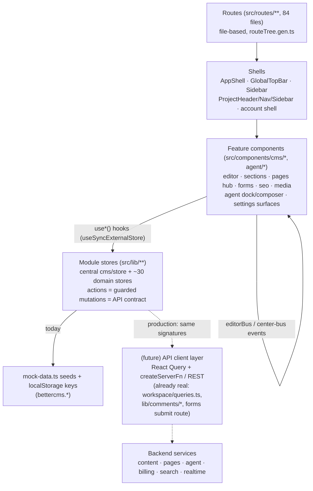

The dashed path already exists in miniature: `workspace/queries.ts` (members/roles/invitations), `lib/comments/*` (threads with realtime), and `POST /api/public/forms/:formId/submit` all run through Supabase today. Production work is walking every other store across that same line without changing a single call site.
## 4. Feature Inventory (master table)

Status legend: **[EXISTING]** works in the browser today against real (client-side) state · **[SIMULATED]** complete UX whose effect is faked client-side (needs a real service behind the same action API) · **[MISSING]** UI exists but nothing fires · **[RECOMMENDED]** not built, proposed. Most domains are a mix: the UI and store logic are EXISTING; persistence and side effects are SIMULATED.

| # | Domain | What it is (one line) | Status | Primary code | Production dependency |
|---|--------|----------------------|--------|--------------|----------------------|
| 1 | Shell & navigation | Top bar (breadcrumb, ⌘K palette, view-as, presence stack, theme toggle, help, Connect dialog, notifications bell), project header/nav, sidebar, mobile drawer | [EXISTING] UI / [SIMULATED] notifications | `src/components/cms/shell/*` (AppShell, GlobalTopBar, Sidebar), `src/components/cms/CommandPalette.tsx`, `src/components/cms/shell/project/*` | Session-aware API for workspaces/projects; notification service |
| 2 | Auth & onboarding | Split-screen `/auth` (real Supabase email, simulated SSO, guest door), `/onboarding` question flow, `/workspace/new` | [EXISTING] email auth / [SIMULATED] SSO, guest | `src/routes/auth.tsx`, `src/routes/onboarding.tsx`, `src/routes/workspace.new.tsx`, `src/lib/onboarding/onboarding-store.ts`, `src/lib/guest.ts` | Supabase (or replacement) + real OAuth SSO; server-side profile persistence |
| 3 | Dashboard & projects | Projects-first workspace home, folders, New Project wizard, project card menus (share/transfer/clone) | [EXISTING] UI / [SIMULATED] provisioning; Archive/Delete [MISSING] | `src/routes/w.$workspace.index.tsx`, `src/components/cms/project/NewProjectWizard.tsx`, `src/lib/cms/use-folders.ts`, `src/lib/cms/clone.ts` | Projects service, real provisioning/deploy pipeline, folder persistence |
| 4 | Pages hub | Page list with nested folders (4 levels), filters, paginator, drag-to-organize, quick settings, generation batch bar, Pages\|Markdown switcher | [EXISTING] | `src/routes/w.$workspace.p.$project.content.tsx`, `src/lib/cms/pages-store.ts`, `src/lib/cms/folders-store.ts`, `src/components/cms/pages/*` | Pages + folders CRUD API; publishing service |
| 5 | Visual editor | Form/Visual modes, device previews, inline editing, section composition, per-section Design panel, x-ray/vision filters, publish, compare | [EXISTING] editing / [SIMULATED] preview URLs, autosave claim | `src/routes/w.$workspace.p.$project.visual.tsx`, `src/components/cms/editor/sections/SectionSystem.tsx`, `src/components/cms/editor/preview/*` | Page render/preview infrastructure (staging hosts), snapshot storage, real autosave |
| 6 | Sections system | Dev-defined `SECTION_DEFS` catalog, variants, `SectionInstance[]` page model, page templates, token-based `SectionDesign` | [EXISTING] (catalog is hardcoded) | `src/components/cms/editor/sections/SectionSystem.tsx`, `src/lib/cms/section-schema.ts`, `DESIGN_CONTROLS.md` | Section registry sourced from customer code (SDK/build step), template storage |
| 7 | Publishing pipeline | Per-page/per-entry Publish menu: staging push, publish now, schedule, unpublish, archive; snapshots for compare | [SIMULATED] (state flips + snapshots, no delivery) | `src/components/cms/editor/PublishMenu.tsx`, `src/components/cms/editor/EntryPublishMenu.tsx`, `src/lib/cms/pages-store.ts`, `src/lib/cms/snapshots.ts`, `src/lib/cms/publishing.ts` | Publish job queue, CDN invalidation, scheduler (cron), immutable version storage |
| 8 | Comments | Field-anchored threads across visual + form modes: pins, reactions, mentions, images, resolve, copy-link, CSS-highlight text anchoring | [EXISTING] UX / [SIMULATED] persistence (page-local state; dead Supabase `*.functions.ts`) | `src/components/cms/editor/comments/CommentSystem.tsx`, `src/lib/cms/comments-store.ts`, `src/components/cms/comments/*`, `src/lib/comments/*` | Comments service + realtime fan-out + notification triggers |
| 9 | Presence / multiplayer | Simulated engine (3.6s tick) over real project data: top-bar stack, canvas cursors, row/field/paragraph avatars | [SIMULATED] | `src/lib/workspace/presence-store.ts`, `src/components/cms/presence/*` | WebSocket presence service (Liveblocks/PartyKit or custom) |
| 10 | Content tab / collections | Tree sidebar, Table/Gallery views, CSV import/export, column hiding, density, bulk actions, per-entry publish | [EXISTING] | `src/routes/w.$workspace.p.$project.editor.tsx`, `src/components/cms/editor/EditorShell.tsx`, `src/components/cms/editor/views/CollectionView.tsx`, `src/lib/cms/store.ts` (`entryActions`) | Entries CRUD API, server-side pagination/query, CSV import job |
| 11 | Entry editor / BlockEditor | Notion-style document: two-level slash menu, AI commands, component instances, embeds, image block w/ crop, Markdown paste + MD view, inline marks | [EXISTING] editor / [SIMULATED] AI output | `src/components/cms/editor/document/BlockEditor.tsx`, `src/lib/cms/blocks/*` (doc.ts, rich-blocks.ts, markdown.ts, recent.ts), `src/components/cms/editor/views/EntryView.tsx` | Real LLM endpoints for AI commands; DocValue persisted server-side; asset upload |
| 12 | Entry workflow | Stage model with publish gate, typed requests (review/approval/feedback w/ due dates), request-changes loop, Compare versions with per-field restore | [EXISTING] logic / [SIMULATED] notifications | `src/components/cms/editor/EntryWorkflowBar.tsx`, `src/lib/cms/store.ts` (`workflowActions`), `src/components/cms/editor/views/CompareVersionsDialog.tsx`, `src/lib/cms/snapshots.ts` | Workflow service, notification delivery, audit persistence |
| 13 | Workflow tab (kanban) | Board by stage, drag between stages, filters, assignees, customize-stages dialog | [EXISTING] | `src/routes/w.$workspace.p.$project.workflow.tsx`, `src/components/cms/workflow/*` | Same workflow service as #12 |
| 14 | Schema builder | `/schema` visual model builder: page/collection/block kinds, inline field rows, references, groups, section zone, live JSON/API panel | [EXISTING] (second schema system; see unification trap) | `src/routes/w.$workspace.p.$project.schema.tsx`, `src/lib/cms/schema-store.ts`, `src/lib/cms/schema/*` | Schema service + migration engine; unify with `types.ts` `Schema`/`SchemaField` |
| 15 | AI agent | Dock + `/agent` page, Plan Mode runs (plan→approve→drafts→apply→undo), skills, roster, history, change review | [EXISTING] UX+guards / [SIMULATED] generation (timer streaming) | `src/lib/agent/runs-store.ts`, `simulate.ts`, `skills.ts`, `src/components/agent/*` | LLM orchestration service (SSE), credit metering, run persistence |
| 16 | Page generators | SEO-pages-from-keywords (CSV bulk) + ABM page builder, riding the agent runs store; batch bar on Pages hub | [EXISTING] flow / [SIMULATED] content | `src/lib/agent/generate.ts`, `src/components/cms/generate/*` (GenerateMenu, GenerationBatchBar, wizards) | Real generation backend; batch job queue |
| 17 | External agents / MCP | Connect dialog, per-editor install commands, scoped one-time-reveal keys, MCP endpoint, Connected agents pages | [SIMULATED] (no real endpoint) | `src/lib/agent/connected-store.ts`, `mcp-clients.ts`, workspace/project agents routes | Real MCP server, token issuance/validation, governance enforcement server-side |
| 18 | AI governance | Workspace AI controls: credit budget, tier ceiling, per-skill/generator toggles, BYOK/external switches — enforced in runs-store | [EXISTING] enforcement client-side | `src/lib/agent/governance-store.ts`, `src/routes/w.$workspace.settings.ai.tsx` | Server-side enforcement of the same rules (never trust client) |
| 19 | SEO section | Sub-nav: meta/SERP preview, sitemap, redirects, robots, RSS, Schema-markup builder with `{{field}}` token chips, issues audit, AEO surfaces | [EXISTING] UI / [SIMULATED] crawl data | `src/routes/w.$workspace.p.$project.seo.*.tsx`, `src/lib/seo/*`, `src/lib/cms/seo-audit.ts` | Sitemap/robots/RSS generation at the edge, real audit crawler, redirect engine |
| 20 | Markdown delivery | `.md` twins serialized from structured content, llms.txt (Auto/Custom) + llms-full.txt, standalone .md files w/ draft/publish, manager UI | [EXISTING] serializers+UI / [SIMULATED] HTTP serving | `src/lib/md/serialize.ts`, `src/lib/md/md-store.ts`, `src/components/cms/markdown/MarkdownManager.tsx`, `src/lib/cms/delivery.ts` | Content-negotiation HTTP routes (`Accept: text/markdown`), llms.txt endpoints |
| 21 | Forms | Dashboard, builder (12+ field kinds incl. phone w/ country flags, Turnstile option), after-submit config, submissions CRM table, embed/API panel | [EXISTING] (localStorage store is the reference model) | `src/lib/forms/forms.store.ts`, `src/routes/w.$workspace.p.$project.forms.*`, `src/components/cms/forms/*` | Form submission endpoint, spam filtering, integration webhooks |
| 22 | Media library | Folders, type + smart filters, favorites, tags, upload, trash, crop dialog, picker dialog | [EXISTING] UI / [SIMULATED] upload (data URLs) & optimization badges | `src/components/cms/media/MediaLibraryShell.tsx`, `MediaPickerDialog.tsx`, `ImageCropDialog.tsx`, `src/lib/cms/store.ts` (`mediaActions`) | Object storage + CDN, image pipeline (resize/optimize), upload signing |
| 23 | Analytics & usage | Project analytics charts w/ date-range picker; workspace usage pages (bandwidth, storage, API, AI credits, compute) | [SIMULATED] (seeded numbers) | `src/routes/w.$workspace.p.$project.analytics.tsx`, `src/components/cms/analytics/*`, usage routes | Analytics ingestion + metering pipeline |
| 24 | Domains | Project-owned domains, workspace roll-up grouped by project, add dialog w/ project picker, set-primary/remove, SSL status | [EXISTING] store flows / [SIMULATED] verification/SSL | `src/lib/cms/store.ts` (`domainActions`), `src/components/cms/domains/*`, domain settings routes | DNS verification worker, cert issuance (ACME), host routing |
| 25 | Roles & permissions | Workspace seats + cascading view-as, tab allow-lists, custom roles with scoped capabilities (Team+/Enterprise gates) | [EXISTING] UI gating / [SIMULATED] runtime enforcement of custom roles | `src/lib/workspace/my-role.ts`, `custom-roles-store.ts`, `capabilities.ts`, `src/lib/cms/permissions.ts` (unused `SITE_PERMISSION_MATRIX` — flag) | AuthZ service evaluating the same matrix server-side |
| 26 | Team & guests | Members w/ billable seats, invites, agency guest teams w/ plan caps, Access page + audit log table | [EXISTING] UI / [SIMULATED] invites, guests | `src/routes/w.$workspace.members.tsx`, `src/lib/workspace/guests-store.ts`, `src/components/cms/workspace/*` | Invitation emails, membership service, seat billing sync |
| 27 | Transfers & sharing | Webflow-style project transfers (instant + email accept loop), public share links `/p/$token`, cloneable templates, project clone | [EXISTING] flows / [SIMULATED] email leg | `src/lib/workspace/transfers-store.ts`, `src/lib/cms/share-store.ts`, `src/routes/p.$token.tsx`, `src/lib/cms/clone.ts` | Transfer service w/ email, signed public tokens, clone job |
| 28 | Billing | Two-layer plans (workspace × site), feature matrix `siteHas`, seat pricing, AI credit meters, buy/switch flows | [EXISTING] math+gating / [SIMULATED] payment | `src/lib/billing/pricing.ts`, `demo.ts`, billing routes under `w.$workspace.settings.billing.*` | Stripe (or similar), entitlement service, metering |
| 29 | Workspace settings | General, notifications, API keys + webhooks w/ one-time reveal, audit log, integrations ("coming soon") | [EXISTING] UI / [SIMULATED] key validity, webhook delivery; notification prefs don't persist [MISSING] | `src/routes/w.$workspace.settings.*.tsx`, `src/lib/workspace/tokens-store.ts` | Token service (hashing, scopes), webhook dispatcher w/ signing, audit store |
| 30 | Project settings | General, access, plan, usage, delivery, integration guides, hosting/deploy config, transfer, env/backups/code | [EXISTING] UI / [SIMULATED] hosting ops | `src/routes/w.$workspace.p.$project.settings.*.tsx`, `src/lib/hosting/demo.ts` | Build/deploy pipeline for managed sites, env secret storage, backups |
| 31 | Account area | `/account`: profile, login & security (password/2FA/sessions), email, connected accounts, preferences (reduce motion is real) | [EXISTING] UI / [SIMULATED] 2FA, sessions, connected accounts | `src/routes/account.*.tsx`, `src/lib/workspace/account-store.ts` | Real auth account APIs (password change, TOTP, session revocation) |
| 32 | Brand kit | `/brand` per-project token store, live preview, design.md import, API bar, versioning, agent voice tie-in | [EXISTING] | `src/lib/brand/brand-store.ts`, `src/routes/w.$workspace.p.$project.settings.brand.tsx` | Brand kit persistence + delivery API |
| 33 | Dark mode & theming | Graphite neutral `.dark` system, dark remap layer, always-light preview canvas, theme toggle | [EXISTING] | `src/styles.css`, `src/lib/cms/appearance.ts`, `src/components/cms/shell/ThemeToggle.tsx` | None (ship as-is) |
| 34 | Device tiers | mobile/tablet/desktop capability allow-lists gating routes/tabs, "needs a larger screen" interstitial | [EXISTING] | `src/lib/device-caps.ts`, `src/lib/device.ts`, `src/components/cms/LargerScreen.tsx` | None (ship as-is) |
| 35 | Site search | Research + plan (Typesense architecture, per-field searchable, Search hub) — early store exists | [RECOMMENDED] (plan in `SEARCH_PLAN.md`; stub `src/lib/search/search-store.ts`, `src/routes/w.$workspace.p.$project.search.tsx`) | `SEARCH_PLAN.md`, `src/lib/search/search-store.ts` | Typesense cluster, indexing worker, scoped search keys |

Cross-cutting trap to carry into every backend design doc: **two section systems** (`pages-store.ts` `SectionInstance[]` — real, used by the visual editor — vs `types.ts` `Section` — Northwind-only Content-tab workspace) and **two schema systems** (`schema-store.ts` `ModelField` vs `types.ts` `SchemaField`). Production must unify each pair; the visual-editor/`SectionInstance` and `types.ts` `SchemaField` sides are the recommended survivors.

---

## 5. Screen-by-Screen: Content & Editing Surfaces

### 5.1 Dashboard, project folders, New Project wizard

**Route:** `/w/$workspace` → `src/routes/w.$workspace.index.tsx` (1,282 lines).

**Purpose (plain):** the workspace home. You see every project as a card or row, group them into folders, create new projects, and manage each project from a ⋯ menu (share, duplicate, transfer). Incoming project transfers surface as an accept/decline banner at the top.

**Layout:** max-width 1240px column. Top-down: `IncomingTransfers` banner (only when a transfer addressed to this workspace is pending) → `WorkspaceHeader` (label "Workspace", workspace name, "All your projects, organized.", right-aligned **New project** button) → `ProjectsExplorer` (toolbar + folder/project list or grid) → `NewProjectWizard` dialog.

**Data flow (engineering):** projects and domains come from the central store via `useCMS(selector)`. Each project row is derived: primary domain (or `{slug}.bettercms.site` fallback), site plan, stack icon, delivery mode via `modeOf(p)`. **Note a demo artifact:** row status is partially synthesized (`(["draft","scheduled","draft"])[i % 3]` for non-published projects) — do not treat dashboard status as store truth. Folders are localStorage-backed via `useFolders(workspaceSlug)` (`src/lib/cms/use-folders.ts`) exposing `{folders, assignments, createFolder, renameFolder, deleteFolder, moveToFolder}`. [SIMULATED] persistence: folder data is per-browser.

**Toolbar, every control:**
- **Search input** ("Search all projects…"): filters by name/domain; searching flattens across folders Webflow-style (folder rows disappear, all matches shown).
- **Sort dropdown** (`ToolbarSelect`): Last updated / Name / Status. Applies to both folders (name or lastUpdated) and projects.
- **New folder icon button** (FolderPlus): opens the create/rename dialog; on submit calls `createFolder(name)` → toast "Folder created".
- **List | Grid segmented toggle**: switches `ExplorerList`/`ExplorerGrid`. Both render the same `ExplorerItem[]` (folders first at root, then unfiled projects).

**States:** a deliberate 220ms skeleton (`ProjectsTableSkeleton`/`ProjectsGridSkeleton`) on mount [EXISTING, cosmetic]; `EmptyProjects` full-page empty state when the workspace has zero projects (CTA → wizard); `ExplorerEmpty` for empty search/folder with a "clear search" action.

**Folder interactions:** clicking a folder opens it (breadcrumb "← All projects › {name}" with a `FolderMenu`: **Rename** and **Delete** — delete moves contained projects back to root and toasts the count). Deleting the currently open folder pops back to root (guard effect).

**Project card/row ⋯ menu**, item by item:
- **Open** — [MISSING]: the `DropdownMenuItem` has no `onSelect`; the card itself links to the project, but this menu item is inert. Production: wire or remove.
- **Share** — opens `ShareProjectDialog` (`src/components/cms/workspace/ShareProjectDialog.tsx`): creates public share links (`share-store.ts`, `/p/$token` read-only sandbox) with a cloneable-template toggle. [EXISTING] client-side; production needs signed tokens.
- **Duplicate** — calls `cloneProject(projectId, workspaceId, "{name} copy")` (`src/lib/cms/clone.ts`), deep-copies project + content, toasts. [EXISTING].
- **Move to folder** submenu — lists folders (+ "No folders yet" disabled row; "Remove from folder" when filed) → `moveToFolder(projectId, folderId|null)`.
- **Transfer** — opens `TransferProjectDialog` → `transferActions` (`src/lib/workspace/transfers-store.ts`): instant move for own workspaces, email-loop request otherwise; while pending the menu instead shows **Cancel transfer request** (`transferActions.cancel`). [EXISTING] flow / [SIMULATED] email.
- **Archive** and **Delete** — [MISSING]: both render without `onSelect` handlers. Production must implement archive state and a confirm-gated delete.

**IncomingTransfers banner:** for each pending request targeting this workspace: **Decline** (`transferActions.decline`) and **Accept** (`transferActions.accept(requestId, ws.id)` — moves the project, resets its plan, toasts "{project} joined {workspace}").

**New Project wizard** (`src/components/cms/project/NewProjectWizard.tsx`, 746 lines) — 5 internal steps in one dialog:
1. **Type** — two large cards: **Headless** ("bring your own frontend") vs **Managed/Cloud** (BetterCMS hosts). Picking headless jumps straight to Configure; managed goes to Source.
2. **Source** (managed only) — GitHub repo / Upload zip / Start from a template.
3. **Configure** — name (required; live slug), framework select; managed variants add a Github block (repo/branch), Zip block, or Template gallery. Primary button reads **Create & deploy** (managed) or **Create project** (headless).
4. **Creating** — calls `projectActions.create` (slug-uniquifying) then plays a per-kind checklist of provisioning steps on a timer [SIMULATED]; production replaces this with real provisioning progress (build, deploy, API key issue).
5. **Done** — managed: "Your site is live 🎉" + URL; headless: "Content API provisioned and ready to query" + Open project.

Gating: dashboard is available on all device tiers; the wizard requires no special role in the demo (any member of the workspace) — production should restrict project creation to owner/developer.

**Production must implement:** projects service (create/clone/transfer/archive/delete), server-side folder persistence keyed to user or workspace (decide: personal vs shared folders — currently per-browser, i.e. personal), real provisioning pipeline, share-token issuance, transfer email flow, and honest project status derived from publish state.

---

### 5.2 Pages hub

**Route:** `/w/$workspace/p/$project/content` → `src/routes/w.$workspace.p.$project.content.tsx` (794 lines). Search params: `?view=pages|content|markdown`, `?batch=<runId>`.

**Purpose (plain):** every page on the site in one list — organize into folders, filter, publish, jump into the visual editor. The same route also hosts the "Content" collections overview (`?view=content`) and the Markdown delivery manager (`?view=markdown`).

**Layout:** `PageShell` (breadcrumbs, title, description, actions slot) → Pages|Markdown pill switcher → optional `GenerationBatchBar` → `ListToolbar` → the page table (folder tree + rows) inside a `DndContext` → `Paginator` → a secondary "Collection pages" table.

**Header actions** (hidden for `?view=content|markdown`, and role-gated by `canCompose(effective)` — marketer+):
- **New folder** (outline) → `FolderDialog` (create mode).
- **Generate** menu (`GenerateMenu`, plan-aware): SEO pages from keywords (Basic+), ABM page (Pro+); disabled items explain their gate. Launches generator wizards that create agent runs; on finish the hub reloads with `?batch=`.
- **New page** (primary) → `NewPageDialog`.

**ListToolbar** (hidden during batch review): search ("Search pages"), **status SegmentedFilter** All/Published/Draft/Scheduled with live counts, **type SegmentedFilter** All types/Static/Generated (only rendered when any page has a `batchId`), **sort dropdown** Recently edited / Name / Path.

**The table.** Header row: Page / Status / Updated (hidden <sm) / actions. Row building is nontrivial and worth spelling out:
- Real folders come from `useFolders(projectId)` (`src/lib/cms/folders-store.ts` — module store, in-memory). Two folder kinds: **URL folder** (has slug; prefixes URLs of pages inside via `folderUrlPrefix`) and **organizer** (no slug; shows an "organizer" badge). Max depth 4 (`MAX_FOLDER_DEPTH`).
- **Virtual folders**: a loose page whose path has >1 segment (e.g. `/lp/pricing-tools`) groups under a synthetic folder row named `/lp` — this is how generated batches read as folders without any store write.
- Folder rows: chevron expand/collapse (local `collapsed` Set), open/closed folder icon, name, slug (mono) or organizer badge, page count (recursive `totalUnder`). Empty folders render only in the plain unfiltered first page. Hover reveals a **drag grip** and a **⋯ menu**: *New page here*, *Rename or move* (FolderDialog edit mode), *Delete folder* → `folderActions.remove` + `pagesActions.clearFolders` (pages move to top level, toast explains).
- Page rows: file icon, title, **effective URL** (`effectiveUrl` composes folder prefix + last path segment — the stored `path` is never rewritten by a move), "· N sections" summary, status chip, relative updated time, then right-aligned: `PresenceStack` (peers active on that page's canvas, max 2 avatars) [SIMULATED presence], hover **Settings2 quick-settings button** → `PageSettingsDialog`, hover **⋯ menu**.
- **Status chip is a button** when `canPublish(effective)`: clicking opens the shared `PublishMenu` in portal mode at a clamped fixed position (`Math.min(rect.bottom+6, innerHeight-508)`); read-only chip otherwise. A small "staging" badge shows when `pg.staged`.

**Page ⋯ menu**, every item: *Open in editor* (navigate `/visual?page={path}`) · *Copy as Markdown* (`pageToMarkdown(...)` → clipboard, toast) [EXISTING — uses the real serializer contract] · *Page settings & SEO* (canCompose) · *Publish* (canPublish; opens PublishMenu portal) · *Move to folder* submenu (Top level + full `folderTrail` list, current one disabled/marked) → `pagesActions.setFolder(projectId, path, folderId|null)` · *Duplicate* (new id via `newPageId()`, `-copy` path uniquified, state reset to draft, sections shallow-copied) · *Delete* → `pagesActions.remove(projectId, path)` — **no confirm dialog** [MISSING; violates the house rule "every destructive action gets a confirm or undo"; production must add one].

**Drag-and-drop** (dnd-kit, disabled unless `canCompose` and not in batch view): drag a page onto a folder → `pagesActions.setFolder`; drag a folder onto a folder → `folderActions.update(parentId)` with two guards: a dragged folder's own subtree is excluded from drop targets (`descendantIds`), and depth is validated via `eligibleParents` + `folderHeight` (toast "Can't nest there. That would go too deep."). While dragging, a **"Drop here to move to the top level"** root drop zone appears above the list, and a `DragOverlay` chip follows the cursor. Sensors: pointer (5px activation) + keyboard.

**Footer:** inline **New page** row button (canCompose) + shared `Paginator` (50/100/200 page sizes, `clampPage`).

**Batch review** (`?batch=`): `GenerationBatchBar` (run title, live counts of drafts/published, **Publish all**, **Undo** via the run's undo journal — removes still-draft pages only, dismiss → clears the param). The table is filtered to `p.batchId === run.id`; search/filters/sort/pagination/dnd are all suspended.

**Collection pages table** (bottom, non-batch): one row per collection rendered as `"/{slug}/:slug"` with a "Dynamic" status, entry count, hover Settings (→ `/schema`) and open affordances — this is the "programmatic pages" surface; the routing itself is [SIMULATED] (no real rendering).

**`?view=content`:** grid of collection cards (name, `/slug`, entry + field counts) linking into `/editor?scope=collections&node=collection:{id}`, plus its own paginator. Empty state: "No collections yet."

**`?view=markdown`:** renders `MarkdownManager` (see Feature Inventory row 20). Editable when `canCompose`.

**NewPageDialog** (`src/components/cms/pages/NewPageDialog.tsx`): step 1 name + slug + folder placement (live URL preview inheriting URL-folder prefixes; "New folder" opens FolderDialog inline); step 2 blank vs template. On finish: `pagesActions.add` with `folderId`, then navigates to `/visual?page=` (blank pages arrive with `?new=1` behavior — the editor opens the section library immediately).

**FolderDialog:** name, optional URL segment (auto-slugified via `slugifySegment`; empty = organizer), parent picker constrained by `eligibleParents` (depth cap). Create → `folderActions.add`; edit → `folderActions.update`.

**PageSettingsDialog** (`src/components/cms/editor/PageSettingsDialog.tsx`) — the page's meta editor, shared by hub and visual editor. Fields and validation, all persisted in one `pagesActions.update` patch on **Save changes**:
- **Page name** (required).
- **URL path** with `/` prefix chrome; normalized (lowercase, spaces→dashes); duplicate-path check against `getPages(projectId)` with inline error; on rename the caller follows via `onPathChange`.
- **Meta title** (placeholder = page name), **Meta description** (textarea, live `n/160` counter turning red past 160 — counter is advisory, not blocking).
- **Canonical URL**: valid when blank, absolute `https?://`, or a `/`-rooted path; invalid state blocks save with explanatory hint.
- **Search indexing**: Index / No-index two-card toggle.
- **Social image (OG)**: URL input + 92×52 live thumbnail preview (hides itself on load error).
- **Structured data (JSON-LD)**: mono textarea; `JSON.parse` validation blocks save with "This is not valid JSON yet."
- Footer: **Delete page** (only when caller passes `onDelete` — the hub does, the visual editor doesn't), Cancel, Save (disabled until valid). Staging URL preview line at the bottom.

**States:** "No pages match your search." empty row; no loading state (synchronous store). **Gating:** hub is in the marketer/editor tab allow-list as "Pages"; composition affordances need `canCompose`, publishing needs `canPublish`; touch devices always show row actions (`max-md:opacity-100`).

**Production must implement:** pages + folders CRUD with the same action signatures (`pagesActions.add/update(patchFn)/remove/setFolder/clearFolders/publish`, `folderActions.add/update/remove`), path uniqueness enforced server-side, delete confirmation, batch metadata on generated pages, and server pagination once page counts exceed client comfort.

---

### 5.3 Visual editor

**Route:** `/w/$workspace/p/$project/visual` → `src/routes/w.$workspace.p.$project.visual.tsx` (1,750 lines). Search params: `?page=<path>`, `?new=1` (opens the template picker), `?comment=<threadId>` (deep-link opens a thread).

**Purpose (plain):** the WYSIWYG surface. Marketers compose pages from developer-defined sections; editors click text and type; reviewers comment. A dark app chrome wraps an always-light website canvas.

**Data model:** pages are `PageDoc` from `usePages(projectId)` (`src/lib/cms/pages-store.ts`); every mutation goes through one helper, `patchPage(fn)` → `pagesActions.update(projectId, activePath, fn)`, and every content mutation also runs `touched()` — a published page flips to `modified` ("Unpublished changes"). Sections are `SectionInstance {id, type, variant?, content: Record<string,string>, design?: SectionDesign}` rendered by `SectionRenderer` against the hardcoded `SECTION_DEFS` catalog (8 types: hero [Centered / Split with media], features, logos, testimonial, cta [Banner / Text on left], pricing, faq, contact).

**Header bar (h-12), left to right:**
- "Visual editor" label + **state pill** (Draft/Published/Unpublished changes/Scheduled/Archived with tone dot).
- **Form | Visual mode toggle** (md+). Form is hidden for roles that can't edit. On **mobile tier the editor is pinned to form mode** (`useViewportTier`) — the canvas needs pointer precision.
- **PageSelect**: searchable page switcher popover (title + mono path, Enter picks first match, Esc closes) with a role-gated **New page** footer that opens the TemplatePicker.
- **Page settings gear** (canCompose) → `PageSettingsDialog` (same component as the hub, no delete here; follows path renames via `onPathChange`).
- **Comments button**: toggles the right `CommentsPanel`; shows an indigo unresolved-count badge.
- Center (visual mode only): **DeviceBar** — icon segmented control Desktop (fluid, max 1000px) / Tablet 768 / Mobile 390 / Landscape 740; animates canvas width. **CanvasSettings popover**: *Column grid* toggle (12-column Figma-style `ColumnGuides` overlay, non-interactive), *X-ray mode* toggle (outlines every element via injected CSS), *Vision preview* 2×2 grid None/Grayscale/Color blind (SVG deuteranopia `feColorMatrix` filter)/Blurred (1.6px) — canvas-only filters; the trigger button tints primary when any setting is active.
- Right: **"Saved" indicator** (title claims autosave — truthful client-side since stores commit synchronously; [SIMULATED] as durable persistence) · **Compare button** (only when `active.publishedSnapshot` exists) with amber `pageDiffCount` badge → `ComparePageDialog` · **Preview** (opens `https://{slug}.bettercms.site{path}` in a new tab — [SIMULATED], nothing is served there) · **Publish** split button (canPublish) → shared `PublishMenu` popover.

**Headless banner:** dev-visible (`canSeeDeveloper`) dismissible info strip explaining the headless model.

**PublishMenu** (`src/components/cms/editor/PublishMenu.tsx`, shared with the hub — popover or portal): header shows title + state + scheduled time + "On staging" badge; **destination cards** Staging (private preview) | Production; **preview-link row** (lock icon, mono staging URL, Copy, Open) with "Private link. Only workspace members can open it."; production reveals **When**: Publish now | Schedule (+ `datetime-local`, default now+1h); a summary strip "Stays private at / Goes live at {url}"; primary button morphs (Push to staging → `patch(staged:true)` / Schedule → `pagesActions.publish(..., {scheduledAt})` / Publish now → `pagesActions.publish` which also captures the `publishedSnapshot`); footer links: **Unpublish/Unschedule** (state→draft, clears schedule), **Save as template** (visual editor only, canCompose — prefills the template-name dialog), **Archive**. Esc closes. All effects are store flips [SIMULATED as real publishing]; production maps these to publish jobs + scheduler.

**Form mode** (left panel; full-width 720px column in form mode, 300–360px sidebar in visual mode): the page as a document of section cards. Each card: section icon + name + variant chip, then one labeled input/textarea per `def.fields` entry (values HTML-stripped; disabled unless `canEditContent`), writing through `setField(sectionId, key, value)`. Hovering a field reveals a **comment button** (creates a field-anchored draft) and any existing `CommentPin`s; the active thread's field gets an indigo ring. Below the fields, marketers+ get the **SectionDesignPanel** (below). Empty state: "No sections on this page yet. Add them in the Visual mode."

**SectionDesignPanel** — the per-section Design panel, every control (all values are tokens on `section.design`, persisted via `setDesign(sectionId, patch)`; a primary dot on the header marks a customized section; collapsible, opens automatically when design exists):
- **Color:** *Theme* segmented Inherit/Light/Dark; *Background* segmented None/Surface/Muted/Accent/Dark(inverse)/Custom — Custom reveals a native color input + hex text input (`backgroundColor`).
- **Spacing:** three **TokenSlider** rows Top/Bottom/Sides — 8-stop range sliders over `SPACE_TOKENS` (`none,xs,sm,md,lg,xl,2xl,3xl`) with the token label echoed; `none` stores `undefined` (pass-through).
- **Layout:** *Content width* Narrow/Default/Wide/Full; *Align* Left/Center/Right; *Full viewport height* checkbox ("Great for hero sections. Content centers vertically.").
- **Effects:** *Section opacity* percent slider (0–100 step 5); *Corner radius* 0/S/M/L/XL/2XL; *Shadow* 0/S/M/L/XL; *Border top* / *Border bottom* checkboxes.
- **Background image:** URL input; when set, a conditional **Overlay** percent slider (`overlayOpacity`) appears.
- **Reset design** link clears every key to `undefined`.
Rendering: `SectionShell` wraps the section body in a token wrapper (`sectionDesignClass/Style/InnerClass/Overlay` from SectionSystem) only when `sectionHasDesign` — zero-cost pass-through otherwise. A per-type developer allow-list in `src/lib/cms/section-schema.ts` scopes which controls each section exposes (see `DESIGN_CONTROLS.md`). Gated marketer+ (`canBuild`). [EXISTING]; production stores `SectionDesign` with the page and exposes the tokens through the delivery API.

**Visual mode canvas:** a rounded white frame with fake **browser chrome** — traffic-light dots, a lock+staging-URL address bar, the **Edit | Comment interaction-mode toggle** (Edit hidden for reviewers; reviewers are force-set to comment by an effect), and an amber **"Draft preview"** badge. Inside, `SiteChrome` (non-composable fake site nav) then the section stack:
- **InsertPoint** between every pair of sections and at index 0 (composing only): a hover-revealed hairline + "Add section" pill → opens `SectionLibrary` at that index.
- **SectionShell** per section (composing only adds chrome): hover outline ring, a top-left **name chip** (icon + name + variant), and a top-right **toolbar**: *Change layout* (variant dropdown listing `def.variants` with a check on the current one → `setSectionVariant`) · *Move up/Move down* (disabled at ends) · *Duplicate* (deep-copies content, flashes the copy) · *Delete* (immediate + toast — again no confirm [MISSING]).
- **Inline editing:** `SectionRenderer section editable={previewMode==="edit"} onEdit={(k,v)=>setField(...)}` — each text node is a contentEditable `InlineText` carrying `data-field="{sectionId}.{key}"` / `data-field-label`; commits write through the same `setField` path as form mode, so both modes are views over one model.
- **Add section** dashed footer button (composing) / rich empty state: role-aware copy ("Start with a section" + Browse sections vs "A marketer or developer adds sections here...").
- Overlays layered on the canvas container: `ColumnGuides` (grid toggle), `PresenceCanvasLayer` (simulated teammate cursors + section outlines; suppressed on mobile tier; repositioned via a `recalc` counter bumped on sections/device/mode/page changes), and `CommentLayer` (pins per thread; in comment mode clicking any `data-field` starts a draft).
- Below the frame: a one-line contextual hint that changes by mode and role.

**RichTextToolbar** (`src/components/cms/editor/preview/RichTextToolbar.tsx`, mounted over the canvas, active in edit mode): floating bubble on text selection inside contentEditable fields. Formatting via `document.execCommand` on the live selection: bold/italic/underline/strike/inline code/text color + block-type menu **H1–H6**/paragraph; **link editor** flyout with an internal-page picker (fed `pages` list), URL input, *Open in new tab* toggle (auto-applies `noopener noreferrer`), and **rel** single-select radio None/nofollow/sponsored/ugc; an **AI panel** (back button, prompt, canned actions — [SIMULATED] stubs). All flyouts are portaled to `document.body` and viewport-clamped; the selection range is snapshotted (`savedRange`) and restored before any command so portal clicks never drop it.

**Comments (visual + form):** state lives page-local in the route (`threadsByPage`, seeded with one Home-hero thread) [SIMULATED persistence]. Behaviors: field-anchored draft (`startFieldComment`) and **select-to-comment** — in comment mode, releasing a text selection inside a field computes character offsets and floats an indigo "Comment" button above the selection; the created thread stores `quote/start/end`. The active thread's anchored text is highlighted through the **CSS Custom Highlight API** (`::highlight(bcms-comment)`) with a select-all fallback. `ThreadPopover` anchors to the field rect in *either surface* (form ↔ canvas fallback lookup) and supports: reply (with image attachment), per-message emoji **reactions** (toggle own), **edit** own message (marks `edited`), **delete** message (deleting the root deletes the thread and closes the popover), **resolve** toggle, **copy link** (`?comment={id}`; a mount effect opens deep-linked threads). `CommentsPanel` (right rail) lists threads; clicking one scrolls its field into view on the current surface. Unresolved count badges appear on both the header button and the canvas-chrome Comment tab.

**Section library & templates:** `SectionLibrary` modal — a marketer-facing browser of `SECTION_DEFS` with live rendered previews per variant; picking one calls `addSection(type, variantId)` → `createSection` (instantiates defaults) spliced at the recorded insert index, scroll-into-view + 1.4s indigo flash + toast. `TemplatePicker` — create-page modal fed `PAGE_TEMPLATES` (Landing page, Case study, Event page, White paper, Blog post) plus session-local custom templates; live stacked mini-previews; **Start blank** creates an empty page and opens the library at index 0. `createFromTemplate` slug-uniquifies the path and `pagesActions.add`s a draft. **Save page as template** (from PublishMenu) opens a small name dialog → captures the current section stack (`{type, variant, content}` snapshots) into `customTemplates` [EXISTING but session-only — production persists templates per project].

**Compare page versions:** `ComparePageDialog` (`src/components/cms/editor/preview/ComparePageDialog.tsx`) — Published ↔ Draft, section-by-section rows, changed fields first, **word-level diff** (removed words struck in the published column, additions highlighted in the draft), and one action per row: restore the published value into the draft. `pageDiffCount(page)` powers the header badge. Snapshots are captured by `pagesActions.publish` (`publishedSnapshot`); the demo perturbs seeds so diffs exist (`src/lib/cms/snapshots.ts`).

**Presence:** `useProjectPresence(projectId)` peers drive the canvas layer and the hub's row stacks — a 3.6s-tick simulation engine over real member data [SIMULATED]; production replaces the store internals with a WebSocket transport keeping the same hook shape.

**Role/plan/device gating summary:** reviewer → comment mode only, no Form toggle, no publish; editor → inline/form editing, no composition, no publish; marketer+ → compose, design panel, templates, publish; developer+ → headless banner. Mobile → form mode pinned, no presence layer. No plan gates on this screen.

**Production must implement:** durable page/section persistence behind `pagesActions`, real staging/production render targets for Preview/publish URLs, scheduled-publish worker, snapshot/version storage (the compare contract), comment + presence services, template storage, and server-side enforcement of the role checks that currently live only in the client.

#### Diagram A — entry publish/workflow state machine

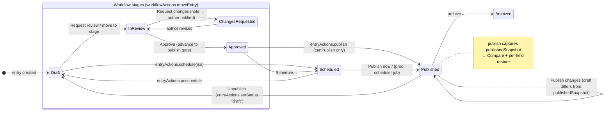

The same shape applies to pages with `pagesActions.publish/update`: page states are `draft → published ⇄ modified`, plus `scheduled`, `archived`, and the orthogonal `staged` flag (push-to-staging never changes the lifecycle state).

#### Diagram B — visual-editor edit loop

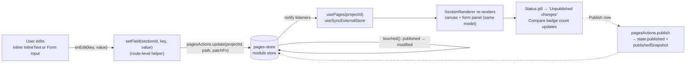

---

### 5.4 Content tab (`/editor`): collections workspace and the entry editor

**Route:** `/w/$workspace/p/$project/editor` (thin route) → `EditorShell` (`src/components/cms/editor/EditorShell.tsx`). Search params `?scope&node&section` select the tree node (e.g. `node=collection:{id}`).

**Purpose (plain):** structured content. Browse collections in a tree, work rows in a table or gallery, and write entries in a Notion-style document editor with workflow built into the footer.

**Shell:** collapsible left tree sidebar (`ContentTree` — pages scope shows the Northwind-seeded `types.ts` `Section` workspace with Content/Layout/Style/SEO/Advanced tabs, the *legacy second section system*; collections scope lists collections) + a center workspace that swaps views by node type. Role gating trims the tree (reviewer/editor see collections surfaces only). Devices: full workbench on tablet+; mobile gets the focused subset per `device-caps.ts`.

**CollectionView** (`src/components/cms/editor/views/CollectionView.tsx`, 1,418 lines) — one calm surface, two views:
- **Header controls:** search; **Import CSV** (hidden file input, `.csv`; parser requires a header row and a "Title" column — errors toast; rows become entries via `entryCreateActions`) and **Export CSV** (client-side serialize of visible fields → `{slug}.csv` download); **Table | Gallery** icon toggle (persisted `localStorage bcms.collection.view`); **Density** menu comfortable/compact/spacious (row heights 56/44/68px; persisted `bcms.collection.density`); **column-visibility** popover with a Switch per schema field + Status + Updated (persisted `bcms.collection.hiddenCols`); **New entry** (role-gated `canEditContent`).
- **Table view:** checkbox select-all + per-row checkboxes driving a **bulk action bar** (`bulk(fn)` maps `entryActions` over the selection — publish/unpublish/delete etc.); sortable columns; reference fields resolved to labels via `getReferenceLabel`; per-row **status cell opens the entry publish menu**; per-row presence avatars; pagination (`Paginator`). Reviewers get browse + export only.
- **Gallery view:** thumbnail cards (first image field), title, status badge — for visual browsing.
- Deliberate scope decisions (user-confirmed): **no Board view, no toolbar view-as, no right inspector, no Compare in the toolbar** — compare lives in the workflow bar.
- Clicking a row opens **EntrySlideOver** (sheet) hosting `EntryView` + the persistent `EntryWorkflowBar` footer; nested dialogs (Compare/Schedule/Request changes) are portaled with `data-nested-dialog` so the sheet ignores their "outside" clicks.

**EntryView** (`src/components/cms/editor/views/EntryView.tsx`) — Notion-style document resolved from the schema by field-name heuristics (`resolveLayout`: title/cover/slug/summary/content hints, e.g. TITLE_HINTS `title|name|heading`, CONTENT first `richText`): optional **Cover** (add via URL input; hover ✕ removes), huge borderless **Title input** (writes both `entry.title` and the mapped title field via `entryActions.setField` + `entryActions.update`), **slug** row (`/` prefix), **summary** line, then the **BlockEditor** bound to the content field, then a **Fields** section — always visible, collapsible — a 2-column grid of `FieldRow`s: label, required badge, live **field-level presence avatar** (peer name tinted their color), `FieldControl` per type (text/number/date/select/URL/image/reference/multi-reference/SEO fields — the 15-field example blog schema exercises all of them), inline `validateField` errors, description hints. Footer: "Last updated …".

**BlockEditor** (`src/components/cms/editor/document/BlockEditor.tsx`, 2,220 lines) — the flagship writing surface. Data model: `DocValue {version:1, blocks: DocBlock[]}` (`src/lib/cms/blocks/doc.ts`), stored as the value of a `richText` field; legacy strings/HTML are lazily migrated by `parseDoc` (HTML block tags → real blocks). 21 block types: paragraph, h1–h6, bullet, numbered, todo, quote, callout (5 tones), code, divider, image, embed, bookmark, video, button, table, toggle, component.

- **Slash menu** (`/` at end of line; caret-anchored, viewport-clamped): a **two-level** structure. Root = three **drill rows** up top — **AI** (7 commands), **Components** (8), **Embeds** (3) — followed by the compact featured/basic block set (Basic: Text, H1–H6, Quote, Callout, Toggle, Divider; Lists: Bulleted, Numbered, To-do; Media: Image, Video; Advanced: Code, Table, Button). Typing filters **globally across all items**; drilling in shows a back row + scoped search ("Search AI commands…"). Arrow/Enter/Esc handled by the menu; Esc from a drill goes back to root first. Recently used items persist to localStorage (`src/lib/cms/blocks/recent.ts`). On select, the in-progress `/query` text is stripped from the DOM and the doc before acting — the **keep-text rule**: `replaceWithWidget` replaces the current block only if it's an empty paragraph, otherwise inserts after, never destroying typed text.
- **AI commands** (`src/lib/cms/blocks/rich-blocks.ts` `AI_COMMANDS`, output from local `simulateAi` [SIMULATED]): *Write with a prompt* (append; prompt panel with placeholder "e.g. an intro paragraph about headless CMS"), *Continue writing* (append), *Summarize* (inserts an info-tone **callout**), *Improve writing* (replace), *Make longer* / *Make shorter* (replace), *Generate image* (prompt; image mode). Prompt-requiring commands open `AiPromptPanel` anchored at the caret. Production contract: same command ids/modes against a real LLM endpoint.
- **Component instances** (BaseHub-style, `COMPONENT_CATALOG`, grouped Marketing/Commerce/Social/Content): CTA banner, Newsletter signup, Badge, Pricing card, Testimonial, Author card, Stat highlight, FAQ item — each renders a styled card with editable `title/desc/componentProps`.
- **Embeds:** `detectEmbed` maps pasted URLs to providers — YouTube/youtu.be, Vimeo, Loom, Figma, CodePen, CodeSandbox, Twitter/X, Spotify, generic iframe — with per-provider embed URLs and aspect ratios; **Bookmark** renders a fake link-preview card (`fakeBookmarkMeta` [SIMULATED]); **Video** by URL.
- **Image block:** empty state offers **Media library** (opens `MediaPickerDialog`), **Upload** (FileReader → data URL [SIMULATED storage]; also `mediaActions.add`s the asset to the project hub so uploads are reusable), **Paste URL** (inline form). Filled state hover toolbar: *Replace*, *Align* popover (full/center/left/right), *Link* (wraps in `<a>`; click prevented in-editor), *Alt text*, *Caption* (inline editable under the figure), *Crop* → `ImageCropDialog` (crop result also lands in the media hub), *Delete*.
- **Table** (editable cells, header-row toggle), **Toggle** (collapsible heading + body), **Callout** (tone picker with emoji), **Button** (label/href/variant), **Code** (language), **Quote**, **Divider**, **To-do** (checkbox state).
- **Markdown, both directions:** pasting multi-line Markdown (Notion copies as Markdown; `looksLikeMarkdown` heuristic) converts to real blocks via `markdownToBlocks` — replacing the current empty paragraph or inserting after, with a "Markdown converted · N blocks added" toast. A hover **Markdown button** (top-right) flips the whole document to a mono textarea via `blocksToMarkdown`; edits commit back through `markdownToBlocks` on exit ("Rich text" button). Dialect notes surfaced in the UI: a bare URL on its own line becomes an embed; `> [!info]` becomes a callout.
- **Keyboard/DOM behaviors:** Enter inserts a paragraph after; Backspace at start of an empty block removes it, at start of a non-paragraph converts it to paragraph (caret preserved via `focusAfterRenderRef`); inline HTML is sanitized on commit (`sanitizeInlineHtml` allows only b/strong/i/em/u/a[href]/br, double-pass unwrap).
- **Per-block hover toolbar** (`BlockToolbar.tsx`): drag-grip affordance with *Move up/down*, *Duplicate*, *Delete*, *Turn into* (type submenu), *Insert below*.
- **Per-paragraph presence:** `blockPeers` maps simulated peers to block ids; avatars with name+role tooltips render in the row gutter [SIMULATED].
- **Selection toolbar bridge:** the shared `SelectionToolbar` (`src/components/cms/comments/SelectionToolbar.tsx`) floats over any text selection. Inside an editable doc block (`data-doc-block-id` walk) it adds formatting: **Bold**, **Italic** (execCommand on the live DOM, then a `bcms:doc-format` CustomEvent asks the editor to sanitize + persist that block's HTML), and **H1/H2/H3 turn-into** (`bcms:doc-turn` → `changeType`). Everywhere it offers **Comment** (opens the comment composer via `commentsUi`), **Ask AI** (comment-with-AI variant), **Copy** (clipboard + toast), **Link** (copies a deep link). The event-bridge exists so one toolbar serves both comment surfaces and the editor without coupling.

**EntryWorkflowBar** (`src/components/cms/editor/EntryWorkflowBar.tsx`) — the single document footer on every entry surface. Left: `StageChip` (or `PublishBadge` once published/archived) + "Moved/Updated {relative}". Right, in order:
- **Request button** — the typed-request popover. Top section **"Waiting on"** lists open requests (avatar, kind icon, requested-at, optional due date; hover reveals **Mark done** / **Withdraw** → `workflowActions.closeRequest(entryId, reqId, "done"|"withdrawn")`). Below: kind cards **Review** ("Read it and flag issues") / **Approval** ("Sign off so it can ship") / **Feedback** ("Opinions, no sign-off"); a people list **suggested by seat** (review → reviewers/editors; approval → owners/admins/marketers) with an "Everyone else" group; a context note textarea; an optional due date; **Send request(s)** → `workflowActions.request(entryId, {kind, memberIds, note, due})` (recipients get notifications [SIMULATED delivery]). The trigger collapses to an `AssigneeStack` when requests are open.
- **Compare** (only when `entry.publishedSnapshot` exists) with a changed-field count badge → `CompareVersionsDialog`: changed fields first (unchanged behind a toggle), word-level highlights, one action per row — restore the published value into the draft; rich-text fields render as prose via `docToPlainText`.
- **Primary split button that "reads the situation":** published → *Publish changes* (disabled until the draft differs) / scheduled → *Publish now* / at the gate stage → *Publish* / working stage → **Approve** (moves to the publish-gate stage). Publish enforces `canPublish` with a toast error otherwise → `entryActions.publish`.
- **Caret dropdown:** *Request changes* (when a changes stage exists and we're not in it — dialog collects a required note, moves the entry back via `workflowActions.moveEntry(..., {comment})`, notifies the author), *Publish now/Publish changes*, *Schedule…* (`ScheduleDialog` → `entryActions.schedule(iso)`), *Move to stage* submenu (custom stages from `useCMS(workflows)` or the project default via `getWorkflow`), *Unschedule* (`entryActions.unschedule`), *Unpublish* (destructive-styled, `entryActions.setStatus("draft")`).
- Read-only seats see "Your seat can review, not edit." instead of the action cluster.

**Copy/paste document:** `src/lib/cms/doc-clipboard.ts` — Copy document serializes `{title, fields, source schema}` into an in-app clipboard (plus a JSON copy on the system clipboard); Paste works **across collections**, matching fields by name against the target schema and reporting anything that didn't fit instead of silently dropping it. Surfaced in the collection/entry menus (`copyDocument`, `useCopiedDoc`).

**States:** empty collection (CTA to create an entry), empty CSV errors, per-field validation errors; no loading/error states (synchronous stores) — production adds them at the query layer. **Gating:** reviewer = read + export; editor+ = edit; marketer+ = publish; the whole tab appears for every role (it's in all allow-lists); dev-only affordances ("Edit schema" → `/schema`) via `canSeeDeveloper`.

**Production must implement:** entries service with the exact `entryActions`/`workflowActions`/`entryCreateActions` surface (setField, update, publish, schedule, unschedule, setStatus, request/closeRequest, moveEntry), DocValue as the canonical rich-text format (plus its Markdown/HTML serializers as delivery contracts), CSV import as an async job with a report, real LLM endpoints for the AI commands, notification fan-out for requests and request-changes, and version snapshots powering Compare.

---

### 5.5 Media library

**Route:** `/w/$workspace/p/$project/media` (thin route) → `MediaLibraryShell` (`src/components/cms/media/MediaLibraryShell.tsx`, 2,584 lines). Assets seed from the central store (`mediaFor(projectId)`); folders live in `useCMS(s => s.mediaFolders)` with `mediaFolderActions`.

**Purpose (plain):** every image, video, PDF, Lottie and GIF for the project — browse by folder or type, favorite, upload, crop, and reuse anywhere via the picker.

**Layout:** left sidebar (folders + type filters + smart filters + storage meter) · toolbar (search, sort, view toggle, Upload) · asset grid/list · a details panel for a single selection · dialogs (upload, move, convert, crop, new-folder).

**Sidebar, every control:** **Folders** list (click filters `folderId`; **New folder** → `mediaFolderActions.add`, auto-selects, toast). **Type filters** (`TYPE_FILTERS`): All, Images (excludes svg/gif), Videos, Lottie, GIFs, SVG, Documents (PDF/zip), Favorites (`m.favorite`). **Smart filters:** *Missing alt text* (images without `altText`), *Needs compression* (`optimized === false`), *Recently added* (top 12 by upload date). **Storage meter:** used bytes vs a 100GB constant [SIMULATED metering]. **Trash** view toggle.

**Toolbar:** search (name/tags; a ref for keyboard focus), sort Name/Uploaded/Size/Type, **Grid | List** view toggle, **Upload** button + full-surface **drag-and-drop** (drag-counter based highlight). Uploads read files into data/object URLs [SIMULATED storage] and register via `mediaActions.add`.

**Grid/list interactions:** click selects; **shift-click range-selects** (`lastClickedId`); multi-select summons a bulk bar: **Move to folder** (dialog with folder list → `moveAssets`, toast names the destination), **Favorite**, **Delete** → **soft delete to Trash** (timestamped `trashed` map, toast). Trash view offers **Restore** and **Delete forever** (both single and bulk). Per-asset hover/menu actions: favorite toggle, rename, tag editing, **Convert format** dialog [SIMULATED], **Crop**, **Open in new tab**, move, delete. "Optimized" badges display seeded pipeline status [SIMULATED].

**ImageCropDialog** (`src/components/cms/media/ImageCropDialog.tsx`): canvas-based cropper — drag the crop box to move, pull corners (nw/ne/sw/se) to resize, **aspect presets** Free / 1:1 / 4:3 / 16:9 / 3:4, then **Crop** exports a new image via canvas `toDataURL`. Works fully offline for data-URL uploads; remote images are drawn with CORS and show a clear message when the canvas is tainted. Consumers: media library and the BlockEditor image block (both save the result back through `mediaActions.add`).

**MediaPickerDialog** (`src/components/cms/media/MediaPickerDialog.tsx`): the compact reuse surface for any "choose an image" moment (OG image, covers, image blocks). Folder rail on the left, search, a 12-per-page infinite-scrolling grid, single-pick selection returning the asset URL. [EXISTING].

**States:** empty library (upload CTA), empty folder/filter/search results, trash-empty; drag-over highlight state. **Gating:** Media appears for owner/dev/marketer/editor tabs (not reviewer); mutation affordances follow `canEditContent`.

**Production must implement:** signed uploads to object storage, an image pipeline (thumbnails, optimization — making the "Optimized" badge and *Needs compression* filter honest), server-side folders/favorites/tags/trash (with retention policy), format conversion as a real job, CDN delivery URLs replacing data URLs, and per-project storage metering feeding the usage pages.

---

**Coverage note for engineers:** every store action named in §5 (`pagesActions.*`, `folderActions.*`, `entryActions.*`, `workflowActions.*`, `mediaActions.*`, `mediaFolderActions.*`, `projectActions.create`, `transferActions.*`, `cloneProject`, `agentRunActions.get`) is the draft API contract — production services must keep these signatures so the UI ports without rewrites. The API mapping table lives in the API specification section of this handoff.
## 6. Screen-by-Screen: Platform & Admin Surfaces

This section documents every platform and admin surface: what it is for in plain language, how it is laid out, every button and the store action it fires, its states, its role/plan/device gating, and what production has to build behind it. Labels: **[EXISTING]** works in the browser today against real (client-side) state; **[SIMULATED]** works as UX but fakes the service; **[MISSING]** not present; **[RECOMMENDED]** our production suggestion. File paths are absolute repo paths under `/Users/himanshusahu/Downloads/FireShot/Content Canvas/`.

---

### 6.1 Schema builder (`/w/$workspace/p/$project/schema`)

**Purpose.** The developer surface where content models are defined: page types, collections, and reusable blocks. What a developer builds here is what marketers and editors get as forms in the entry editor and as composable section zones in the visual editor.

**Code.** Route `src/routes/w.$workspace.p.$project.schema.tsx` (the builder is implemented inline in this large route file), store `src/lib/cms/schema-store.ts`. Note the repo's **two-schema-system trap**: this builder writes `SchemaModel`/`ModelField` in `schema-store.ts`, while the entry editor and collections run on `Schema`/`SchemaField` in `src/lib/cms/types.ts` (edited via `schemaActions` in `src/lib/cms/store.ts` and the older workspace under `src/components/cms/editor/schema/*` — `SchemaCanvas`, `SchemaInspector`, `SchemaJsonPanel`, `SchemaToolbar`, `SchemaUnsavedBar`). Production must unify these into one model service. [EXISTING] as two parallel systems; unification [RECOMMENDED].

**Layout.** Left rail of models grouped by kind, center canvas of Notion-style inline field rows, right-hand hideable "Editor preview" panel (Webflow-style) showing what content roles will see, and a live JSON/API panel. Top bar carries Save / Save as draft. New models open a full-page template gallery, not a modal.

**Model kinds.** `ModelKind = "page" | "collection" | "block"` [EXISTING]:
- **page** — a routed page type; can hold a **section zone** plus fixed fields.
- **collection** — repeatable API-served entries (posts, authors).
- **block** — a reusable field group embedded in other models.

**Actions and the store calls they fire.**
- **New model** → template gallery (`SCHEMA_TEMPLATES`: Blog post, Testimonial, Author, Case study, Glossary term, White paper, or blank) → `modelActions.add(projectId, model)` with `newModelId()`. [EXISTING]
- **Rename model / edit description** → `modelActions.update(projectId, id, patchFn)` (patch is a function; `updatedAt` is stamped by the store). [EXISTING]
- **Delete model** → `modelActions.remove(projectId, id)`. [EXISTING]
- **Add field** → `makeField(label, type, extra)` + `insertField(fields, groupId, field)` inside an `update` patch; API id auto-derived by `toApiId("Meta title" → "metaTitle")`. [EXISTING]
- **Reorder / nest fields** → real drag physics: drag to reorder, drop *into* a group to nest, drop out to un-nest; implemented with the pure helpers `extractFieldById`, `insertRelativeTo(fields, targetId, "before"|"after"|"inside", field)`, `moveFieldById`, `isDescendant` (cycle guard). [EXISTING]
- **Duplicate field** → `cloneFieldDeep` (new ids all the way down). **Remove field** → `removeFieldById`. [EXISTING]
- **Field settings (inline, no modal-hell).** Each row expands to `FieldSettings`: **Required** toggle (`required`), **Searchable** toggle (`searchable` — feeds the Search hub index, see §6.7), help text (`help`), **options** list for `select`, **reference target** (`refModelId`) for `reference`/`multireference` (Webflow-style: points at a collection), and **allowed sections** (`allowedSections`, keys from `SECTION_DEFS` in `SectionSystem.tsx`) for the `sections` zone field. All write through `mapField` inside `modelActions.update`. [EXISTING]
- **Create group** → Webflow-style dialog creating a `type:"group"` field with `fields: ModelField[]` children. [EXISTING]
- **Section zone** → a `type:"sections"` field; the allowed-sections picker is the dev-side allow-list the visual editor's section library respects. [EXISTING]
- **JSON/API panel** → shows the model as live JSON plus its API endpoint one click away; copy buttons. [EXISTING] as a preview; the endpoint itself is [SIMULATED] — nothing serves it.

**Field types (18).** text, longtext, richtext, slug, number, toggle, date, image, file, link, email, phone, select, reference, multireference, color, json, group, sections — color-coded in the UI for scanning. [EXISTING]

**States.** Empty project (template gallery as first-run), draft vs saved model (Save / Save as draft bar), locked screen for non-developers.

**Gating.** Developer/Admin only (`canSeeDeveloper`); everyone else gets a calm locked panel, per the house rule that role-gating hides tabs but plan-gating explains itself. Device: tablet+ (`device-caps.ts`); mobile shows the LargerScreen interstitial. [EXISTING]

**Production requirements.** [RECOMMENDED] A schema service with versioned, migratable model definitions (schema changes against live entries need migration plans and breaking-change detection), per-field validation compilation, generated typed APIs (the JSON panel is the contract), and the unification of the two schema systems: treat `ModelField` as the authoring shape, compile to the runtime `SchemaField` shape consumed by entries. `searchable` must flow into the search indexer; `allowedSections` must be enforced server-side when pages are written.

---

### 6.2 Workflow board (`/w/$workspace/p/$project/workflow`)

**Purpose.** A kanban view of where every entry sits in the editorial pipeline, with drag-to-move, assignees, due dates, and customizable stages that gate publishing.

**Code.** `src/routes/w.$workspace.p.$project.workflow.tsx`; state in the central store (`workflowActions`, `getWorkflow`, `stageOfEntry` in `src/lib/cms/store.ts`); bits in `src/components/cms/workflow/` (`WorkflowBits.tsx` — `StageChip`, `AssigneeStack`, `DueChip`; `CustomizeStagesDialog.tsx`; `PersonTooltip.tsx`).

**Layout.** One column per stage plus a system **Published** column (lifecycle, not a stage); cards show title, collection, assignee stack, due chip; a filter row on top; a Board|List `ViewToggle` (grid/rows icons — deliberately no Board view in the collections workspace, this is the only kanban). Clicking a card opens `EntrySlideOver` (read/act without leaving the board).

**Actions.**
- **Drag card between stages** → dnd-kit `Draggable`/`Droppable`; `onDragEnd` → `workflowActions.moveEntry(entryId, stageId, { comment? })` — also writes a workflow event on the entry and notifies assignees. [EXISTING]
- **Publish from board** (cards in the final stage) → `publishFrom(entryId)` → `entryActions` publish path; gated by `canPublish`. Stages *gate* publishing: an entry can only publish from the last stage. [EXISTING]
- **Filters** → `SegmentedFilter` (stage/all), collection dropdown, "Mine" assignee filter (counts entries where `workflowAssigneeIds` includes `CURRENT_MEMBER`). Client-side filtering of `useCMS` selections. [EXISTING]
- **Customize stages** → `CustomizeStagesDialog`: add/rename/recolor/reorder/remove stages → `workflowActions.setStages(projectId, stages)`; **Reset to defaults** → `workflowActions.reset(projectId)`. [EXISTING]
- **Assign / due date** (in slide-over and entry workflow bar) → `workflowActions.assignEntry(entryId, memberIds)`, `workflowActions.setDueDate(entryId, iso|undefined)`. [EXISTING]
- **Typed requests** (Review / Approval / Feedback with suggested people by seat, context note, due date; open-request list with done/withdraw) live on the entry workflow bar but ride the same store: `workflowActions.request(...)`, `workflowActions.closeRequest(entryId, requestId, "done"|"withdrawn")` — both emit notifications. [EXISTING]

**States.** Empty columns, "No entries match these filters", plan-locked panel.

**Gating.** Feature is plan-gated via `siteHas(plan, ...)` → `LockedFeature` explains and links to plans (workflows are Pro/Team per the pricing brief). Dragging requires `canEditContent`; publishing requires `canPublish`; reviewer sees read-only. Device: tablet+. [EXISTING]

**Production requirements.** [RECOMMENDED] Stage transitions as auditable server events with optimistic drag; per-stage permissions (who may move into Approved) — currently [MISSING]; SLA/due-date reminders as background jobs feeding the notification service; publish gates enforced server-side, not just in the UI.

---

### 6.3 Agent surfaces

The flagship subsystem. Files: `src/lib/agent/*` (`runs-store.ts`, `skills.ts`, `simulate.ts`, `generate.ts`, `agents-store.ts`, `byok-store.ts`, `dock-store.ts`, `change-set.ts`, `types.ts`), UI in `src/components/agent/*`. Non-negotiable product rules baked into the store: the agent **plans first**, a **person approves**, changes stage as **drafts**, everything **applies through real store actions**, an **undo journal** enables one-click revert, and everything is **audited**. Nothing auto-publishes, ever.

#### 6.3.1 AgentDock

**Purpose.** A 400px in-flow (not overlay) sidebar available on every project screen, so agent runs live next to whatever you are doing.

**Actions.** Header **agent toggle** button opens/closes it (`dock-store.ts`: `open/close/show(runId)`); other surfaces call `show(runId)` to jump the dock to a run (e.g., the ABM generator's "Open in editor" opens `/visual?page=…` with the dock showing that run). Hidden on `/agent` (redundant) and for reviewers (they cannot act). Composer, run cards, plan approval, and change review render identically to the agent page (shared components). [EXISTING]

#### 6.3.2 Project agent page (`/w/$workspace/p/$project/agent`, `?run=` deep link)

**Layout.** Hero composer → skills gallery (cards with credit estimates and plan/tier gate hints) → **Generators** section (two cards, §6.3.6) → `AgentRoster` → `AgentHistory` → `ConnectedAgents` (dev-gated summary linking to settings).

**Composer** (`AgentComposer.tsx`): contentEditable input with manual DOM chip spans (`data-kind/id/label`):
- **`@` mentions** open grouped pickers — pages / collections / entries / files (attachments) — inserting typed `ContextRef` chips; at workspace scope an additional **project-unlock** chip is required (§6.3.5). [EXISTING]
- **`/` skills** inline picker → sets `skillId`. [EXISTING]
- **File attachments** → object URLs on the run context. [SIMULATED] (no upload service)
- **Tier dropdown** — Lite / Balanced / Max (speed names only; never model names) with plan-based disabling.
- **BYOK "Your models"** section — pick a model attached to your own key; provider-key dialog writes `byokActions.saveKey(wsSlug, providerId, rawKey)` (masked immediately), `setModel`, `removeKey`. BYOK runs bill to the key (`creditsSpent = 0`). Entire section hidden when governance `byokAllowed` is off. [EXISTING] UX / [SIMULATED] key validation.
- **Submit** → `agentRunActions.start({projectId, prompt, tier, context, skillId?, model?, agentId?})`. The store re-checks everything the UI already gates: `roleCanAct` (editor+ via *effective* role), `skillAllowed(wsId, skillId)`, `byokAllowed`, then `clampTier` (plan → governance ceiling). Blocked calls return `""` so **no code path bypasses UI gating**. [EXISTING]

#### 6.3.3 Run lifecycle, plan approval, change review

Status machine (`runs-store.ts`): `planning → awaiting_approval → applying → review → done | rejected`. Streaming is timer-simulated (`schedule`/`pushStep`); production drives the identical machine over SSE. [SIMULATED] generation, [EXISTING] machine + guards.

- **Planning** — three streamed steps ("Reading project structure", "Checking pages and collections" with live counts, "Preparing a plan"), then `buildPlan` (goal, will-touch items, boundaries — always including "Creates drafts only" and a brand-voice line when `hasBrandVoice(projectId)`), status → `awaiting_approval`.
- **Approve** → `agentRunActions.approvePlan(runId)`; **Reject** → `rejectPlan(runId)` (clears timers, status `rejected`).
- **Read-only skills** (audit, links, aeo — `READ_ONLY_SKILLS`) skip review: scan steps then `findings` (built from *real* store data by `buildFindings`/`buildLinkFindings`/`buildAeoFindings`) and `done`.
- **Write skills** stage `ProposedChange[]` (default status `accepted`) and enter `review`.
- **Change review** (multi-document, Sanity-style): three-panel UI grouping proposals per document with a live document preview and per-field before→after highlight (`change-set.ts` groups ops; extends `ProposedChange` with `entry.patch` / `page.section` operations). Controls per document: **Confirm all** → `confirmAll(runId)` (accept everything open + apply); **Discard** → `discard(runId)` (reject all, close, `appliedCount 0`); **Apply selected** → per-row toggles via `setProposal(runId, proposalId, status)` — with a dependency cascade: rejecting an entry-create rejects its field patches; accepting a patch accepts its create — plus `setProposals(ids, status)` for per-document toggles and `setAllProposals`; then **Apply** → `apply(runId)`. [EXISTING]
- **Apply** re-validates against live state: `applyProposals` writes through real store actions (`entryCreateActions`, `entryActions`, `pagesActions`) and returns truthful `appliedIds` + `UndoOp[]`; accepted proposals that could not write (page deleted, field edited meanwhile) flip to rejected. `recordAgentAudit(projectId, "agent.changes_applied", …)`. [EXISTING]
- **Undo** → `agentRunActions.undo(runId)` → `revertRun` replays the journal (`removeEntry` / `removePage` / `restorePageField`) but only removes still-draft items and only restores unchanged fields; marks `reverted`, audits `agent.changes_reverted`, returns `{reverted, skipped}` counts shown in a toast. [EXISTING]

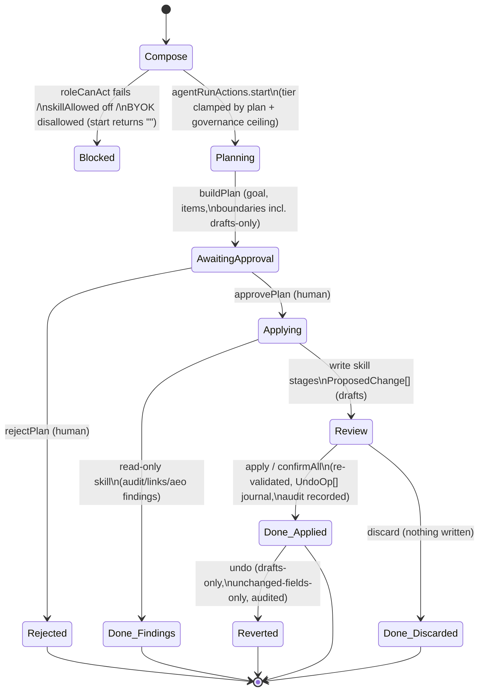

#### 6.3.4 Skills, roster, history

- **Skills** (`skills.ts`, 7): `draft` (needs a collection), `backfill` SEO metadata, `rename` across content (the multi-doc change-review showcase), `audit` (read-only), `links` internal-linking pass (read-only), `aeo` AEO readiness (read-only, Max tier / Pro+), `migrate` pages from a URL. Free text routes through `skillFromPrompt` (priority aeo→migrate→links→audit→draft→backfill). Each card shows credit estimate (`AI_ACTIONS` in `src/lib/billing/pricing.ts`) and gate hints; a governance-disabled skill renders disabled with "Off in AI controls". [EXISTING]
- **AgentRoster** (`agents-store.ts`): named agents (emoji avatar, skill, prompt, schedule) seeded per project (Content agent / SEO agent / Site auditor). Actions: create/edit/delete → `namedAgentActions.add/update/remove`; **Run now** → `agentRunActions.start` with `agentId`/`agentName` (run title becomes "Name: Skill") + `namedAgentActions.recordRun`. Schedules are display-only [SIMULATED]; a real scheduler (cron + queue) is [MISSING].
- **AgentHistory**: searchable run list, per-run status/credits/applied counts, **CSV export** (client-side blob), **hover Undo** on applied runs → `agentRunActions.undo`. [EXISTING]
- **Run card states** (shared between dock and page): planning spinner with streamed step list; plan card with Approve/Reject buttons; applying steps; review panel; done card showing applied count, `creditsSpent` (or "Billed to your key" for BYOK runs), and **Undo this run**; rejected and reverted badges. `runIsActive()` drives the dock's live indicator. A **credits meter** near the composer shows plan-included credits vs spend (display math from `AI_ACTIONS`; no real ledger decrements it [SIMULATED]).

#### 6.3.5 Workspace agent (`/w/$workspace/agent`)

Same composer at workspace scope: requires an **@project chip** before submit (the store is project-keyed); on submit it hands off via navigation to the project agent page `?run=<id>`. [EXISTING]

#### 6.3.6 Page generators (SEO pages + ABM) and Pages-hub entry points

Both are structured wizard front-ends (`src/components/cms/generate/`: `GenerateMenu.tsx`, `SeoPagesDialog.tsx`, `AbmPageDialog.tsx`, `GeneratorShell.tsx`, `GenerationBatchBar.tsx`) that create **agent runs** via `agentRunActions.startGenerator` — so history, audit, credits, and undo come free. The wizard *is* the approval, so generator runs go straight `applying → done`; pages land as **drafts** with `batchId` + `generatedFor`, undo journal = `removePage` per page.

- **SEO pages from keywords** (Basic+, `seo-page` action = 12 credits/page at Balanced, cap 50/batch): paste keywords or upload CSV (header row detected; extra columns become `{{token}}` variables) → template card + URL prefix (e.g. `/lp`) + title/description patterns with a live Google-style example → review step (page count, credit total, brand-voice line, destination) → **Generate** → streamed steps → "N draft pages created / **Review pages**" linking to the Pages hub `?batch=<runId>`. [EXISTING], generation content [SIMULATED] (`buildSeoPages` in `generate.ts`).
- **ABM page builder** (Pro+, `abm-page` = 60 credits/page): account name(s) + context textarea (or accounts CSV + sales-motion selection) → template or AI mode with a section-by-section personalization plan → generates `/for/{slug}` draft pages hard-set to **noindex** ("these pages are for the accounts, not for search") → **Open in editor** navigates to `/visual?page=…` with the agent dock showing the run. [EXISTING]/[SIMULATED] same split.
- **Pages-hub Generate button**: the hub toolbar's **Generate** menu opens either wizard; menu items disable with "Turned off in AI controls" when governance blocks a generator. The `?batch=` **GenerationBatchBar** shows title + live draft/live counts, **Publish all** (per-page publish through `pagesActions.update`), **Undo** (run journal, removes remaining drafts only), and dismiss. [EXISTING]

**Store guards** for generators mirror runs: `roleCanAct`, `generatorAllowed(wsId, kind)`, `tierAllowed(plan, "balanced", actionId)` — each returns `""` when blocked. [EXISTING]

**Production requirements.** [RECOMMENDED] An agent orchestration service: LLM calls behind the same status machine streamed over SSE/WebSocket; server-side plan/proposal persistence; credit metering with atomic budget checks (governance `monthlyCreditBudget` is currently *displayed* but not decremented against a real meter — metering is [SIMULATED]); a job queue for generators and scheduled roster agents; undo journal stored as first-class server data; BYOK keys in a vault, never client-held.

---

### 6.4 Connect-your-AI, external agents, AI governance

#### 6.4.1 ConnectAiDialog (top bar + ⌘K)

**Purpose.** One-tap "point your own AI at this project": BetterCMS expects many users to drive it from Claude Code/Cursor rather than the in-app agent.

**Code.** `src/components/agent/ConnectAiDialog.tsx`, recipes in `src/lib/agent/mcp-clients.ts`, grants in `src/lib/agent/connected-store.ts`. Opened from the **Connect** button in `GlobalTopBar.tsx` and a Command-palette entry.

**Layout & actions.** Editor picker (`MCP_CLIENTS`: Claude Code, Cursor, VS Code, Windsurf, Claude Desktop) → per-editor install steps rendered with the real command, e.g. Claude Code: `claude mcp add bettercms -e BETTERCMS_TOKEN=<token> -- npx -y @bettercms-ai/mcp`, then `/mcp__bettercms__studio`; Cursor/Windsurf get JSON config blocks; VS Code gets `code --add-mcp …`. Every block has a copy button. **Create key** → `agentGrantActions.create(projectId, client)` returns `{grant, token}`; the raw token is shown **once** and substituted into the steps (placeholder until then); the grant list shows masked tokens + **Revoke** → `agentGrantActions.revoke`. The MCP endpoint `https://mcp.bettercms.site/v1/projects/{id}` (from `mcpEndpoint()`) is copyable, with `DEFAULT_SCOPES` and a guardrails note (staging-only writes, audited). When governance `externalAgentsAllowed` is off the dialog renders the disabled state. [EXISTING] UX; the endpoint, token auth, and MCP server itself are [SIMULATED] — the MCP server is a headline production build.

#### 6.4.2 Connected agents pages

- **Project**: `settings.agents.tsx` — grant list per project (client, masked key, created, last used), create/revoke (same `agentGrantActions`), endpoint + setup command. Dev-gated.
- **Workspace**: `w.$workspace.settings.agents.tsx` — workspace MCP endpoint + setup command + client roster + per-project grant summary with "Manage keys" links into each project. Shows an **amber banner** when governance disables external agents, with an inline re-enable for admins. [EXISTING]

#### 6.4.3 AI governance (`/w/$workspace/settings/ai`)

**Purpose.** Workspace admins cap what the agent may do — without ever removing the human.

**Layout.** A pinned "Two rules never change" card (plan approval + no auto-publish — deliberately **not** configurable), then controls: **monthly credit budget** (number or plan default), **tier ceiling** (Lite/Balanced/Max), **per-skill toggles** (all 7), **per-generator toggles** (SEO, ABM), **BYOK allowed**, **external agents allowed**.

**Actions** → `governanceActions.patch(wsId, partial)`, `setSkill(wsId, skillId, on)`, `setGenerator(wsId, kind, on)` (`src/lib/agent/governance-store.ts`).

**Enforcement — the key engineering fact:** every toggle is enforced in `runs-store.ts` (`skillAllowed`, `generatorAllowed`, `clampToCeiling`, `byokAllowed` checks; blocked calls return `""`) *and* reflected as disabled UI with the hint "Off in AI controls" across the Generate menu, agent-page skill rows and generator cards, composer BYOK section, and Connected-agents banner. [EXISTING] Manage requires `canSeeDeveloper`; other roles see the page read-only with a lock note. The credit **budget** number is stored and displayed but not yet debited by a metering engine [SIMULATED]. Production: governance as server-side policy evaluated on every agent/MCP request [RECOMMENDED].

---

### 6.5 SEO section + Markdown manager

#### 6.5.1 SEO section (`/w/$workspace/p/$project/seo/*`)

**Purpose.** Everything organic-search shaped in one place. Sub-nav (`src/components/cms/seo/SeoSubNav.tsx`): **Overview, Pages, Schema markup, Sitemap, RSS feed, Robots, Redirects, Issues** — each its own route file.

- **Overview** (`seo.tsx` index): site-level score (`ScoreGauge`), audit summary from `src/lib/cms/seo-audit.ts` (real checks over live pages: missing meta, short titles, noindex, etc. [EXISTING]), SERP preview (`SerpPreview.tsx`) and **AI answer preview** (`AiAnswerPreview.tsx` — AEO surface showing how an answer engine would cite the page) [EXISTING] with heuristic scoring [SIMULATED].
- **Pages** (`seo.pages.tsx`): per-page SEO list (title/description/indexing status), row click → per-page SEO detail (`pages.$pageId.seo.tsx`) with meta editing (writes `pagesActions.update`), version history (`SeoPageVersionHistory.tsx`). [EXISTING]
- **Schema markup** (`seo.schema.tsx`): JSON-LD schema builder where meta patterns embed **`{{field}}` CMS variables** via `TokenField.tsx` — a purple-chip editor: typing `{{` opens a field picker, tokens render as chips, backspace deletes atomically; output previews with live field values. [EXISTING]; nothing renders JSON-LD on a real site [SIMULATED].
- **Sitemap** (`seo.sitemap.tsx`): generated sitemap preview from live pages, include/exclude, copy URL. [SIMULATED] serving.
- **RSS feed** (`seo.rss.tsx`): collection-driven feed config (source collection, field mapping, item limit) with XML preview. [SIMULATED] serving.
- **Robots** (`seo.robots.tsx`): robots.txt editor with sensible default. [SIMULATED] serving.
- **Redirects** (`seo.redirects.tsx` + `RedirectsManager.tsx`): table of from→to rules, add (with 301/302 type), edit, delete → `redirectActions.add(projectId, {from, to, type})/update/remove` in the central store. [EXISTING] data, [SIMULATED] enforcement.
- **Issues** (`seo.issues.tsx`): the audit findings as a worklist with per-issue deep links. [EXISTING]

Gating: SEO tab visible to marketer+ (`visibleTabs`); some AEO features Pro+. Production: sitemap/RSS/robots/redirects/JSON-LD must be served by the delivery layer (edge middleware for redirects [RECOMMENDED]), and the audit should run as a background job with history.

#### 6.5.2 Markdown manager (Pages hub → **Pages | Markdown** pill)

**Purpose.** The AEO delivery surface: every page/entry gets a `.md` twin serialized on request; `llms.txt` indexes it; standalone `.md` files are the only markdown-first content.

**Code.** `src/components/cms/markdown/MarkdownManager.tsx`, store `src/lib/md/md-store.ts`, serializers `src/lib/md/serialize.ts` (`pageToMarkdown`, `entryToMarkdown`, `llmsTxt`, `llmsFullTxt` — these are the **production contract**).

**Layout & actions.** Delivery card on top, endpoints table below, `ListToolbar` search + Type filter (All/Static/Collections/Files with counts) + shared `Paginator`.
- **llms.txt row**: Auto/Custom badge, copyable URL, **Preview** (generated from published content only; drafts excluded), **Edit** (prefilled from the generated text; saving switches mode to Custom → `mdActions.setLlmsMode(projectId, "custom", text)`), **Upload** (file → custom), **Revert to auto** → `setLlmsMode(projectId, "auto")`. Enable/disable → `mdActions.setSurface(projectId, "llms", on)`. [EXISTING]
- **llms-full.txt row**: off by default with a context-window honesty note → `setSurface(projectId, "llmsFull", on)`. [EXISTING]
- **Content negotiation row**: "Always on" + curl example (`Accept: text/markdown`). [SIMULATED] — `src/lib/cms/delivery.ts` narrates it; no route serves it.
- **Endpoints table**: one row per page/entry/file with source chip; per-row **Serve** switch → `mdActions.toggleExcluded(projectId, key)` (drops from llms.txt live); **Preview** dialog (mono, Copy/Download). File rows add a StateBadge and an editor (title/path/mono body; `normalizeMdPath` coerces to `/x/y.md`) with **Save as draft** / **Publish** → `mdActions.addFile/updateFile/setFileState`; row ⋯ menu: Publish/Unpublish (`setFileState`), Copy, Download, Delete (`removeFile`). Uploads land as drafts; drafts never appear in llms.txt/full. [EXISTING]

No plan gate — markdown delivery is table stakes. Production: HTTP routes for `/*.md`, `/llms.txt`, `/llms-full.txt` with content negotiation and CDN caching keyed on publish events [RECOMMENDED].

---

### 6.6 Forms (`/w/$workspace/p/$project/forms`, `forms/$formId`)

**Purpose.** Build forms, embed them anywhere, collect submissions into a lightweight CRM with spam handling.

**Code.** `src/lib/forms/forms.store.ts` — the one localStorage-backed store (`bettercms.forms.v1`), exposing **server-function-shaped async APIs** (this store is the clearest draft API contract in the repo). Dead Supabase `*.functions.ts` files exist for comments/reactions; forms do NOT use them. UI: `FormsDashboard.tsx`, `CreateFormModal.tsx`, `FormCard.tsx`, `builder/`.

**Dashboard.** Stats (submissions, conversion), form cards with status; **New form** → `CreateFormModal` (name, type/template) → `createForm`; card menu: **Duplicate** → `duplicateForm`, **Delete** → `deleteForm`, status toggle → `updateFormStatus`. [EXISTING]

**Builder** (`forms/$formId`, tabbed):
- **Field library** (12+ kinds): text, email (with **business-email-only** toggle validated by `business-email.ts`), **phone with country-code flag picker** (`countries.ts`), select, checkbox, textarea, number, date, file, hidden, consent, plus a **Cloudflare Turnstile** captcha option. Add → `createField`; edit props (label, placeholder, required, width, options) → `updateField`; duplicate/delete → `duplicateField`/`deleteField`; drag reorder → `reorderFields`. [EXISTING]; Turnstile is config-only [SIMULATED].
- **After submit** tab: thank-you message, redirect URL, error message → `updateForm`. [EXISTING]
- **Submissions CRM** tab: table with a **column per form field**, plus IP, date; **Submissions vs Spam** tabs; multi-select checkboxes with bulk actions (mark spam/not spam → `bulkUpdateSubmissionStatus`, delete → `bulkDeleteSubmissions`); per-row status/delete → `updateSubmissionStatus`/`deleteSubmission`; list via `listSubmissions`. Test submissions write through `recordSubmission` — the same function a public endpoint would call. [EXISTING]
- **Integrations** panel: rows (e.g. Slack, webhook, email notification) → `listIntegrations`/`createIntegration`/`updateIntegration`/`deleteIntegration`. Config-only [SIMULATED] delivery.
- **Embed & API** panel: endpoint URL, copyable HTML, `fetch`, and React snippets generated from the real field list. [EXISTING] snippets; endpoint [SIMULATED].

**Gating.** Forms tab per `visibleTabs`; all store access SSR-guarded (localStorage only touched client-side). **Production:** a public, unauthenticated submission endpoint with rate limiting + Turnstile verification, spam classification, file-upload storage, integration fan-out via the webhook/queue system, CSV export. The async function signatures port directly to server functions [RECOMMENDED].

---

### 6.7 Search hub (`/w/$workspace/p/$project/search`)

**Purpose.** Site search as a product feature: configure what is indexed, try it, install it, and see query analytics.

**Code.** `src/components/cms/search/SearchHub.tsx`, store `src/lib/search/search-store.ts` (localStorage `bettercms.search.v1`). **Important nuance:** the index is **REAL in the demo** — built in-browser from live pages (`pages-store`) and collection entries, honoring per-field `searchable` config, with ranked and highlighted results. Only the infrastructure (Typesense, scoped keys, sync jobs) is simulated.

**Tabs (5).**
1. **Overview** — enable pill (`EnablePill` → `searchActions.patch(projectId, {enabled:true})`, stamps `enabledAt`), stat cards (indexed docs, queries), public key with copy, **AI search** toggle (hybrid keyword+semantic; adds typo tolerance in the demo) plan-gated via the dormant `search`/AI feature keys. [EXISTING]
2. **Searchable content** — **Pages** master switch (`patch {includePages}`), per-collection switches (`setCollection`), expandable per-field `MiniSwitch` rows (`setField` → `fieldOff` map, keyed `collectionId.fieldName`) seeded from the schema's `searchable` flags. [EXISTING]
3. **Playground** — live query box against the in-browser index; `HitRow` shows ranked, highlighted results; every query logs `searchActions.logQuery(projectId, q, hits)` (capped 500 rows). [EXISTING — genuinely functional]
4. **Install** — copyable widget/SDK snippets embedding the **public search-only key** (`publicKey`, regenerate → `searchActions.regenerateKey`); includes a rendered demo `SiteSearch` component. [EXISTING] snippets; hosted widget [SIMULATED].
5. **Analytics** — `useSearchAnalytics` aggregates the query log into **top queries** and **no-result queries** tables (`QueryTable`, warn tone for zero-hit). [EXISTING over real logged data]

**Production.** [RECOMMENDED] Typesense (or Meilisearch) collections per project, scoped search-only API keys, index-sync background jobs on publish events, and server-side query analytics; keep the `SearchConfig` shape and `searchActions` signatures as the config API. See `SEARCH_PLAN.md` in-repo.

---

### 6.8 Analytics and Usage

**Analytics** (`w.$workspace.p.$project.analytics.tsx`). Traffic dashboard: `MetricCard` row (Visitors, Sessions, Pageviews, Conversions, Bounce rate, with up/down deltas vs the previous period), recharts time series, top pages/sources, shared `DateRangePicker` (`daysInRange`, `defaultRange`) in the page actions slot. Headless projects get `HeadlessApiCallout` (bring-your-own analytics note). Plan-gated via `siteHas` → `InlinePlanHint`/`LockedFeature`. **All numbers are seeded/derived** [SIMULATED]; the page layout, ranges, and gating are [EXISTING]. Production: a real collector (or Plausible/PostHog integration) behind the same date-range query shape [RECOMMENDED].

**Usage** (`settings.usage.tsx` project; `settings/billing/usage` + `settings/usage` at workspace level). Metric tabs — **Bandwidth, Storage, API requests, AI credits**, plus **Compute** only for Cloud/managed sites — each with used/limit meters (limits from the plan's `def.limits`), a detail panel per tab (`BandwidthDetail` daily-egress chart + by-asset table, `StorageDetail` by type, API breakdown, `AiDetail` per-event credit ledger), and an **Export** button that downloads CSV client-side. Numbers are deterministic hash-seeded series [SIMULATED]. House rule enforced: usage displays never use red. Production: a metering pipeline (CDN logs, storage scans, API gateway counters, AI credit ledger) feeding these exact panels [RECOMMENDED].

---

### 6.9 Domains

**Model.** Domains are **project-owned**; the workspace page is a roll-up. One source of truth: `domainActions` in `src/lib/cms/store.ts` — `add(workspaceId, projectId|undefined, host)`, `setStatus(domainId, status)`, `setPrimary(domainId)` (demotes siblings), `remove(domainId)`. Shared `AddDomainDialog` (in `src/components/cms/domains/`) normalizes the host, guards duplicates, and at workspace level includes a **project picker** then navigates into that project's domain settings.

**Project page** (`settings.domains.tsx`): primary-domain section; custom-domain list rows with ⋯ menu — **Set as primary** (disabled until status is verified/active) → `setPrimary`, **Copy**, **Remove** → `remove`; synthesized `*.bettercms.site` preview domains; DNS record rows (A/CNAME/TXT) with copy buttons; SSL status chip (`sslStatus: issued|pending|failed`). Gated by `siteHas(plan, "custom-domain")` with an explanatory locked panel. [EXISTING] data flow; DNS verification and SSL issuance [SIMULATED] (status flips are manual/demo).

**Workspace page** (`w.$workspace.settings.domains.tsx`): read-only roll-up **grouped by project**; row/Manage buttons route into the owning project's settings; Add-domain opens the shared dialog. [EXISTING]

**Production.** [RECOMMENDED] Real DNS verification (TXT challenge polling), ACME SSL issuance, apex/CNAME guidance per host, and domain-to-deployment binding; keep `domainActions` as the API.

---

### 6.10 Team and access

**Members** (`w.$workspace.members.tsx`, components in `src/components/cms/workspace/`). `MembersTable` (name, email, role, seat, status, last active), **Invite** → `InviteDialog` → `memberActions.invite(workspaceId, email, role)`; `InvitationsList` pending rows with **Resend** → `resendInvite`, **Revoke** → `revokeInvite`; row menus: **Change role** → `changeRole` (writes seat billing implications), **Deactivate/Activate** → `setStatus`, **Remove** → `remove`; **Add seat** → `addSeat`, **Change seat** → `changeSeat`. Seat economics: editor/marketer/developer paid, reviewer free, guests free (pricing brief). Email delivery of invites [SIMULATED]; everything else [EXISTING] against the 90+ seeded members.

**Guest teams** (`GuestsSection.tsx`, `src/lib/workspace/guests-store.ts`). Agency model: invite an external team (admin + members) with scope `"all"` or explicit project ids, a role, and a `canPublish` flag. Actions: `guestActions.invite`, `markActive` (demo shortcut standing in for the acceptance email loop [SIMULATED]), `updateAccess`, `addMember`, `removeMember`, `removeTeam`. Plan caps: 2 teams x 5 members self-serve, 10x10 Enterprise. Watch the demo quirk: workspace slug `flowtrix` has id `ws_acme` — must not leak into production data.

**Custom roles** (Access page Roles tab, `custom-roles-store.ts`, `CapabilityGroupPicker.tsx`, `RoleCard.tsx`). Builder: name/description → base-role cards (marketer/editor/reviewer) → 6 capability checkboxes (edit, publish, seo, agent, generate, markdown) → three ScopePickers (collections/pages/sections: "All" or a checkbox list). Create → `customRoleActions.add(projectId, input)`; delete → `remove`. Plan gates: custom roles **Team+**; element/section-type scoping **Enterprise only** (locked dashed row on Team; whole panel locked below Team with "See plans"). **Runtime enforcement of custom-role capabilities is [MISSING]** (v2/backend); layering rule when built: workspace AI controls beat role capabilities. Also flag: `SITE_PERMISSION_MATRIX` in `src/lib/cms/permissions.ts` exists but is **unused** [MISSING wiring].

**Access page + audit log** (`settings.access.tsx` project, `w.$workspace.roles.tsx`): role model explainer cards plus an **audit log table** fed by `recordAudit`/`recordAgentAudit` entries in the central store (agent applies/reverts, publishes, invites). [EXISTING] plumbing; production needs an immutable, queryable audit service with retention [RECOMMENDED].

---

### 6.11 Transfers and share links

**Transfers** (`TransferProjectDialog.tsx`, `src/lib/workspace/transfers-store.ts`; Webflow-modeled). Two paths: **instant own-workspace move** → `transferActions.toOwnWorkspace(projectId, targetWorkspaceId)`; **email transfer** → `sendToEmail({...})` creating a pending request — recipient sees an **accept banner** on their dashboard → `accept(requestId, intoWorkspaceId)` / `decline(requestId)`; sender can `cancel(requestId)`. Plan resets on arrival (site plan resets to the target's defaults). Email leg [SIMULATED]; state machine [EXISTING].

**Share links** (`ShareProjectDialog.tsx`, `src/lib/cms/share-store.ts`, route `src/routes/p.$token.tsx`). Two link kinds per project: **preview** and **template**. Actions: `shareActions.enablePreview/disablePreview/enableTemplate/disableTemplate`; **Clone on/off** → `setCloneEnabled` (cloning is baked into the token, so toggling **re-mints** the template link); views counted via `recordView`.

**/p/$token sandbox** [EXISTING]: a top-level route that deliberately **escapes the workspace auth gate** — anyone with the link gets a read-only review surface: pages rendered for real (desktop/mobile toggle), the content model, and collection entries; no editing, no settings, no workspace nav; invalid/disabled token → lock screen. Template links add a **Clone** button → `cloneProject` (`src/lib/cms/clone.ts`) duplicating the project into the visitor's workspace. Gotcha encoded in the store: `useSyncExternalStore` must return a stable empty array for unknown tokens. Production: signed, revocable tokens resolved server-side with SSR rendering of shared pages [RECOMMENDED].

---

### 6.12 Billing and plans

**Routes.** `w.$workspace.settings.plans.tsx` (plan catalog + switch flows), `settings.billing.*` (overview, `invoices`, `payment`, `usage`), plus per-project **plan buy/switch** at `p.$project.settings.plan.tsx`. Logic in `src/lib/billing/pricing.ts`: two-layer model — **workspace plan** (free/company/agency/team/enterprise: seats, white-label) x **per-site plan** (free/basic/pro/team/enterprise: bandwidth, locales, AI credits, features via `FEATURE_MATRIX` + `siteHas(plan, key)`).

**Actions.** On **Plans**: plan cards with per-plan feature lists and Current/Upgrade/Downgrade buttons → `workspaceActions.setWorkspacePlan` (confirm dialog summarizes seat and feature deltas). On the project **Plan** page: site-plan cards with monthly price, buy/switch flow writing the project's `sitePlan`, and a downgrade warning listing features that would lock. **Billing overview**: current plan card, seat-count line items with per-seat price math rendered live from member seats (paid: editor/marketer/developer; reviewer and guests free), AI-credit meter, next-invoice estimate. **Invoices**: table of past invoices with Download buttons; **Payment**: card-on-file panel with Update/Remove. Invoices table and payment-method card are display-only [SIMULATED]; no payment processor exists [MISSING]. `FeatureGate.tsx` (`LockedFeature`, `InlinePlanHint`) is the single gating UI used app-wide; a `search` feature key exists in the matrix and is currently dormant. AI tiers gate per plan via `tierAllowed` (Lite everywhere; Balanced on Pro+ and on Basic only for `BASIC_BALANCED_ACTIONS`; Max Pro+). [EXISTING] math and gating; production needs Stripe (subscriptions + seat proration + metered AI credits), entitlement service backing `siteHas`, and invoice/tax handling [RECOMMENDED].

---

### 6.13 Workspace settings (`/w/$workspace/settings/*`)

Shell: `SettingsDashboard.tsx` landing + `WorkspaceSubNav.tsx`; every group uses `SettingsSection` (header **inside** the card so titles align with fields — a deliberate repo-wide convention).

- **General** — workspace name, slug (uniqueness via `workspaceActions.slugTaken`), logo upload (data URL [SIMULATED]) → `workspaceActions.update`. [EXISTING]
- **Members / Roles** — §6.10.
- **Plans / Billing / Usage** — §6.12, §6.8.
- **Domains** — §6.9 roll-up.
- **Notifications** — email/in-app switch groups; **known cosmetic gap: switches do not persist** [SIMULATED, flagged in `WORKSPACE_AUDIT.md`].
- **AI controls** — §6.4.3.
- **Connected agents** — §6.4.2.
- **API keys** (`settings.api-keys.tsx`, `src/lib/workspace/tokens-store.ts`) — personal + machine tokens. **Create** → `tokenActions.create(wsId, kind, name)` returns `{token, raw}`; the raw `bcms_pat_*`/`bcms_mt_*` value appears in a **one-time reveal dialog whose Done button is disabled until Copy is clicked**; the list only ever shows `masked` (`bcms_pat_xxxxx...yyyy`); **Revoke** → `tokenActions.revoke`. [EXISTING] UX; no API validates tokens [SIMULATED].
- **Webhooks** (`settings.webhooks.tsx`) — **Add endpoint**: URL + event checkboxes from `WEBHOOK_EVENTS` (`page.published`, `entry.published`, `form.submission`, `agent.applied`, `member.invited`) → `webhookActions.add` returns the endpoint plus a `whsec_*` **signing secret shown once**; rows support **Pause/Resume** → `setActive`, **Delete** → `remove`. Delivery [MISSING] — production needs a queued dispatcher with HMAC signing, retries, and a delivery log [RECOMMENDED].
- **Integrations** — honest "Coming soon" placeholder cards. [MISSING by design]
- **Audit log** — table of `recordAudit` entries. [EXISTING] client-side.

Manage-level pages require owner/admin (developer for API keys/webhooks/agents via `canSeeDeveloper`); device tablet+.

---

### 6.14 Project settings (`/w/$workspace/p/$project/settings/*`)

Twenty-one child routes; the same `SettingsSection` convention. Highlights and their wiring:

- **General** — name, slug, project kind badge, delete/archive → `projectActions`. [EXISTING]
- **Access** — project members + custom roles builder (§6.10) + guest visibility.
- **Brand** — links the Brand kit (`/brand` page, `brand-store.ts`: tokens, live preview, `parseDesignMd` design.md import, API bar, version bump per save via `brandActions`). [EXISTING]
- **Plan / Usage** — per-site plan purchase and meters (§6.12, §6.8).
- **Delivery** — headless delivery config narrative (`delivery.ts`), markdown/content-negotiation summary. [SIMULATED]
- **Domains / Redirects / SEO / Sitemap / Robots** — project-scoped twins of the SEO surfaces (same stores: `domainActions`, `redirectActions`, page meta).
- **Code / Env** — custom code injection slots and environment variables (`customCodeActions`, `envVarActions` in the central store) — stored, never executed [SIMULATED].
- **Backups** — snapshot list with restore buttons over `snapshots.ts` seed data [SIMULATED].
- **Integrations** — per-project placeholder [MISSING by design]; **Webhooks / API** — project-scoped keys and endpoints mirroring §6.13 patterns (`apiKeyActions`, central `webhookActions`).
- **Publishing** — publish defaults, staging URL config [SIMULATED].
- **Deployment / Hosting** (`settings.deployment.tsx`, top-level `hosting.tsx`, managed/Cloud sites only) — repo/build config (framework, build command, output dir), deploy history rows; gated to `kind !== "headless"`. [SIMULATED] — real CI/CD integration is a major production build.
- **Setup / Integration guide** (`settings.setup.tsx`) — per-framework quick-start (Next.js/Nuxt/Astro/etc.): copyable install + fetch snippets built from the project's real API ids. [EXISTING] snippets; endpoints [SIMULATED].

Settings tab visibility: developer-leaning pages (code, env, webhooks, api, deployment) gated by `canSeeDeveloper`; the rest marketer+ or admin.

---

### 6.15 Account area (`/account/*`), auth, onboarding, workspace creation

**Account** (`src/routes/account.*.tsx`, standalone top-level shell; store `src/lib/workspace/account-store.ts`, UI `AccountBits.tsx`, `SecurityCards.tsx`):
- **Profile** — name, avatar upload (data URL), title → `accountActions.updateProfile`. [EXISTING]
- **Login & security** — change password (`changePassword(at)` records the timestamp; **the value itself is never stored**), **2FA** enable/disable with QR + recovery codes (`enableTwoFactor`/`disableTwoFactor`/`regenerateBackupCodes` — codes are client-generated [SIMULATED]), **sessions list** with per-session sign-out [SIMULATED].
- **Email** — primary email management; seeded once from the Supabase session via `seedEmail`. [EXISTING]/[SIMULATED verification]
- **Connected accounts** — Google/GitHub connect/disconnect → `connect(provider, handle, at)`/`disconnect` [SIMULATED OAuth].
- **Preferences** — theme, density, **reduce motion (has a real effect** — `applyPrefs` writes a root class) → `updatePrefs`. [EXISTING]

**/auth** (`auth.tsx`): split screen; SSO buttons (Google/GitHub) are toast + guest session [SIMULATED]; **email/password is real Supabase** [EXISTING — the only real backend]; forgot-password → `reset-password.tsx` flow; the dashed **"Continue without signing in"** guest door sets the localStorage guest flag (`lib/guest.ts`) — keep verbatim, it is the demo entrance.

**/onboarding** (`onboarding.tsx` + `components/onboarding/steps.tsx`): 6 one-question screens (role → what you build → team size → referral → workspace name → invites), click-to-advance cards with number-key shortcuts and progress dots; answers persist to `onboarding-store.ts` (localStorage) and **echo forward** (agency answers change later copy); workspace step shows a live identity preview (`/w/{slug}`); invites use an email chip input and are the only skippable step; finish → `enableGuest()` + `workspaceActions.create` → navigate. [EXISTING]

**/workspace/new**: kind → name → invites, closable; `workspaceActions.create` (owner seat via the unknown-workspace fallback in `my-role.ts`). Also reachable from the workspace switcher's Create button. [EXISTING]

Production: real SSO (OAuth/OIDC + SAML for Enterprise), server-side sessions, TOTP 2FA, transactional email — Supabase covers much of this [RECOMMENDED].

---

### 6.16 Notifications center

**Code.** Bell in `GlobalTopBar.tsx` with an **unread badge**; popover renders the shared `NotificationsList.tsx`; full list on the workspace settings notifications page. Store: `notificationActions` in the central store — `add(workspaceId, {kind?, title, body?})`, `markRead(id)`, `markUnread(id)`, `markAllRead(workspaceId)`, `remove(id)`.

**Producers today** [EXISTING, in-memory]: workflow requests and approvals, assignment changes, transfer offers, invites, agent completions. Actions in the UI: row click marks read + deep-links, per-row unread toggle and delete, **Mark all read** header button. No email/push channel exists [MISSING]. Production: a notification service with per-user preferences (the currently cosmetic switches in §6.13 become real), email digests, and web push; keep the action names as the API [RECOMMENDED].

---

### 6.17 Shell utilities: command palette, shortcuts, theme, view-as

- **Command palette (⌘K)** — `src/components/cms/CommandPalette.tsx`: fuzzy list across pages/collections/components (built from the content tree with grouped scopes and path breadcrumbs), navigation commands, and action entries including **Connect your AI** (opens `ConnectAiDialog`). Selection navigates or fires the mapped action. [EXISTING]; command-palette depth (actions like "publish this page") is a v2 roadmap item [MISSING].
- **Shortcut cheatsheet** — `ShortcutCheatsheet.tsx`, opened from the top-bar help icon (`?`): static grouped keymap dialog; shortcut registry in `src/lib/cms/shortcuts.ts`. [EXISTING]
- **Theme toggle** — `ThemeToggle.tsx` → `src/lib/cms/appearance.ts` (localStorage `bettercms.appearance.v2`: dark/light/system; `.dark` class on `<html>`; Graphite neutral dark system with a remap layer; preview canvases always stay light). [EXISTING]
- **View-as** — `ViewAsControl.tsx` over the global store in `src/lib/workspace/my-role.ts`: preview any role at-or-below your seat; **the entire app reads the effective role** (`useEffectiveRole`), including store-level guards (`effectiveRoleFor` inside `runs-store.roleCanAct`) — so view-as is a genuine permission simulation, not a skin. Switcher pill also appears in the visual-editor sub-header. [EXISTING]; production must map this to real server-side role evaluation with an impersonation audit trail [RECOMMENDED].
- **Presence stack** — top-bar avatar stack + who's-here popover with jump-to; simulated engine (`presence-store.ts`, 3.6s tick over real seat data) [SIMULATED]; production = websocket presence (or Liveblocks) behind the same hooks.

**Device gating (applies to every surface above).** `src/lib/device-caps.ts` allow-lists capabilities per tier: mobile = focused editing subset, tablet = full workbench including dev mode, desktop = everything; `AppShell` wraps gated routes in the `LargerScreen` interstitial and provides the mobile drawer/hamburger. [EXISTING]

---

### 6.18 Cross-surface production checklist

Recurring backend obligations that fell out of the surfaces above, deduplicated:

1. **One-time secrets** appear in four places (workspace API tokens, webhook signing secrets, MCP grant tokens, search public keys). Production needs a single secrets service: generate server-side, return raw exactly once over TLS, store only a hash + mask, support revocation and last-used tracking. [RECOMMENDED]
2. **Governance as policy, not UI.** `skillAllowed`/`generatorAllowed`/`clampToCeiling`/`byokAllowed`/custom-role capabilities must be evaluated in one server-side policy engine consulted by the agent API, the MCP server, and the REST API alike — the client-side "return empty string when blocked" pattern is the spec, not the enforcement. [RECOMMENDED]
3. **Event backbone.** Webhook events, notifications, audit lines, search-index syncs, markdown/llms.txt regeneration, and analytics all key off the same domain events (`page.published`, `entry.published`, `form.submission`, `agent.applied`, `member.invited`, plus transfer/workflow events). Emit once from the write path into a queue; fan out. [RECOMMENDED]
4. **Store-to-service mapping.** Every store cited in this section (`schema-store`, `runs-store`, `governance-store`, `connected-store`, `agents-store`, `byok-store`, `search-store`, `md-store`, `forms.store`, `tokens-store`, `custom-roles-store`, `guests-store`, `transfers-store`, `share-store`, `account-store`, plus the central `store.ts` action families) keeps its action signatures as the API contract; the endpoint derivation belongs in the API specification section of this handoff. [RECOMMENDED]
5. **Demo-data hygiene.** `ws_acme`/`flowtrix` slug-id mismatch, `CURRENT_ACTOR = "m_jane"`, `CURRENT_MEMBER`, pinned ids like `s_home_hero`, and hardcoded `/w/acme` fallbacks must not leak into production schemas or seeds. [EXISTING quirk / [RECOMMENDED] cleanup]
## 7. Roles, Permissions & Seats

### 7.1 The five workspace roles [EXISTING]

Plain language: everyone in a workspace has one of five seats, and each seat unlocks a slice of the product. An Admin sees everything; a Reviewer only reads and comments. The same person can hold a different seat in each workspace.

Engineering: the role model lives in `src/lib/workspace/my-role.ts`. Roles are a strict rank ladder, and every gate in the app is a rank comparison or an allow-list keyed by role:

| Role (internal id) | UI label | Rank | Blurb (from `ROLE_INFO`) |
|---|---|---|---|
| `owner` | Admin | 5 | Full control of the workspace and billing |
| `developer` | Developer | 4 | Defines sections in code and composes pages |
| `marketer` | Marketer | 3 | Builds and publishes pages from templates |
| `editor` | Content editor | 2 | Edits content inline, no layout changes |
| `reviewer` | Reviewer | 1 | Reviews pages and leaves comments |

Two demo quirks must not survive into production: (1) the signed-in user's seat per workspace is a hardcoded map (`MY_WORKSPACE_ROLE`: flowtrix=owner, atlas=developer, northwind=marketer, pixelforge=editor, wayground=reviewer), and (2) `myRole()` returns `owner` for any unknown workspace slug — a fail-open default. In production the seat is a column on the workspace membership row (`memberships.seat`) and the default for an unknown membership is *no access*, not owner.

### 7.2 View-as cascade [EXISTING]

Plain language: higher roles can preview the app "as" any lower role — an Admin can flip to Reviewer to see exactly what a reviewer sees — but never upward.

Engineering: `canViewAs(actual, target)` allows `target.rank <= actual.rank`. The selection is a tiny global `useSyncExternalStore` store (`setViewAs`, module-level `viewAs` variable). Everything downstream reads the **effective role**: `useEffectiveRole(wsSlug)` for components, `effectiveRoleFor(wsSlug)` for non-hook store guards (e.g. `runs-store.ts`). The effective role is the actual role clamped by the view-as choice; an invalid (higher) view-as silently falls back to the actual role.

[RECOMMENDED] Keep view-as in production — it is a genuinely useful admin tool — but treat it as **strictly cosmetic**. The server must always authorize against the real seat. If you want the preview to be honest (e.g. hide publish buttons *and* reject a publish call), pass an optional `X-View-As` header that the API may use to further *restrict* (never widen) the evaluated permissions.

### 7.3 The four gate functions + tab allow-lists [EXISTING]

All product gating today flows through five exports in `my-role.ts`, called from ~25 files (ProjectNav, ProjectHeader, EditorShell, EntryWorkflowBar, EntryPublishMenu, AgentDock, runs-store, the visual/schema/workflow/agent/settings routes, and more):

- `visibleTabs(role)` — project-nav allow-lists. Owner/developer get `ALL_TABS` (content, schema, media, visual, agent, seo, forms, search, analytics, hosting, settings, pages, collections, components, publishing, workflow). Marketer: content, pages, collections, workflow, visual, agent, media, seo, analytics. Editor: collections, workflow, visual, media, agent. Reviewer: collections, workflow, visual.
- `canSeeDeveloper(role)` — rank ≥ developer. Gates schema builder, API/webhooks, custom code, hosting, search config.
- `canCompose(role)` — rank ≥ marketer. Gates section composition, page creation, templates, and the per-section Design panel.
- `canEditContent(role)` — everyone except reviewer. Gates inline/form editing.
- `canPublish(role)` — rank ≥ marketer. Gates publish/schedule/unpublish across the Publish menu, entry publish menu, and workflow bar.

Note these are *client-side function calls in React components*. There is no route-level guard framework and no server. A reviewer who edits the URL to `/schema` may still mount the route if that route forgot the check (most routes do check; the audit found the checks consistently applied, but consistency is enforced by convention only). Device tiers (`src/lib/device-caps.ts`) apply a second, orthogonal allow-list (mobile/tablet/desktop) over the same tabs.

### 7.4 Custom roles [EXISTING as store + UI; SIMULATED enforcement]

`src/lib/workspace/custom-roles-store.ts` implements per-project custom roles for **Team and Enterprise site plans** (`customRolesAllowed(plan)`). A custom role is:

- a **base** (`marketer` | `editor` | `reviewer`),
- six capability booleans: `edit`, `publish`, `seo`, `agent`, `generate` (page generators), `markdown` (llms.txt / .md delivery),
- three **scopes**, each `"all" | string[]`: collection ids, page paths, and section types. Section-type scoping is Enterprise-only (`sectionDepthAllowed`).

Store actions are `customRoleActions.add/remove`; Team+ projects seed one example ("Blog author": edit-only, scoped to one collection). Crucially, per `WORKSPACE_AUDIT.md` and the code, **custom roles are data + builder UI only — nothing at runtime consults them**. The layering rule (documented, not coded): workspace AI controls beat role capabilities; a role granting `generate` cannot override a workspace that disabled generators.

There is also a separate, generic capability vocabulary in `src/lib/workspace/capabilities.ts` (`CAPABILITY_GROUPS`: content.view/edit/delete/publish, collections.view/edit/schema/delete, media.upload/delete/organize, publishing.draft/review/approve/publish, settings.view/edit/domains/api/security/permissions, with `hasCapability(caps, "group.flag")`). It renders the workspace Roles page and is the better long-term shape for a policy engine — see 7.8.

### 7.5 The unused SITE_PERMISSION_MATRIX [EXISTING, display-only — flag]

`src/lib/cms/permissions.ts` defines a *third* permission vocabulary: 6 site roles (`site_manager`, `designer`, `content_editor`, `marketer`, `reviewer`, `viewer`) × 8 resources (pages, components, collections, media, seo, publishing, analytics, settings) × {view, edit, publish}. Its only consumer is `src/components/cms/ui/RolePermissionMatrix.tsx`, rendered on the project Access settings page as an explanatory table. **No gate anywhere reads it**, and its role names do not match the real 5-role system (`site_manager` and `viewer` do not exist as seats; `WORKSPACE_ROLE_LABELS` in the same file lists yet another set — owner/admin/editor/content_manager/developer/viewer — used nowhere meaningful).

[RECOMMENDED] Do not port this file. Either delete it and re-render the Access matrix from the real gates (derive rows from `visibleTabs`/`canX` so the docs can never drift from behavior), or make it the seed data for the production policy engine and rewrite the gates to consult it. The dangerous middle — shipping a matrix UI that *describes* permissions the code does not *enforce* — is a compliance incident waiting to happen.

### 7.6 Seats and billing [EXISTING pricing math; SIMULATED billing]

`src/lib/billing/pricing.ts` `SEATS`: viewer $0, reviewer $0 (both free and unlimited), editor $10/mo, marketer $15/mo, developer $20/mo (`PAID_SEAT_ROLES`). Seats live at the **workspace** level; `seatCounts(members)` and the itemized-bill builder sum `n × SEATS[role].monthly` per paid role. `SeatRole` (`src/lib/cms/types.ts`) is the same five-value union as `WorkspaceRole` plus `viewer` swapped for `owner` — note the mismatch: the role system has `owner` and no `viewer`; the seat system has `viewer` and no `owner`. [RECOMMENDED] Unify into one enum in production (owner is a flag on a membership, not a seat type; viewer becomes a real sixth role or is dropped) and make Stripe seat quantities derive from a `memberships` count query, never a client-computed number.

Plan gating that touches permissions: custom roles Team+, section-depth Enterprise, guest caps by workspace plan, generators/markdown per the feature matrix (`siteHas(plan, key)`), and the dormant `search` / `ai-search` feature keys (Basic+ / Pro+).

### 7.7 Guest teams [EXISTING store + UI; SIMULATED invites]

`src/lib/workspace/guests-store.ts` models Webflow-style agency guests: a host workspace invites a whole external team, free (no seats), scoped to `"all"` projects or an explicit id list, with one shared role (`developer` | `editor` | `marketer` — note: no owner, no reviewer) and a `canPublish` boolean. Caps by host workspace plan via `guestLimits()`: self-serve (free/company/agency) = **2 teams × 5 members**; managed (team/enterprise) = **10 teams × 10 members**. Actions: `invite`, `markActive` (demo stand-in for the accept flow), `updateAccess`, `addMember`, `removeMember` (admin cannot be removed), `removeTeam`. The Flowtrix workspace (legacy id `ws_acme`) seeds one active team. In production the guest's effective permission is `min(guest team role, canPublish flag)` scoped to the project list — guests must never resolve workspace settings, billing, members, or API keys, which today is only true because the UI doesn't render those links for them.

### 7.8 Permissions matrix (as enforced today)

Built-in roles, client-side enforcement. Legend: full = view+edit; view = read-only; — = surface hidden. Sources: `visibleTabs`, the four `canX` gates, route-level checks, and plan gates noted inline.

| Surface / action | Admin (owner) | Developer | Marketer | Content editor | Reviewer | Guest (dev/editor/marketer) |
|---|---|---|---|---|---|---|
| Dashboard & projects list | full | full | full | full | full | scoped projects only |
| Create/clone/transfer project | full | full | — | — | — | — |
| Pages hub (list, folders, page settings) | full | full | full | — | — | as role |
| Create page / template / folder (`canCompose`) | yes | yes | yes | no | no | marketer/dev: yes |
| Visual editor — open | full | full | full | full | view+comment | as role |
| Inline content edit (`canEditContent`) | yes | yes | yes | yes | no | yes |
| Section compose: add/reorder/variant (`canCompose`) | yes | yes | yes | no | no | marketer/dev: yes |
| Design panel (per-section tokens) | yes | yes | yes | no | no | marketer/dev: yes |
| Comments (create/resolve/react) | yes | yes | yes | yes | yes | yes |
| Publish / schedule / unpublish (`canPublish`) | yes | yes | yes | no | no | only if `canPublish` |
| Compare versions / restore | yes | yes | yes | edit-only restore | view diff | as role |
| Content tab (Northwind section workspace) | full | full | full | — | — | as role |
| Collections (table/gallery, CSV import/export) | full | full | full | full | view | as role |
| Entry editor (blocks, AI commands) | full | full | full | full | view | editor+: full |
| Entry workflow (request review/approve, stages) | full | full | full | full | approve/comment | as role |
| Workflow kanban board | full | full | full | full | view+drag own | as role |
| Schema builder `/schema` (`canSeeDeveloper`) | full | full | — | — | — | dev guests: full |
| Agent dock + `/agent`, runs, undo | full | full | full | full | — | as role (custom role `agent` cap) |
| Page generators (SEO/ABM; plan-gated Basic+/Pro+) | yes | yes | yes | no | no | `generate` cap |
| Markdown delivery (llms.txt, .md files) | full | full | full | — | — | `markdown` cap |
| Forms (builder, submissions CRM) | full | full | — | — | — | dev guests |
| Search config + playground (plan `search` key) | full | full | — | — | — | dev guests |
| Media library (view/upload/organize) | full | full | full | full | view | yes |
| SEO section (meta, redirects, sitemap, schema markup) | full | full | full | — | — | marketer/dev |
| Analytics + usage pages | full | full | view | — | — | marketer/dev: view |
| Hosting (managed sites) | full | full | — | — | — | dev guests |
| Project settings (general, access, plan, domains) | full | full | — | — | — | — |
| Custom roles builder (Team+ plan) | full | full | — | — | — | — |
| Workspace settings: general, notifications | full | view | — | — | — | — |
| Members, invites, seats | full | view | — | — | — | — |
| Billing, plans, usage purchase flows | full | — | — | — | — | — |
| API keys & webhooks (one-time reveal) | full | full | — | — | — | — |
| AI governance (budgets, skill toggles, BYOK) | full | view | — | — | — | — |
| Connected agents (grants, revoke) | full | full | — | — | — | — |
| Audit log | full | view | — | — | — | — |
| Guest team management | full | — | — | — | — | — |
| Account area `/account` | own account, any role | own | own | own | own | own |

[MISSING] Row-level nuances the demo does not enforce: custom-role scopes (collections/pages/sections lists), guest project scoping beyond navigation, per-surface distinctions between owner and developer on workspace settings (today both often see the page; billing mutations are owner-only by UI placement, not by check).

### 7.9 Production enforcement plan [RECOMMENDED]

Everything above is advisory UI state. The production rule: **the client hides; the server denies.** Client gates are UX (don't render buttons a user can't use); the API must re-derive every decision from the database because any user can replay requests with curl and a stolen or lower-privileged token, and because view-as, seeded role maps, and store guards all live in attacker-controlled JavaScript.

1. **Policy layer, one choke point.** A single `authorize(actor, action, resource)` function (or an engine like OPA/Cerbos/Oso, or hand-rolled) called by every route handler *after* authentication and tenant resolution. Inputs: membership seat, guest-team grant, custom-role assignment, workspace/site plan, resource ownership chain (workspace → project → document). Output: allow/deny + reason (for the audit log).
2. **Canonical permission vocabulary.** Adopt the `capabilities.ts` `group.flag` shape as the wire format; compile the five built-in roles into capability sets server-side, so built-in and custom roles evaluate through one code path. Plan gates (`siteHas`) evaluate in the same function so "allowed by role, denied by plan" is one decision with one audit entry.
3. **Middleware order:** authenticate (session/JWT) → resolve tenant from URL and *verify membership* → load effective role (seat ∨ guest grant ∨ custom role, minus plan restrictions) → authorize action → handler. Never derive workspace/project ids from the request body when they are in the path.
4. **Mirror to the client** via a `GET /me/permissions?workspace=…&project=…` payload so the frontend renders from server truth instead of `MY_WORKSPACE_ROLE`; keep the existing gate function *names* so component code barely changes.
5. **Deny-by-default** for unknown roles, missing memberships, and unrecognized actions; contract tests that walk the matrix in 7.8 role-by-role against the real API.

## 8. Authentication & Security

### 8.1 What exists today

- **[EXISTING] Supabase email/password auth** — `src/routes/auth.tsx` calls `supabase.auth.signInWithPassword`, `signUp` (with `emailRedirectTo`, `full_name` metadata) and `resetPasswordForEmail` (→ `/reset-password`). The client (`src/integrations/supabase/client.ts`) uses the publishable key with `persistSession: true`, `autoRefreshToken: true`, sessions in `localStorage`. Minimum password length is a client-side `minLength={8}` attribute only.
- **[SIMULATED] SSO** — the Google/GitHub buttons toast "simulated", call `enableGuest()`, and navigate. No OAuth flow exists.
- **[EXISTING but by-design-insecure] Guest door** — `src/lib/guest.ts` sets `bettercms.guest=1` in localStorage; route gates check `isGuest()` and skip the session redirect. This is the demo's front door and must be removed or env-flagged off in production; as shipped, anyone can self-grant "authentication" from devtools.
- **[SIMULATED] `/account` security page** — `account-store.ts` tracks `passwordSet`, `passwordChangedAt`, `twoFactorEnabled`, `backupCodesRemaining` as client state; password forms "validate shape and strength only, then discard the value"; `ACCOUNT_SESSIONS` is a hardcoded device list. All of Change password / Enable 2FA / Revoke session are UX specs, not features.

### 8.2 Production authentication plan [RECOMMENDED]

- **Session model.** Keep Supabase Auth (it is already wired and cheap) or move to a dedicated IdP; either way: short-lived access JWT (~1h) + rotating refresh token, refresh-token reuse detection, server-side session registry so the `/account` sessions list and "sign out everywhere" become real. Prefer httpOnly cookies over the current localStorage storage to take tokens out of XSS reach (see 8.5).
- **2FA.** TOTP (RFC 6238) enrollment with QR + 10 single-use backup codes — the UI for exactly this already exists. Supabase MFA or a custom `mfa_factors` table; step-up prompt on sensitive actions (billing, key creation, member role changes). WebAuthn/passkeys as fast-follow.
- **SSO/SAML as a plan tier.** OAuth (Google/GitHub) for everyone — the buttons exist; SAML/OIDC enterprise SSO + SCIM provisioning and domain-capture gated to the Enterprise workspace plan, matching the pricing brief's "enhanced security" line.
- **Password policy.** Server-enforced: ≥ 12 chars, breach check (haveibeenpwned k-anonymity), Argon2id hashing (Supabase handles hashing if kept), rate-limited login with progressive lockout, mandatory re-auth to change email/password.

### 8.3 Secrets, keys, and scopes

- **[EXISTING pattern, SIMULATED storage] One-time reveal.** `tokens-store.ts` generates `bcms_pat_*` (personal) and `bcms_mt_*` (machine) tokens, returns the raw value exactly once, stores only a mask; webhook endpoints get a `whsec_*` signing secret with the same shown-once rule. This is the correct production UX — keep it, but server-side: store only a SHA-256 hash + prefix + last-4, verify by hash, record `last_used_at`.
- **[SIMULATED] Agent grants** (`connected-store.ts`): project-scoped `bcms_agent_*` tokens for external MCP clients, default scopes "Read content / Write drafts to staging / Run read-only audits", revocable, shown once. Production: these become real API keys whose scope claims are enforced by the policy layer (staging-only writes is a *server* rule), and whose issuance/revocation is audit-logged.
- **[SIMULATED] Search keys** (`search-store.ts`): a public `bcms_search_*` key per project. `SEARCH_PLAN.md` specifies the production shape: Typesense scoped keys derived from a search-only parent key with an embedded, non-overridable `filter_by: project_id`, TTL, and `exclude_fields`; admin keys never reach a browser. Implement exactly that.
- **[MISSING] Webhook delivery**: sign payloads HMAC-SHA256 with the `whsec_*` secret, timestamped to prevent replay, with retry + dead-letter queue.

### 8.4 XSS surface: contentEditable and innerHTML — assess

The CMS is an HTML-adjacent editor, so stored XSS is *the* headline risk.

- **[EXISTING, adequate for its scope] `sanitizeInlineHtml`** (`src/lib/cms/blocks/doc.ts:189`): DOM-template-based sanitizer with allow-list `B, STRONG, I, EM, U, A, BR`; strips every attribute except `a[href]`; unwraps (rather than deletes) unknown elements; two passes to catch exposed nested wrappers; SSR fallback strips all tags. `BlockEditor.tsx` correctly routes contentEditable reads through it (lines 528, 789) before writing to the doc model.
- **Gaps to close [RECOMMENDED]:** (1) `href` is not scheme-filtered — `javascript:` URLs survive; add a protocol allow-list (http/https/mailto) at sanitize time and `rel="noopener noreferrer"` at render time. (2) **The visual editor's rich `EditableText` (`SectionSystem.tsx` ~line 230-262) commits raw `innerHTML` on blur with no sanitization and re-renders it via `innerHTML`** — pasting hostile HTML into a section heading is a stored-XSS vector today (mitigated only by the app being single-user demo). Route it through `sanitizeInlineHtml` on commit *and* render. (3) Server-side re-sanitization: once content is API-writable (agents, MCP, import), the browser sanitizer is bypassable; sanitize again at the API boundary (e.g. DOMPurify in a worker, or an allow-list HTML parser) and treat rich fields as untrusted on every render surface — especially the public share sandbox `/p/$token` and the delivered site. (4) Embed blocks (YouTube/Figma/etc.) must render as sandboxed iframes from an allow-listed host set, never from raw user URLs.
- **[RECOMMENDED] CSP.** Ship `Content-Security-Policy` on all app and delivery responses: `default-src 'self'; script-src 'self'` (no `unsafe-inline` — the Vite build supports nonces), `frame-src` limited to the embed allow-list, `object-src 'none'`, `frame-ancestors 'none'` for the app (the share sandbox may relax to allow intended embedding). CSP turns any sanitizer miss from code execution into a console error.

### 8.5 Rate limiting, PII, and other controls [RECOMMENDED]

- **Rate limiting:** per-IP + per-account on auth endpoints (login, reset, signup); per-token on API/search/agent endpoints with plan-based quotas (the `PRO_SCALING.api` numbers are the product's own quota spec); form submission endpoints get Turnstile (the builder already offers the toggle) + per-form throttles.
- **PII in search indexes:** `SEARCH_PLAN.md` calls this out — anything indexed is exposable through the public search key regardless of UI. Enforce per-field `searchable` toggles at index time, apply `exclude_fields` on scoped keys, heuristically warn when email/phone-looking fields are toggled searchable, and *never* index form submissions (they contain IPs and emails by design of the submissions CRM).
- **Form submissions:** today stored in localStorage with visitor IPs; production stores them encrypted at rest, retention-limited, and access-gated (submissions are the most PII-dense table in the system).
- **Secrets in the codebase:** Supabase URL/publishable key via env (fine — it is a public key), but establish a rule that no service-role or admin keys ever enter `VITE_*`/client bundles.

### 8.6 Security checklist

| Control | Today | Production requirement |
|---|---|---|
| Email/password auth | [EXISTING] Supabase | Keep; add breach-check + 12-char policy |
| Session storage | [EXISTING] localStorage JWT | httpOnly cookies, rotation, reuse detection |
| Guest door | [EXISTING] localStorage flag bypass | Remove / env-gate to demo builds only |
| SSO (Google/GitHub) | [SIMULATED] | Real OAuth via Supabase providers |
| SAML / SCIM | [MISSING] | Enterprise plan tier |
| 2FA (TOTP + backup codes) | [SIMULATED] UI only | Real TOTP, step-up on sensitive actions |
| Session list / revoke | [SIMULATED] static data | Server session registry |
| Server-side authorization | [MISSING] | Policy layer (7.9), deny-by-default |
| API keys | [SIMULATED] client-generated, one-time reveal | Hash-at-rest, scoped, audit-logged |
| Webhook signing | [SIMULATED] secret shown once | HMAC-SHA256 + timestamp + retries |
| Scoped search keys | [SIMULATED] random string | Typesense scoped key w/ embedded filter_by + exclude_fields + TTL |
| Inline HTML sanitization (doc editor) | [EXISTING] `sanitizeInlineHtml` | Add href scheme filter; keep |
| Inline HTML sanitization (visual sections) | [MISSING] raw innerHTML commit | Sanitize on commit + render |
| Server-side re-sanitization | [MISSING] | Sanitize at API boundary for all rich fields |
| CSP | [MISSING] | Strict CSP, nonce-based scripts |
| Rate limiting | [MISSING] | Auth, API, search, forms |
| PII in search | [MISSING] | Field toggles enforced at index; never index submissions |
| Encryption at rest / in transit | n/a (no backend) | TLS everywhere; encrypt submissions + tokens |
| Audit log | [EXISTING] UI table, seeded | Real append-only log fed by policy layer |

## 9. Multi-tenancy & Sharing Boundaries

### 9.1 Hierarchy and isolation strategy

The tenancy chain is **workspace → project → content** (pages, collections/entries, media, forms, brand kit, domains all carry a `projectId`; members, billing, API tokens, guests, AI governance carry a `workspaceId`). Today "isolation" is nothing more than filter predicates over shared in-memory arrays (`s.projects.find(p => p.id === …)`) — every browser session can see every seeded tenant, which is fine for a demo and untenable for production.

[RECOMMENDED] Single Postgres database, shared schema, with **`workspace_id` on every tenant-owned row and `project_id` on every project-owned row** (denormalize `workspace_id` onto project-owned rows too, so one predicate covers both). Enforce in two layers:

1. **Application layer:** the tenant-resolution middleware from 7.9 sets the workspace context once per request; repositories require it (no query builder method exists that doesn't take a tenant id).
2. **Postgres RLS as the backstop [RECOMMENDED option]:** `CREATE POLICY tenant_isolation ON pages USING (workspace_id = current_setting('app.workspace_id')::uuid)`. If the API keeps Supabase, RLS is idiomatic (policies keyed on `auth.uid()` joined through `memberships`). RLS costs a few percent latency and buys a guarantee that a forgotten `WHERE` clause becomes an empty result, not a cross-tenant leak. Recommendation: application-layer scoping as the primary mechanism, RLS enabled on all tenant tables as defense in depth.

Demo-data trap: the workspace with slug `flowtrix` has id `ws_acme`, the acting user is the constant `CURRENT_ACTOR = "m_jane"`, and unknown workspaces resolve to owner. None of these ids, slugs, or fallbacks may seed production; production ids are opaque UUIDs and slugs are unique per… nothing else.

### 9.2 The trust boundaries

Each of the following crosses the authenticated-member boundary and needs an explicit server-side contract:

- **Public share links `/p/$token` [EXISTING as client route, SIMULATED trust].** `share-store.ts` issues `preview` and `template` links. Today the token **self-encodes** `{projectId, kind, cloneEnabled}` as unsigned base64url — anyone can mint a token for any project id and the route will render it. Production: tokens become random ids referencing a server-side `share_links` row (project, kind, clone flag, revoked_at, view counter); the unauthenticated read path serves a **read-only projection** (published pages, content model, collections — no settings, members, tokens, or drafts beyond what the sandbox intends) through a dedicated endpoint that never joins into workspace-scoped tables. Revocation must be instant (the row, not the token, is the authority).
- **Template clone [EXISTING client-side].** A template link with `cloneEnabled` lets a *visitor* duplicate the project into *their own* workspace (`cloneProject`). Production: clone is a server job that copies only content-plane data (pages, sections, schemas, entries, media references, brand kit) into the destination tenant with fresh ids — never members, tokens, domains, billing, submissions, or audit history.
- **Project transfers [EXISTING store + banner flow, SIMULATED email].** `transfers-store.ts`: instant move between your own workspaces via `projectActions.transfer`, or a pending email request the recipient accepts, choosing the destination workspace. Transfers reset the site plan to base and disconnect custom domains (the confirm copy promises this — honor it server-side). Production: a signed, expiring accept link; the move runs in a transaction that rewrites `workspace_id` across the project's row-tree, severs domains/keys/grants, resets plan/billing, and writes audit entries in **both** tenants. This is the one flow where a row legitimately crosses tenants — gate it behind owner seat + (recommended) 2FA step-up.
- **Guest teams [EXISTING store].** Cross-organization access without membership: enforce scope (`"all"` vs project-id list) in the tenant middleware — a guest's resolvable project set is the intersection of the host grant and the request — and hard-deny all workspace-plane resources (settings, billing, members, tokens) regardless of role.
- **External agents / MCP [SIMULATED].** `bcms_agent_*` grants are project-scoped credentials for third-party tools. The server enforces: project scope embedded in the key record (not the request), staging-only writes, per-key rate limits, AI-governance toggles (workspace controls beat everything), and full auditing. Treat MCP clients as hostile-until-proven: they are the classic confused-deputy path into a tenant.
- **Search clients [SIMULATED → Typesense].** The browser-held `bcms_search_*` key is scoped by construction (embedded `filter_by: project_id`, `exclude_fields`, TTL) so even a leaked key can only query one project's intentionally-public index.

### 9.3 Tenancy and trust-boundary diagram

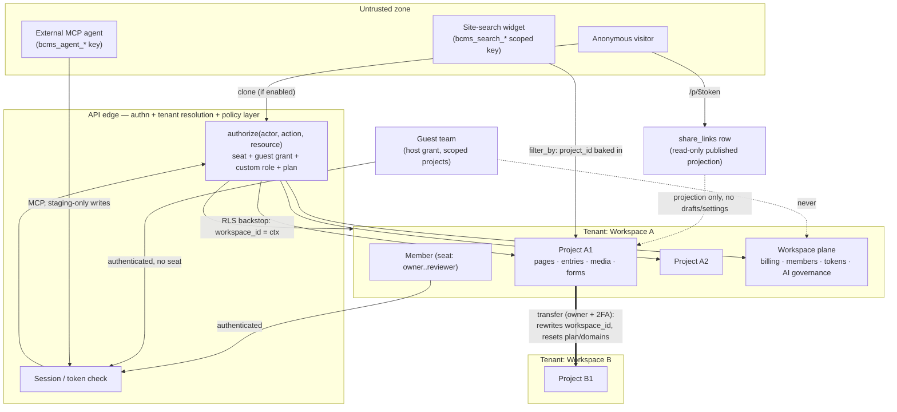

The diagram's rules of thumb: everything inside a workspace is reachable only through the policy layer with a resolved tenant context; share links and search keys are the two deliberately unauthenticated read paths, both served from constrained projections; transfers are the single sanctioned tenant-crossing write; guest teams and external agents authenticate but carry *narrower-than-member* grants that the server, not the UI, must narrow.
## 10. Domain Model

This section catalogs every entity the frontend actually manipulates, derived from `src/lib/cms/types.ts` and the state of every module store under `src/lib/**`. Labels:

- **[EXISTING]** — the entity has working, in-browser CRUD through store actions; the shape and action signatures are the production contract.
- **[SIMULATED]** — the entity models something that must be a real external service or server process (SSL, webhook delivery, AI generation, presence); the UX and shape exist, the behavior is faked client-side.

A structural warning up front: the repo contains **two parallel section systems** and **two parallel schema systems** (plus two parallel API-token/webhook models). The live UI uses one of each; the other is an older, richer model that was only partially wired. Both are documented below and explicitly resolved at the end of this section. Trust the code paths named here over `APPLICATION_BLUEPRINT.md` where they differ.

### 10.1 Tenancy and identity

| Entity | Source | Purpose, key fields, relationships | Status |
|---|---|---|---|
| **Workspace** | `cms/types.ts`, central `cms/store.ts` | Top-level tenant. `id`, `slug`, `name`, `logoUrl`, `projectIds[]`, `memberIds[]`, `workspacePlan` (`free/company/agency/team/enterprise`), `whiteLabel`, `billing` (`WorkspaceBillingInfo`: cycle, managed contact, card, renewalDate). Owns projects, members, tokens, governance, notifications, audit. **Demo trap:** the workspace with slug `flowtrix` has id `ws_acme`; must not leak into production seeds. | [EXISTING] |
| **Member** | `cms/types.ts` | A person in a workspace. `id`, `name`, `email`, `role` (legacy `WorkspaceRole` enum), `seat` (`SeatRole`: viewer/reviewer free; editor/marketer/developer billable), `status` (`active/invited/suspended`), `twoFactorEnabled`, `lastActiveAt`, `guestOf`. The acting user is the constant `CURRENT_ACTOR = "m_jane"` (`workspace/current-user.ts`) — a demo quirk to replace with real auth identity. Effective UI role comes from `workspace/my-role.ts` (owner/developer/marketer/editor/reviewer + view-as cascade), not from `Member.role`. | [EXISTING] shape, [SIMULATED] identity |
| **Invitation** | `cms/types.ts` | Pending invite: `workspaceId`, `email`, `role`, `invitedBy`, `expiresAt`, `status`. No email is ever sent. | [SIMULATED] |
| **Project** (= Site) | `cms/types.ts` | The unit of a site. `id`, `slug`, `name`, `workspaceId`, `websiteId`, `kind` (`headless/managed`), `delivery` (`{hosted, api}` — both on = hybrid), `hosting` (`FrontendHosting`: mode external/bettercms, repo, branch, build config), `sitePlan` (`free/basic/pro/team/enterprise`), `domain`, `usage` (`SiteUsage`: bandwidthGB, storageGB, apiRequests, aiCreditsUsed, formSubmissions), `clientSite`, `collectionIds[]`, `componentIds[]`, `mediaIds[]`, `publishState`. | [EXISTING] |
| **Domain** | `cms/types.ts`, `domainActions` | Project-owned host. `host`, `status` (`pending/verifying/active/failed`), `primary`, `sslStatus` (`issued/pending/failed`), `projectId`, `addedAt`. Add/set-primary/remove work; verification and SSL issuance are state flips. | [EXISTING] CRUD, [SIMULATED] verification/SSL |
| **CustomRole** | `workspace/custom-roles-store.ts` | Per-project scoped role: `base` (`marketer/editor/reviewer`), `capabilities` `{edit, publish, seo, agent, generate, markdown}` (booleans), `scope` `{collections, pages, sections}` each `"all" \| string[]` (section depth is Enterprise-gated), `members` (count), `createdAt`. Runtime enforcement is deferred to backend. | [EXISTING] builder, [SIMULATED] enforcement |
| **SITE_PERMISSION_MATRIX** | `cms/permissions.ts` | A full 6-role × 8-resource view/edit/publish matrix (`site_manager/designer/content_editor/marketer/reviewer/viewer` × pages/components/collections/media/seo/publishing/analytics/settings) plus `SiteMember`. **Currently unused by any UI** — nothing imports it into a guard. Keep as design input for backend RBAC; do not treat it as live behavior. | [EXISTING but dormant] |
| **GuestTeam / GuestMember** | `workspace/guests-store.ts` | Agency guest access: `hostWorkspaceId`, `agencyName`, `members[]` (`isAdmin` on members[0]), `scope` (`"all"` or project ids), `role` (`developer/editor/marketer`), `canPublish`, `status` (`invited/active`). Plan caps via `guestLimits()` (2 teams × 5, or 10 × 10 on Team+). Guests hold no billable seat. | [EXISTING] flows, [SIMULATED] invites |
| **TransferRequest** | `workspace/transfers-store.ts` | Webflow-style project transfer: `projectId`, `fromWorkspaceId/Name`, `toEmail`, `note`, `status` (`pending/accepted/declined/canceled`). Instant own-workspace move + email accept-banner loop; accepting resets the site plan. | [EXISTING] flows, [SIMULATED] email leg |
| **AccountProfile / AccountPrefs / AccountSecurity / AccountConnection / AccountSession** | `workspace/account-store.ts` (localStorage) | The `/account` area: profile, preferences (incl. reduce-motion, which has real effect), password-change timestamps, 2FA flag + backup codes, OAuth-style connections (google/github/slack/figma/notion/linear), sessions list. All simulated except appearance side effects. | [SIMULATED] |
| **OnboardingProfile** | `onboarding/onboarding-store.ts` (localStorage) | `role`, `usage`, `team`, `source`, `name` captured in the onboarding funnel; echoes into copy downstream. Becomes a `user_profiles` attribute set in production. | [EXISTING] |

### 10.2 Content graph

| Entity | Source | Purpose, key fields, relationships | Status |
|---|---|---|---|
| **PageDoc** | `cms/pages-store.ts` | **The real page model** used by the visual editor, Pages hub, generators, markdown twins, and search — for every project. `id`, `path` (used as the update key!), `title`, `state` (`draft/published/modified/scheduled/archived`), `sections: SectionInstance[]`, `scheduledAt`, `updatedAt` (epoch ms), `publishedSnapshot` (`PageDocSnapshot`: capturedAt, title, sections, seoTitle, seoDescription — drives Compare), `seoTitle`, `seoDescription`, `canonical`, `ogImage`, `indexing`, `jsonLd`, `folderId`, `staged`, `batchId` + `generatedFor` (generator batches). Keyed per project; `pagesActions.update(projectId, path, patchFn)`. | [EXISTING] |
| **SectionInstance** | `components/cms/editor/sections/SectionSystem.tsx` | One section on a PageDoc: `id`, `type` (key into the dev-defined `SECTION_DEFS` catalog), `variant`, `content: Record<string,string>` (flat field values), `design?: SectionDesign`. Rendered by `SectionRenderer`; instantiated by `createSection`/`instantiateTemplate`. | [EXISTING] |
| **SectionDesign** | same file | Token-based, marketer-set design overrides: `theme` (inherit/light/dark), `background` (default/surface/muted/accent/inverse/custom) + `backgroundColor`, `backgroundImage` + `overlayOpacity` (0–100), `opacity`, `paddingTop/paddingBottom/paddingX` on the 8-stop `SpaceToken` scale (none…3xl), `maxWidth` (full/wide/default/narrow), `align`, `radius` (…2xl), `shadow` (…xl), `borderTop/borderBottom`, `fullHeight`. Never raw CSS — structured tokens a headless frontend maps itself (see `DESIGN_CONTROLS.md`). | [EXISTING] |
| **Section (CMS-store)** | `cms/types.ts` + central store `sections[]` | The **second section system**: `pageId`, `kind` (17-value enum), `name`, `props`, optional `blocks: Block[]` tree, `componentId` + `overrides`, and four rich override groups — `layout` (`SectionLayout`), `style` (`SectionStyle`), `seo` (`SectionSeo`: anchorId, schemaType, headingLevel, excludeFromIndex, ariaLabel), `advanced` (`SectionAdvanced`: htmlTag, hidden, visibility by device/auth, customClassName, customId, customAttributes, customCss, zIndex, notes), plus its own `publishedSnapshot`. Powers only the Content-tab section workspace and is seeded only for the Northwind demo project. | [EXISTING but legacy/partial] |
| **Page (CMS-store)** | `cms/types.ts` | The central-store twin of PageDoc: `sectionIds[]`, `publishState` (6-state incl. review/approved), full SEO block (metaTitle, ogTitle/Description, twitterImage, structuredData), `customHead/customBody`, `publishedSnapshot`, `revisionIds`. Used by the Northwind Content-tab tree and SEO surfaces, not by the visual editor. | [EXISTING but legacy/partial] |
| **Block / BlockKind** | `cms/types.ts` | Composable block tree (`heading/paragraph/richText/…/grid/columns/accordion/nav-bar…`) with `props` + `children` — the intended future canonical content for CMS-store sections; registry in `cms/blocks/registry.ts`. Partially adopted. | [EXISTING, partial] |
| **Folder (page folders)** | `cms/folders-store.ts` | Nested page folders, max depth 4: `projectId`, `name`, `slug` (empty string = organizer folder with no URL segment), `parentId`. PageDoc.folderId points here. | [EXISTING] |
| **Dashboard folders** | `cms/use-folders.ts` (localStorage) | Separate, simpler `{id, name}` folders grouping projects on the dashboard, per workspace. | [EXISTING] |
| **Collection** | `cms/types.ts` | `projectId`, `name`, `slug`, `schemaId`, `entryIds[]`. Seeded 3 per project (Blog posts / Team members / Testimonials). | [EXISTING] |
| **Schema / SchemaField** | `cms/types.ts` | The schema system entries actually validate against: `Schema {ownerType: collection\|component, ownerId, fields[], groups[], titleFieldName, listFieldNames}`; `SchemaField` has 16 types (`text/richText/number/boolean/date/image/file/reference/multiReference/select/url/email/json/code/color/componentRef`), `refCollectionId`, `refComponentId`, `groupId`, `validation` (min/max/lengths/pattern), `unique`, `localized`, `hiddenInList`, plus UI hints (`ui`, `icons`, `optionLabels`). | [EXISTING] |
| **SchemaModel / ModelField** | `cms/schema-store.ts` | The **second schema system**, behind the `/schema` visual builder: `SchemaModel {kind: page\|collection\|block, name, apiId, fields[]}`; `ModelField` has 19 types (adds `longtext/slug/toggle/link/phone/group/sections`), `apiId`, `searchable` (site-search flag — only exists here!), `refModelId`, `allowedSections` (section-zone whitelist), and **nested `fields[]`** (groups are fields, not a side table). Not connected to the entry editor. | [EXISTING] |
| **Entry** | `cms/types.ts`, `entryActions` | Collection document: `collectionId`, `title`, `fields: Record<string,unknown>` (rich text fields hold `DocValue`), `status` (`PublishState`), `scheduledAt`, `publishedSnapshot` (`EntryPublishedSnapshot`), SEO fields (metaTitle/metaDescription/canonical/ogImage/indexing), and the workflow block: `workflowStageId`, `workflowAssigneeIds[]`, `workflowDueDate`, `workflowLastMove {by, at, comment}`, `workflowRequests: WorkflowRequest[]`. | [EXISTING] |
| **DocValue / DocBlock** | `cms/blocks/doc.ts` | The rich-text document model for entry fields: `{version: 1, blocks: DocBlock[]}` with 24 block types (paragraph, h1–h6, bullet/numbered/todo, quote, callout+tone, code, divider, image with caption/align/crop, embed, bookmark, video, button, table rows[][], toggle, component instance with `componentProps`). Serializes to markdown (`blocks/markdown.ts`) and plain text (search). This is the payload production must store losslessly. | [EXISTING] |
| **WorkflowStage / ProjectWorkflow** | `cms/types.ts`, `workflowActions` | Custom editorial stages between draft and publish: `{id, name, color, publishGate}`; one `ProjectWorkflow {projectId, stages[]}` per project that customized stages, else `DEFAULT_WORKFLOW_STAGES`. Publishing is offered only from `publishGate` stages. | [EXISTING] |
| **WorkflowRequest** | `cms/types.ts` (embedded on Entry) | Typed ask: `kind` (`review/approval/feedback`), `memberId`, `note`, `requestedBy`, `requestedAt`, `due`, `status` (`open/done`). Emits notifications. | [EXISTING] |
| **Revision / PagePublishedSnapshot / EntryPublishedSnapshot** | `cms/types.ts`, `cms/snapshots.ts` | Snapshot-bearing revisions (`ownerKind page\|entry`, `snapshot`) plus per-document `publishedSnapshot` inline copies; `snapshots.ts` computes `PageDiff`/`EntryDiff` for Compare with per-field restore. | [EXISTING] |
| **CommentThread / CommentMessage** | `lib/comments/types.ts` + `cms/comments-store.ts` | Field-anchored threads: `workspace_id`, `project_id`, `surface` (14 surfaces), `page_id`, `anchor_kind` (`page/block/field/selection/element`), `anchor_ref` (blockId, fieldPath, CSS selector, text range), `viewport` (xPct/yPct pin), `status`, `priority`, `assignee_user_id`, `messages[]` with `mentions[]`, `attachments[]`, `suggested_edit {before, after, applied}`, `parent_message_id`, `author_kind` (`user/ai/system`). Already snake_case — it was designed for Supabase; the `*.functions.ts` files are dead, data lives client-side. `comments-store.ts` itself is only UI state (mode, filters, active thread). | [EXISTING] model, [SIMULATED] persistence/realtime |
| **EntryComment** | `cms/types.ts` | Older flat comment on entries. Superseded by CommentThread; fold into it. | [EXISTING, legacy] |
| **MediaAsset / MediaFolder** | `cms/types.ts` | Library assets: `kind` (`image/video/file`), `url` (data/object URLs today), `thumbUrl`, `sizeBytes`, `mimeType`, `width/height`, `optimized`, `tags[]`, `altText`, `caption`, `favorite`, `durationSec`, `folderId`, `referencedBy[]`. Folders nest via `parentId`. Upload/crop/optimization are client-side only. | [EXISTING] library, [SIMULATED] storage/CDN |
| **MdFile / MdState** | `md/md-store.ts` | Markdown delivery per project: `MdState {llms, llmsFull, llmsMode auto\|custom, llmsCustom, excluded[], files[]}`; `MdFile {path (*.md), title, body, state draft\|published}`. Serializers in `md/serialize.ts` (`pageToMarkdown`, `entryToMarkdown`, `llmsTxt`, `llmsFullTxt`) are the production contract; no HTTP route serves them yet. | [EXISTING] model, [SIMULATED] delivery |
| **BrandKit** | `brand/brand-store.ts` | Per-project tokens: `colors` (6 slots), `typography` (heading/body from `BRAND_FONTS`), `radius` (`sharp/rounded/pill`), `logos` (wordmark/mark text), `voice` (tone, doWords, dontWords, protectedPhrases), `version` (bumps per save), `updatedAt`. Voice feeds agent plan boundaries. | [EXISTING] |
| **ShareLink** | `cms/share-store.ts` (localStorage) | Public share: `token`, `projectId`, `kind` (`preview/template`), `cloneEnabled`, `views`. Backs `/p/$token` read-only sandbox and template cloning (`cms/clone.ts` + `clonePagesTo`). | [EXISTING] |
| **FormRecord / FormField / SubmissionRow / IntegrationRow** | `forms/forms.store.ts` (localStorage `bettercms.forms.v1`) | Full forms product: `FormRecord {projectSlug, name, slug, description, status draft\|published\|archived, settings (captcha: none\|turnstile), submitAction {kind message\|redirect, message, url, label, errorMessage}}`; `FormField {formId, groupId, kind (11 kinds incl. phone w/ country picker, consent), name, label, placeholder, helpText, required, options (choices, width, businessOnly, countryPicker…), validation, position}`; `SubmissionRow {formId, data JSON, sourceUrl, ipAddress, submittedAt, status active\|spam, spamScore}`; `IntegrationRow {formId, kind webhook\|email\|slack\|sheets, enabled, config}` + `PageUsingForm` usage rows. **Trap:** keyed by `projectSlug`, not project id — must be re-keyed in production. | [EXISTING] (reference data model) |
| **SearchConfig / SearchQueryLogRow / SearchDoc** | `search/search-store.ts` (localStorage `bettercms.search.v1`) | Site search config per project: `enabled`, `includePages`, `collections {id: bool}`, `fieldOff {"collectionId.fieldName": false}`, `aiSearch` (plan-gated hybrid), `publicKey` (scoped search-only key), `enabledAt`; a query log; and a derived in-browser `SearchDoc` index built live from PageDocs + entries (production: Typesense per `SEARCH_PLAN.md`). `ModelField.searchable` is the schema-side flag. | [EXISTING] config, [SIMULATED] index |
| **Notification** | `cms/types.ts` | Workspace-scoped: `kind` (`info/success/warning/error`), `title`, `body`, `readAt`. Bell badge + mark-read work; no push/email channels. | [EXISTING] in-app, [SIMULATED] channels |
| **AuditLogEntry** | `cms/types.ts`, `recordAudit`/`recordAgentAudit` | Append-only: `workspaceId`, `actorId`, `action`, `entityType/Id/Label`, `diff`. Written by publish, agent apply, member and settings actions. | [EXISTING] plumbing |
| **ApiToken / WebhookEndpoint** | `workspace/tokens-store.ts` | What the settings UI actually uses: `ApiToken {kind personal\|machine, name, masked, lastUsedAt}` with one-time raw reveal; `WebhookEndpoint {url, events[], active}` with one-time `whsec_` secret. Event catalog: `page.published`, `entry.published`, `form.submission`, `agent.applied`, `member.invited`. The richer `ApiKey/Webhook/WebhookDelivery` types in `cms/types.ts` (scopes, delivery log, failing status) are seeded but not the UI's source of truth — merge both into one production model. | [EXISTING] UI, [SIMULATED] auth/delivery |
| **EnvironmentVariable, Redirect, CustomCodeBlock, Backup, SiteEnvironment** | `cms/types.ts` | Project config surfaces: env vars (scope dev/prod/all), 301/302 redirects, head/body code blocks (html/css/js/jsonld), backups, staging/production environments with deploy status. | [EXISTING] CRUD, [SIMULATED] effect |
| **Plan / Subscription / Invoice / UsageMetric** | `cms/types.ts` + `billing/pricing.ts` | Billing scaffolding plus the real pricing logic: `FEATURE_MATRIX` (~40 keys incl. dormant `search`), `siteHas(plan,key)`, `AI_ACTIONS` credit costs, `tierAllowed(plan,tier,action)`. Numbers are seeded; no payment processor. | [EXISTING] gating logic, [SIMULATED] billing |
| **PresencePeer** | `workspace/presence-store.ts` | Ephemeral presence: `surface` (`pages/canvas/entry`), page/section/cursor or collection/entry/field/blockSeed positions, seat, status. Simulated engine on a 3.6s tick over real seat data. Not a database entity — a realtime channel payload. | [SIMULATED] |

### 10.3 AI / platform graph

| Entity | Source | Purpose, key fields, relationships | Status |
|---|---|---|---|
| **AgentRun** | `agent/types.ts`, `agent/runs-store.ts` | The flagship unit of AI work: `projectId`, `skillId`, `title`, `prompt`, `tier` (`lite/balanced/max`), `model` (BYOK only), `agentId/agentName` (roster), `context: ContextRef[]`, `status` (`planning → awaiting_approval → applying → review → done \| rejected \| failed`), `steps: RunStep[]`, `plan: AgentPlan {goal, items, boundaries, estimate}`, `proposals[]`, `findings: AuditFinding[]`, `note`, `creditsSpent`, `appliedCount`, `undo: UndoOp[]`, `reverted`. Store guards (`roleCanAct`, `clampTier`, governance checks) are the authorization contract. | [EXISTING] state machine, [SIMULATED] generation |
| **ProposedChange** (change set) | `agent/types.ts`, `agent/change-set.ts` | One staged write: `operation` (`content.generate`, `content.patch`, `entry.patch`, `seo.meta`, `page.section`…), `targetType` (`page/entry`), `targetId`, `targetLabel`, `fieldPath`, `before/after`, `reason`, `risk` (`low/medium`), `status` (`pending/accepted/rejected/applied`). `groupChanges()` derives per-document `ChangeDoc` groups for the 3-panel review; `DocPreview`/`DiffPart` compute per-field before→after highlighting. | [EXISTING] |
| **UndoOp** | `agent/types.ts` | Reversible write captured at apply time, 5 kinds: `removeEntry`, `removePage`, `restorePageField` (seoTitle/seoDescription), `restoreEntryField`, `restoreSectionField`. `revertRun` only removes still-draft items and only restores unchanged fields — that truthfulness rule must survive into the backend. | [EXISTING] |
| **ContextRef** | `agent/types.ts` | An @-mention/attachment target: `kind` (`page/collection/entry/section/component/media/form/project/file`), `id`, `label`. | [EXISTING] |
| **AuditFinding** | `agent/types.ts` | Read-only skill output: `severity` (`note/warn`), `label`, `detail`, `targetLabel`, `fixable`. | [EXISTING] |
| **NamedAgent** | `agent/agents-store.ts` | Roster agent: `name`, `emoji`, `purpose`, `skillId`, `instructions`, `tier`, `schedule` (`manual/daily/weekly/on_publish`), `status` (`active/paused`), `lastRunAt/lastRunId`. Schedules never fire — production needs a scheduler. | [EXISTING] CRUD, [SIMULATED] scheduling |
| **AgentGrant** | `agent/connected-store.ts` | External MCP client grant, per project: `client` (`claude-code/cursor/vscode/custom`), `maskedToken` (raw shown once), `scopes[]` (default: read content, write drafts to staging, run read-only audits), `lastUsedAt`. | [EXISTING] UX, [SIMULATED] token auth |
| **AiGovernance** | `agent/governance-store.ts` | Per-workspace controls: `monthlyCreditBudget` (null = plan amount), `tierCeiling`, `skills {skillId: bool}` (missing = allowed), `generators {seo, abm}`, `byokAllowed`, `externalAgentsAllowed`. Genuinely enforced inside runs-store, so it is a real policy model. | [EXISTING] |
| **ByokConfig** | `agent/byok-store.ts` | Per-workspace BYOK: `provider`, `maskedKey` (raw never kept), `models[]`, `activeModel`. BYOK runs bill to the key, credits = 0. Production stores an encrypted secret server-side. | [EXISTING] UX, [SIMULATED] key handling |
| **SeoGenerateConfig / AbmGenerateConfig** | `agent/generate.ts` | Generator inputs riding `runsActions.startGenerator`: SEO = `{rows (keyword + CSV token columns), templateId, pathPrefix, titlePattern, descriptionPattern}`; ABM = `{accounts[], motion (breakin/expand/accelerate/reengage), mode template\|ai, prompt, templateId}`. Outputs are draft PageDocs stamped `batchId`/`generatedFor`. | [EXISTING] |
| **AI credits** | `billing/pricing.ts` + run `creditsSpent` | No ledger entity exists — credits are computed per run and summed in usage UIs. Production needs a real metering ledger (see §11). | [SIMULATED] |

### 10.4 Core content graph (ER)

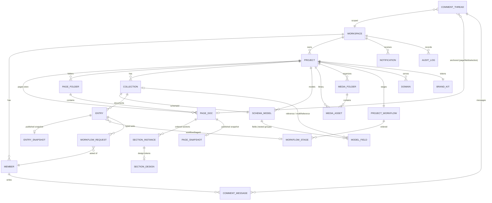

### 10.5 AI / platform graph (ER)

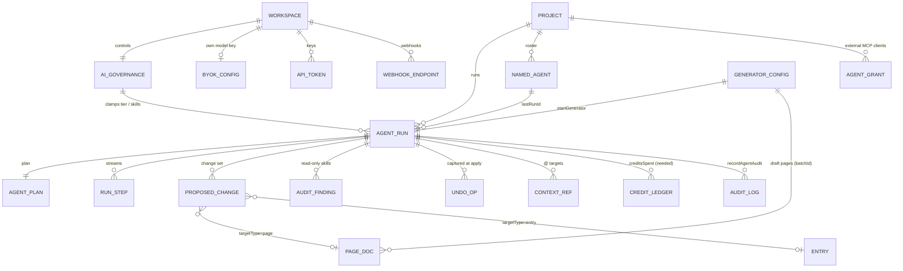

### 10.6 Resolving the two section systems

**System A — `pages-store` `SectionInstance` (+ `SectionDesign`).** Live for every project, every visual-editor feature, generators, markdown serialization, search, presence, comments. Content is flat `Record<string,string>` against a dev-defined catalog (`SECTION_DEFS`). Design is a clean token vocabulary.

**System B — `types.ts` `Section`.** Richer envelope (layout/style/seo/advanced, block trees, component binding, per-section snapshots) but only drives the Northwind-seeded Content-tab workspace. Its `SectionStyle` overlaps ~80% with `SectionDesign` with different spellings (`background: "transparent"|"surface"…` vs `"default"|…`; 5-stop vs 8-stop padding).

**Recommended unified target model [RECOMMENDED]:**

1. **Keep System A as the spine.** A page is an ordered list of section instances typed against a developer-defined section definition. This is what every user-facing surface already assumes.
2. **Structure the content, keep it schema-checked.** Replace `content: Record<string,string>` with `content: jsonb` validated against the section definition's field list (which, post schema-unification below, lives in the unified model registry — `ModelField.allowedSections` already points at System A type keys). This preserves current data (strings) while allowing rich values later.
3. **Adopt System B's envelope as optional columns on the unified section, ported to System A vocabulary:** `design` (SectionDesign, the winner — it is the shipped Design panel), `seo` (SectionSeo: anchorId, schemaType, headingLevel, excludeFromIndex, ariaLabel), `advanced` (SectionAdvanced) — all optional JSONB. `SectionLayout`/`SectionStyle` are **retired**; write a one-time mapping (`paddingY lg → paddingTop/Bottom lg`, `background transparent → default`, `theme` carries over) for the Northwind seed.
4. **Block trees (`Block[]`) become a v2 migration** of section internals, not a launch requirement: the unified section keeps `content` for catalog-defined fields and gains an optional `blocks` JSONB column so the Phase-2 "sections made of blocks" direction stays open.
5. Delete the Northwind-only Content-tab section workspace or re-point it at the unified store; two write paths to "a page's sections" must not survive the handoff.

### 10.7 Resolving the two schema systems

**System A — `schema-store` `SchemaModel`/`ModelField`** (the `/schema` builder): three model kinds (page/collection/block), `apiId` naming, nested groups as fields, `sections` zone with `allowedSections`, `searchable` flag, `refModelId`.

**System B — `types.ts` `Schema`/`SchemaField`** (the content store): owner-attached (`collection|component`), flat fields + separate `groups[]`, validation/unique/localized/defaults/placeholders, UI hints, `refCollectionId`/`refComponentId`, `titleFieldName`/`listFieldNames`. This is what the entry editor renders and what entries validate against.

**Recommended unified target model [RECOMMENDED]:** one `models` + `model_fields` registry that is the superset:

- **Model:** `{id, project_id, kind: "page"|"collection"|"block"|"component", name, api_id, description, title_field, list_fields[]}`. `kind` merges A's page/collection/block with B's component owner; a Collection row holds `model_id` instead of `schemaId`, and page types reference a `page` model.
- **Field:** A's identity (`api_id`, `label`, `type`) + B's behavior (`required`, `unique`, `localized`, `validation`, `default_value`, `placeholder`, `description/help`, `hidden_in_list`, UI hints) + A's extras (`searchable`, `allowed_sections` for section zones). Groups become **first-class parent fields** (A's nested shape) rather than B's `groupId` side-channel — nesting is strictly one level (group → leaf) to keep the entry editor simple.
- **Type vocabulary:** union both lists and canonicalize: `text, longtext, richtext (DocValue), slug, number, boolean, date, image, file, link/url, email, phone, select, reference, multireference, color, json, code, componentRef, group, sections`. Map B's `richText→richtext`, `boolean→toggle` display, A's `toggle→boolean` storage.
- The `/schema` builder and the entry editor both read/write this registry; `SchemaField`/`ModelField` become two views of one table. Ship a code-mod that migrates the seeded demo schemas into the registry once, then delete `types.ts` Schema/SchemaField.

## 11. Database Design

Target: **PostgreSQL 16** (Supabase-hosted is fine — auth is already there), UUIDv7 primary keys (time-ordered), `timestamptz` everywhere, Row-Level Security keyed on `workspace_id`. Conventions below: every table implicitly has `id uuid PK default uuid_generate_v7()`, `created_at timestamptz not null default now()`, `updated_at timestamptz not null default now()` unless stated; "FK" implies `not null` unless marked nullable; column lists show `name type [null] [default]`.

### 11.1 Tenancy principles

- **Every row carries its tenant keys.** Workspace-scoped tables carry `workspace_id`; project-scoped tables carry **both** `project_id` and a denormalized `workspace_id` (FK to workspaces) so RLS policies never need joins and workspace-level exports/deletes are single-predicate. A composite FK `(project_id, workspace_id) → projects(id, workspace_id)` keeps the denormalization honest.
- **Soft delete for content, hard delete for secrets.** Content tables (pages, sections, entries, media, md_files, forms, comments) get `deleted_at timestamptz null` + partial indexes `where deleted_at is null`; a 30-day sweep job hard-deletes. Tokens, grants, BYOK keys, sessions, invitations are hard-deleted (revocation rows remain in `audit_log`). Workspaces/projects soft-delete with cascade sweeps.
- **Demo data never ships.** `ws_acme`/`flowtrix`, `m_jane`, seeded page ids like `s_home_hero`, and forms keyed by `projectSlug` are all demo artifacts; production keys are UUIDs and forms re-key to `project_id`.

### 11.2 Identity and tenancy tables

**`users`** — real identity (Supabase `auth.users` is the credential store; this is the profile).
| column | type | null | default |
|---|---|---|---|
| auth_id | uuid (FK auth.users) | no | |
| email | citext | no | |
| name | text | no | '' |
| avatar_url | text | yes | |
| onboarding | jsonb | no | '{}' — role/usage/team/source from the onboarding store |
| prefs | jsonb | no | '{}' — theme, reduce_motion, density (account-store AccountPrefs) |
| two_factor_enabled | boolean | no | false |
Unique: `email`, `auth_id`.

**`workspaces`**: `slug citext unique not null`, `name text not null`, `logo_url text`, `plan text not null default 'free'` (check in free/company/agency/team/enterprise), `white_label boolean not null default false`, `billing jsonb not null default '{}'` (cycle, managed contact, card ref, renewal), `deleted_at timestamptz`.

**`workspace_members`**: `workspace_id FK`, `user_id FK users`, `role text not null` (owner/developer/marketer/editor/reviewer), `seat text not null default 'reviewer'` (viewer/reviewer/editor/marketer/developer — billable flag derives), `status text not null default 'active'` (active/invited/suspended), `last_active_at timestamptz`. Unique `(workspace_id, user_id)`. Index `(workspace_id, role)`.

**`invitations`**: `workspace_id FK`, `email citext`, `role text`, `invited_by FK users`, `expires_at timestamptz`, `status text default 'pending'`. Unique partial `(workspace_id, email) where status='pending'`.

**`projects`**: `workspace_id FK`, `slug citext`, `name text`, `description text`, `kind text not null default 'headless'` (headless/managed), `delivery jsonb not null default '{"hosted":false,"api":true}'`, `hosting jsonb` (FrontendHosting: mode, repo, branch, build config), `site_plan text not null default 'free'`, `framework text`, `source text`, `client_site boolean default false`, `publish_state text`, `deleted_at`. Unique `(workspace_id, slug)`. Composite unique `(id, workspace_id)` to support denormalized FKs.

**`domains`**: `project_id FK`, `workspace_id FK`, `host citext unique`, `status text not null default 'pending'` (pending/verifying/active/failed), `is_primary boolean not null default false`, `ssl_status text` (issued/pending/failed), `verification jsonb` (DNS challenge records). Partial unique `(project_id) where is_primary` — one primary per project. Index `(workspace_id)`.

**`custom_roles`**: `project_id FK`, `workspace_id FK`, `name text`, `description text`, `base text not null` (marketer/editor/reviewer), `capabilities jsonb not null` (`{edit,publish,seo,agent,generate,markdown}`), `scope jsonb not null` (`{collections:"all"|[ids], pages:"all"|[paths], sections:"all"|[types]}`). **`custom_role_assignments`**: `custom_role_id FK`, `member_id FK workspace_members`, unique pair — replaces the demo's `members` count.

**`guest_teams`**: `host_workspace_id FK workspaces`, `agency_name text`, `scope jsonb not null default '"all"'`, `role text`, `can_publish boolean default false`, `status text default 'invited'`. **`guest_team_members`**: `guest_team_id FK`, `user_id FK users null` (null until accepted), `name text`, `email citext`, `is_admin boolean default false`. Unique `(guest_team_id, email)`.

**`project_transfers`**: `project_id FK`, `from_workspace_id FK`, `to_workspace_id FK null`, `to_email citext null`, `note text`, `status text default 'pending'` (pending/accepted/declined/canceled), `token text unique` (accept-link), `resolved_at timestamptz`.

### 11.3 Content tables (unified model)

**`page_folders`** (from `folders-store`): `project_id FK`, `workspace_id FK`, `name text`, `slug text not null default ''` ('' = organizer, no URL segment), `parent_id uuid FK page_folders null`, `deleted_at`. Check depth ≤ 4 enforced in service layer. Unique partial `(project_id, parent_id, slug) where slug <> ''`.

**`pages`** (from `PageDoc` — the unified page):
| column | type | null | default |
|---|---|---|---|
| project_id / workspace_id | uuid FK | no | |
| path | text | no | — '/pricing'; the demo keys updates by path, production keys by id and treats path as mutable data |
| title | text | no | '' |
| state | text | no | 'draft' (draft/published/modified/scheduled/archived) |
| scheduled_at | timestamptz | yes | |
| folder_id | uuid FK page_folders | yes | |
| seo | jsonb | no | '{}' — seoTitle, seoDescription, canonical, og_image, indexing, json_ld |
| staged | boolean | no | false |
| batch_id | uuid FK agent_runs | yes | — generator batches |
| generated_for | text | yes | |
| custom_code | jsonb | yes | — head/body (from legacy Page) |
| deleted_at | timestamptz | yes | |
Unique partial `(project_id, path) where deleted_at is null`. Indexes: `(project_id, state)`, `(project_id, folder_id)`, `(batch_id)`.

**`page_sections`** (unified `SectionInstance` + System-B envelope):
| column | type | null | default |
|---|---|---|---|
| page_id | uuid FK pages | no | |
| project_id / workspace_id | uuid FK | no | |
| type | text | no | — SECTION_DEFS key ('hero', 'faq'…) |
| variant | text | no | '' |
| position | integer | no | — order within page; service reindexes |
| content | jsonb | no | '{}' — field values (flat strings today, richer later) |
| design | jsonb | yes | — SectionDesign tokens |
| seo | jsonb | yes | — SectionSeo (anchor, schemaType, headingLevel…) |
| advanced | jsonb | yes | — SectionAdvanced (htmlTag, visibility, customCss…) |
| component_id | uuid FK components | yes | — bound component + `overrides` inside content |
| deleted_at | timestamptz | yes | |
Unique `(page_id, position) deferrable`. Index `(page_id) where deleted_at is null`, `(project_id, type)` (section-usage queries, custom-role section scoping).

**`models`** + **`model_fields`** (unified schema registry, §10.7):
`models`: `project_id FK`, `workspace_id FK`, `kind text` (page/collection/block/component), `name text`, `api_id text`, `description text`, `title_field text`, `list_fields text[]`, `deleted_at`. Unique `(project_id, api_id)`.
`model_fields`: `model_id FK`, `project_id FK`, `parent_field_id uuid FK model_fields null` (group nesting, depth 1), `api_id text`, `label text`, `type text not null`, `position integer`, `required boolean default false`, `unique_value boolean default false`, `localized boolean default false`, `searchable boolean default false`, `hidden_in_list boolean default false`, `ref_model_id uuid FK models null`, `config jsonb not null default '{}'` (options, allowed_sections, validation, default_value, placeholder, help, ui hints, icons, option_labels). Unique `(model_id, parent_field_id, api_id)`. Fields as **rows** (not JSONB) because references (`ref_model_id`) need FK integrity, the search indexer and custom-role scoping filter on `searchable`/type, and concurrent field edits in the builder want row-level conflict handling; per-field configuration that nothing joins on stays JSONB.

**`collections`**: `project_id FK`, `workspace_id FK`, `model_id FK models`, `name text`, `slug citext`, `deleted_at`. Unique `(project_id, slug)`.

**`entries`**:
| column | type | null | default |
|---|---|---|---|
| collection_id | uuid FK | no | |
| project_id / workspace_id | uuid FK | no | |
| title | text | no | '' |
| fields | jsonb | no | '{}' — values keyed by field api_id; richtext values are DocValue documents |
| status | text | no | 'draft' (draft/review/approved/scheduled/published/archived) |
| scheduled_at | timestamptz | yes | |
| last_published_at | timestamptz | yes | |
| seo | jsonb | no | '{}' (meta_title, meta_description, canonical, og_image, indexing) |
| workflow_stage_id | uuid FK workflow_stages | yes | |
| workflow_assignees | uuid[] | no | '{}' |
| workflow_due | timestamptz | yes | |
| workflow_last_move | jsonb | yes | ({by, at, comment}) |
| created_by / updated_by | uuid FK users | yes | |
| deleted_at | timestamptz | yes | |
Indexes: `(collection_id, status) where deleted_at is null`, `(project_id, updated_at desc)`, `(workflow_stage_id)`, GIN on `fields jsonb_path_ops` (reference lookups, search indexing), partial `(project_id, scheduled_at) where status='scheduled'` (the publish scheduler's work queue). Slug uniqueness per collection enforced via generated column `slug text generated always as (fields->>'slug') stored` + partial unique `(collection_id, slug) where slug is not null and deleted_at is null`.

**`workflow_stages`**: `project_id FK`, `workspace_id FK`, `name text`, `color text`, `publish_gate boolean default false`, `position integer`. Replaces `ProjectWorkflow` wrapper; default stages seeded per project.

**`workflow_requests`** (extracted from `Entry.workflowRequests[]` so people can query "my open asks"): `entry_id FK`, `project_id / workspace_id FK`, `kind text` (review/approval/feedback), `member_id FK workspace_members`, `note text`, `requested_by FK workspace_members`, `due timestamptz`, `status text default 'open'`, `resolved_at`. Index `(member_id, status)`, `(entry_id)`.

**Snapshots & versions.** Inline `publishedSnapshot` becomes real tables so Compare and restore survive reloads:
- **`page_snapshots`**: `page_id FK`, `project_id/workspace_id`, `kind text` ('publish' now; 'backup' later), `captured_at timestamptz`, `title text`, `seo jsonb`, `sections jsonb not null` (full ordered SectionInstance array frozen as JSON), `created_by`. The **latest publish snapshot** id is denormalized as `pages.published_snapshot_id uuid FK null` for cheap Compare. Index `(page_id, captured_at desc)`.
- **`entry_snapshots`**: `entry_id FK`, `captured_at`, `entry jsonb` (full frozen row incl. fields), `created_by`; `entries.published_snapshot_id FK`. The Compare-versions overlay (word diff, per-field restore) reads exactly these payloads (`cms/snapshots.ts` diff logic ports server-side unchanged).
- **`revisions`** (autosave/history, from `Revision`): `owner_kind text` (page/entry), `owner_id uuid`, `project_id/workspace_id`, `label text`, `snapshot jsonb`, `created_by`. Retention: last 50 or 90 days, plan-gated.

**`comments_threads`** / **`comment_messages`** (shapes are already snake_case in `lib/comments/types.ts` — adopt verbatim):
`comments_threads`: `workspace_id FK`, `project_id FK null`, `surface text`, `page_id uuid null`, `anchor_kind text`, `anchor_ref jsonb` (blockId/fieldPath/selector/text/range), `viewport jsonb`, `version_label text`, `status text default 'open'`, `priority text default 'none'`, `assignee_user_id FK users null`, `created_by FK users`, `resolved_at`, `last_activity_at`, `deleted_at`. Index `(project_id, page_id, status)`, `(workspace_id, status, last_activity_at desc)`.
`comment_messages`: `thread_id FK`, `author_kind text` (user/ai/system), `author_user_id FK null`, `body text`, `mentions jsonb default '[]'`, `attachments jsonb default '[]'`, `suggested_edit jsonb null`, `parent_message_id FK self null`, `deleted_at`.

**`media_folders`**: `project_id/workspace_id FK`, `name`, `parent_id FK self null`. **`media_assets`**: `project_id/workspace_id FK`, `folder_id FK null`, `name text`, `kind text` (image/video/file), `storage_key text not null` (object storage, replaces data URLs), `url text` (CDN), `thumb_url text`, `mime_type text`, `size_bytes bigint`, `width/height integer`, `duration_sec numeric`, `optimized boolean default false`, `alt_text text`, `caption text`, `tags text[] default '{}'`, `favorite boolean default false`, `uploaded_by FK users`, `deleted_at`. Index `(project_id, folder_id)`, GIN `(tags)`.

**`md_settings`** (one row per project, from `MdState`): `project_id unique FK`, `workspace_id FK`, `llms boolean default true`, `llms_full boolean default false`, `llms_mode text default 'auto'`, `llms_custom text default ''`, `excluded text[] default '{}'`. **`md_files`**: `project_id/workspace_id FK`, `path text` (check `like '%.md'`), `title`, `body text`, `state text default 'draft'`, `deleted_at`. Unique `(project_id, path) where deleted_at is null`.

**`brand_kits`**: `project_id unique FK`, `workspace_id FK`, `version integer not null default 1`, `colors jsonb`, `typography jsonb`, `radius text`, `logos jsonb`, `voice jsonb` (tone/do/dont/protected). Optional `brand_kit_versions` history table (same payload + version) for the versioning UI.

**`share_links`**: `project_id/workspace_id FK`, `token text unique not null` (unguessable), `kind text` (preview/template), `clone_enabled boolean default false`, `views bigint default 0`, `revoked_at timestamptz`. Partial unique `(project_id, kind) where revoked_at is null`.

### 11.4 Forms (localStorage store → tables, the reference model)

`forms/forms.store.ts` is the richest localStorage store and translates 1:1 — but re-keyed from `projectSlug` to `project_id`.

- **`forms`**: `project_id/workspace_id FK`, `name text`, `slug citext`, `description text`, `status text default 'draft'`, `settings jsonb default '{}'` (captcha provider/siteKey), `submit_action jsonb default '{}'` ({kind, message, url, label, errorMessage}), `deleted_at`. Unique `(project_id, slug)`.
- **`form_fields`**: `form_id FK`, `project_id FK`, `group_id uuid null`, `kind text` (11 kinds), `name text`, `label text`, `placeholder text`, `help_text text`, `required boolean default false`, `options jsonb default '{}'` (choices, width, businessOnly, countryPicker, defaultCountry, excludeCountries), `validation jsonb default '{}'`, `position integer`. Unique `(form_id, name)`.
- **`form_submissions`**: `form_id FK`, `project_id/workspace_id FK`, `data jsonb not null`, `source_url text`, `ip inet`, `user_agent text`, `status text default 'active'` (active/spam), `spam_score numeric default 0`, `submitted_at timestamptz default now()`. Indexes `(form_id, status, submitted_at desc)`; GIN on `data` for the column-per-field CRM table. Plan metering counts rows per period.
- **`form_integrations`**: `form_id FK`, `kind text` (webhook/email/slack/sheets), `enabled boolean`, `config jsonb`.
- **`form_usages`** (PageUsingForm): `form_id FK`, `page_id FK pages`, `block_id text` — maintained by the page save path.

### 11.5 AI / platform tables

- **`agent_runs`**: `project_id/workspace_id FK`, `skill_id text`, `title text`, `prompt text`, `tier text` (lite/balanced/max), `model text null` (BYOK), `agent_id uuid FK named_agents null`, `agent_name text`, `status text not null` (planning/awaiting_approval/applying/review/done/rejected/failed), `context jsonb default '[]'` (ContextRef[]), `plan jsonb null`, `steps jsonb default '[]'`, `findings jsonb default '[]'`, `note text`, `credits_spent integer default 0`, `applied_count integer default 0`, `undo jsonb null` (UndoOp[] frozen at apply), `reverted boolean default false`, `generator jsonb null` (SeoGenerateConfig/AbmGenerateConfig), `created_by FK users`, `finished_at timestamptz`. Indexes `(project_id, created_at desc)`, `(workspace_id, created_at desc)` (governance budget checks), partial `(project_id) where status in ('planning','awaiting_approval','applying')`.
- **`agent_proposals`** (ProposedChange as rows — reviewed/accepted individually, so they need row-level status updates): `run_id FK`, `project_id FK`, `operation text`, `target_type text` (page/entry), `target_id text`, `target_label text`, `field_path text`, `before text`, `after text not null`, `reason text`, `risk text`, `status text default 'pending'`, `applied_at timestamptz`. Index `(run_id)`, `(target_type, target_id)`.
- **`named_agents`**: `project_id/workspace_id FK`, `name`, `emoji`, `purpose`, `skill_id text`, `instructions text`, `tier text`, `schedule text` (manual/daily/weekly/on_publish), `status text default 'active'`, `last_run_at`, `last_run_id FK agent_runs null`. The scheduler (cron worker) scans `(schedule, status)`.
- **`agent_grants`** (external MCP): `project_id/workspace_id FK`, `client text`, `token_hash text unique not null` (argon2; raw shown once), `token_prefix text` (masked display), `scopes text[] not null`, `last_used_at`, `revoked_at`. Hard-delete after revocation grace.
- **`ai_governance`**: `workspace_id unique FK`, `monthly_credit_budget integer null`, `tier_ceiling text default 'max'`, `skills jsonb default '{}'`, `generators jsonb default '{"seo":true,"abm":true}'`, `byok_allowed boolean default true`, `external_agents_allowed boolean default true`.
- **`byok_keys`**: `workspace_id FK`, `provider text`, `encrypted_key bytea not null` (KMS envelope), `key_suffix text` (display), `models text[]`, `active_model text null`, `revoked_at`. Unique partial `(workspace_id) where revoked_at is null`.
- **`ai_credit_ledger`** (new — the demo has no ledger): `workspace_id/project_id FK`, `run_id FK null`, `action_id text` (AI_ACTIONS key), `amount integer not null` (negative = spend, positive = grant/refund), `period text` ('2026-07'), `created_at`. Index `(workspace_id, period)`. Budget checks = `sum(amount) where period = current`, cached in Redis.

### 11.6 Platform/settings tables

- **`api_tokens`** (merge tokens-store + types.ts ApiKey): `workspace_id FK`, `kind text` (personal/machine), `name text`, `token_hash text unique`, `token_prefix text` ('bcms_pat_xxxx'), `scopes text[] default '{}'`, `created_by FK users`, `last_used_at`, `revoked_at`.
- **`webhooks`**: `workspace_id FK`, `project_id FK null`, `url text`, `events text[]` (catalog: page.published, entry.published, form.submission, agent.applied, member.invited + room to grow), `secret_hash text`, `secret_prefix text` ('whsec_'), `status text default 'active'` (active/paused/failing). **`webhook_deliveries`**: `webhook_id FK`, `event text`, `payload jsonb`, `status_code integer`, `duration_ms integer`, `attempt integer default 1`, `next_retry_at timestamptz null`. Partitioned monthly; 30-day retention.
- **`search_configs`**: `project_id unique FK`, `workspace_id FK`, `enabled boolean default false`, `include_pages boolean default true`, `collections jsonb default '{}'`, `field_off jsonb default '{}'`, `ai_search boolean default false`, `public_key text` (Typesense scoped search key), `enabled_at timestamptz`. **`search_query_log`**: `project_id FK`, `q text`, `hits integer`, `created_at` — or push straight to the analytics pipeline. The index itself lives in **Typesense**, not Postgres; Postgres holds config + the outbox that feeds the indexer.
- **`notifications`**: `workspace_id FK`, `user_id FK users` (per-recipient in production, unlike the demo's workspace-broadcast), `kind text`, `title text`, `body text`, `link text`, `read_at timestamptz`. Index `(user_id, read_at nulls first, created_at desc)`.
- **`audit_log`** (append-only, monthly partitions): `workspace_id FK`, `project_id uuid null`, `actor_kind text` (user/agent/api/system), `actor_id uuid`, `action text`, `entity_type text`, `entity_id text`, `entity_label text`, `diff jsonb`, `created_at`. No updates, no deletes; BRIN index on `created_at`, btree `(workspace_id, created_at desc)`.
- **Billing**: `plans` (static catalog, or config-in-code mirroring `FEATURE_MATRIX`), `subscriptions` (`workspace_id`, `plan_id`, `status`, `current_period_end`, `seats`, `processor_ref`), `invoices` (`number unique`, `amount`, `status`, period, `pdf_url`), `usage_metrics` (`workspace_id`, `project_id null`, `metric text`, `period text`, `value bigint`, `limit bigint`; unique `(workspace_id, project_id, metric, period)`) — written by metering jobs, read by every usage page.
- **Project config**: `env_vars` (`project_id`, `key`, `value_encrypted bytea`, `scope`; unique `(project_id, key, scope)`), `redirects` (`project_id`, `from_path`, `to_path`, `type smallint check in (301,302)`, `enabled`; unique `(project_id, from_path)`), `custom_code_blocks` (`project_id`, `page_id null`, `location`, `language`, `content text`, `enabled`), `backups` (`project_id`, `label`, `kind`, `size_bytes`, `storage_key`), `site_environments` (`project_id`, `kind` staging/production, `url`, `status`, `last_deploy_at`).
- **Dashboard folders** (use-folders): `dashboard_folders` (`workspace_id FK`, `user_id FK`, `name`) + `project_id uuid[]` or a join table — per-user personalization, hence the `user_id`.
- **Presence, dock state, comment-UI state, editor buses, slash-menu recents: not tables.** Presence rides the realtime service (Redis presence sets); pure UI stores stay client-side.

### 11.7 Where JSONB is used deliberately

| Payload | Column | Why JSONB and not rows |
|---|---|---|
| DocValue rich text | `entries.fields` (values), `agent artifacts` | A versioned block document (`{version:1, blocks:[…]}`) is read/written whole by one editor session; blocks have 24 heterogeneous shapes and no cross-document joins. Row-per-block would explode writes (every keystroke reorders) for zero query benefit. GIN indexing still allows containment queries; full-text search is delegated to Typesense anyway. |
| SectionInstance.content | `page_sections.content` | Field set is defined by the section catalog per `type`, varies per section, and is validated in the service layer against the model registry. Schema-per-section-type as columns is impossible; EAV rows would make page loads 50-row joins. |
| SectionDesign tokens | `page_sections.design` | A small closed vocabulary of optional tokens, always read with the section, never queried independently. Kept separate from `content` so design-only saves don't conflict with copy edits and role checks ("can edit design") can be column-scoped. |
| Entry fields | `entries.fields` | Same argument as section content: model-defined dynamic shape. The two values worth relational treatment get generated columns (slug above; add more per query need, e.g. a date field for sorted blogs). References inside fields are validated in the service layer; a `entry_references(entry_id, field_api_id, ref_entry_id)` projection table is maintained by trigger for reverse-reference lookups and delete protection. |
| Form field definitions / submissions | `form_fields.options`, `form_fields.validation`, `form_submissions.data` | Field options are per-kind config bags (country pickers, business-email toggles). Submission data is shaped by the form at submit time and must remain readable after fields change — freezing it as JSON is the correct semantics; the CRM table renders columns dynamically from it. |
| Agent change sets | `agent_runs.plan/steps/findings/context/undo`, `agent_proposals` as rows | Split deliberately: **proposals are rows** because reviewers accept/reject them individually and concurrently. Plan, steps, findings, context and the undo journal are immutable-after-write blobs read only with their run — perfect JSONB. |
| Snapshots | `page_snapshots.sections`, `entry_snapshots.entry`, `revisions.snapshot` | A snapshot is by definition a frozen document; normalizing it would let later migrations corrupt history. Compare/diff runs in memory on the frozen payloads. |

### 11.8 Published-snapshot storage and the publish flow

Publishing a page: (1) write `page_snapshots` row from the current draft, (2) set `pages.state='published'`, `published_snapshot_id`, (3) enqueue webhook + cache purge + search reindex + markdown-twin regeneration. "Modified" state = `updated_at > snapshot.captured_at` (computed, not stored, to avoid drift). Scheduled publishes store `scheduled_at` and are executed by a scheduler scanning the partial index; `Unpublish` keeps the snapshot for history. Entries follow the identical pattern with `entry_snapshots`. The delivery API serves **published snapshots** (production) or live drafts (staging/preview tokens) — never a mix.

### 11.9 Storage layout by service

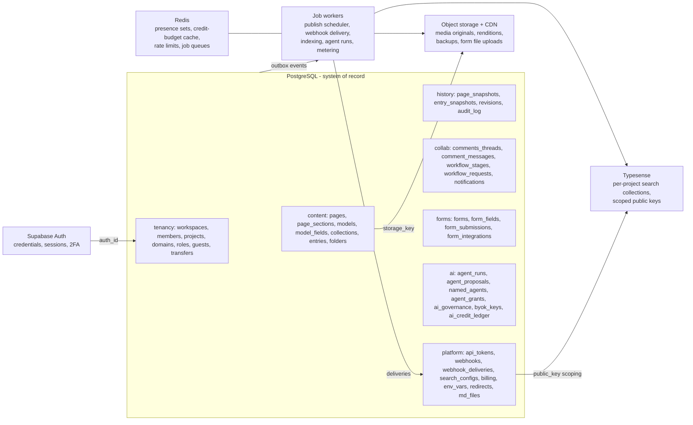

### 11.10 Store file → table mapping

| Store file (`src/lib/**`) | Persistence today | Production table(s) |
|---|---|---|
| `cms/store.ts` (central) | in-memory, reseeds | workspaces, workspace_members, invitations, projects, domains, collections, entries, entry_snapshots, media_assets, media_folders, notifications, audit_log, plans/subscriptions/invoices/usage_metrics, env_vars, redirects, custom_code_blocks, backups, site_environments, workflow_stages |
| `cms/pages-store.ts` | in-memory | pages, page_sections, page_snapshots |
| `cms/schema-store.ts` + `types.ts` Schema | in-memory | models, model_fields (unified) |
| `cms/folders-store.ts` | in-memory | page_folders |
| `cms/use-folders.ts` | localStorage | dashboard_folders (per-user) |
| `cms/share-store.ts` | localStorage `bettercms.shares.v1` | share_links |
| `cms/comments-store.ts` + `lib/comments/*` | in-memory (+ dead Supabase fns) | comments_threads, comment_messages |
| `forms/forms.store.ts` | localStorage `bettercms.forms.v1` | forms, form_fields, form_submissions, form_integrations, form_usages |
| `md/md-store.ts` | in-memory | md_settings, md_files |
| `brand/brand-store.ts` | in-memory | brand_kits (+ versions) |
| `search/search-store.ts` | localStorage `bettercms.search.v1` | search_configs, search_query_log + Typesense collections |
| `agent/runs-store.ts` | in-memory | agent_runs, agent_proposals, ai_credit_ledger |
| `agent/agents-store.ts` | in-memory | named_agents |
| `agent/connected-store.ts` | in-memory | agent_grants |
| `agent/governance-store.ts` | in-memory | ai_governance |
| `agent/byok-store.ts` | in-memory | byok_keys |
| `workspace/tokens-store.ts` (+ types.ts ApiKey/Webhook) | in-memory | api_tokens, webhooks, webhook_deliveries |
| `workspace/custom-roles-store.ts` | in-memory | custom_roles, custom_role_assignments |
| `workspace/guests-store.ts` | in-memory | guest_teams, guest_team_members |
| `workspace/transfers-store.ts` | in-memory | project_transfers |
| `workspace/account-store.ts` | localStorage | users.prefs, users 2FA columns, user_connections, sessions (Supabase) |
| `onboarding/onboarding-store.ts` | localStorage | users.onboarding |
| `workspace/presence-store.ts`, `agent/dock-store.ts`, `cms/comments-store.ts` UI state, `cms/editor-bus.ts` | ephemeral | none — realtime channels / client state |

### 11.11 Migrations and seeding strategy

- **Migrations:** plain SQL migrations under version control (Drizzle Kit or Atlas; Supabase CLI migrations if staying on Supabase), forward-only, one migration per PR, CI runs them against a disposable database plus `pgTAP`/smoke assertions on RLS policies. Never edit an applied migration.
- **Baseline order:** 1) extensions (uuid v7, citext, pgcrypto) → 2) tenancy (users, workspaces, members, projects) → 3) unified model registry → 4) content (pages/sections/collections/entries/snapshots) → 5) collab/forms/media → 6) AI tables → 7) platform/billing → 8) RLS policies + roles last, in the same migration set as the tables they guard.
- **Three seed tiers, strictly separated:**
  1. **System seed** (every environment): plan catalog/feature matrix mirror, default workflow stages template, section catalog + model templates (from `SCHEMA_TEMPLATES`), AI skill/action registry, webhook event catalog. Idempotent upserts keyed by stable natural keys.
  2. **Per-tenant provisioning** (runs on workspace/project create, replacing the stores' lazy `ensure()+seed()`): default brand kit, md_settings row, ai_governance defaults, default workflow stages, starter models — **not** the 5-page demo marketing site; a real project starts empty with optional template application, which reuses the same `instantiateTemplate` path as the UI.
  3. **Demo/E2E seed** (dev, staging, test only; guarded by env flag): a faithful port of `mock-data.ts` + per-store seeds (6 workspaces, seeded pages incl. the pinned home-hero comment anchor, demo runs, forms) **with fresh UUIDs generated at seed time** — the literal `ws_acme`, `m_jane`, `s_home_hero` identifiers, the flowtrix slug/id mismatch, and slug-keyed forms must never appear in a production migration or seed file.
- **Data migration from the demo:** none required (nothing user-generated persists beyond localStorage), but ship a one-time importer for the localStorage stores (forms, shares, search config, onboarding) so internal dogfooders keep their data: read the `bettercms.*.v1` keys client-side, POST to a `/import` endpoint, translate slugs → ids.
## 12. Backend Architecture (target)

### 12.1 The starting point

Today there is no backend. [EXISTING] Every domain lives in an in-memory module store built on `useSyncExternalStore` (central store `src/lib/cms/store.ts` plus ~25 module stores under `src/lib/**`), with a handful of stores persisting to localStorage (forms, folders, share links, search config, onboarding, appearance). [EXISTING] The only real server-side dependency is Supabase email auth. Everything else — publishing, webhooks, domains, AI runs, MCP grants, presence — is a simulated flow with production-quality UX. That makes the frontend the specification: **the exported action objects of the stores are the API contract**, and the backend's job is to stand behind those signatures without changing them.

### 12.2 Recommendation: modular monolith first, real seams from day one

[RECOMMENDED] Do not start with microservices. The product is one team, one database, and a v1 launch target. Ship a **single deployable API monolith** (TypeScript, Fastify/NestJS or Hono on Node/Bun) behind an API gateway, with **Postgres as the system of record**, and enforce module boundaries inside the codebase (one package per domain, no cross-module imports except through interfaces). The store inventory maps cleanly onto internal modules, which become the extraction seams if and when scale demands it:

| Internal module (seam) | Owns (today's stores) | Why it is a seam |
|---|---|---|
| **Content service** | `cms/store.ts` (collections, entries, schemas, sections, blocks), `pages-store`, `schema-store`, `folders-store`, `brand-store`, `md-store`, comments | The core CRUD + versioning workload; read-heavy, cache-friendly |
| **Publishing & jobs** | `pageActions.publish/schedule`, `entryActions.publish`, snapshots, staged/production states | Scheduled publishes, batch generator applies, transfer execution — all queue work, not request/response work |
| **Search sync** | `search-store` config + the index build in `useSearchIndex` | Consumes publish events, talks to Typesense, retries independently (SEARCH_PLAN.md decision: sync on publish, never on save) |
| **AI orchestration** | `agent/runs-store`, `simulate.ts` (to be replaced by real LLM calls), `generate.ts`, `skills.ts`, `byok-store`, `governance-store`, `agents-store` | Long-running, streaming, cost-metered; the one module with genuinely different runtime needs (SSE, provider fan-out, token budgets) |
| **Billing & metering** | `billing/pricing.ts` (keep as shared pure library), credit ledger, seat counts, usage counters | Stripe integration + a metering pipeline; must be consistent even when other modules fail |
| **Notifications** | `notificationActions` in central store | Fan-in from every module; later grows email/Slack channels |
| **Webhooks** | `store.ts webhookActions` + `tokens-store webhookActions` (two overlapping stores today — unify, see §13.9) | Outbound delivery with signing, retries, and dead-lettering; never block a request on it |
| **Identity & access** | Supabase auth, `memberActions`, `custom-roles-store`, `guests-store`, `transfers-store`, `my-role.ts` guards | The permission checks every other module calls |
| **Media** | `mediaActions`, upload pipeline, crop/optimize | Object storage + image CDN; different I/O profile |

[RECOMMENDED] The extraction order, if growth forces it: AI orchestration first (isolate LLM latency and spend), search sync second (already event-driven), webhooks third. Content stays in the monolith the longest — it is the transactional heart.

### 12.3 Event backbone

[MISSING] Nothing event-shaped exists in the demo; publishes are synchronous state flips and "webhook delivery" is a list row. Production needs a small, boring event bus — Postgres-backed outbox + a queue (BullMQ/Redis, or SQS) is enough. Do not reach for Kafka at this scale.

Core events (derived from the store actions that would emit them):

| Event | Emitted by | Consumers |
|---|---|---|
| `content.published` / `content.unpublished` (page, entry, md file) | Publishing module (`pageActions.publish`, `entryActions.publish`, `mdActions.setFileState`) | Search sync (index/delete jobs), CDN invalidation, webhook fan-out, llms.txt regeneration, analytics |
| `content.scheduled` / `content.schedule_due` | Publishing scheduler (the demo already runs a due-entry publisher inside `store.ts`) [SIMULATED] | Publishing executor |
| `entry.updated` / `page.updated` (draft writes) | Content service | Presence/collab layer, autosave revisions; **not** search (publish-only indexing) |
| `workflow.moved` / `workflow.requested` | `workflowActions` | Notifications (in-app now, email later), audit |
| `run.status_changed` / `run.applied` / `run.reverted` | AI orchestration (`agentRunActions`) | SSE stream to clients, credit metering, audit, notifications |
| `webhook.deliverable` | Any of the above via fan-out rules | Webhook delivery workers (sign with `whsec_*`, retry with backoff, DLQ) |
| `project.transferred` / `project.cloned` | `transferActions.accept`, `projectActions.clone` | Billing (plan resets — the demo already resets plans on transfer), notifications, audit |
| `media.uploaded` | Media module | Optimization pipeline (the "Optimized" badge is real work here), CDN warm |

Every event row carries `workspace_id`, `project_id`, `actor_id` (human, named agent, or MCP grant), and an idempotency key — this is also what feeds the audit log, which today is `recordAudit`/`recordAgentAudit` appending to in-memory state. [SIMULATED]

### 12.4 Target architecture diagram

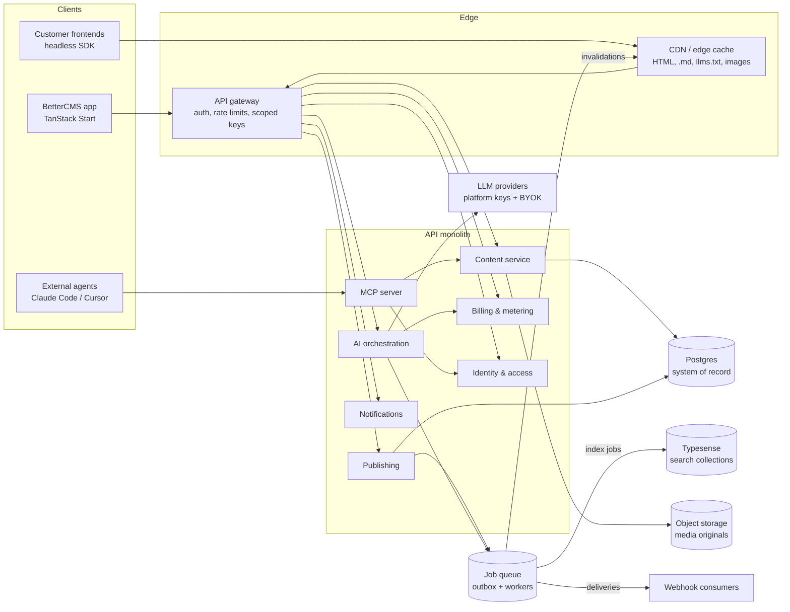

[RECOMMENDED] Deployment shape: the existing TanStack Start/Nitro app keeps deploying to Vercel; the API monolith and workers run on Fly.io/Render/ECS next to managed Postgres (RDS/Neon) and a managed Typesense cluster. Supabase stays for auth (see the Build-vs-Buy section) so session verification is a JWT check at the gateway.

---

## 13. Application API Specification

### 13.1 Conventions (apply to every table below)

- **Base**: `https://api.bettercms.ai/v1` [SIMULATED — this exact host is already hardcoded as `MCP_API_URL` in `src/lib/agent/mcp-clients.ts`; keep it].
- **Auth**: `Authorization: Bearer <token>`. Three token classes, all present in the demo UX: user session JWTs (Supabase), workspace API tokens (`bcms_pat_*` personal / machine, from `tokens-store`), and agent grant tokens (`bcms_agent_*`, from `connected-store`). [SIMULATED] Role checks mirror the frontend guards: `visibleTabs`, `canCompose` (marketer+), `canEditContent` (all but reviewer), `canPublish` (marketer+), `canSeeDeveloper` (dev+) from `src/lib/workspace/my-role.ts`, layered with custom-role capabilities (`custom-roles-store`) and workspace AI governance (governance beats role capabilities). [EXISTING as client guards; MISSING as server enforcement]
- **Tenancy**: every resource is addressed under `/workspaces/{wsId}` or `/projects/{projectId}`; the server derives the workspace from the project and must verify membership on every call. Demo quirks (`ws_acme` for slug `flowtrix`, `CURRENT_ACTOR = "m_jane"`) must not leak into production IDs.
- **Pagination**: `?limit=&cursor=` cursor pagination on all list endpoints; the UI already paginates at 50/100/200 (shared Paginator), so default `limit=50`, max 200.
- **Errors**: RFC 9457 problem+json: `{ type, title, status, detail, code }` with stable `code` values (`role_denied`, `plan_gated`, `governance_blocked`, `stale_version`, `slug_taken` — the last mirrors `workspaceActions.slugTaken`).
- **Optimistic concurrency**: every mutable document (`PageDoc`, `Entry`, `SchemaModel`, `BrandKit`) carries `updatedAt`/`version`; writes send `If-Match` (or body `baseVersion`) and get `409 stale_version` on mismatch. The demo's patch-function pattern (`pagesActions.update(id, (p) => next)`) becomes JSON-merge-patch + version check. `brand-store` already bumps a `version` per save — generalize that. [RECOMMENDED]
- **Idempotency**: `Idempotency-Key` header required on publish, schedule, run-apply, generator-start, transfer-accept, and webhook replays. The demo's `applyProposals` already re-validates live state and returns truthful `appliedIds` — the production apply must keep exactly that semantics (skip-don't-fail on drift, report what actually wrote).

### 13.2 Workspaces, members, seats (central store)

| Method & path | Purpose | Maps to | Auth |
|---|---|---|---|
| POST `/workspaces` | Create workspace | `workspaceActions.create` | any user |
| PATCH `/workspaces/{ws}` | Name/logo/white-label | `workspaceActions.update` | owner |
| GET `/workspaces/slug-check?slug=` | Slug availability | `workspaceActions.slugTaken` | any user |
| PUT `/workspaces/{ws}/plan` | Change workspace plan | `workspaceActions.setWorkspacePlan` | owner |
| POST `/workspaces/{ws}/members/invites` | Invite member (role + seat) | `memberActions.invite` | owner |
| POST `/invites/{id}/resend` · DELETE `/invites/{id}` | Resend / revoke | `memberActions.resendInvite` / `revokeInvite` | owner |
| PATCH `/members/{id}` | Role, seat, status | `memberActions.changeRole` / `changeSeat` / `setStatus` | owner |
| DELETE `/members/{id}` | Remove member | `memberActions.remove` | owner |
| POST `/workspaces/{ws}/seats` | Add billable seat | `memberActions.addSeat` | owner |

### 13.3 Projects, delivery, transfers, sharing, guests

| Method & path | Purpose | Maps to | Auth |
|---|---|---|---|
| POST `/workspaces/{ws}/projects` | New Project wizard (kind, plan; slug-uniquifies) | `projectActions.create` | owner/dev |
| POST `/projects/{id}/clone` | Duplicate project (also powers template clone) | `projectActions.clone` + `clonePagesTo` | owner/dev |
| PUT `/projects/{id}/delivery` | hosted/headless/hybrid switches | `projectActions.setDelivery` (`delivery.ts` model) | dev+ |
| PUT `/projects/{id}/hosting` · `/plan` | Repo/build config; site plan buy/switch | `projectActions.setHosting` / `setSitePlan` | owner |
| POST `/projects/{id}/transfers` | Start transfer (own-workspace instant or email invite) | `transferActions.toOwnWorkspace` / `sendToEmail` | owner |
| POST `/transfers/{id}/accept` · `/decline` · DELETE | Accept-banner loop; plan resets on accept | `transferActions.accept` / `decline` / `cancel` | recipient / owner |
| PUT `/projects/{id}/share/preview` · `/template` | Enable/disable public share links; clone toggle | `shareActions.enablePreview/disablePreview/enableTemplate/disableTemplate/setCloneEnabled` | owner/dev |
| POST `/workspaces/{ws}/guest-teams` (+ member CRUD) | Agency guest teams w/ plan caps (`guestLimits`) | `guestActions.invite/addMember/removeMember/updateAccess/removeTeam` | owner |

### 13.4 Pages (the REAL page model: `pages-store` `PageDoc.sections: SectionInstance[]`)

| Method & path | Purpose | Maps to | Auth |
|---|---|---|---|
| GET `/projects/{id}/pages` | List w/ status/folder filters | `usePages`/`getPages` | any member |
| POST `/projects/{id}/pages` | New page (blank/template; `buildPage`, `instantiateTemplate`) | `pagesActions.add` | marketer+ (`canCompose`) |
| PATCH `/pages/{id}` | Title, path, sections[], per-section `SectionDesign`, SEO fields, canonical, OG image, indexing, JSON-LD | `pagesActions.update(patchFn)` | editor+ (design controls marketer+) |
| DELETE `/pages/{id}` | Delete page | `pagesActions.remove` | marketer+ |
| PUT `/pages/{id}/folder` | Move to folder | `pagesActions.setFolder` | editor+ |
| POST `/pages/{id}/publish` | now / `scheduledAt` / `staged:true` destination | `pagesActions.publish` (PublishMenu contract) | marketer+ (`canPublish`); **Idempotency-Key** |
| POST `/pages/{id}/unpublish` · `/unschedule` | State transitions | same store, state flips | marketer+ |
| GET `/pages/{id}/revisions` · POST `/revisions/{rev}/restore` | Compare versions + per-field restore | snapshot in `PageDocSnapshot` / `restoreRevision` pattern | editor+ |
| Folder CRUD: POST/PATCH/DELETE `/projects/{id}/folders` | Nested URL folders + organizers, max depth 4 | `folderActions.add/update/remove` (`MAX_FOLDER_DEPTH`, `eligibleParents`) | marketer+ |

[EXISTING trap] A second page/section model lives in the central store (`pageActions`, `sectionActions`, `blockActions` over `types.ts Section` with layout/style/seo/advanced, seeded only for Northwind). Production should expose **one** pages API on the `PageDoc` model and fold the Content-tab section workspace into it; do not ship two page endpoints. The `sectionActions` verbs (add/duplicate/remove/move/reorder/setProp/bindComponent/setOverride/clearOverride/detachFromComponent) become the sub-resource `/pages/{id}/sections` operations of the unified model.

### 13.5 Collections, schemas, entries

| Method & path | Purpose | Maps to | Auth |
|---|---|---|---|
| POST `/projects/{id}/collections` | Create collection | `collectionActions.add` | dev+ |
| GET `/collections/{id}/entries` | Table/Gallery list, filters, CSV export | central selectors | member (scope-checked vs custom role) |
| POST `/collections/{id}/entries` | Create entry (also CSV import rows) | `entryCreateActions.add` | editor+ |
| PATCH `/entries/{id}` | Doc-level fields (title, slug, cover, blocks) | `entryActions.update` | editor+ |
| PUT `/entries/{id}/fields/{fieldId}` | Single schema-validated field write | `entryActions.setField` | editor+ |
| POST `/entries/{id}/duplicate` · `/paste` | Duplicate; doc clipboard paste | `entryActions.duplicate` / `pasteDocument` | editor+ |
| POST `/entries/{id}/publish` · `/schedule` · `/unschedule` · `/unpublish` | EntryPublishMenu (now/schedule/staging) | `entryActions.publish/schedule/unschedule` + `setStatus` | marketer+; Idempotency-Key |
| GET `/entries/{id}/revisions` · POST restore | Compare + per-field restore | `entryActions.restoreRevision` | editor+ |
| Schema (content store): field CRUD, groups, ordering, validation, references, list/title field | PATCH-style ops under `/collections/{id}/schema` | `schemaActions.*` (20 verbs: addField…replaceSchema) | dev only |
| Schema builder models: POST/PATCH/DELETE `/projects/{id}/models` | `/schema` visual builder (page/collection/block kinds, `ModelField`, searchable flag, section zone) | `modelActions.add/update/remove` | dev only |

[EXISTING trap] Two schema systems (`schema-store.ts ModelField` vs `types.ts SchemaField`). The API should present **one** `/models` resource; ship a migration that folds `SchemaField` collections into `SchemaModel` and make `schemaActions` verbs sub-operations of it. Until then, do not expose both publicly.

### 13.6 Workflow, comments, notifications

| Method & path | Purpose | Maps to | Auth |
|---|---|---|---|
| PUT `/projects/{id}/workflow/stages` · DELETE | Custom stages; reset to defaults | `workflowActions.setStages/reset` (`DEFAULT_WORKFLOW_STAGES`) | marketer+ |
| POST `/entries/{id}/workflow/move` | Stage move; optional request-changes comment (side effect: published→draft, notification) | `workflowActions.moveEntry` | editor+ |
| PUT `/entries/{id}/workflow/assignees` · `/due-date` | Assign (notifies newly added), due date | `assignEntry` / `setDueDate` | editor+ |
| POST `/entries/{id}/workflow/requests` | Typed request (review/approval/feedback, per-person, note, due; re-ask replaces open) | `workflowActions.request` | editor+ |
| POST `/workflow/requests/{id}/close` | done / withdrawn (assignee cleanup rule) | `closeRequest` | requester or requestee |
| POST `/entries/{id}/comments` (+ threads, reactions, mentions, attachments, resolve) | Field-anchored comments across visual + form modes | `commentActions.add/remove/toggleResolved` + `lib/comments/*.functions` | member; reviewer allowed |
| GET `/workspaces/{ws}/notifications` · POST mark-read/all | Bell feed w/ unread badge | `notificationActions.markRead/markUnread/markAllRead/remove` (`add` is server-internal) | self |

### 13.7 Media, brand, markdown, SEO surfaces

| Method & path | Purpose | Maps to | Auth |
|---|---|---|---|
| POST `/projects/{id}/media` (multipart or presigned) | Upload; kinds image/video/pdf/lottie/gif | `mediaActions.add` [SIMULATED as object URLs — needs real storage] | editor+ |
| PATCH/DELETE `/media/{id}` | Tags, favorite, alt, crop result; delete | `mediaActions.update/remove` | editor+ |
| POST/DELETE `/projects/{id}/media/folders` | Media folders | `mediaFolderActions.add/remove` | editor+ |
| GET/PUT `/projects/{id}/brand` | BrandKit (colors, fonts, radius, logos, voice); bumps `version` | `brandActions.update`, `parseDesignMd` import stays client-side | marketer+ |
| GET/PUT `/projects/{id}/markdown/config` | llms on/off, llms-full, auto/custom body, exclusions | `mdActions.setSurface/setLlmsMode/toggleExcluded` | marketer+ |
| POST/PATCH/DELETE `/projects/{id}/markdown/files` + `/files/{id}/state` | Standalone .md files, draft/publish lifecycle | `mdActions.addFile/updateFile/removeFile/setFileState` (`normalizeMdPath`) | marketer+ (custom-role `markdown` capability) |
| Redirects/env/custom code/integrations under `/projects/{id}/…` | Settings CRUD | `redirectActions`, `envVarActions`, `customCodeActions`, `integrationActions.toggle` | dev+ |
| Domains: POST/DELETE `/projects/{id}/domains`, PUT `/domains/{id}/primary` | Add (host normalize + dupe guard), verify status, set primary (verified only) | `domainActions.add/setStatus/setPrimary/remove` [SIMULATED verification/SSL — needs real DNS + ACME] | owner/dev; plan-gated `custom-domain` |

### 13.8 Forms (the localStorage store is the reference model — `forms.store.ts` functions are already async/server-shaped)

| Method & path | Purpose | Maps to |
|---|---|---|
| GET `/projects/{slug}/forms/dashboard` | Stats + list | `getFormsDashboard` |
| POST/GET/PATCH/DELETE `/forms/{id}` (+ duplicate, status) | Form CRUD | `createForm/getForm/updateForm/updateFormStatus/duplicateForm/deleteForm` |
| Field CRUD + reorder under `/forms/{id}/fields` | Builder (12+ kinds incl. phone/country, business-email, Turnstile) | `createField/updateField/deleteField/duplicateField/reorderFields` |
| GET `/forms/{id}/submissions` · bulk ops · per-row status/delete | CRM table, Submissions vs Spam | `listSubmissions/bulkUpdateSubmissionStatus/bulkDeleteSubmissions/updateSubmissionStatus/deleteSubmission` |
| **POST `/f/{formId}` (public, unauthenticated)** | The embed endpoint the Embed & API panel already documents | `recordSubmission` [SIMULATED — becomes the one truly public write; needs Turnstile verify + rate limits + spam pipeline] |
| Integrations CRUD under `/forms/{id}/integrations` | webhook/email/slack/sheets | `listIntegrations/createIntegration/updateIntegration/deleteIntegration` |

### 13.9 Tokens, webhooks, audit, governance, AI

| Method & path | Purpose | Maps to | Auth |
|---|---|---|---|
| POST `/workspaces/{ws}/api-tokens` | Create personal/machine token; **raw value returned exactly once**, stored hashed | `tokenActions.create` (one-time reveal UX) | dev+ |
| DELETE `/api-tokens/{id}` | Revoke | `tokenActions.revoke` | dev+ |
| POST `/workspaces/{ws}/webhooks` | URL + event checkboxes → `whsec_*` shown once | `tokens-store webhookActions.add` **and** `store.ts webhookActions.create` — [EXISTING duplication; unify on the tokens-store shape with the central store's typed `WebhookEvent[]` catalog] | dev+ |
| POST `/webhooks/{id}/pause` · `/resume` · DELETE | Delivery control | `setActive` / `remove` / `toggle` | dev+ |
| GET `/workspaces/{ws}/audit` | Audit log (also agent lines) | `recordAudit`/`recordAgentAudit` become server-side writes; this is the read | owner/dev |
| GET/PUT `/workspaces/{ws}/governance` (+ per-skill, per-generator) | AI controls: budget, tier ceiling, skill/generator toggles, BYOK, external agents | `governanceActions.patch/setSkill/setGenerator` | dev+ manage (`canSeeDeveloper`); read-only otherwise |
| POST `/projects/{id}/agent/runs` | Start a run (prompt, tier, context refs, skillId, model?, agentId?) → returns run + **SSE stream URL** | `agentRunActions.start` — server must re-run the same guards: `roleCanAct` (editor+ effective role), `skillAllowed`, BYOK check, `clampTier` (plan then ceiling), returning 403 `governance_blocked` where the store returns `""` | editor+ |
| POST `/projects/{id}/agent/generators` | SEO/ABM batch (wizard = approval; drafts + batchId + undo journal) | `agentRunActions.startGenerator` (guards: `generatorAllowed`, `tierAllowed(plan,"balanced",actionId)`) | marketer+; SEO Basic+, ABM Pro+ |
| POST `/runs/{id}/approve` · `/reject` | Plan gate (non-negotiable) | `approvePlan` / `rejectPlan` | editor+ |
| PUT `/runs/{id}/proposals` (single, set, all) | Accept/reject with the entry-create↔patch cascade | `setProposal/setProposals/setAllProposals` | editor+ |
| POST `/runs/{id}/apply` · `/confirm-all` · `/discard` | Apply accepted through real content ops; truthful appliedIds | `apply/confirmAll/discard` | editor+; Idempotency-Key |
| POST `/runs/{id}/undo` | One-click revert (only still-draft items, only unchanged fields) | `agentRunActions.undo` → `revertRun` | editor+ |
| Named agents CRUD `/projects/{id}/agents` | Roster, schedules, run-now | `namedAgentActions.add/update/remove/recordRun` | marketer+ |
| BYOK `/workspaces/{ws}/byok` | Save provider key (server-side vault, never echoed), pick model, remove | `byokActions.saveKey/setModel/removeKey` [SIMULATED — production stores keys encrypted, KMS-wrapped] | member; gated by `byokAllowed` |
| Custom roles POST/DELETE `/projects/{id}/roles` | 6 capabilities + 3 scopes | `customRoleActions.add/remove` (plan gates `customRolesAllowed` Team+, `sectionDepthAllowed` Enterprise) [MISSING: runtime enforcement — server must enforce what the demo only models] | owner |
| Search config GET/PUT `/projects/{id}/search` (+ per-collection, per-field, regenerate key) | Search hub | `searchActions.patch/setCollection/setField/regenerateKey` (`logQuery` becomes proxy-side analytics) | dev+; plan `search` key |

[MISSING] Not modeled anywhere client-side and needed at the API layer: rate limiting per token class, request quotas per plan (the `FEATURE_MATRIX` has the keys), soft-delete/trash semantics, and bulk endpoints for CSV import beyond looping `entryCreateActions.add`.

---

## 14. Content Delivery API (headless)

This is the public, read-only surface customer frontends consume. [SIMULATED] Nothing serves at real URLs today; `src/lib/cms/delivery.ts` defines the model (hosted/api switches; headless = api on) and the Markdown manager documents the URL scheme. The serializers in `src/lib/md/serialize.ts` are the production contract.

### 14.1 Published content endpoints

Base: `https://api.bettercms.ai/v1/delivery/{projectId}` (or per-site domain alias). Auth: a **delivery key** distinct from workspace PATs — read-only, project-scoped, safe to embed server-side; browser use goes through scoped keys (§14.4). Published content only; drafts never appear (mirrors the llms.txt rule "drafts excluded").

| Endpoint | Returns |
|---|---|
| GET `/pages?path=&folder=&limit=&cursor=` | Published `PageDoc`s: path, title, ordered `sections[]` (type, variant, content, resolved `SectionDesign` tokens), SEO fields, canonical, OG image, JSON-LD |
| GET `/pages/{path}` | One page; `404` for draft/archived unless a preview token is presented |
| GET `/collections/{slug}/entries?filter[field]=&sort=&limit=&cursor=` | Published entries with schema-typed fields; references expandable via `?include=` |
| GET `/collections/{slug}/entries/{slug}` | One entry (blocks serialized as the `DocValue` block model + a rendered HTML variant) |
| GET `/schema` | Public read of the project's models (field names/types) so SDKs can typegen — dev-facing |
| GET `/forms/{formId}` + POST `/f/{formId}` | Form definition for headless rendering; the public submit endpoint (§13.8) |
| GET `/search-key` | The `_searchKey`-style scoped key document (§14.4) |

[RECOMMENDED] Ship a small typed SDK (`@bettercms-ai/sdk`) mirroring these routes; the project settings "Integration guide" per framework already assumes one.

### 14.2 Markdown twins, llms.txt, content negotiation

[EXISTING as serializers, MISSING as HTTP] `pageToMarkdown` (frontmatter + per-section rules: hero→H1+bold CTAs, features→H2+bullets, faq→H3 pairs, testimonial→blockquote, logos skipped), `entryToMarkdown` (schema-driven: short fields as a bullet list, long fields as H2 sections), `llmsTxt` (spec-shaped, published-only, root path → `/index.md`), `llmsFullTxt`. The md-store adds surfaces: llms.txt on by default (Auto or Custom body), llms-full.txt off by default, per-document Serve toggles (`excluded[]`), standalone `MdFile`s with draft/publish.

Production behavior on the hosted/site domain:

- `GET /{path}.md` → serialize the published page/entry on request (cache hard, §14.5); `404` if excluded or unpublished.
- `GET /llms.txt` → generated from published, non-excluded documents, or the verbatim custom body when `llmsMode:"custom"`; `GET /llms-full.txt` only when enabled.
- **Content negotiation**: `Accept: text/markdown` (and `?format=md`) on a page URL returns the twin — the Manager UI's "Content negotiation: always on" row is the spec.
- Standalone files serve at their `normalizeMdPath` path only when `state:"published"`.
- Headless projects get the same documents under the delivery API (`/delivery/{projectId}/md/{path}`) so customers can proxy them.

### 14.3 Images and media URLs

[SIMULATED] Uploads are data/object URLs today. Production: originals to object storage (S3/R2), served via an image CDN with on-the-fly transforms — `https://media.bettercms.site/{projectId}/{assetId}/{filename}?w=&h=&fit=&fm=`. The crop dialog's canvas export becomes stored crop parameters (re-croppable), not baked pixels. The media library's "Optimized" badge maps to a real post-upload optimization job. Delivery API responses reference assets by CDN URL + width/height + alt so frontends never touch storage directly.

### 14.4 Preview tokens and scoped keys

- **Share links** [SIMULATED]: `share-store` mints `/p/{token}` links (kinds `preview` | `template`, `resolveShare`, view counting, clone toggle). Production: the token becomes a signed, revocable grant the delivery API accepts as `?preview={token}` or via the sandbox route — it unlocks read-only access to the project's pages, content model, and collections (exactly the demo sandbox scope), never settings or write ops. Template links additionally authorize `projectActions.clone` for the visitor when `cloneEnabled`.
- **Draft preview** [MISSING]: per-page "private preview link" in the PublishMenu needs the same mechanism scoped to one document + staged content.
- **Search scoped key** [EXISTING pattern, SIMULATED enforcement]: `search-store` keeps a `publicKey` (`bcms_search_*`, regenerable). Production follows SEARCH_PLAN.md exactly: the parent Typesense key is search-only and server-held; the delivery API's `GET /search-key` returns a **generated scoped key** with embedded non-overridable `filter_by: project_id`, TTL, and `exclude_fields` — the BaseHub `_searchKey` pattern. Regenerate = rotate parent, reissue children.
- **Agent grant keys** (`bcms_agent_*`) authenticate the MCP surface only (§15) — never the delivery API.

### 14.5 Caching and invalidation on publish

[RECOMMENDED]
- Cache published JSON, `.md`, `llms.txt`, and images at the CDN with `s-maxage` + `stale-while-revalidate`; key by project + path + format.
- `content.published`/`unpublished` events (§12.3) enqueue **targeted purges**: the document's JSON + `.md` URLs, list endpoints for its collection, `llms.txt`/`llms-full.txt`, and the sitemap/RSS feeds the SEO section defines. Unpublish must purge and 404, and delete the search document — the SEARCH_PLAN "silent-stale" failure mode is the anti-goal for both caches.
- ETags from the document `version` give conditional GETs for polling SDKs; webhooks (event catalog in `tokens-store WEBHOOK_EVENTS`) give push invalidation to customer ISR/edge caches.

---

## 15. MCP Server Specification

### 15.1 What exists

[EXISTING UX, SIMULATED backend] The demo ships the full connect experience: a top-bar **ConnectAiDialog** (also on ⌘K) with per-editor install recipes for Claude Code / Cursor / VS Code / Windsurf / Claude Desktop (`mcp-clients.ts`: `claude mcp add bettercms -e BETTERCMS_TOKEN=… -- npx -y @bettercms-ai/mcp`, JSON config blocks for the file-configured editors), a per-project endpoint `https://mcp.bettercms.site/v1/projects/{projectId}`, one-time-reveal grant keys (`connected-store`: `bcms_agent_*`, masked after creation, revocable), default scopes `["Read content", "Write drafts to staging", "Run read-only audits"]`, project + workspace Connected-agents pages, and a governance kill switch (`externalAgentsAllowed`) that replaces the dialog body with an amber lock. The `@bettercms-ai/mcp` package and the server behind the endpoint do not exist. [MISSING]

### 15.2 Production shape

[RECOMMENDED] A hosted **streamable-HTTP MCP server** at the endpoint above (the npx package is a thin stdio→HTTP shim so the shipped install commands keep working). Auth: `BETTERCMS_TOKEN` = grant key, hashed at rest, mapped to `{projectId, scopes, createdAt, lastUsedAt}`. Every tool call passes one policy pipeline before touching content:

1. grant valid + project match; 2. workspace `externalAgentsAllowed` (revocation and the governance switch take effect immediately — mid-session too); 3. scope check per tool; 4. governance skill/generator toggles + `clampToCeiling` for AI-invoking tools; 5. credit budget check (`monthlyCreditBudget`); 6. **staging-only invariant**: no tool can publish to production or mutate published state — writes create drafts/staged changes and, for multi-document work, land as an agent run awaiting in-app review; 7. `recordAgentAudit` line for every call, attributed to the grant (client label + grant id), with `lastUsedAt` bumped.

### 15.3 Tool catalog

Names are verbs over the same operations the in-app agent uses (AGENT_PLAN Layer 1). Params are sketched; all tools implicitly take the grant's project.

| # | Tool | Params (sketch) | Returns | Scope | Governance checks |
|---|---|---|---|---|---|
| 1 | `content_list_collections` | — | collections + entry counts | read | — |
| 2 | `content_query_entries` | `{collection, filter?, sort?, limit?, cursor?}` | entries (schema-typed fields, incl. drafts) | read | custom-role collection scope when the grant is member-bound |
| 3 | `content_get_entry` | `{entryId}` | full entry + blocks + workflow state | read | — |
| 4 | `content_get_page` | `{path \| pageId}` | `PageDoc` w/ sections + design tokens | read | — |
| 5 | `schema_read` | `{modelId?}` | models + fields (types, required, references, allowedSections, searchable) | read | — |
| 6 | `brand_read` | — | BrandKit incl. voice/protected phrases | read | — |
| 7 | `entry_create_draft` | `{collection, title, fields}` | draft entry id (schema-validated; invalid fields rejected) | write-drafts | audit line; counts toward run if batched |
| 8 | `entry_update_draft` | `{entryId, patch, baseVersion}` | new version (409 on stale; **published entries: staged as a proposal, never edited live**) | write-drafts | staging-only invariant |
| 9 | `page_compose` | `{path, title, sections:[{type,variant?,content}], template?}` | draft `PageDoc` id (section types validated against the catalog + role allow-list) | write-drafts | `canCompose`-equivalent scope |
| 10 | `page_update_draft` | `{pageId, patch, baseVersion}` | new version; published pages → staged change | write-drafts | staging-only |
| 11 | `media_upload` | `{filename, contentBase64 \| url, alt?}` | asset id + CDN URL (unoptimized until job runs) | write-drafts | size/type limits |
| 12 | `seo_backfill` | `{target: pageIds \| all, dryRun?}` | an **agent run** (proposals awaiting in-app review) | run | skill toggle `backfill`, tier clamp, credits |
| 13 | `audit_scan` | `{scope?: pages \| collections \| all}` | findings (read-only; missing meta, stale drafts, broken links) | read | skill toggle `audit`; small credit cost |
| 14 | `links_suggest` | `{scope?}` | internal-link findings, read-only | read | skill toggle `links` |
| 15 | `search_query` | `{q, collection?, limit?}` | published-index hits w/ snippets (via the scoped search key; never drafts) | read | plan `search` key |
| 16 | `generator_invoke` | `{kind:"seo"\|"abm", config}` | batch run id + draft page ids (`batchId`, ABM noindex) | run | `generatorAllowed`, plan gate (SEO Basic+/ABM Pro+), credits, cap 50/batch |
| 17 | `publish_request` | `{targets:[{type,id}], note?, schedule?}` | a workflow request/notification for a human — **never publishes**; returns the in-app review URL | write-drafts | audit; notification fan-out |
| 18 | `workflow_request` | `{entryId, kind: review\|approval\|feedback, note?, due?}` | open request (assignee resolution happens in-app) | write-drafts | maps to `workflowActions.request` |
| 19 | `run_status` | `{runId}` | status machine + proposals + appliedCount (poll after 12/16) | read | — |
| 20 | `markdown_read` | `{path? }` | llms.txt / a document's .md twin | read | serve-toggle respected |

[RECOMMENDED] Tools 12 and 16 do not bypass the trust model: they create runs in the same `runs-store` state machine, so proposals surface in the in-app dock/review UI, and undo journals apply. `publish_request` is the deliberate ceiling — external agents can stage and ask, humans publish. This matches the shipped copy ("schema-checked, staging-only, every action audited") verbatim.

### 15.4 Key issuance and lifecycle

1. User opens Connect (top bar or ⌘K), picks a client → `POST /projects/{id}/agent-grants {client}` (today `agentGrantActions.create`) → server generates `bcms_agent_` + 32 chars, stores only the hash + mask (`bcms_agent_xxx...yyyy`), returns the raw token **once**; the dialog injects it into the install command. [EXISTING UX]
2. Grant rows list on project + workspace Connected-agents pages with client, scopes, created, last-used. Revoke = `DELETE /agent-grants/{grantId}` → immediate 401 on the next call. [EXISTING UX, SIMULATED enforcement]
3. Governance `externalAgentsAllowed=false` suspends **all** grants workspace-wide without deleting them (the amber banner + inline re-enable already exist). [EXISTING UX]
4. [RECOMMENDED, MISSING] Add: expiry/TTL option at creation, per-grant scope editing (the `DEFAULT_SCOPES` triple is fixed today), rate limits per grant, and anomaly alerts (new IP, burst writes) into the notifications feed.

### 15.5 Sequence: external agent write

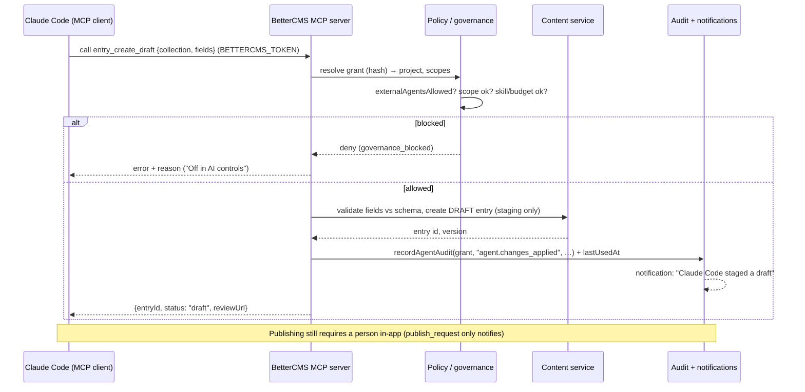
## 16. Rich Text & Markdown Architecture

BetterCMS treats rich text as **structured JSON blocks, never HTML documents**. There are two layers: the authoring model (the block editor and its `DocValue` format) and the delivery model (Markdown serialized on request: `.md` twins, `llms.txt`, `llms-full.txt`). The legacy TipTap dependency still ships in `package.json` but the production editor is the custom BlockEditor; treat TipTap as removable.

### 16.1 The DocValue block model [EXISTING]

`src/lib/cms/blocks/doc.ts` defines the canonical document shape stored as the value of any `richText` field:

```ts
interface DocValue { version: 1; blocks: DocBlock[] }
interface DocBlock { id: string; type: DocBlockType; text?: string; ... }
```

`DocBlockType` covers 21 types in four families:

- **Prose**: `paragraph`, `h1`–`h6`, `bullet`, `numbered`, `todo` (with `checked`), `quote`, `callout` (with `tone: info|success|warning|danger|neutral` and `emoji`), `code` (with `language`).
- **Media**: `image` (`src`, `alt`, `caption`, `align: left|center|right|full`), `divider`.
- **Widgets**: `embed`/`video` (`url`, `provider`, `title`), `bookmark` (`url`, `title`, `desc`, `site`), `button` (`label`, `href`, `variant`), `table` (`rows: string[][]`, `hasHeader`), `toggle` (`text`, `bodyText`, `open`).
- **Component instances**: `component` (`component` key into the catalog, `title`, `desc`, `componentProps: Record<string,string>`) — BaseHub-style typed components dropped into body copy.

`DocBlock` is a single flat interface with optional fields per type (not a discriminated union), and blocks are a **flat array** — no nesting except the toggle's single `bodyText` string. `blockId()` produces `b_<time36>_<seq36>` ids. `parseDoc(value)` is the lazy migration path: a well-formed `DocValue` passes through; a legacy string is sniffed for block-level HTML tags and run through `htmlToBlocks` (a dependency-free regex pass that maps `p/h1–h6/blockquote/pre/ul/ol/hr` to block types); plain strings split into paragraphs on blank lines. This means **any string ever stored in a richText field remains readable** — the production API must keep this coercion at the read boundary or run a one-time migration.

### 16.2 The BlockEditor and the one-contentEditable-per-block strategy [EXISTING]

`src/components/cms/editor/document/BlockEditor.tsx` (2,220 lines) is a Notion-style editor with a deliberate ownership split, documented in its header comment: **React owns the block list (type, order, metadata); the DOM owns in-progress text.** Each prose block renders as its own uncontrolled `contentEditable` element; text is pushed back into React state only on blur or structural change, so the caret never jumps mid-edit. Key mechanics:

- `blockRefs: Map<string, HTMLElement>` tracks live DOM nodes; `focusAfterRenderRef` + a `useLayoutEffect` restore focus/caret after structural commits (insert, remove, move, type change, duplicate).
- Structural operations (`insertAfter`, `removeBlock`, `duplicateBlock`, `moveBlock`, `changeType`) are pure array transforms that `commit()` a new `DocValue` up through `onChange` — this is exactly the shape a production PATCH-on-field API would receive.
- The slash menu is a two-level catalog (Featured + Basic at root; AI, Components, Embeds drill-ins) driven by a `/query` regex match at the end of the active line. `replaceWithWidget` implements the keep-text rule: if the triggering block still holds text, the widget is inserted below it rather than replacing it, and a trailing empty paragraph is always appended so typing continues.
- **AI commands** (`AI_COMMANDS` in `rich-blocks.ts`: write, continue, summarize, improve, longer, shorter, generate image) run through `simulateAi()` — [SIMULATED] deterministic local text from a small lorem pool; image generation emits a gradient SVG data URI. Modes (`append | replace | callout | image`) define how output lands. Production: swap `runAi` for a streaming LLM call behind the same command catalog and the workspace AI-governance/credit checks that already gate the agent (Section on AI architecture).
- **Presence**: per-paragraph avatars map simulated peers (`useProjectPresence`, `blockSeed % blocks.length`) onto blocks — [SIMULATED], replace with real cursor positions over the collaboration channel.

### 16.3 Inline marks and XSS handling [EXISTING, with production notes]

Prose block `text` may carry a tiny inline-HTML vocabulary. `RICH_TEXT_TYPES` names the block types allowed to carry marks; `sanitizeInlineHtml(html)` in `doc.ts` is the single choke point: it parses into a detached `<template>`, keeps only `B/STRONG/I/EM/U/A/BR`, strips **every attribute except `href` on `<a>`**, unwraps everything else while preserving text, and runs two passes so unwrapping exposed nested wrappers. It runs whenever a `contentEditable` commits (blur, selection-toolbar format via the `bcms:doc-format` window event bridge, which calls `document.execCommand` on the live DOM then persists `sanitizeInlineHtml(el.innerHTML)`), and `hasInlineMarkup()` decides whether to store HTML or plain `textContent`.

**Production XSS posture [RECOMMENDED]:** client-side sanitization is a UX convenience, not a security boundary. The write API must re-sanitize inline HTML server-side with the same allow-list (e.g. `sanitize-html` configured to `b,strong,i,em,u,a[href],br`, plus an `href` protocol allow-list — the current code does **not** filter `javascript:` URLs in `href`; add that check on both client and server). Widget fields (`url`, `src`, `href`, `embedUrl`) need URL validation and, for embeds, a provider allow-list — `detectEmbed()` in `rich-blocks.ts` already normalizes YouTube/Vimeo/Loom/Figma/CodePen/CodeSandbox/Twitter/Spotify URLs into embeddable forms and should become the server-side canonicalizer. Rendered embeds must stay inside sandboxed iframes with a strict frame CSP. `fakeBookmarkMeta()` is [SIMULATED] link-preview metadata; production replaces it with a server-side unfurl service (fetch + OpenGraph parse, SSRF-guarded).

### 16.4 Markdown paste and the MD view round-trip [EXISTING]

`src/lib/cms/blocks/markdown.ts` is a dependency-free two-way bridge:

- `blocksToMarkdown(doc)` maps prose 1:1 (headings, lists, `- [x]` todos, quotes, fenced code, GFM tables with `\|` escaping, images with caption-as-title), converts inline HTML to `**`/`*`/`[label](url)`, and keeps widgets in honest textual forms: embeds/bookmarks/videos as bare URLs on their own line, callouts as `> [!tone]`, toggles as `<details><summary>`, buttons as links, and component instances as `<!-- bcms:component <key> {json} -->` HTML comments so nothing is silently lost.
- `markdownToBlocks(md)` is a line-oriented parser reversing all of the above; a bare URL line re-materializes as an embed when `detectEmbed` recognizes the provider, else a bookmark. `mdToInline` escapes HTML entities **before** re-introducing only the editor's own `<b>/<i>/<a>` marks, which keeps pasted `<script>` inert.
- `looksLikeMarkdown(text)` gates paste conversion (≥2 structural lines, or 1 structural + inline marks); the BlockEditor paste handler converts matching clipboard text into real blocks with a toast, which is how Notion-copied content lands cleanly.
- The **Markdown view toggle** serializes the whole document into a `<textarea>` (`enterMd`) and re-parses on exit (`exitMd`). Note the round-trip is **normalizing, not lossless**: unknown HTML, image `align`, callout emoji, and table header-less variants collapse to canonical forms. That is acceptable for an editing view; do not use this path as a storage migration.

### 16.5 docToPlainText consumers [EXISTING]

`docToPlainText(doc)` projects a document to plain text (strips tags, flattens widget labels/urls, joins with blank lines). Current consumers: entry previews/summaries (`blocks/summary.ts`), the Compare dialog (`CompareVersionsDialog.asText` renders rich fields as prose before diffing), and the **search index** (`search-store.flatten()` detects `DocValue` shapes and calls it). In production this same projection feeds the Typesense document builder and any excerpt/AI-context pipelines — keep it in a shared package.

### 16.6 Delivery: .md twins, llms.txt, the Markdown manager

- **Serializers** (`src/lib/md/serialize.ts`) [EXISTING as contract, SIMULATED as HTTP surface]: `pageToMarkdown` emits frontmatter (title/description/url/updated) plus per-section rules (hero → `# headline` + bold CTAs, features → `## heading` + bullets, faq → `### q` + answers, testimonial → blockquote with attribution, cta/pricing/contact → `## heading` + subtext, logos skipped, unknown kinds fall back to their field values). `entryToMarkdown` is schema-driven: short field values become a `- **Label:** value` list, long/multiline values become `## Label` sections. `llmsTxt` builds the llmstxt.org shape (H1, blockquote summary, `## Pages` / per-collection / `## Files` link lists) from **published content only**; drafts are excluded at the filter level. `llmsFullTxt` inlines the full corpus with `---` separators.
- **md-store** (`src/lib/md/md-store.ts`) [SIMULATED persistence, real model]: per-project `MdState { llms, llmsFull, llmsMode: auto|custom, llmsCustom, excluded[], files: MdFile[] }`. Standalone `MdFile`s carry their own `draft|published` lifecycle and a `normalizeMdPath` slug rule (`/segment/name.md`). Actions (`setSurface`, `setLlmsMode`, `toggleExcluded`, `addFile`, `updateFile`, `setFileState`, `removeFile`) are the API contract.
- **Manager UI** (`src/components/cms/markdown/MarkdownManager.tsx`, Pages hub → Markdown view) [EXISTING]: Delivery card (llms.txt Auto/Custom with edit-prefill and revert-to-auto, llms-full off by default, always-on content-negotiation row), an Endpoints table of every page/entry/file with per-row Serve switches that live-update llms.txt, preview/copy/download dialogs, and file editing with Save-as-draft / Publish.
- **[MISSING]**: no real HTTP routes serve any of this. Production needs an edge/delivery service: `GET {path}.md`, `Accept: text/markdown` content negotiation on canonical URLs, `GET /llms.txt`, `GET /llms-full.txt`, all rendering from the published snapshot (not drafts), honoring `excluded`, cached by CDN and invalidated on publish events (see §20).

### 16.7 Production notes: storage and Portable Text interop [RECOMMENDED]

- **Storage**: store `DocValue` as a `jsonb` column on the entry-field value row (or inside the entry's `fields jsonb` as today's shape implies). Add a CHECK/application constraint on `version = 1` and block-count limits (e.g. 5,000 blocks) to bound payloads. Index nothing on the JSON itself; derive `plain_text` (from `docToPlainText`) into a sidecar column or the search pipeline instead. Keep `parseDoc` as the read-side coercion for legacy strings, and write a backfill job that runs it once so the column becomes uniformly versioned.
- **Versioning/migration**: the `version: 1` field is the migration lever. Any future block-shape change bumps the version and ships a pure `migrateV1toV2(doc)` function run lazily at read + eagerly by a backfill job — the same pattern `parseDoc` already establishes.
- **Portable-Text-like interop**: the flat-array-of-typed-blocks model maps nearly 1:1 to Portable Text: prose blocks become `{_type:"block", style, children:[spans], markDefs}` (inline `<b>/<i>/<a>` split into spans with marks; `<a href>` becomes a `link` markDef), lists become blocks with `listItem`/`level`, and every widget becomes a custom block type (`embed`, `table`, `component`...). Two impedance points: BetterCMS stores marks as inline HTML inside `text` (converter must parse spans out), and toggles/tables have no PT-standard equivalent (custom types). Write `docToPortableText` / `portableTextToDoc` in the shared content package if Sanity-ecosystem tooling (PT renderers, `@portabletext/markdown`) is wanted; otherwise treat `DocValue` as the house format and keep only the Markdown and plain-text projections, which already exist and are cheaper to maintain.

---

## 17. Visual Design Mode

### 17.1 The two section systems (the #1 architectural trap)

**System A — pages-store `SectionInstance` (the real product).** `src/lib/cms/pages-store.ts` holds `PageDoc { id, path, title, state, sections: SectionInstance[], publishedSnapshot, seo fields, folderId, staged, batchId... }` per project, lazily seeded with a 5-page marketing site for **every** project. `SectionInstance { id, type, variant, content: Record<string,string>, design?: SectionDesign }` comes from `src/components/cms/editor/sections/SectionSystem.tsx`, which is simultaneously the type home, the developer catalog (`SECTION_DEFS`: 8 kinds — hero, features, logos, testimonial, cta, pricing, faq, contact — each with variants, `FieldDef[]`, defaults, and a real React renderer), the inline-edit primitive (`InlineText`, an uncontrolled contentEditable that tags elements with `data-field="${sectionId}.${fieldKey}"` for the comment system and form panel), the marketer library (`SectionLibrary` with live scaled previews), and page templates (`PAGE_TEMPLATES` + `instantiateTemplate`). The visual editor (`/visual`), Pages hub, Markdown serializers, search index, generators, and agent all read/write this store. [EXISTING]

**System B — CMS-store `Section` (the Northwind section workspace).** `src/lib/cms/types.ts` defines a much richer `Section { id, pageId, kind: SectionKind (17 kinds), props, blocks?: Block[] (a nested composable block tree), componentId/overrides, layout: SectionLayout, style: SectionStyle, seo: SectionSeo, advanced: SectionAdvanced, publishedSnapshot }` living in the central store's `pages`/`sections` arrays, **seeded only for the Northwind demo project** (`pg_home` with 13 sections etc. in `mock-data.ts`). It powers the Content-tab section workspace (`PageView.tsx` with Content/Layout/Style/SEO/Advanced tabs, role-gated so editors/reviewers see Content + SEO only), its own token renderer (`src/components/cms/editor/preview/sections.tsx`), field schemas per kind (`src/lib/cms/section-schema.ts` `SCHEMAS` + conditional `VISIBILITY` predicates), and the store-level publish machinery (`pageActions.publish` with `Revision` snapshots). [EXISTING but demo-scoped]

They do not share data, ids, or renderers. A page created in `/visual` never appears in the Northwind section workspace and vice versa.

### 17.2 Recommended unification [RECOMMENDED]

Adopt **System A's instance model as the stored shape** (it is what every cross-cutting feature already consumes) and **System B's capability set as the schema**, merged as follows:

1. One `page_sections` table: `{ id, page_id, position, type, variant, content jsonb, design jsonb, seo jsonb, advanced jsonb }`. `content` stays the flat `Record<string,string>` for v1 fields; System B's nested `blocks` tree becomes a v2 field type inside `content` rather than a parallel structure.
2. Merge `SectionDesign` (System A) with `SectionLayout`/`SectionStyle` (System B) into one design object — they already overlap ~80% (theme, background, overlayOpacity, radius, shadow, borders, fullHeight, width, align, padding). System B extras worth keeping: `gap`, `columns`, `textTone`, `fontScale`. System A extras worth keeping: independent `paddingTop/paddingBottom` (System B only has `paddingY`) and `opacity`. Write the token migration table once (e.g. System B `paddingY:"lg"` → `paddingTop:"lg", paddingBottom:"lg"`).
3. Keep System B's `SectionSeo` (anchorId, schemaType, headingLevel, excludeFromIndex, ariaLabel) and `SectionAdvanced` (htmlTag, hidden, device/auth visibility, customClassName/Id/Attributes, scoped customCss, zIndex, notes) as the dev-gated tabs — they are the Enterprise/developer surface DESIGN_CONTROLS.md anticipates.
4. Section **definitions** move out of the hardcoded `SECTION_DEFS` array into the schema system (§18): the `/schema` builder's `sections` field type with `allowedSections` already points there. Production sections are registered via a developer API/SDK (name, category, variants, field schema, render component or frontend mapping), and the catalog becomes per-project data.
5. Migrate the Northwind seed to the unified shape and delete the parallel store paths. Budget one sprint: the renderers are the only genuinely divergent code.

### 17.3 The SectionDesign token model [EXISTING]

Every knob is a **named token, never raw CSS** (DESIGN_CONTROLS.md is the decision record). Full token inventory from `SectionSystem.tsx`:

| Token | Values |
|---|---|
| `theme` | `inherit \| light \| dark` |
| `background` | `default \| surface \| muted \| accent \| inverse \| custom` |
| `backgroundColor` | hex/CSS string, only when `background: "custom"` |
| `backgroundImage` | URL |
| `overlayOpacity` | 0–100, **conditional: only meaningful (and only shown) when backgroundImage is set** |
| `opacity` | 0–100 whole-section |
| `paddingTop` / `paddingBottom` / `paddingX` | `SPACE_TOKENS`: `none, xs, sm, md, lg, xl, 2xl, 3xl` (8-stop scale) |
| `maxWidth` | `full \| wide \| default \| narrow` |
| `align` | `left \| center \| right` |
| `radius` | `none \| sm \| md \| lg \| xl \| 2xl` |
| `shadow` | `none \| sm \| md \| lg \| xl` |
| `borderTop` / `borderBottom` | boolean |
| `fullHeight` | boolean (hero/cta only via allow-list) |

The **developer allow-list** lives in `src/lib/cms/section-schema.ts`: `sectionDesignControls(kind)` returns the `DesignControlKey` set per kind — every kind gets the standard set; `hero`/`cta` add `fullHeight`; chrome kinds (`navigation`, `header`, `footer`) are trimmed to background + theme + typography. `DESIGN_OVERRIDES` is the extension point (roadmap: editable in the /schema builder).

### 17.4 Render helpers and the dark scope [EXISTING]

Four pure functions translate tokens to presentation on the managed canvas:

- `sectionDesignClass(d)` → outer-wrapper Tailwind classes via lookup maps (`D_PT/D_PB/D_PX/D_BG/D_RADIUS/D_SHADOW`); dark theme pushes `bg-slate-950 text-slate-100`, radius adds `overflow-hidden`, `fullHeight` adds `min-h-screen flex flex-col justify-center`.
- `sectionDesignStyle(d)` → the only inline styles: custom background color, background image (cover/center), and fractional opacity.
- `sectionInnerClass(d)` → content-column constraint (`max-w-*` + `mx-auto/ml-auto/mr-auto` for alignment).
- `sectionOverlay(d)` → 0..1 scrim value; `SectionShell` in `visual.tsx` renders it as an absolutely-positioned `rgba(0,0,0,x)` layer between background and content.
- `isDarkSurface(d)` / `sectionHasDesign(d)` are the predicates; an undesigned section renders with **zero wrappers** (transparent pass-through).

**`.bcms-sec-dark`** (styles.css ~line 560) is the theme scope: a dark-surfaced section flips its headings and slate-text utilities to light via scoped CSS overrides, while text inside light cards (`.bg-white`, `.bg-slate-50/100`) is restored by higher-specificity rules — this is how section renderers written for the light canvas survive a dark section without per-component theme props. (System B's renderer instead reuses the app-wide `.dark` token remap by stamping `dark` on the section wrapper — a second divergence the unification removes.)

### 17.5 How Design panel edits persist [EXISTING]

`SectionDesignPanel` (in `w.$workspace.p.$project.visual.tsx`) renders inside the form panel per section, gated by `canCompose` (marketer+; editors/reviewers never see it). Every control fires `onChange(patch)` → `setDesign(sectionId, patch)` → `pagesActions.update(projectId, path, p => ({...p, sections: map(s => ({...s, design: {...s.design, ...patch}}))}))`. Notes: spacing sliders convert `"none"` back to `undefined` (unset), "Reset design" writes an all-`undefined` patch, and a dot on the Design header signals `sectionHasDesign`. The patch-function signature of `pagesActions.update` is the draft API contract: production is `PATCH /projects/:id/pages/:pageId/sections/:sectionId { design: {...} }` with a last-write-wins merge (or CRDT once realtime lands). [SIMULATED persistence — in-memory today, resets on reload.]

### 17.6 Headless delivery of design tokens [EXISTING as data model, MISSING as API]

The whole point of tokens: `design` travels through the content API as plain structured data. The delivery contract to document for customers:

```json
{ "id": "sec_x", "type": "hero", "variant": "centered",
  "content": { "headline": "…", "primaryCta": "…" },
  "design": { "theme": "dark", "paddingTop": "xl", "maxWidth": "narrow", "overlayOpacity": 60 } }
```

A Next.js frontend maps `paddingTop: "xl"` onto its own scale; BetterCMS Cloud (managed hosting) renders with the built-in maps above. **Frontend mapping contract [RECOMMENDED]:** publish a small `@bettercms/tokens` package exporting the token unions, the default Tailwind/CSS-variable maps, and a `resolveSectionDesign(design, overrides)` helper, so headless customers override per-token without re-implementing semantics. Never serialize computed class strings through the API. Roadmap item (DESIGN_CONTROLS.md): re-map the global spacing scale per brand kit without touching stored content — possible precisely because storage is tokens.

### 17.7 Section render pipeline

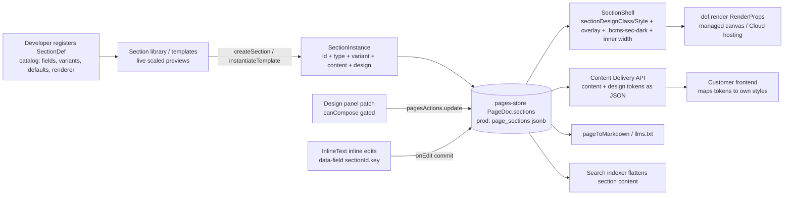

---

## 18. Schema Management

### 18.1 The two schema systems (trap #2)

**System A — `schema-store.ts` `ModelField` (the /schema builder).** Per-project `SchemaModel { id, kind: page|collection|block, name, apiId, description, fields: ModelField[] }`. `ModelField { id, label, apiId, type, required?, searchable?, help?, options?, refModelId?, allowedSections?, fields? }` with **19 field types**: `text, longtext, richtext, slug, number, toggle, date, image, file, link, email, phone, select, reference, multireference, color, json, group, sections`. Nesting is via the `group` type (children in `fields`), ordering is array order, and a full set of immutable tree helpers exists (`mapField`, `insertRelativeTo`, `extractFieldById`, `moveFieldById`, `cloneFieldDeep`, `isDescendant` guard against dropping a group into itself). Seeded per project with Marketing page (a `page` kind carrying a `sections` zone with `allowedSections`), Blog post (with `reference` → Author and `multireference` → Category), Author, Category, and a Call-to-action `block`. `SCHEMA_TEMPLATES` provides six ready-made model shapes. The `/schema` route renders Notion-style inline field rows, field settings (required, help, options, references, allowed sections, and the **Searchable** toggle at `w.$workspace.p.$project.schema.tsx:1040`), the "Create group" dialog, the two-step New-model modal, and a **live JSON + API preview panel** showing the model as JSON and example API calls. Dev-only (`canSeeDeveloper`). [EXISTING]

**System B — `types.ts` `Schema`/`SchemaField` (the content store).** `Schema { id, ownerType: collection|component, ownerId, fields: SchemaField[], groups?: SchemaFieldGroup[], titleFieldName?, listFieldNames? }`. `SchemaField` has **17 types** (`text, richText, number, boolean, date, image, file, reference, multiReference, select, url, email, json, code, color, componentRef`) plus the production-grade extras System A lacks: `unique`, `localized`, `validation {min,max,minLength,maxLength,pattern}`, `hiddenInList`, `defaultValue`, `placeholder`, `ui` hints (`segmented|icons|chips|switch|stepper|select`) with `icons`/`optionLabels` maps, and flat `groupId` grouping via a separate `SchemaFieldGroup` list. This is what the entry editor, collection tables, CSV import/export, Compare, serializers, and the search index actually read (the 15-field example blog schema lives here). Also reused as the field-definition language for System B section kinds in `section-schema.ts`. [EXISTING]

The naming collisions are exact and cruel: `richtext` vs `richText`, `toggle` vs `boolean`, `link` vs `url`, `multireference` vs `multiReference`, `refModelId` vs `refCollectionId`, `help` vs `description`, nested `fields` vs flat `groupId`.

### 18.2 Unification plan [RECOMMENDED]

Make **System B the runtime schema** (it has validation, localization, uniqueness, UI hints — everything entry storage needs) and **System A the authoring surface** compiled onto it:

1. One `models` table (`{ id, project_id, kind: page|collection|block|component, name, api_id, description }`) + `fields` (`{ id, model_id, parent_field_id nullable, position, api_id, label, type, config jsonb }`). `config` carries required/help/options/ref/validation/localized/unique/ui/searchable/allowedSections. `parent_field_id` supports the builder's nested groups; expose `groupId` flat form to clients that want it.
2. A single canonical `FieldType` enum with a migration alias table (`longtext→text+multiline ui`, `toggle→boolean`, `link→url`, `phone→text+phone validation`, `slug→text+slug validation+unique`). `sections` and `group` come from System A; `componentRef`/`code` from System B.
3. The `/schema` builder writes through the same `modelActions`-shaped API (`add/update/remove` with patch functions) — its tree helpers already model the immutable transforms; keep them as the client-side optimistic layer.
4. Kill the demo-only fork where `collectionActions.add` creates a bare System B schema while the builder creates a System A model for the same concept; a created collection gets exactly one model row.

**Schema changes must drive four downstream systems:**

- **Entry validation** [MISSING today]: server-side validation compiled from `required` + `validation` + type coercion per field; `unique` becomes a partial unique index on the flattened value; reference fields validate target model + existence. Publish-time validation is stricter than save-time (drafts may be incomplete).
- **Table columns** [EXISTING client-side]: collection tables derive columns from `listFieldNames`/`hiddenInList`; production keeps that server-driven so column config is schema data, not UI state.
- **Search index schema** [PARTIAL]: the per-field `searchable` flag (System A) and the SearchConfig `fieldOff` overrides (§21) compile into the Typesense collection schema. Any schema change that adds/removes/retypes a searchable field triggers the **alias-swap reindex**: create `project_{id}_v{n+1}` with the new schema, backfill from published content, atomically repoint the alias, drop the old collection (SEARCH_PLAN.md gotcha #1). Field renames are the dangerous case — treat as remove+add and warn in the builder.
- **API types** [EXISTING as preview, MISSING as artifact]: the builder's live JSON/API panel is the spec for generated artifacts — an OpenAPI/JSON-schema per model, generated TS types (`@bettercms/client` codegen), and the MCP tool input schemas. Regenerate on model publish; version with the model's `updatedAt`.

Also carry over **demo-seeding hygiene**: `schema-store.seed()` and the per-project demo collections exist only for the demo (and the memory notes record a past `collectionIds` leak between projects); production projects start empty with templates offered, and none of the seed ids (`mdl_*`, `pg_home`, `pr_northwind`) may appear in migrations.

---

## 19. Workflows & Approvals

### 19.1 Stages model [EXISTING]

Editorial stages live in the central store (`store.ts` ~line 2104). `WorkflowStage { id, name, color, publishGate? }`; `ProjectWorkflow { id, projectId, stages }` exists only for projects that customized their stages — `getWorkflow(projectId)` falls back to `DEFAULT_WORKFLOW_STAGES`: Draft (#64748B), In review (#D97706), Changes requested (#E11D48), Approved (#4F46E5, `publishGate: true`). Stages cover the middle of the journey; `draft/scheduled/published/archived` remain system lifecycle on `Entry.status`. `stageOfEntry(entry, stages)` resolves an entry's stage, inferring from legacy `status` (`review`→`wfs_review`, `approved`→`wfs_approved`) when `workflowStageId` is unset — keep this inference as the data-migration rule. `WORKFLOW_STAGE_COLORS` is the 8-color custom-stage palette (dark-mode safe). `CustomizeStagesDialog` edits the set via `workflowActions.setStages` (rejects empty) and `reset`. Publishing UI is offered only from `publishGate` stages. Plan-gated: the Workflow tab sits behind the `siteHas` feature gate (Pro/Team per the workflows memory) with a `LockedFeature` upsell.

Note there is also a **parallel lifecycle state machine** in `src/lib/cms/publishing.ts` (`canTransition`/`disabledReason` over `draft→review→approved→scheduled→published` + archived rules) used by System B `PublishState` transitions (`pageActions.transition`, `entryActions.transition`). In production, unify: custom stages own the editorial middle; the lifecycle machine owns only `draft/scheduled/published/archived`, and "Approved" is whatever stage carries `publishGate`.

### 19.2 Kanban board [EXISTING]

`w.$workspace.p.$project.workflow.tsx`: columns = project stages + a built-in Published column; dnd-kit drag between columns calls `workflowActions.moveEntry` with role checks (`canEditContent`); dropping onto Published requires `canPublish` and routes through `entryActions.publish`. Filters: scope (All / Mine via the demo `CURRENT_MEMBER = "m_jane"` / Overdue), collection filter, board/list view toggle. Cards show `StageChip`, `AssigneeStack`, `DueChip` (from `WorkflowBits.tsx`) and open the same `EntrySlideOver` the Content tab uses — one entry system everywhere.

### 19.3 EntryWorkflowBar [EXISTING]

`src/components/cms/editor/EntryWorkflowBar.tsx` is the single document footer on every entry surface. Left: `StageChip` (or `PublishBadge` for published/archived) + relative time of the last move. Right: Request button, Compare (with amber changed-field count from `diffEntry` against `publishedSnapshot`), and a **situational primary action**: working stage → "Approve" (move to the gate stage); gate stage → "Publish"; published → "Publish changes" (disabled at zero diff); scheduled → "Publish now". The split dropdown holds Request changes (moves to `wfs_changes` with a mandatory comment via `RequestChangesDialog`, which notifies), Publish now, Schedule/Reschedule, Move-to-stage submenu, Unschedule, Unpublish. Reviewers see "Your seat can review, not edit." and no actions — enforcement is `canEditContent`/`canPublish` on the effective (view-as) role.

### 19.4 Typed WorkflowRequests [EXISTING]

`WorkflowRequest { id, kind: review|approval|feedback, memberId, note?, requestedBy, requestedAt, due?, status: open|done }` on the entry. The `RequestButton` popover implements the full loop: pick a kind (each with a plain-language hint), people list split into **Suggested** — by seat, per `REQUEST_KINDS.suggests`: review suggests reviewer/editor seats, approval suggests owner/admin roles + marketer seats, feedback suggests no one — and Everyone else; optional context note and due date; multi-select send. Store semantics in `workflowActions.request`: one open request per person per kind (a re-ask replaces the old one), requestees are auto-added to `workflowAssigneeIds`, each person gets a notification carrying the note, and an audit line is recorded. `closeRequest(entryId, requestId, "done"|"withdrawn")` marks done or deletes, and drops the person from assignees only when they hold no other open request. The "Waiting on" list at the top of the popover shows open asks with per-row done/withdraw.

Adjacent actions: `assignEntry` (notifies newly added assignees), `setDueDate`, and `moveEntry` (audit line; a comment on the move raises a "Changes requested" warning notification; moving a published entry to a working stage flips `status` back to `draft` — a new draft version starts).

### 19.5 Production: state machine and jobs [RECOMMENDED]

- **Tables**: `workflow_stages (project_id, position, name, color, publish_gate)`; `workflow_requests (entry_id, kind, member_id, note, requested_by, due_at, status, resolved_at)`; assignees as `entry_assignees` join; stage/due/last-move as columns on `entries`. Stage deletion must specify a target stage for orphaned entries (the demo silently falls back to stage[0] — make it explicit).
- **State machine**: model entry state as (lifecycle, stageId) with server-enforced transitions: publish allowed only from a `publish_gate` stage or when the actor's role bypasses (owner/dev, configurable); moving out of published creates a new draft head; all transitions emit domain events (`entry.stage_moved`, `entry.request_created`, `entry.request_closed`) onto the event bus that also feeds webhooks and audit (§20).
- **Assignment/notification jobs**: request creation fans out in-app + email notifications (respecting notification preferences, [SIMULATED] today); a scheduled job scans `due_at` for overdue-request reminders and powers the board's Overdue scope; digesting (batch multiple requests to one person) belongs in the notification service, not the workflow service.
- **Guards**: custom-role capability checks (`custom-roles-store` scopes, currently UI-only [SIMULATED]) must move server-side: `capabilities.publish` and scope restrictions evaluated per entry/collection on every transition.

---

## 20. Publishing Pipeline

### 20.1 Current behavior — two parallel implementations [EXISTING, SIMULATED as infrastructure]

**Pages (visual editor, pages-store).** `PageState = draft | published | modified | scheduled | archived` plus a `staged` boolean. `pagesActions.publish(projectId, path, {scheduledAt?})` flips state and — on immediate publish only — captures `publishedSnapshot: PageDocSnapshot { capturedAt, title, sections (structuredClone), seoTitle, seoDescription }`. `PublishMenu` (`src/components/cms/editor/PublishMenu.tsx`, shared by the visual-editor header, Pages list status chips, and page menus) offers: destination segmented **Staging | Production**; Publish now / Schedule (datetime-local); push-to-staging (`staged: true` with a private preview URL); Unpublish (state → draft); Cancel schedule; Save as template; Archive. "Modified" is the published-with-unpublished-changes state.

**Entries (+ System B pages, central store).** `entryActions.publish` builds `buildEntrySnapshot(entry)` (snapshots.ts), creates a `Revision { ownerKind, ownerId, label: "v{n}", snapshot }` row, sets `status/lastPublishedAt/publishedSnapshot/revisionIds`, and records audit. `schedule`/`unschedule` (unschedule returns to `approved`), `setStatus(draft)` for unpublish, `transition` guarded by `publishing.ts` `canTransition`. `pageActions` (System B) mirrors this with `restoreRevision` restoring a full snapshot into the draft. A **scheduler tick** in store.ts promotes scheduled pages/entries whose `scheduledAt` has arrived — the in-browser stand-in for a real job runner. Seeded revisions/snapshots (with a deliberately perturbed first heading) make Compare demonstrable out of the box.

**Compare** [EXISTING]: `diff-text.ts` does word-level LCS diffing (whitespace-preserving tokens, `Uint16Array` DP table, prefix/suffix fallback above 250k token-pairs). `CompareVersionsDialog` (entries) and `ComparePageDialog` (pages) render Published ↔ Draft in aligned columns — changed fields first, unchanged behind a toggle, removed words struck in the published column, additions highlighted in the draft — with exactly one action per row: **Restore published value** (writes the snapshot value into the draft via `entryActions.setField` / `pagesActions.update`). Rich-text fields diff as `docToPlainText` prose. `snapshots.ts` provides the structural diffs (`diffPage` changed/added/removed/reordered section ids, `diffEntry` changed field set) and `summarizeDiff` for badges.

**Doc clipboard** [EXISTING]: `doc-clipboard.ts` — `copyDocument(entry)` stores `{title, fields, source collection}` in an in-app singleton (plus best-effort JSON onto the system clipboard tagged `_bettercms: "document"`); `entryActions.pasteDocument(collectionId, doc)` creates a new draft entry matching fields **by name against the target schema**, reporting rather than silently dropping mismatches — cross-collection paste is a first-class feature to keep.

### 20.2 Production pipeline [RECOMMENDED]

- **Transactional publish**: one transaction per publish: validate against schema (strict mode) → write immutable `revisions` row (content-addressed snapshot: full page/entry JSON incl. sections and design tokens) → flip `published_revision_id` pointer on the document → append `publish_events` outbox row. Publishing is a pointer swap; "modified" is derived (`draft_updated_at > published_at`), not stored. Unpublish clears the pointer (keep the revision). Never mutate snapshots.
- **Snapshot storage**: `revisions (id, owner_kind, owner_id, version, created_by, created_at, label, snapshot jsonb, checksum)`. Retention: keep all on paid plans, cap on free (plan-gated version history is standard). Section-level `publishedSnapshot` (System B has it per-section) is redundant once revisions exist — derive per-section diffs from the page revision.
- **Scheduled publish jobs**: replace the browser tick with a durable scheduler (e.g. pg-boss/cloud scheduler scanning `scheduled_at <= now()` with row locks). A scheduled publish is a *deferred pointer swap that re-validates* (the entry may have changed or lost its gate stage since scheduling — fail to a notification, don't silently publish stale approval). Timezone: store UTC, display local (the datetime-local input already implies this).
- **Staging**: model as a named environment target (`staged_revision_id` alongside `published_revision_id`) rather than the current boolean, so the delivery API can serve `?env=staging` behind the private-preview token that the PublishMenu already surfaces.
- **Cache/CDN invalidation**: on the publish event, purge the page's canonical URL, its `.md` twin, `/llms.txt` (+ `/llms-full.txt` if enabled), sitemap/RSS, and any listing pages referencing the document; managed hosting additionally triggers a re-render, and headless projects with `FrontendHosting.mode: external` get the rebuild-webhook ping the hosting model reserves.
- **Webhook + search-index events**: the `WebhookEvent` catalog in types.ts already names `page.published/page.unpublished/collection.entry.*`; deliveries are signed (`whsec_` one-time-reveal exists in the tokens store [SIMULATED]) with retries and a `webhook_deliveries` log. Search sync consumes the same events (publish → upsert, unpublish/delete → remove — all three lifecycle events per SEARCH_PLAN.md gotcha #2).

### 20.3 Publish event flow

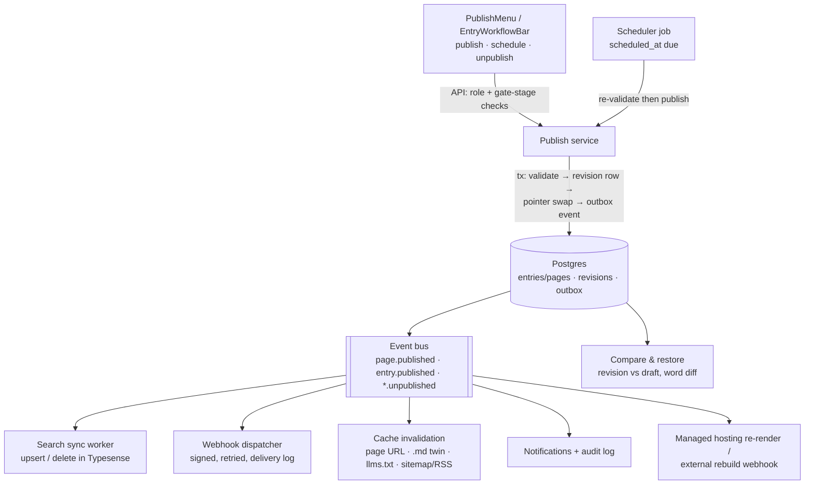

---

## 21. Search Architecture

### 21.1 SEARCH_PLAN.md decisions (summary)

Search ships as a content-adjacent primitive like Forms. Decisions: **Typesense** engine (open source, typo tolerance, query-time sort, scoped keys, built-in vector/hybrid; Algolia rejected on cost/replicas); shared clusters with **per-project collections** (dedicated clusters = enterprise upsell only); **field-level granularity** via a per-schema-field `searchable` flag (text-ish fields default on when a collection is enabled — also the RAM/cost control); **sync on publish, never on save** — the index contains only published content, with publish/unpublish/delete all enqueuing jobs and a per-collection "last synced" admin status; **key scoping** — the parent key is search-only, browsers get generated scoped keys embedding a non-overridable `filter_by: project_id`, TTL, and `exclude_fields`, delivered BaseHub-style through the content API; **two consumption modes on one index** — hosted embed widget vs headless REST + `useSearch` hook + unstyled SearchBox primitives; **AI search = plan-gated hybrid** (auto-embed field, `query_by` includes the vector, ~0.7 keyword/0.3 semantic fusion; `search` feature key Basic+, `ai-search` Pro+ — both rows confirmed present in `FEATURE_MATRIX`, pricing.ts:368-369); **analytics at the proxy** (top searches, no-result rate); **pages and entries both index** (pages flatten section content; richText flattens via `docToPlainText`). Gotchas engineering owns: alias+rebuild-swap on schema change, deletes must remove documents, strict PII enforcement of field toggles + a warning when a sensitive-looking field is toggled searchable, and draft search (if ever) is a separate index.

### 21.2 What the demo implements [EXISTING / SIMULATED]

`src/lib/search/search-store.ts` (localStorage-persisted, `bettercms.search.v1`):

- **Config model**: `SearchConfig { enabled, includePages, collections: Record<collectionId, boolean>, fieldOff: Record<"collectionId.fieldName", boolean>, aiSearch, publicKey, enabledAt }`. `defaultConfig` opts every project collection in; `searchActions` = `patch`, `setCollection`, `setField`, `regenerateKey`, `logQuery` — the draft API contract.
- **A real in-browser index** — this is the part that is *not* simulated logic: `useSearchIndex` builds `SearchDoc`s live from `pages-store` (title, path, seoDescription, plus all section content flattened into `body`) and from CMS-store entries (per-field text for schema fields of `TEXTY` types — `text, richText, select, url` — minus `fieldOff` exclusions), flattening `DocValue` rich text through `docToPlainText`. `searchDocs()` is a working ranked query engine: tokenized AND-matching, field weighting title(10) > named fields(5) > body(2), position bonus for title-prefix hits, snippet extraction as `[before, match, after]`, and — in AI mode — Levenshtein-≤1 typo tolerance on tokens ≥4 chars. **What it proves**: the per-field config genuinely changes results, ranking/snippets/no-result states are demonstrable against real seeded content, and the SearchDoc flattening rules are executable spec for the Typesense document builder. What it is not: an infrastructure claim — no cluster, no scoped-key enforcement, no sync jobs [SIMULATED].
- **Field-level flags across both schema systems**: the schema-builder side is `ModelField.searchable` (schema-store.ts:46, toggled in the /schema field settings at schema.tsx:1040) — declarative, per-model; the search-config side is `SearchConfig.fieldOff` keyed to the *content-store* schema fields that the index actually reads, edited in the hub's Searchable-content matrix. Today the two are **not wired together** (the index derives candidates from `TEXTY` types + `fieldOff`; `ModelField.searchable` is authored but unread) — a direct symptom of the two-schema split. Post-unification (§18): one `searchable` flag on the canonical field, with SearchConfig retaining only collection-level enables and per-project overrides.
- **Scoped keys**: `publicKey` (`bcms_search_` + 24 chars) with regenerate — display-only today [SIMULATED].
- **Install surfaces**: `SearchHub` (`src/components/cms/search/SearchHub.tsx`) with five tabs — Overview (enable pill, stat cards, last-synced framing), Searchable content (pages toggle + per-collection and per-field matrix with MiniSwitches), Playground (live queries against the real index with highlighted `HitRow` snippets), Install (embed snippet + API/React snippets carrying the scoped key), Analytics. Nav tab is owner/developer-only and plan-gated by the `search` feature key with a locked-state upsell.
- **Analytics**: `logQuery` keeps the last 500 queries per project; `useSearchAnalytics` aggregates top-8 queries and no-result queries with counts and recency. [EXISTING at playground scope]

### 21.3 Production Typesense plan [RECOMMENDED]

- **Collections per project**: `search_{projectId}_v{n}` behind alias `search_{projectId}`. One document shape for pages and entries: `{ id, kind, title, path/where, collection_id?, field texts…, project_id (facet, filter target), published_at }`. Auto-embedding field added only when the project's `ai-search` entitlement is on.
- **Sync-on-publish jobs**: a search-sync worker consumes the §20 event bus — `*.published` → build SearchDoc via the same flatten rules → upsert; `*.unpublished`/`*.deleted` → delete by id; config changes (collection/field toggles) → partial reindex of the affected collection. Retries with DLQ; per-collection `last_synced_at` surfaced in the hub Overview (already framed in the UI). Never index drafts.
- **Alias-swap on schema change**: schema publishes that touch searchable fields create `v{n+1}`, backfill from published revisions, then atomically repoint the alias — zero-downtime, and the budget item SEARCH_PLAN.md calls out. Config-only field toggles that *narrow* the schema can also ride the swap to actually evict data (PII rule: a disabled field must leave the index, not just the UI).
- **Scoped keys**: proxy issues Typesense scoped keys from a search-only parent key with embedded `filter_by: project_id=…`, `exclude_fields`, and TTL; delivered via the content API; `regenerateKey` revokes by rotating the embedded key version. Raw admin keys never reach a browser.
- **Hybrid AI tier**: enable the embedding field + `query_by: title,fields,body,embedding` with rank fusion ≈ 0.7/0.3; entitlement checks at the proxy per plan (`siteHas(plan, "ai-search")`), falling back to keyword-only rather than erroring.
- **Analytics at the proxy**: log query/hit-count/latency per project (the exact `SearchQueryLogRow` shape), aggregate into top/no-result reports (the hub's Analytics tab is already the consumer), and meter request volume for billing.
- **Consumption**: hosted sites get the embed overlay widget; headless gets `POST /v1/projects/:id/search` plus `@bettercms/search-react` (`useSearch`, unstyled SearchBox primitives). Both hit the same proxy, so key scoping, analytics, and entitlements enforce in one place.
## 22. Asset Management

**Plain language:** the media library is where a team keeps every image, video and file a site uses. Today it looks and behaves like a finished product — folders, tags, favorites, a crop tool, a picker inside the content editor — but nothing is actually uploaded anywhere. Files live as browser-local data URLs and disappear on refresh.

### What exists today

- **[EXISTING] Data model.** `MediaAsset` and `MediaFolder` in `src/lib/cms/types.ts`: `kind: "image" | "video" | "file"`, `url`, `thumbUrl`, `folderId`, `sizeBytes`, `mimeType`, `width`/`height`, `optimized`, `referencedBy?: ID[]`, `tags`, `altText`, `caption`, `favorite`, `durationSec`. This shape is a good starting contract; the demo UI additionally presents PDF/Lottie/GIF as sub-kinds of image/file.
- **[EXISTING] Store actions.** `mediaActions.add/update/remove` and `mediaFolderActions.add/remove` in `src/lib/cms/store.ts`. `add` and `remove` write audit entries (`media.uploaded`, `media.removed`) and maintain `project.mediaIds`. These four actions plus `update` are the draft API surface: `POST /projects/:id/media`, `PATCH /media/:id`, `DELETE /media/:id`, folder CRUD.
- **[EXISTING] Library UI.** `src/components/cms/media/MediaLibraryShell.tsx` (~2,500 lines): folder tree, grid/list views, favorites, tag filters, kind filters, detail sheet, bulk select, "optimized" badges, open-in-new-tab.
- **[SIMULATED] Upload.** The upload queue in `MediaLibraryShell.tsx` (around line 2431) is a hardcoded `Queued[]` array with `uploading → optimizing → done` states and fake progress values. Real file input paths read the file with `FileReader.readAsDataURL` (also in `BlockEditor.tsx` ~line 1155 for pasted/dropped images) or object URLs, so the "uploaded" asset is a base64 string held in React state / the in-memory store. Nothing persists, nothing is optimized, and large files will blow up memory.
- **[EXISTING as UX, SIMULATED as persistence] Crop.** `ImageCropDialog.tsx`: aspect presets, canvas-based export via `canvas.toDataURL("image/png")` (CORS-aware, with a clear failure message). The crop result is a brand-new data URL; the original is not linked to the crop, and crop parameters are not stored.
- **[EXISTING] Picker.** `MediaPickerDialog.tsx` is reused by the block editor's image block (library pick, upload, paste URL, caption, alt text, alignment, hyperlink, crop).
- **[MISSING] Usage tracking.** `referencedBy` exists on the type but nothing populates it. There is no "where is this image used" answer and no delete protection for referenced assets.

### Production plan

- **[RECOMMENDED] Object storage + direct upload.** S3 or Cloudflare R2 per environment, bucket-per-region later. Upload flow: client calls `POST /projects/:id/media/uploads` → API validates plan storage quota (`siteHas` limits, section 28), creates a `media_asset` row in `pending` state, returns a presigned PUT/POST URL scoped to a deterministic key (`{projectId}/{assetId}/original`). Client uploads directly to storage (this is what the fake progress bar becomes — real `XMLHttpRequest`/fetch progress). A storage event notification (or a client "complete" call verified server-side via HEAD) flips the asset to `processing` and enqueues the ingest job.
- **[RECOMMENDED] Ingest pipeline (background job, section 27).** Extract metadata (dimensions, duration via ffprobe, mime sniffing — never trust client mime), strip EXIF GPS, generate a thumbnail and a blurhash/LQIP placeholder, optionally run AV scanning for Team/Enterprise, then mark `ready` and set `optimized: true`. The existing `uploading → optimizing → done` UI states map 1:1 onto `pending → processing → ready`.
- **[RECOMMENDED] Transforms + CDN.** Do not pre-generate renditions; serve originals through an on-the-fly transform proxy (imgproxy self-hosted, or Cloudflare Images/Vercel Image if buying) behind the CDN: `https://media.{site}/cdn-cgi/...?w=800&f=webp&q=80`. Signed transform URLs prevent parameter abuse. Bandwidth from this CDN is the metering source for the usage pages (section 28). The `optimized` badge becomes "served as AVIF/WebP with responsive sizes".
- **[RECOMMENDED] Video.** Phase 1: store + serve MP4s through the CDN with a poster frame from ingest. Phase 2 (if video matters commercially): buy Mux or Cloudflare Stream for transcode + HLS; the `MediaAsset.durationSec` field already anticipates this.
- **[RECOMMENDED] Crop persistence.** Store crops as non-destructive parameters on the *reference*, not as new files: `{ assetId, crop: { x, y, w, h, aspect } }` in the field value / section content, resolved by the transform proxy (`?rect=x,y,w,h`). Keep the current dialog UX; replace its `toDataURL` output with a crop-params save. Offer "save as new asset" as the explicit destructive path (server-side transform job writes a derived asset with `parentId`).
- **[RECOMMENDED] References and usage tracking.** Maintain a `media_reference (asset_id, project_id, target_type, target_id, field_path)` table updated transactionally whenever a page section, entry field, brand kit logo, or form config referencing an asset is saved (walk `SectionInstance.content`, entry `fields`, `DocValue` blocks). Powers "Used in N places" in the detail sheet, blocks or warns on delete, and enables orphan cleanup jobs. This replaces the dormant `referencedBy` array with a queryable index.
- **Enforcement:** storage quota checks at upload-URL creation; per-plan max file size; per-kind allow-lists (SVG needs sanitization before serving from the site domain — serve user SVGs from a sandboxed media domain).

---

## 23. Notifications

**Plain language:** the bell in the top bar shows a feed of things that happened — you were assigned an entry, someone requested your review, changes were requested. Today the feed works in the browser (mark read, badge counts) but every notification goes to one shared workspace feed rather than to a specific person, and nothing sends email.

### What exists today

- **[EXISTING] Model + actions.** `Notification` in `src/lib/cms/types.ts`: `{ id, workspaceId, kind: "info"|"success"|"warning"|"error", title, body?, readAt?, createdAt }`. `notificationActions` in `src/lib/cms/store.ts` (~line 2065): `add`, `markRead`, `markUnread`, `markAllRead(workspaceId)`, `remove`. Seeded from `mock-data.ts`.
- **[EXISTING] Producers.** Real product events already push notifications: `workflowActions.moveEntry` (request-changes comment → warning notification), `workflowActions.assignEntry` (newly added assignees notified), `workflowActions.request` (typed Review/Approval/Feedback requests — one notification *per requested person*, with requester name and note). Agent run completion surfaces in the dock/history rather than the feed today.
- **[EXISTING] UI.** Bell with unread badge in the top bar; `src/components/cms/shell/NotificationsList.tsx` (mark read on click, Mark all read); a workspace notifications center page.
- **[SIMULATED] Preferences.** The workspace Settings → Notifications page renders toggle rows that do not persist (documented as a known cosmetic gap in `WORKSPACE_AUDIT.md` §7.1). There is no per-user preferences store.
- **[MISSING] Recipient model.** `Notification` has no `userId`. Everything lands in one feed per workspace, which only works because the demo has one acting user (`CURRENT_ACTOR = "m_jane"`). This must not leak into production.

### Production plan

- **[RECOMMENDED] Notification service, event-driven.** Domain services emit typed events (the same catalog webhooks consume, section 24). A notification worker maps event → audience → per-user `notification` rows: `{ id, user_id, workspace_id, project_id?, event_type, title, body, entity_ref, read_at, created_at }`. Audience resolution lives server-side: assignment events fan out to the assignees, request events to the requested member, comment mentions to the mentioned users, agent completion to the run creator, publish failures to project developers.
- **[RECOMMENDED] Per-user fan-out + delivery channels.** In-app is the source of truth (paginated feed API + unread count endpoint; push new items over the realtime channel from section 26 so the badge updates live). Email is a second channel: transactional immediately for high-signal events (review requested of you, transfer received, one-time security events) and batched otherwise.
- **[RECOMMENDED] Digests.** A scheduled job (section 27) rolls unread, non-urgent notifications into a daily or weekly email digest per user per workspace ("3 entries await your review, 2 agent runs finished"). Suppress digest items the user already read in-app.
- **[RECOMMENDED] Preferences.** `notification_pref (user_id, workspace_id, event_group, channel, enabled)` with sane defaults; the existing toggle-row UI binds straight to it. Event groups should match what the current settings page already lists (publishing, comments/mentions, workflow, agent, billing). Mention and direct-request notifications should not be fully disableable in-app, only by channel.
- **Ordering note:** ship per-user rows + bell wiring with the first backend milestone (workflow requests are already a core loop); email + digests can follow, preferences last.

---

## 24. Integrations & Webhooks

**Plain language:** developers can create API keys and register webhook URLs today, with a proper "copy this secret now, you will not see it again" flow. But no webhook is ever actually delivered, keys authenticate nothing, and the Integrations page honestly says "Coming soon" on every card.

### What exists today

- **[EXISTING] tokens-store.** `src/lib/workspace/tokens-store.ts`, per workspace: `ApiToken { kind: "personal" | "machine", name, masked, createdAt, lastUsedAt? }` — `tokenActions.create` returns the raw `bcms_pat_...` / `bcms_mt_...` value exactly once and stores only a mask; `revoke` is immediate. `WebhookEndpoint { url, events[], active, createdAt }` — `webhookActions.add` returns a `whsec_...` signing secret shown once; `setActive` implements pause/resume; `remove` deletes. The one-time-reveal dialogs deliberately block "Done" until the value is copied.
- **[EXISTING] Event checklist.** `WEBHOOK_EVENTS` in tokens-store: `page.published`, `entry.published`, `form.submission`, `agent.applied`, `member.invited`.
- **[EXISTING but duplicated] A second, richer model.** `src/lib/cms/types.ts` separately defines `ApiKey` (scopes, `revokedAt`, with `apiKeyActions.revoke` in `store.ts` writing an audit entry), `Webhook` (status `active|paused|failing`, `secretPrefix`, `lastDeliveryAt`), a wider `WebhookEvent` union (adds `page.unpublished`, entry created/updated/deleted, `media.uploaded`, `member.removed`, `site.deployed`), and `WebhookDelivery` (`statusCode`, `durationMs`). The live UI runs on tokens-store; the types.ts model is seeded/legacy. **Unify on one model in production** — take tokens-store's UX flow and types.ts's richer shape (scopes, delivery log, failing state).
- **[SIMULATED] Everything behind the UI.** No signing, no delivery, no auth. `lastUsedAt` is never set. Per-project MCP connection keys (`connected-store.ts`, section 25) are a third one-time-reveal token flow with the same production needs.
- **[EXISTING, honest placeholder] Integrations page.** `src/routes/w.$workspace.settings.integrations.tsx` renders seven "Coming soon" cards (Slack, GitHub, Cloudflare, Vercel, Zapier, Discord, Notion). Deliberately no fake connect buttons (`WORKSPACE_AUDIT.md` §5).

### Production plan

- **[RECOMMENDED] Key management.** Store `prefix + SHA-256(token)` only; verify by hash. Scoped keys (`content:read`, `content:write`, `media:write`, `webhooks:manage`, per-project restriction) — the `ApiKey.scopes` field already models this. Track `last_used_at` (throttled write), optional expiry, and audit create/reveal/revoke (section 30). Personal tokens act as the user; machine tokens are workspace/project service actors with their own audit identity.
- **[RECOMMENDED] Event catalog.** Publish a single versioned catalog that webhooks, notifications, and the audit log all consume:

| Event | Payload core | Emitted by |
|---|---|---|
| `page.published` / `page.unpublished` / `page.scheduled` | page id, path, version | publish pipeline |
| `entry.created` / `entry.updated` / `entry.deleted` / `entry.published` | entry id, collection, actor | content service |
| `media.uploaded` / `media.deleted` | asset id, kind, size | media service |
| `form.submission` | form id, submission id (no field PII by default) | forms service |
| `agent.run.completed` / `agent.changes_applied` / `agent.changes_reverted` | run id, skill, counts | agent service |
| `member.invited` / `member.removed` / `member.role_changed` | member id, seat | workspace service |
| `workflow.moved` / `workflow.requested` | entry id, stage/request | workflow service |
| `site.deployed` / `domain.verified` | deployment/domain id | hosting service |

- **[RECOMMENDED] Delivery with retries + DLQ.** Transactional outbox: domain write and `webhook_outbox` row commit together; a delivery worker (section 27) POSTs with headers `bcms-signature: t=<ts>,v1=<HMAC-SHA256(ts + "." + body, whsec)>` and `bcms-event-id` for consumer-side dedupe. Retry on non-2xx/timeouts with exponential backoff + jitter (e.g. 8 attempts over ~24h), then park in a dead-letter queue. Persist every attempt as a `WebhookDelivery` row (the type already exists) and surface a delivery-log tab with manual redelivery. Consecutive-failure threshold flips the endpoint to `failing` (auto-pause + notification), matching the status the type models. Support secret rotation (two active secrets during a grace window).
- **[RECOMMENDED] First integrations, in order.** 1) **Slack** — highest leverage, purely a consumer of the notification service (channel per project: publishes, review requests, agent run summaries). 2) **Vercel/Netlify deploy hooks** — "rebuild on publish" is table stakes for headless customers and is just a special-cased webhook target with UI sugar. 3) **Zapier** — nearly free once the public API + webhook catalog are stable; huge long-tail reach. GitHub content sync and Notion import are meaningful projects; keep them "Coming soon" until the content API settles.

---

## 25. AI Architecture

**Plain language:** the agent is the flagship. A user asks for a job (draft an entry, backfill SEO, rename a term everywhere, audit the site), the agent shows a plan, the person approves, changes stage as reviewable drafts, and one click undoes the whole run. All of that trust machinery is real code today — only the "brain" is a simulation.

### What exists today (full audit of `src/lib/agent/*`)

- **[EXISTING] Run lifecycle** (`runs-store.ts`, 483 lines). Status machine `planning → awaiting_approval → applying → review → done | rejected` (`failed` exists in the type but nothing sets it — production will). Steps stream via `setTimeout` timers (`pushStep`/`finishSteps`); in production the backend drives the identical machine over SSE — the store API is written not to change. Store-level guards are the real contract, not the UI: `roleCanAct` (editor+ via the effective-role cascade), `clampTier` (site plan first, then the workspace governance ceiling), `skillAllowed`, `generatorAllowed`, and a BYOK check; every blocked path returns `""` from `start`/`startGenerator` so no code path can bypass gating.
- **[EXISTING] Skills catalog** (`skills.ts`). **Seven** skills (the blueprint says six; `rename` was added later): three write paths — `draft` (needs a collection), `backfill` (SEO meta), `migrate` (from URL) — plus `rename` (edits existing docs) and three read-only reports — `audit`, `links`, `aeo` (`READ_ONLY_SKILLS`; they skip proposal review and emit `AuditFinding[]`). `aeo` is Max-tier (`minTier`). `skillFromPrompt` routes free text by regex priority aeo → rename → migrate → links → audit → draft → backfill, falling back to the read-only audit — a safe default worth keeping.
- **[SIMULATED] The brain** (`simulate.ts`, 832 lines). `buildPlan` produces per-skill `AgentPlan { goal, items, boundaries, estimate }` with credit estimates from `AI_ACTIONS` and a brand-voice boundary line when `hasBrandVoice(projectId)`. `buildProposals`/`buildRenameProposals` read *real* store state (pages-store sections, collections, schemas) and template deterministic copy. `renameScan` counts mentions, skips fields where every mention sits inside quotes, and reports what it left alone — this "editorial intent" behavior is a product spec the real model must honor via prompt + post-filter.
- **[EXISTING] Change-set model** (`types.ts`, `change-set.ts`). `ProposedChange { operation, targetType, targetId, fieldPath?, before?, after, reason, risk, status }` with operations `content.generate`, `content.patch`, `seo.meta`, `entry.patch`, `page.section`, `page.compose`, `page.generate`. `setProposal` implements dependency cascades (rejecting an entry-create rejects its field patches; accepting a patch accepts the create). `change-set.ts` groups flat proposals into per-document `ChangeDoc` cards, builds a live `DocPreview` overlaying edits on current store state, and `diffParts` gives a character-level before/after highlight. This grouping/preview module is pure and portable — reuse it verbatim over API data.
- **[EXISTING] Apply + undo journal.** `applyProposals` writes through the *same store actions a human uses* (`entryCreateActions.add`, `entryActions.setField`, `pagesActions.update/add`) and **re-validates every write against current state**: a page deleted meanwhile, or a field whose value no longer equals `proposal.before`, is skipped ("never clobber human edits"). It returns truthful `appliedIds` plus `UndoOp[]` (five kinds: `removeEntry`, `removePage`, `restorePageField`, `restoreEntryField`, `restoreSectionField`). `revertRun` is equally guarded: it only deletes entries/pages still in `draft` and only restores fields that still hold exactly what the agent wrote, returning `{ reverted, skipped }`. These compare-and-swap semantics are the production invariant: **optimistic concurrency on `before` values, enforced server-side.**
- **[EXISTING] Generators** (`generate.ts`, 394 lines). SEO pages from keywords (line/CSV parsers with header detection, extra columns as `{{token}}` fills, `uniquePath` collision handling, per-keyword hero/features/faq/cta section fills, `indexing: "index"`) and ABM pages (accounts CSV, four sales motions with distinct headline/CTA copy, brand-voice tone, **always `noindex`**). `runsActions.startGenerator` skips plan approval (the wizard *is* the approval), lands pages as drafts tagged `batchId` + `generatedFor`, records the undo journal and the audit line, and bills `AI_ACTIONS` per-page costs (`seo-page` 12, `abm-page` 60, Balanced).
- **[EXISTING] Roster** (`agents-store.ts`). Named agents per project (seeded: Content agent, SEO agent, Site auditor) with emoji identity, skill, instructions, tier, and schedule `manual|daily|weekly|on_publish`. Schedules are **[SIMULATED]** — "Run now" fires a real run; the cadence is display-only. Production: these become cron/event-triggered background runs.
- **[EXISTING] BYOK** (`byok-store.ts`). Per-workspace provider key (OpenAI/Anthropic/Google/OpenRouter with example model lists), key masked immediately, raw never kept. BYOK runs set `run.model`, bill **zero credits**, and are the only place model names may appear (managed tiers are strictly Lite/Balanced/Max). Governance `byokAllowed=false` removes the section and blocks at `start()`.
- **[EXISTING] Governance** (`governance-store.ts`). Per-workspace `{ monthlyCreditBudget, tierCeiling, skills{}, generators{seo,abm}, byokAllowed, externalAgentsAllowed }`, enforced in runs-store and mirrored as explained-disabled UI ("Off in AI controls"). Two rules are deliberately not configurable: plan approval and no auto-publish. **[SIMULATED]** budget: stored and displayed, but spend against it is not metered.
- **[EXISTING as UX] External agents / MCP.** `connected-store.ts` mints per-project scoped grants (`bcms_agent_...` shown once, default scopes "Read content / Write drafts to staging / Run read-only audits", revoke). `mcp-clients.ts` holds install recipes for Claude Code/Cursor/VS Code/Windsurf/Claude Desktop and the endpoint shape `https://mcp.bettercms.site/v1/projects/{id}`. **[MISSING]** any real MCP server. `dock-store.ts` is trivial UI state.
- **[EXISTING] Credits accounting shape.** `creditsSpent` = midpoint of the plan estimate (0 for BYOK); `billing/demo.ts` fabricates deterministic credit history for the usage panels.

### Production plan

- **[RECOMMENDED] LLM provider layer.** One internal gateway service: `complete(taskSpec) → structured output`. Tier→model routing table owned by ops, never exposed (Lite → fast/cheap class, Balanced → mid, Max → frontier), per-tier token budgets, provider fallback, response caching for deterministic sub-tasks. BYOK keys live in a KMS-backed vault (encrypt per workspace, decrypt only inside the gateway); BYOK requests route to the customer's provider with our safety wrapper, are metered for audit but not credits, and inherit all governance checks.
- **[RECOMMENDED] Runs as durable background jobs.** A run is a queued job (section 27): orchestrator plans (LLM call → `AgentPlan`), persists `awaiting_approval`, and *stops*. Approval is an API call with the approver's identity recorded. Apply executes operations against the content API with **structured output validated against the collection schema / section definitions before a proposal may persist** — invalid output is retried or surfaced, never written. Steps/status stream to clients over SSE (matching today's `RunStep` shape); the run survives page reloads and worker restarts (idempotent step checkpoints).
- **[RECOMMENDED] Plan-then-apply guardrails as server invariants.** (1) Agent principals can only create drafts / staged versions — the publish endpoint rejects agent actors outright. (2) `apply` requires an approved plan and a human session. (3) Every write does compare-and-swap on `before` (exactly today's semantics), with skipped writes reported honestly. (4) `UndoOp[]` persists per run with the same only-if-untouched revert guards. (5) Every transition writes audit entries (`agent.changes_applied`, `agent.changes_reverted` already exist). Governance is evaluated server-side at run start *and* at apply.
- **[RECOMMENDED] Credit metering + budgets.** A `credit_ledger` (workspace, project, run id, action id, tier, credits, actor) written per primitive; preflight estimate from the same `AI_ACTIONS` table + orchestration overhead; enforcement: reject run start when the governance budget or plan allowance would be exceeded for *background* runs (pause), soft-continue with add-on billing for interactive runs (the stated `OVERAGE_PROMISE`); alerts at 80/100%. The ledger feeds the usage pages and Stripe metered items (section 28).
- **[RECOMMENDED] Prompt/skill registry.** Skills, their prompts, output JSON schemas, tier defaults, and credit mappings live in a versioned registry (DB + code review for prompt changes), keyed by the same skill ids governance toggles use. New skills ship without client releases; runs record the prompt version used for reproducibility.
- **[RECOMMENDED] Evals.** Per-skill golden sets (briefs → expected structural properties), automatic gates on prompt/model changes: schema-validity rate, `before`-mismatch rate, rename quote-preservation accuracy, meta length limits. In production, treat proposal accept-rate and undo-rate (both already recorded) as the north-star quality telemetry.
- **[RECOMMENDED] MCP server.** Expose the same operation layer (`content.patch`, `page.compose`, `seo.meta`, read tools) as MCP tools behind the per-project grants from `connected-store`; grants become hashed scoped keys (section 24), writes are staging-only by scope, `externalAgentsAllowed` gates the whole surface, and every tool call is audited as the grant's actor.

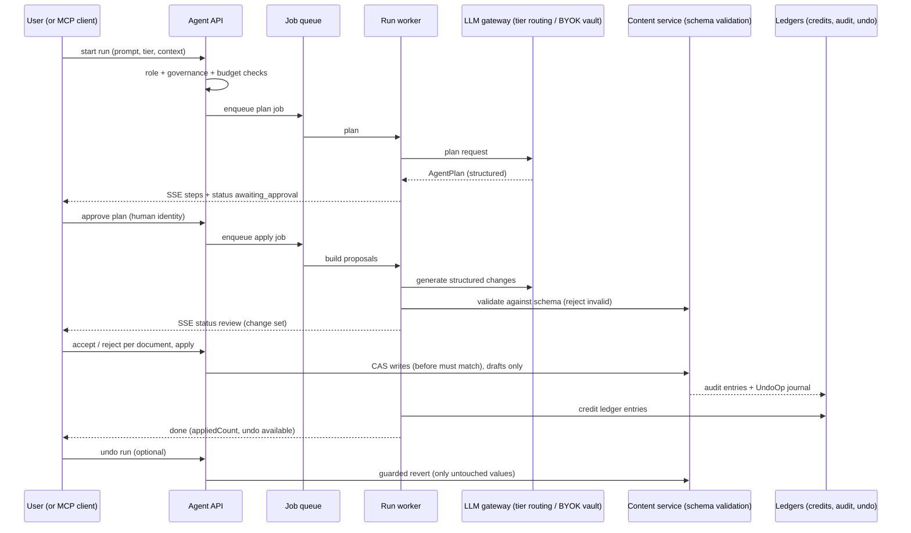

---

## 26. Real-time Collaboration

**Plain language:** the app already *feels* multiplayer — you see teammates' avatars in the top bar, their cursors on the page canvas, their initials on the row and even the paragraph they are editing, and you can leave Figma-style comments pinned to any field. The presence half is entirely an act; the comments half is closer to real than anything else in the app.

### What exists today

- **[SIMULATED] Presence engine** (`src/lib/workspace/presence-store.ts`, 362 lines). A local simulation standing in for the presence websocket: 3–4 real workspace members "join" a project, and a 3.6s tick (`PRESENCE_TICK_MS`) moves them between surfaces. Crucially, every emitted location points at **real data** — actual page paths, `SectionInstance` ids, entry ids, schema field names, and a `blockSeed` for per-paragraph placement — so the UX it specifies is precise: top-bar avatar stack + who's-here popover with jump-to, live canvas cursors (fractional coords within a section rect) + colored section outlines, pages/collection row avatars, Sanity-style field-level avatars, and per-paragraph avatars in the block editor. Behavior rules to preserve: reviewers never appear to edit (seat-aware), idle/active states, an accent palette distinct from the brand pink, engine runs only while subscribed. Ephemeral by design — nothing persists.
- **[EXISTING — partially real] Comments, two implementations.**
  1. **Visual-editor comment system** (`src/components/cms/editor/comments/CommentSystem.tsx`): field-anchored threads (`fieldKey` + optional text range + quoted text), cross-mode pins reachable from both the visual canvas and the form panel, reactions, @mentions (hardcoded `MEMBERS` list), image attachments via `FileReader`, edit/delete, resolve, threads panel. State is **component-local and in-memory** — a pure UX spec.
  2. **Supabase-backed comment layer** (`src/lib/comments/*` + `src/components/cms/comments/*`, mounted via `SurfaceCommentsShell` in the project route and `CommentSurfaceWrapper` in `EditorShell`). This one has a *real* backend path: zod-validated TanStack `createServerFn` endpoints over `comment_thread` / `comment_message` / `comment_reaction` tables (rich model: 14 surfaces, anchor kinds page/block/field/selection/element, priority, assignee, suggested edits, AI author kind + `AI_QUICK_ACTIONS`), `realtime.ts` subscribing to Supabase `postgres_changes` for cross-session sync, read-state and mentions functions, and a `comments-store.ts` UI store (filters incl. unread/priority/ai, pending pin, sidebar). **Caveat:** it runs with the service-role client and a hardcoded `DEMO_USER_ID` ("Phase 1 has no real auth" — the code says to swap in `requireSupabaseAuth`).

### Production plan

- **[RECOMMENDED] Presence: buy first.** The simulation defines the contract: rooms per project with sub-locations (page path, section id, entry id, field name, block index), cursor positions, seat metadata, idle timeout. **Liveblocks** (or PartyKit if you prefer owning the code) covers rooms, presence, and awareness out of the box and removes a websocket fleet + Redis presence TTL service from the critical path; the client hook surface (`useProjectPresence`, `peerLocationLabel`) stays, backed by Liveblocks presence instead of the RNG. Build in-house only if per-seat pricing at your member counts becomes material — the build is a ws gateway + Redis keyspace with TTL heartbeats, well-understood but real ops load.
- **[RECOMMENDED] Comments: consolidate on the Supabase-shaped model.** Retire the in-memory `CommentSystem` state by pointing its (excellent) UI at the `comment_thread` schema — the anchor model (`AnchorRef` with blockId/fieldPath/selection ranges) already covers the visual editor's field+range anchoring. Add real auth (`auth.uid()` + RLS by workspace membership) replacing `DEMO_USER_ID`; wire mention extraction (`mentions.functions.ts` exists) into the notification fan-out (section 23); keep text anchoring resilient by storing the quoted text and re-locating on render (the CSS-highlight approach already does this). Reactions, read-state, attachments (move to the media pipeline, not data URLs) all have functions scaffolded.
- **[RECOMMENDED] Co-editing: scope CRDT as a later phase.** Do *not* start with CRDTs. Phase 1: presence warnings ("Kiran is editing this field") + per-field last-write-wins with the compare-and-swap `before` semantics the agent already uses, plus version snapshots for recovery. Phase 2 (only if concurrent long-form editing becomes a top complaint): Yjs documents for the block editor's `DocValue` bodies specifically — the per-paragraph presence UX already anticipates it — leaving structured scalar fields on CAS. This sequencing keeps the risky tech off the v1 critical path.

---

## 27. Background Jobs

**Plain language:** everything that has to happen when nobody's browser tab is open. The demo fakes all of it in the client — including a real `setInterval` in the store that publishes scheduled content while the app is open. Production needs a proper job system.

### Job catalog

| Job | Trigger | Today | Notes |
|---|---|---|---|
| Scheduled publish sweep | cron, every minute | **[SIMULATED]** — `store.ts` line ~358 runs a client-side `setInterval` publishing due pages and entries | Claim rows with `scheduled_at <= now()` via `SELECT … FOR UPDATE SKIP LOCKED`; publishing must be idempotent per (entity, version) |
| Search index sync | event: publish/unpublish/delete; full reindex on schema/config change | **[SIMULATED]** — in-browser index in `search-store.ts` | Typesense upserts per SEARCH_PLAN; honors per-field searchable config; debounce bursts per project |
| Webhook delivery | outbox insert | **[MISSING]** | Retries + DLQ per section 24 |
| Agent runs | user action / roster schedule | **[SIMULATED]** timers | Durable multi-step jobs with SSE streaming (section 25); scheduled roster agents (`daily`, `weekly`, `on_publish`) become cron + event triggers that pause at credit caps |
| Page generators | wizard submit | **[SIMULATED]** | Batch job: N pages, checkpoint per page so a crash resumes, `batchId` already in the model |
| Media ingest | storage upload event | **[MISSING]** | Metadata, thumbnails, blurhash, EXIF strip, AV scan (section 22) |
| Transfer emails + expiry | transfer created; cron for expiry | **[SIMULATED]** accept-banner loop | Send invite email, expire unaccepted transfers, reset plans on accept |
| Notification digests | cron per user cadence | **[MISSING]** | Section 23 |
| Usage rollups | cron hourly/daily | **[SIMULATED]** seeded numbers | Aggregate CDN logs (bandwidth), storage inventory, API gateway counters, credit ledger into `usage_metric` rows; feed Stripe metered billing |
| Snapshot pruning | cron daily | **[MISSING]** | Version snapshots (compare/restore feature) pruned per plan retention; keep publish snapshots longer than autosaves |
| Domain verification / SSL | cron per pending domain | **[SIMULATED]** status flips | DNS polling, ACME issuance, flip `verifying → active`, notify |
| llms.txt / .md cache refresh | event: publish, serve-toggle | **[SIMULATED]** serializers run in-browser | Serializers are the contract (`md/serialize.ts`); regenerate or invalidate edge cache on change |
| Email sends (invites, auth, billing) | event | **[SIMULATED]** except Supabase auth mail | Queue with provider (Resend/Postmark) |
| Audit/export jobs | user request | **[MISSING]** | CSV exports (usage, audit, submissions) generated async, delivered via signed URL |

### Queue recommendation and rules

- **[RECOMMENDED] Tech.** The app deploys as Nitro on Vercel (serverless), which rules out a long-lived worker without extra infra. Two sound paths: (a) **Inngest or Trigger.dev** — durable step functions, cron, retries, concurrency keys, and event triggers as a service; fastest to ship and fits Vercel natively; (b) if you move the API to a container platform anyway (likely for the ws/agent workloads), **Postgres-backed queues (Graphile Worker / pg-boss)** keep ops surface minimal — one database, transactional enqueue with the outbox pattern for free. Recommend (a) for the first 6 months, revisit at scale. Avoid Redis/BullMQ as a *third* stateful system unless already running Redis for cache.
- **[RECOMMENDED] Idempotency + retry rules.** Every job carries an idempotency key (`{jobType}:{entityId}:{version}`); handlers must be safe to re-run (at-least-once delivery). Retries: exponential backoff with jitter; caps per class (webhooks 8 attempts/24h; LLM steps 3 attempts with model fallback; media transcode 2). DLQ with alerting after exhaustion; manual replay UI for webhooks and generators. Per-tenant concurrency limits (one workspace's 50-page batch must not starve others). Crons that scan tables (publish sweep, domain checks) must use row-level claim locks so horizontal workers do not double-fire. Job outcomes that matter to users (generator done, publish executed, webhook failing) emit events into the notification/audit paths.

---

## 28. Billing, Usage & Metering

**Plain language:** pricing is two layers — you pay for the workspace (the team container) and separately for each site's plan — plus paid seats by role and AI credit packs. The entire pricing model is fully coded and is the source of truth; what is missing is a payment processor, real metering, and server-side enforcement.

### What exists today

- **[EXISTING] `src/lib/billing/pricing.ts` (607 lines) — the canonical model.** Site plans free/basic/pro/team/enterprise with concrete limits (bandwidth, storage, API requests, AI credits, locales, form submissions; e.g. Pro = $35/$25yr, 500 GB, 1M API, 3,000 credits, 5 locales). Workspace plans free/company/agency ($25/$38 monthly) with team/enterprise flagged `managed` (contract billing). Seats: viewer + reviewer free/unlimited; editor $10, marketer $15, developer $20 (`SEATS`, `PAID_SEAT_ROLES`, `paidSeatsMonthly`). `PRO_SCALING` (add-on steps with ceilings: bandwidth +$9/250 GB to 5 TB, storage +$8/250 GB to 1 TB, API +$19/5M to 20M, credits +$16/2k to 20k, locales +$4 to 20) with `proScalingOptions` generating the dropdowns. `ADDONS` (incl. A/B testing $15/500k events), `CREDIT_PACKS` (1k/$8 … 15k/$90), `AI_ACTIONS` credit costs per tier, `tierAllowed` + `BASIC_BALANCED_ACTIONS` gating, `OVERAGE_PROMISE` ("never cuts off mid month… billed at the add on rate… hard cap available").
- **[EXISTING] Feature gating.** `FEATURE_MATRIX` (~38 rows) + `siteHas(plan, key)` + `firstPlanWith(key)` drive every locked panel (custom-domain Basic+, workflows Pro+, custom roles Team+, SSO Team+, SCIM Enterprise, ai-search Pro+, etc.). The `search` and `ai-search` keys exist and are wired to the search hub; a few rows (`branching`, `multi-region`) are forward-looking. `computeWorkspaceBill` produces the itemized bill (workspace + per-site + seats; managed contracts return contract lines).
- **[EXISTING] Types scaffolding.** `Plan`, `Subscription` (status incl. `past_due`), `Invoice`, `UsageMetric (workspaceId, metric, period, value, limit)` in `types.ts` — shaped for a real billing backend.
- **[SIMULATED] Everything monetary.** Plan buy/switch flows toast success and flip `workspacePlan`/`sitePlan` in the store (`setWorkspacePlan`, `setSitePlan`, audit-logged). Payment update is a toast. A `DodoCheckout.tsx` component exists in `src/components/cms/billing/` (checkout UI shell). Usage pages (project `settings/usage`, 785 lines; workspace usage; billing usage) render seeded numbers — `trafficSeries`-style deterministic data and `creditHistory` from `billing/demo.ts` (FNV-seeded per site, tier labels only). `usageState` (80% "approaching", never red) styles them.

### Production plan

- **[RECOMMENDED] Stripe structure.** One Stripe customer per **workspace**. One subscription with multiple items: workspace plan price; one item per project's site plan (use per-item metadata `project_id`; quantity 1 — adding/removing a site or changing its plan updates items with proration); seat items per paid role with `quantity = seat count`, updated on member/seat changes (Stripe prorates automatically — this is the "seat proration" requirement); Pro-scaling add-ons as additional recurring items. Credit packs = one-time PaymentIntents crediting the ledger. Overage = metered billing items (bandwidth GB, API calls, credits) reported by the usage pipeline, honoring the never-cut-off promise; the optional hard cap is an entitlement flag that switches enforcement from "bill" to "block". Team/Enterprise (`managed: true`) bypass self-serve: invoice-based via Stripe Invoicing or PO, plans set by an admin tool. Webhooks (`invoice.paid`, `customer.subscription.updated`, `payment_failed`) drive `Subscription.status` and entitlement refresh; `past_due` triggers dunning banners, not immediate lockout.
- **[RECOMMENDED] Entitlement service.** Mirror `FEATURE_MATRIX` keys into an `entitlement` resolver: `has(workspaceId | projectId, key)` evaluated **server-side** on every gated API path, cached (Redis/in-process with pub-sub invalidation on plan change). The client keeps `siteHas` for rendering locked panels, but it becomes advisory; the API is authoritative. Custom Enterprise overrides are per-workspace rows layered over the plan defaults.
- **[RECOMMENDED] Usage metering pipeline.** Sources: CDN access logs → bandwidth per project (hourly rollup job); object-storage inventory → storage; API gateway counters (per-key, per-project) → API requests; the agent credit ledger (section 25) → AI credits; form service → submissions. Rollups write `usage_metric` rows per period (the type exists) powering the usage pages with real numbers in the same shapes the seeded data uses today, plus 80% "approaching" notifications.
- **[RECOMMENDED] Enforcement points.** Upload-URL creation (storage quota, file size), API gateway (request quota → soft-bill or 429 on hard cap), locale creation (`locales` limit), form submission intake (Free's 50/mo), agent run start + generator preflight (credits/budget), publish path (plan features like workflows/custom stages), custom domain attach (`custom-domain`), seat invite (workspace plan seat rules). Every enforcement returns the same self-explaining gate copy pattern the UI already uses ("Available on Pro", link to plans).

---

## 29. Analytics

**Plain language:** every project has an analytics page with traffic charts, plus AI-era surfaces (how ready pages are for answer engines, AI traffic insights) and search analytics. Today the traffic numbers are convincingly fake; the search analytics are actually real, computed from queries you type in the playground.

### What exists today

- **[SIMULATED] Site analytics.** `w.$workspace.p.$project.analytics.tsx` (recharts area/bar charts, metric cards, shared `DateRangePicker` with compare mode). Data from `src/lib/seo/mock-data.ts` `trafficSeries(projectSlug, days)` — deterministic LCG seeded on the slug (stable per project, weekend dips, noise), anchored to a fixed date. Bounce/conversion metrics derive from the same generator. Per-page SEO cards and issue lists in the SEO section ride the same mock module.
- **[SIMULATED] AI-traffic / AEO surfaces.** `src/lib/seo/aeo.ts` computes eight AEO sub-scores heuristically from real page properties (meta lengths, section counts, schema presence) — "no real AI calls", explicitly marked for replacement. The FEATURE_MATRIX gates `analytics` (Basic+), `ai-traffic` (Pro+), `aeo-agents` (Team+).
- **[EXISTING] Search analytics — real.** `search-store.ts` keeps an actual query log (`logQuery`, capped at 500 rows, localStorage-persisted) and `useSearchAnalytics` aggregates top queries and zero-result queries. This is the one analytics surface whose data path is genuine end-to-end in the demo and whose shape ports directly to a server-side query log.

### Production plan

- **[RECOMMENDED] Event collection.** First-party, cookieless script on hosted sites (and an npm snippet for headless customers): pageview + web-vitals + custom conversion events, POSTed to an edge collector. For hosted sites you additionally get server-side logs for free — prefer log-based counting for bandwidth/AI-crawler metrics since it needs no JS.
- **[RECOMMENDED] Pipeline + storage.** Collector → queue → columnar store. Buy **Tinybird** (ClickHouse as a service) or run ClickHouse; Postgres will not survive per-pageview granularity at any real traffic. Rollup jobs (section 27) materialize daily/hourly aggregates per project/page/referrer; the dashboard API serves aggregates only. Keep the existing chart components and `DateRangePicker` — they bind to the same series shape `trafficSeries` emits.
- **[RECOMMENDED] AI traffic.** Classify by user-agent + referrer against a maintained list of AI crawlers and assistant referrers (GPTBot, ClaudeBot, PerplexityBot, chat.openai.com referrals, etc.) in the log pipeline; surface "AI visits", "pages cited", and tie into the llms.txt/markdown delivery story. Replace `aeoScores` heuristics with a real model pass run as a background job, cached per page version.
- **[RECOMMENDED] Search analytics.** Move the query log server-side at the search API (Typesense proxy logs query, hit count, project, ts; no user identity); same top/zero-result aggregations the store already computes. Zero-result queries feed a "content gaps" panel (and are good agent-skill fodder later).
- **Privacy.** Cookieless sessionization (daily rotating salted hash of IP+UA, then discard IP or truncate to /24), no PII in events, honor DNT/GPC, per-project data-residency awareness for Enterprise, configurable retention (raw events 90 days, aggregates indefinitely), and a DPA-ready processor list. Analytics must not undermine the CMS's own GDPR posture; being cookieless keeps hosted sites banner-free by default.

---

## 30. Audit Logs

**Plain language:** the audit log answers "who did what, when" for a workspace — a compliance requirement for Team/Enterprise buyers and the backbone of the agent trust story. The plumbing exists everywhere in the demo store; what is missing is a real actor identity and tamper-proof persistence.

### What exists today

- **[EXISTING] `recordAudit` plumbing.** Private `recordAudit(workspaceId, action, entityType, entityLabel?, entityId?)` in `src/lib/cms/store.ts` (~line 722) prepends `AuditLogEntry` rows to in-memory state; `recordAgentAudit(projectId, …)` is the exported agent wrapper resolving the owning workspace. `AuditLogEntry` in `types.ts`: `{ id, workspaceId, actorId, action, entityType, entityId?, entityLabel?, diff?, createdAt }` — note `diff` exists but nothing populates it.
- **[EXISTING] Coverage already wired** (verbatim action strings worth keeping as the catalog seed): workspace `workspace.created/settings.updated/workspace.plan_changed`; project `project.created/cloned/transferred_out/transferred_in/delivery_changed`, `hosting.mode_changed`, `site.plan_changed`; pages `page.created`, per-state `page.{state}`, `page.scheduled/published/restored`; `collection.created`, `component.created`; media `media.uploaded/removed`; entries `entry.{status}/deleted/pasted/published`; `member.invited`; `apikey.revoked`; workflow `workflow.updated/moved/requested`; agent `agent.changes_applied` / `agent.changes_reverted` (with run id as entity). Surfaced in the project Access page audit table; plan-gated by the `audit` feature row (Pro = "Log", Team/Enterprise = "Full").
- **[SIMULATED] Actor identity.** `actorId` is hardcoded to `CURRENT_ACTOR = "m_jane"` — a documented demo quirk that must not leak into production. In-memory only; reseeds on refresh.

### Production plan

- **[RECOMMENDED] Append-only audit service.** A dedicated `audit_log` table (or stream + table) with insert-only DB privileges for the application role — no UPDATE/DELETE grants; deletions happen only via the retention job under a separate role. For Enterprise "Full" tier, add per-row hash chaining (`hash = H(prev_hash + row)`) or periodic anchoring so tampering is detectable. Writes happen **in the server-side action layer** (the services that replace the store actions), inside the same transaction as the mutation where possible; never trust client-submitted audit events.
- **[RECOMMENDED] Actor model.** `actor: { type: user | agent | api_token | mcp_grant | system, id }` from the authenticated session/key — this cleanly covers humans, named roster agents, machine tokens, and external MCP clients, all of which the product already presents as distinct actors. Include request metadata (IP, user agent) for security-relevant events.
- **[RECOMMENDED] Coverage list** (superset of today's actions): **auth** — login success/failure, logout, password change, 2FA enroll/disable, session revoked, SSO events; **content** — create/update/delete/restore for pages, entries, sections, schemas, markdown files, brand kit versions; **publish** — publish/unpublish/schedule/cancel, staging promotions, snapshots restored; **roles & access** — member invited/removed/role changed, custom role created/edited/assigned, guest team changes, view-as does *not* log (it is a preview, not an action); **keys & webhooks** — created, revealed (one-time reveal is itself an auditable event), revoked, webhook endpoint added/paused/failing, MCP grant created/revoked; **agent** — run started, plan approved/rejected (with approver), changes applied/reverted, governance settings changed, BYOK key added/removed; **billing** — plan changes, seat changes, payment events; **platform** — domains added/verified/removed, transfers, share links created/disabled, exports performed.
- **[RECOMMENDED] Retention + access.** Per-plan retention (Pro 30–90 days "Log"; Team 1 year; Enterprise custom + SIEM export via S3/webhook streaming). Redaction rules: log *that* a field changed with a reference to the version snapshot, not secret values or full content bodies in the audit row (the unused `diff` field should hold structural summaries or snapshot pointers, never raw secrets). API: filterable by actor/action/entity/date with cursor pagination; the existing Access-page table becomes its consumer, and the CSV export runs as a background job (section 27).
## 31. Error Handling

### What exists today

**[EXISTING] Client error boundary.** `src/components/AppErrorBoundary.tsx` is a class-component boundary mounted at the root (`src/routes/__root.tsx`). It has three notable behaviors:

- **Chunk-load detection.** `isChunkLoadError()` matches five regexes (`Failed to fetch dynamically imported module`, `Loading chunk N failed`, etc.) so a stale-deploy chunk miss renders a "reload to update" experience instead of a generic crash. `src/components/ChunkErrorListener.tsx` listens for the same class of failures outside render.
- **Reporting hook.** `componentDidCatch` calls `reportLovableError` (`src/lib/lovable-error-reporting.ts`) with `boundary: "app_error_boundary"` and the component stack. This is the Lovable-export telemetry shim — it is the slot where a real error tracker plugs in.
- **Recovery affordances.** The fallback offers `reset` (clear boundary state, re-render) and `reload` (full `window.location.reload()`).

**[EXISTING] Server-side error recovery.** `src/lib/error-capture.ts` captures the last real `Error` via global `error`/`unhandledrejection` listeners with a 5s TTL, so `src/server.ts` can recover a stack trace after h3 has swallowed the throw into a generic 500. A workaround for a Nitro/h3 limitation; production replaces it with real server instrumentation, but know it exists when debugging SSR 500s during the transition.

**[EXISTING] Toast patterns.** Sonner is the single feedback channel — roughly 400+ `toast` call sites across `src/components` and `src/routes`. The house conventions (enforce these in production code review):

- Success toasts confirm mutations in plain sentence case ("Page published", "Key revoked").
- Destructive/irreversible actions never rely on a toast alone — they get a confirm dialog or an undo path first (blueprint cross-cutting rule 7).
- One-time secrets (API keys, `whsec_` webhook secrets) block dialog dismissal until copied; the toast is never the only carrier of a secret.
- Gates explain themselves inline ("Off in AI controls", "Available on Enterprise") rather than toasting an opaque failure.

**[SIMULATED] Failure paths.** Every store mutation is a synchronous in-memory write, so the demo has essentially no failure states: no network errors, rollbacks, or conflict handling. The "write failed" UX is unspecified — a real gap to design as APIs land.

### Production plan

**[RECOMMENDED] Error taxonomy.** Adopt a fixed set of machine-readable error codes shared between API, SDK, and UI:

| Class | HTTP | Examples | UI treatment |
|---|---|---|---|
| `validation_error` | 400 | bad slug, schema mismatch, invalid field value | Inline field errors; never a toast-only |
| `auth_required` / `session_expired` | 401 | expired Supabase JWT | Redirect to `/auth` preserving return URL |
| `forbidden` | 403 | role/capability/plan gate, governance block | Explanatory locked panel or disabled control with reason (matches demo copy patterns) |
| `not_found` | 404 | deleted page, revoked share token | Route-level empty state |
| `conflict` | 409 | slug taken, stale version on save, concurrent schema edit | Merge/refresh dialog; for content saves, offer Compare (the Compare-versions UI already exists) |
| `rate_limited` | 429 | API keys, agent runs, form submissions | Retry-After honored; toast with countdown |
| `payment_required` / `quota_exceeded` | 402 | AI credits exhausted, bandwidth cap | Upsell panel linking to plans (never red — usage rule) |
| `internal` | 500 | anything else | Toast + error id, auto-reported |

**[RECOMMENDED] API error contract.** Every non-2xx response returns one envelope:

```json
{
  "error": {
    "code": "conflict",
    "subcode": "stale_version",
    "message": "This page changed since you loaded it.",
    "requestId": "req_7f3a…",
    "details": { "field": "slug" },
    "retryable": false
  }
}
```

`requestId` is surfaced in the UI error footer and is the join key into tracing (§32). `retryable` drives client retry policy mechanically instead of by string-matching.

**[RECOMMENDED] Retry/undo UX rules.**

1. Reads: automatic retry with exponential backoff (3 attempts, jitter) via TanStack Query (already a dependency); stale-while-revalidate for lists.
2. Writes: never auto-retry non-idempotent mutations. Give every mutation an idempotency key (client-generated UUID) so a safe retry IS possible after a network timeout.
3. Optimistic updates only where the demo already behaves optimistically (toggles, reorder, publish state chips); rollback restores prior state and toasts the taxonomy message.
4. Undo stays a first-class product primitive: the agent undo journal (`UndoOp[]`), batch-bar Undo, and entry restore must survive the move to a backend — implement as server-side inverse operations recorded per run/mutation, not client memory.
5. Chunk errors after deploy: keep the existing detection, add a service-worker/versions endpoint so the app can prompt "A new version is available" proactively rather than on failure.

---

## 32. Observability

**[MISSING] today.** The demo has `reportLovableError` and console output; there is no logging, metrics, or tracing infrastructure. Everything below is [RECOMMENDED].

### Logging

- Structured JSON logs (pino) from every service; one log line per request with `requestId`, `workspaceId`, `projectId`, `actorId`, route, latency, status. Never log content bodies or secrets; log content IDs.
- Ship to a hosted sink (Axiom, Datadog Logs, or Grafana Loki self-hosted). Retention: 30 days hot, 13 months archived (audit-relevant events go to the audit log table, not just logs — the audit trail is product surface, §28 of the main handoff).

### Tracing and metrics

- OpenTelemetry SDK in the API from day one — auto-instrument HTTP, Postgres, Redis, queue consumers, and LLM calls (span per provider call with token counts as attributes). Export to Grafana Tempo/Honeycomb.
- Metrics via OTel → Prometheus/Grafana Cloud. RED metrics per endpoint plus the domain SLIs below.

### Key SLIs and SLOs

| SLI | Definition | Target (GA) | Alert threshold |
|---|---|---|---|
| Publish latency | publish action → content served on delivery API/CDN + `.md` twin + llms.txt updated | p95 < 10s | p95 > 30s for 10m |
| Search indexing lag | publish event → document visible in Typesense | p95 < 30s | any doc > 5m stale, or DLQ > 0 |
| Search query latency | delivery search endpoint | p95 < 150ms | p95 > 400ms for 10m |
| Agent run success | runs reaching `done`/`review` ÷ runs started (excl. user rejects) | > 97% | < 90% over 1h |
| Agent plan latency | prompt submit → plan card | p95 < 20s | p95 > 60s |
| Webhook delivery | delivered within retry budget ÷ enqueued | > 99.5% | DLQ growth alert |
| Content API availability | 5xx rate on delivery endpoints | 99.9% monthly | burn-rate alerts (2%/1h, 5%/6h) |
| Form submission success | accepted ÷ attempted (excl. spam/Turnstile fail) | > 99.9% | 5xx spike |
| App shell errors | error-boundary hits per 1k sessions | < 1 | 3x baseline |

### Alerting and ops hygiene

- PagerDuty/Opsgenie for the availability + data-loss class (delivery API down, index DLQ, webhook DLQ, DB replication lag). Slack-only for degradation class (latency SLO burn, agent success dip, LLM provider errors — with automatic provider-failover noted in the alert).
- Client-side: Sentry for browser errors (replaces `reportLovableError` — the call sites are already centralized, so this is a one-file swap), with release tagging so chunk-error rates per deploy are visible.
- Cost observability is a first-class metric: LLM spend per workspace per day (feeds both alerting and the credits/governance product surface — the AI controls page already promises budget enforcement, so the meter must be real).
- Weekly SLO review; every page (alert) gets a runbook link.

---

## 33. Testing Strategy

### Current state

**[EXISTING but not a test suite.]** There are no unit, integration, or E2E tests. The `tests/` directory holds three Python-driven browser scripts (`editor-flows.py`, `editor-perf.py`, `editor-surfaces.py`) — ad-hoc exploratory harnesses, not CI assets. TypeScript hygiene has a known trap: the repo carries **pre-existing `tsc` errors that the working habit filters out**. CI must not inherit that habit: fix or explicitly `// @ts-expect-error`-annotate the legacy errors in week one so `tsc --noEmit` gates merges at zero.

The single biggest testing asset in the codebase: **the module stores are pure, framework-light TypeScript** (`state` + `listeners` + `actions`), and the store actions ARE the API contract. That makes the demo unusually testable — and those tests transfer directly to the backend, because the backend must keep the same action semantics.

### The pyramid

**1. Store/unit tests (widest layer, start immediately).** Vitest (Vite-native, Bun-compatible). Priority targets, all pure and fast:

- `agent/runs-store.ts` + `simulate.ts`: `roleCanAct`, `clampTier`, governance blocks return `""`, `applyProposals` truthful appliedIds, `revertRun` only-removes-drafts / only-restores-unchanged-fields invariants.
- `billing/pricing.ts`: `siteHas`, `tierAllowed`, seat math — this is revenue logic.
- `md/serialize.ts`: `pageToMarkdown` per-section rules, `entryToMarkdown`, `llmsTxt` published-only + excluded paths. These serializers are declared "the production contract" — snapshot-test them exhaustively.
- `workspace/my-role.ts` + `capabilities.ts` + `custom-roles-store.ts`: cascade, `visibleTabs`, `canCompose`/`canPublish`, view-as clamping.
- `cms/pages-store.ts` (patch-function update semantics), `snapshots.ts`/`diff-text.ts` (compare/restore), `forms.store.ts` (SSR guards, spam split), `seo-audit.ts`, `search-store.ts` field-flag derivation.

Target: ~80% line coverage on `src/lib/**` within the first month; these same suites later run against the API-backed store adapters unchanged (swap the in-memory implementation, keep the assertions).

**2. API contract tests (middle layer).** As each store becomes a service (§44), publish its OpenAPI/tRPC schema and test with supertest/Pact-style suites: auth + tenancy isolation on every endpoint (cross-workspace access must 403/404), error-envelope conformance (§31), idempotency-key behavior, pagination, and the permission matrix (parameterized: 5 roles × endpoint). Schema-drift check in CI: generated client types must match the frontend's expectations.

**3. Playwright E2E of critical flows (narrow layer, highest confidence).** Run against a seeded ephemeral environment per PR (the demo seed inventory in the blueprint's Appendix B is the fixture spec). The critical-flow list:

1. **Auth**: email sign-up → onboarding question flow → lands in new workspace; guest door still works; session expiry redirects.
2. **Create project**: New Project wizard, headless vs managed fork; slug uniquification; nav tab set matches kind.
3. **Edit page (visual)**: open `/visual`, inline-edit hero text, per-section Design panel change (theme + spacing token), save; reload persists.
4. **Publish**: PublishMenu now/schedule/staging; status chip transitions; published content appears on delivery API + `.md` twin.
5. **Entry edit + blocks**: entry editor, slash menu (block insert, embed, table), image block with crop, Markdown paste, inline formatting; per-field save.
6. **Workflow request**: move entry between kanban stages; typed Review request with assignee + due date; approve; publish gate respected.
7. **Agent plan/apply/undo**: composer with @ chip + skill, plan card approve, proposal review apply-selected, done card, **Undo this run** reverts; audit line exists.
8. **Forms submit**: build form (phone field, Turnstile toggle), submit via public endpoint, row appears in submissions CRM; spam tab.
9. **Search config + query**: toggle field `searchable`, publish entry, query playground returns it; unpublish drops it (index-lag assertion with timeout).
10. **Share link**: create `/p/$token`, open logged-out read-only sandbox; clone-toggle on → clone works; revoke kills the link.
11. **Transfer**: initiate project transfer, accept-banner loop in recipient workspace, plan resets applied.
12. **Billing gate**: downgrade site plan → gated features render locked panels (custom roles below Team, Balanced tier clamp); upgrade unlocks; seat count changes invoice preview.

Add mobile-viewport runs for flows 1, 3, 5 (device-caps allow-lists are product behavior).

**4. Visual regression for the editors.** The visual editor canvas, section library previews, Design panel output, block editor, and dark mode are the product's differentiation and the most regression-prone surfaces. Playwright screenshot testing (or Chromatic on Storybook stories for `SECTION_DEFS` renders) across light/dark × desktop/tablet/mobile. Gate: no unreviewed pixel diffs on `SectionSystem` renders and the preview-canvas-stays-light rule.

**CI policy.** Every PR: typecheck (zero errors), eslint, unit suite (< 2 min), contract suite, changed-flow E2E; nightly: full E2E matrix + visual regression + a11y scan (axe) on the 12 flows.

---

## 34. DevOps & Deployment

### Today

**[EXISTING]** Bun + Vite 7 + TanStack Start, Nitro with Vercel preset (`NITRO_PRESET=vercel bun run build` → `.vercel/output`), deployed at bcms-demo.vercel.app with `X-Robots-Tag: noindex` on every response via `src/server.ts`. **[SIMULATED]** everything stateful: in-memory stores reseed on reload; the only real external service is Supabase email auth. There is no CI pipeline, no environments, no migrations, no secrets management beyond Vercel env vars.

### Production plan [RECOMMENDED]

**Environments.** `dev` (per-engineer, docker-compose: Postgres + Redis + Typesense + MinIO), `preview` (per-PR: Vercel preview frontend + API in an ephemeral namespace with a seeded DB — the demo seed becomes the fixture), `staging` (prod-shaped, integrations in test mode), `production`. Do not conflate the product's "publish to staging" (a content state) with the org's staging (an infra tier).

**Topology.** Keep the frontend on Vercel (it already works, and TanStack Start SSR is Vercel-native via Nitro). Run the API + workers on a container platform (Fly.io/Render early; ECS/Fargate or GKE when SOC 2 demands VPC control). Postgres and Redis managed (Neon/RDS, Upstash/ElastiCache). Typesense on dedicated VMs or Typesense Cloud (§36).

**IaC.** Terraform from the first provisioned resource (modules: network, db, redis, search, queue, object storage, DNS/cert automation for customer domains). The customer-domain pipeline (verify TXT → issue cert via Let's Encrypt/Cloudflare for SaaS) is itself infrastructure-as-code — the demo's domain/SSL status flow is the UX spec for it.

**CI (GitHub Actions).** Pipeline per PR: install (bun, cached) → typecheck → lint → unit → build → contract tests → preview deploy → changed E2E → visual diff. Merge to main auto-deploys staging; production is a manual promotion with a release tag. Trunk-based, no long-lived branches.

**DB migrations.** Versioned SQL migrations (Drizzle Kit or Atlas), forward-only, expand-and-contract pattern for zero-downtime (add column → dual-write → backfill → cut reads → drop). Migrations run as a gated CI step before app rollout; every migration ships with a rollback note. Content schema changes (the customer-facing schema builder) are NOT DB migrations — they are versioned rows in a `schemas` table; never let customer models generate DDL.

**Feature flags.** A flags service (Unleash self-hosted or PostHog flags) wired the same way plan gates already work (`siteHas` is effectively a flag evaluator — reuse the pattern). Every risky subsystem (real LLM provider, realtime, search) ships dark behind a flag, enabled per-workspace, so the simulated implementation can remain the fallback during rollout.

**Secrets.** Doppler or AWS Secrets Manager; no secrets in Vercel env for the API tier; BYOK customer keys encrypted at rest with envelope encryption (KMS), never logged, never returned after write (the one-time-reveal UX is already the product rule — mirror it in the API).

**Rollback.** Frontend: instant Vercel rollback to prior deployment (chunk-error handling in §31 covers the client skew window). API: keep N-2 images, `helm rollback`/platform revert < 5 min, with the expand-and-contract rule guaranteeing the previous app version still runs on the current schema. Data: PITR on Postgres (7–30 days), pre-deploy snapshot on migration releases. Define rollback triggers in the deploy checklist (5xx > 2%, publish-latency SLO burn, auth failures).

---

## 35. Recommended Tech Stack

| Layer | Keep / Choose | Rationale (one line) |
|---|---|---|
| Frontend framework | **Keep** TanStack Start + React 19 + Vite | Frontend is complete and is the spec; rewriting it is pure risk with zero product gain. |
| UI system | **Keep** Tailwind v4 tokens + Radix/shadcn + sonner + dnd-kit | `DESIGN_SYSTEM.md` is authoritative; components are production quality. |
| Data fetching | TanStack Query (already a dependency) as the store-adapter layer | Stores become Query-backed adapters with identical action signatures — the strangler seam (§44). |
| API | **Node/TS with tRPC for the app API + Fastify REST for public delivery/forms/MCP** | tRPC gives end-to-end types matching the store-action contract fastest; public surfaces need stable REST + OpenAPI. (Nest is viable if the team prefers structure; avoid mixing three frameworks.) |
| Database | PostgreSQL 16 (Neon → RDS) | Relational tenancy + JSONB for `SectionInstance[]`/entry fields; RLS as a second tenancy fence. |
| Cache / ephemeral | Redis (Upstash → ElastiCache) | Sessions edge cache, rate limits, presence, queue backend. |
| Queue / jobs | **BullMQ on Redis now; Temporal only if/when agent runs need durable multi-step orchestration** | Publish fan-out, indexing, webhooks, generators are simple queues; don't buy Temporal's ops cost on day one. |
| Search | Typesense (self-hosted first) | Already the researched, decided architecture in `SEARCH_PLAN.md` (scoped keys, field-level index, hybrid/vector built in). |
| Object storage / CDN | Cloudflare R2 + Cloudflare CDN (+ image resizing) | Zero egress fees matter for a bandwidth-metered CMS; images/`.md` twins/llms.txt served from edge. |
| Billing | Stripe (Billing + metered usage) | Two-layer plans + seats + AI-credit metering map to subscriptions + usage records; never build this. |
| LLM providers | Anthropic + OpenAI behind an internal gateway; tiers stay Lite/Balanced/Max | Product rule hides model names; gateway does routing, fallback, BYOK injection, and per-workspace cost metering. |
| Realtime | **Liveblocks** for presence/comments/live cursors; plain WebSocket (or Supabase Realtime) for notifications/run streaming | Presence UX is already fully specced; Liveblocks buys it in weeks instead of quarters (§36). |
| Auth | Supabase Auth (keep) + its SSO/SAML for enterprise | Already integrated and real; adds OAuth + 2FA + SAML without a migration. |
| Email | Resend (transactional) + React Email templates | Invites, transfer accept-loop, workflow requests, notification digests. |
| Anti-spam | Cloudflare Turnstile | Already in the forms builder spec as an option. |
| Observability | OTel + Grafana Cloud (or Datadog) + Sentry | §32. |

---

## 36. Build vs Buy

| Capability | Options | Recommendation + reasoning |
|---|---|---|
| Search | Typesense self-hosted vs Typesense Cloud vs Algolia | **Typesense self-hosted** (3-node HA at scale; single node pre-GA), migrate to Typesense Cloud only if ops burden bites. `SEARCH_PLAN.md` already rejected Algolia (proprietary, replica-per-sort, cost curve) and the scoped-key/per-project-collection design assumes Typesense semantics. RAM is the cost driver — the per-field `searchable` flag is the control knob. |
| Auth | Keep Supabase vs Clerk vs custom | **Keep Supabase.** It is the only real backend today; email flows work in prod. Clerk is nicer DX but forces a user migration for zero user-visible gain; custom auth is disqualified pre-SOC 2. Add Supabase SAML/SSO for the enterprise tier; revisit only if pricing at 10k+ seats hurts. |
| Realtime presence/comments | Build (ws + CRDT) vs Liveblocks | **Buy Liveblocks** for presence, cursors, and comment threads — the simulated engine (`presence-store.ts`, field/paragraph avatars, canvas cursors) is a precise spec that maps 1:1 to Liveblocks primitives; building CRDT infra is a 2-quarter distraction. Build the thin notification/run-streaming socket in-house (it's trivial). Exit risk: keep the presence adapter behind the store interface so a later swap is contained. |
| Billing | Stripe vs build | **Stripe, non-negotiable.** Two-layer plans = two subscription items; seats = quantity; AI credits = metered usage records; invoices/payment UI already sketched in the demo maps to Stripe-hosted surfaces + API. Build only the entitlement layer (`FEATURE_MATRIX`/`siteHas` already is it). |
| Analytics (customer-facing site/search analytics) | Build vs PostHog vs Plausible | **Hybrid:** embed **Plausible (self-hosted) or a ClickHouse pipeline** for customer site analytics served into the existing charts; **PostHog** for our own product analytics + flags. Don't hand-roll event ingestion; do own the presentation (the analytics pages exist and are the spec). Search analytics come free from Typesense query logs → ClickHouse. |
| Media pipeline | Build vs Cloudinary vs Mux | **R2 + Cloudflare Images for images (buy transformation, own storage); Mux for video if/when video delivery becomes real** (demo only stores video as library items today). Cloudinary full-suite is expensive at CMS bandwidth scale; the crop dialog already produces client-side canvas exports, so server needs are transform-on-delivery only. |
| Email | Build (SES raw) vs Resend/Postmark | **Resend** (or Postmark). Deliverability, templates, and webhook events for bounce handling; SES-raw saves pennies and costs deliverability debugging. |

---

## 37. Cost Estimation

All figures are monthly USD, assumption-driven; label and revisit each at every scale step. **Assumptions:** average project = 60 pages/entries, 500MB media, 30k content-API requests/mo, 20GB CDN egress-equivalent (mostly free via R2/Cloudflare); 10% of projects use search actively; average workspace runs 300 AI credits/mo ≈ 25 agent actions; blended LLM cost per action ≈ $0.03 (Lite ~ $0.005, Balanced ~ $0.03, Max ~ $0.15 at mid-2026 token prices, mix 60/30/10).

### Infrastructure

| Line | 100 projects (~40 ws) | 1,000 projects (~350 ws) | 10,000 projects (~3,000 ws) | Assumptions |
|---|---|---|---|---|
| Compute (API + workers) | $150 (2× small containers + workers on Fly/Render) | $800 (6–8 containers, autoscale) | $5,000 (ECS/GKE, ~30 vCPU steady + burst) | ~50 req/s per vCPU on Fastify/tRPC |
| Vercel (frontend SSR) | $20 (Pro) | $250 | $1,500 (Enterprise-ish usage) | SSR invocations scale with editor sessions, not delivery traffic (delivery API bypasses Vercel) |
| Postgres | $70 (Neon scale) | $400 (2 vCPU/8GB + replica) | $2,500 (HA cluster + replicas + PITR) | Content rows are small; JSONB sections dominate |
| Redis | $10 | $80 | $500 | Queues + rate limits + sessions |
| Typesense RAM | $50 (1 node, 4GB — ~10 active search projects × ~50MB index) | $350 (3-node HA, 8GB each) | $2,000 (3× 32GB) | ~50MB RAM per active search project (field opt-in keeps this down); RAM is THE search cost lever |
| Storage + CDN (R2 + Images) | $30 (50GB store, 2TB egress free via CF) | $250 (500GB + image transforms) | $2,000 (5TB + transforms) | R2 $0.015/GB-mo, zero egress; Cloudflare Images per-delivery pricing |
| LLM spend (platform-billed) | $360 (40 ws × 300 credits ≈ 12k actions × $0.03) | $3,150 | $27,000 | The single most volatile line; BYOK shifts it to customers; credits pricing must clear ~3× this cost |
| Third parties (Liveblocks, Resend, Sentry, Grafana, PostHog, flags) | $200 (mostly free/starter tiers) | $1,200 (Liveblocks ~$500 dominates) | $7,000 (Liveblocks MAU-priced ~$3–4k, observability ~$2k) | Liveblocks priced per monthly-active collaborator |
| Supabase Auth | $25 | $100 | $600 | MAU-based |
| **Infra total** | **≈ $915/mo** | **≈ $6,600/mo** | **≈ $48,000/mo** | Infra cost per project falls from ~$9 to ~$4.8 with scale; LLM ≈ 40–55% of it |

Stripe fees (~2.9% + 30¢) are COGS on revenue, not listed above.

### Team burn

**Assumption:** fully-loaded cost (salary + taxes + tools) ≈ $18k/mo senior, $14k/mo mid, blended $16k.

| Phase | Team (see §38) | Monthly burn |
|---|---|---|
| M0–M2 (foundations) | 4 eng (2 sr BE, 1 sr FE, 1 mid full-stack) + design 0.5 | $72k |
| M3–M6 (to GA) | 6 eng (+1 AI/infra, +1 mid FE) + 0.5 design + 0.5 PM | $112k |
| Post-GA steady | 6–8 eng + support 1 | $120–145k |

Total to GA (≈7 months): **≈ $650–700k engineering + < $30k cumulative infra.** Team cost dwarfs infra until ~5,000 projects; optimize for build speed, not cloud bills.

---

## 38. Engineering Estimates

**Assumptions:** engineer-week = 1 senior-equivalent focused week; estimates include tests + review, exclude PTO; the frontend existing is why these numbers are small — every epic is "backend + wire-up," not "design + build UI."

| Epic | Scope highlights | Eng-weeks |
|---|---|---|
| Foundations: auth + tenancy | Postgres schema v1, Supabase JWT middleware, workspace/project/member/seat model, RLS, view-as clamps server-side | 6 |
| Content + publishing | Pages/entries/collections CRUD, draft/publish/schedule/staging states, snapshots + compare/restore, delivery API + `.md` twins + llms.txt | 10 |
| Editors parity (wire-up) | Store→Query adapters for visual editor, block editor, autosave, conflict handling (409 UX), section-system unification decision implemented | 12 |
| Schema | Unified schema service (merge `schema-store.ts` ModelField with `types.ts` SchemaField), versioning, validation, per-field flags (searchable, localized) | 6 |
| Media | R2 upload (signed URLs), library metadata, transforms via CF Images, crop persistence, picker wiring | 4 |
| Workflows | Stages, kanban, typed requests, assignments, due dates, publish gates, notification fan-out | 5 |
| Agent / AI | LLM gateway, run state machine server-side (plan/approve/apply/undo), proposals + undo journal persistence, skills ×6, generators ×2, credits metering, governance enforcement, BYOK vault | 14 |
| MCP server | Endpoint, tool catalog mirroring store actions, scoped one-time keys, per-project grants, governance + staging-only-writes enforcement | 4 |
| Search | Typesense provisioning, index-on-publish workers + DLQ, scoped key minting, delivery search endpoint, hosted widget + headless SDK, playground/analytics wiring | 7 |
| Forms | Public submission endpoint, Turnstile verify, spam pipeline, submissions API, integrations panel (webhook first), embed snippets | 4 |
| Billing | Stripe subscriptions (two-layer), seats, AI-credit metered usage, entitlement sync to `FEATURE_MATRIX`, invoices/payment surfaces, dunning | 6 |
| Collab / realtime | Liveblocks presence + comments migration, notification socket, run streaming (SSE) | 5 |
| Analytics + audit | Event ingestion, site analytics pipeline, usage metering (bandwidth/storage/API), audit log persistence + Access page | 5 |
| Hardening | Security review, rate limits, pen-test fixes, load tests, SOC 2 groundwork, backup/restore drills, docs | 6 |
| **Total** | | **≈ 94 eng-weeks** |

**Team shape:** 4 engineers M0–M2, 6 from M3 (2 senior backend, 1 senior frontend, 1 AI/infra, 2 mid full-stack). 94 weeks ÷ ~5 effective parallel engineers ≈ 19 calendar weeks of build + integration overhead → **GA at M6–M7.**

**Phased timeline:** M0 foundations + content CRUD → M1 editors wired + publishing + media → M2 private alpha (5 design partners) with schema + workflows → M3 agent/AI real + billing → M4 search + MCP + forms → M5 collab + analytics + hardening → M6 open beta → M6.5–M7 GA.

---

## 39. Implementation Roadmap

### Phase diagram

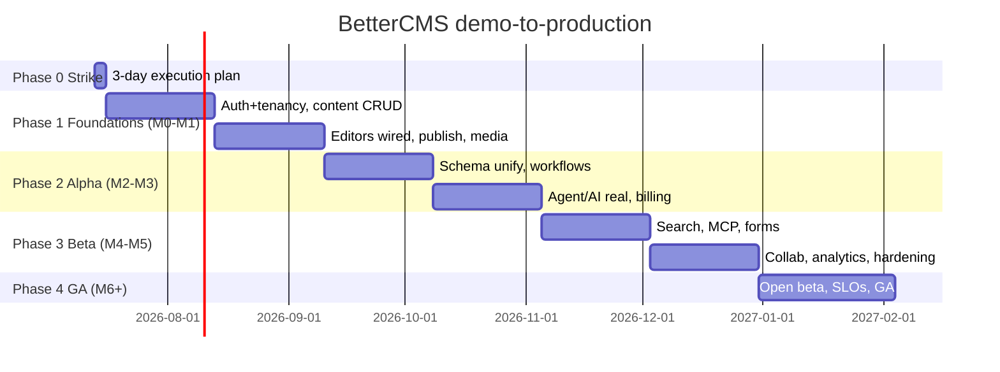

### THREE-DAY EXECUTION PLAN (strike team: 2–3 senior engineers)

What ships in 3 days — the skeleton every later week hangs off. Exit criterion for each day is demoable, not aspirational.

**Day 1 — Repo split + schema v1.**
- Split into a monorepo (`apps/web` = the existing app untouched, `apps/api`, `packages/contracts` for shared types lifted from `src/lib/cms/types.ts` and Appendix A, `packages/db`).
- Postgres schema v1 migrated and seeded: `users, workspaces, workspace_members(seat_role), projects(kind, site_plan), pages(sections JSONB, state), collections, schemas(fields JSONB, version), entries(fields JSONB, state), media, audit_log` — with `workspace_id` on every row and RLS policies written (not yet enforced-only-path). **Explicitly exclude demo IDs** (`ws_acme`, `m_jane`, slug quirks) — seed via a script that generates fresh UUIDs.
- Exit: `docker compose up` gives Postgres+Redis+API healthcheck; migration + seed run in CI.

**Day 2 — Auth + tenancy skeleton.**
- Supabase JWT verification middleware in the API; `me` endpoint; workspace membership resolution → effective role (port `my-role.ts` cascade server-side, including view-as clamp-down-only).
- Tenancy guard on every route (workspace scoping + 404-on-foreign-id contract test).
- Exit: contract tests prove cross-tenant isolation; the web app can log in against the API and list real workspaces/projects.

**Day 3 — Content CRUD for the unified model + deploy pipeline.**
- CRUD endpoints for projects, pages (PageDoc + `SectionInstance[]` as the canonical page model — the unification decision is made here, in code: `pages-store` shape wins, `types.ts Section` marked legacy), collections, entries. Patch-function update semantics preserved via JSON-merge-patch.
- One store adapter proven end-to-end: `pages-store.ts` backed by TanStack Query against the API behind the same `pagesActions` signatures — the strangler seam demonstrated.
- CI/CD: GitHub Actions (typecheck with legacy errors triaged, lint, unit, build), preview deploys for web, API deploy to staging on merge.
- Exit: create a page in the real UI → row in Postgres → survives reload. The demo's number-one lie (reload amnesia) is dead on one surface.

### 30/60/90-day milestones

**Day 30:** all central-store domains (workspaces/projects/pages/collections/entries/members/domains-metadata) persisted; visual editor + Pages hub fully API-backed; publish/schedule real with snapshots; media upload to R2; audit log persisted; preview environments seeded per PR; unit suite ≥ 60% of `src/lib`.

**Day 60:** entry block editor + schema builder on the unified schema service; workflows + typed requests + notifications (email via Resend); Stripe subscriptions live in test mode with entitlements driving the existing gates; agent runs execute against a real LLM behind the gateway for 2 skills (draft, backfill-SEO) with server-side undo journal; private alpha with 5 design partners.

**Day 90:** all 6 skills + both generators real; credits metering + governance enforced server-side; Typesense indexing on publish + playground live; MCP endpoint with scoped keys; forms public endpoint + Turnstile; Liveblocks presence on the visual editor; E2E suite covers the 12 critical flows; beta gate review against SLOs.

---

## 40. Engineering Ticket Breakdown

Epics: **FND** foundations, **CNT** content, **EDT** editors, **AI** agent, **BIL** billing, **SRC** search, **OPS** devops. The first 20 tickets (estimates in ideal engineer-days; dependencies by id):

| ID | Title | Description | Acceptance criteria | Est | Deps |
|---|---|---|---|---|---|
| FND-1 | Monorepo split + contracts package | Restructure to `apps/web`, `apps/api`, `packages/contracts` (types lifted from `src/lib/cms/types.ts` + blueprint Appendix A), `packages/db`. Web app builds unchanged. | Web deploys from monorepo with zero behavior change; contracts imported by both apps; CI green | 2 | — |
| OPS-1 | CI pipeline + typecheck zero-baseline | GitHub Actions: install/typecheck/lint/unit/build. Triage the known pre-existing tsc errors (fix or annotated suppress) so `tsc --noEmit` = 0. | PR blocked on any new tsc/lint error; pipeline < 8 min; suppressions carry owner + ticket | 3 | FND-1 |
| FND-2 | Postgres schema v1 + migrations | Drizzle schema + first migration for users, workspaces, members(seat_role), projects, pages, collections, schemas, entries, media, audit_log; `workspace_id` everywhere; RLS policies. | Migration + rollback run in CI; ERD generated; no demo IDs anywhere | 3 | FND-1 |
| FND-3 | Seed script (demo parity, clean IDs) | Generate the Appendix-B seed inventory (5 workspaces, projects, 5-page site, 3 collections, members) with fresh UUIDs, parameterized per environment. | Preview env boots with full demo parity; re-runnable idempotently; `ws_acme`/`m_jane` grep = 0 hits | 2 | FND-2 |
| FND-4 | Auth middleware (Supabase JWT) | Verify Supabase JWTs in API, `GET /me`, session refresh handling, guest mode explicitly unsupported server-side (demo-only flag stays client-side). | Valid token → user resolved; expired → 401 envelope; contract tests | 2 | FND-2 |
| FND-5 | Tenancy + effective-role resolution | Membership lookup, seat roles, port `my-role.ts` cascade + view-as clamp server-side; scoping guard on all routes. | Cross-workspace access 404s (test matrix 5 roles × foreign/own); view-as can never elevate | 3 | FND-4 |
| FND-6 | Error contract + request IDs | Implement §31 envelope (code/subcode/message/requestId/retryable) as API-wide error handler; requestId into logs. | All non-2xx conform (contract test); requestId round-trips to client and logs | 1 | FND-4 |
| CNT-1 | Projects + workspaces CRUD API | Endpoints matching `workspaceActions`/`projectActions` (create w/ slug-uniquify, update, slugTaken); audit rows on mutation. | Store-action parity tests pass; slug collision returns 409 `slug_taken`; audit row per write | 2 | FND-5 |
| CNT-2 | Pages CRUD (canonical PageDoc model) | Pages API on the `pages-store` shape (`sections: SectionInstance[]`, states, seo fields, staged/batch fields); JSON-merge-patch update preserving patch-function semantics; DECISION RECORD: `types.ts Section` system marked legacy. | CRUD + list + patch tests; state transitions validated server-side; decision doc merged | 3 | CNT-1 |
| CNT-3 | Pages-store strangler adapter | Rewrite `src/lib/cms/pages-store.ts` internals over TanStack Query against CNT-2, keeping `usePages`/`pagesActions` signatures byte-compatible. | Visual editor + Pages hub work with zero component changes; reload persists; existing unit tests pass against adapter | 3 | CNT-2 |
| CNT-4 | Collections + entries CRUD | Collections/entries API per `entryActions` + entry fields JSONB, status/scheduledAt/SEO fields; pagination. | Entry editor round-trips all 15 example-schema field types; list pagination contract | 3 | CNT-1 |
| CNT-5 | Schema service v1 (unified) | One `schemas` service merging `ModelField` (schema builder) and `SchemaField` (types.ts): superset model, versioned, validation on entry write. Migration map for both demo shapes. | /schema builder and entry editor read the same schema; entry writes validated; version increments; unification doc updated | 4 | CNT-4 |
| CNT-6 | Publish/schedule/staging pipeline | Server-side state machine (draft/published/modified/scheduled/archived + staged), snapshot on publish, scheduler worker (BullMQ), per-item publish parity with PublishMenu. | Publish < 10s p95 to delivery API; schedule fires ±60s; snapshot retrievable; unpublish/cancel paths | 4 | CNT-2, OPS-2 |
| OPS-2 | Queue infra + worker skeleton | Redis + BullMQ, worker app, DLQ pattern, retry policy, queue metrics exported. | Jobs retry w/ backoff; DLQ alert fires in staging test; dashboard panel | 2 | FND-2 |
| CNT-7 | Delivery API + md twins + llms.txt | Public read endpoints for published content; port `md/serialize.ts` server-side; `GET /{path}.md`, llms.txt (auto/custom + exclusions), llms-full; content negotiation; drafts never served. | Serializer snapshot tests match client lib byte-for-byte; draft exclusion test; cache headers + purge on publish | 4 | CNT-6 |
| EDT-1 | Autosave + conflict UX | Debounced autosave for visual + entry editors with idempotency keys and version checks; 409 → refresh/Compare dialog per §31. | Two-tab edit conflict shows dialog, no silent data loss; autosave ≤ 2s after idle; offline queue survives reload | 4 | CNT-3, CNT-4 |
| CNT-8 | Media upload (R2 signed URLs) | Signed-URL upload flow, media rows, folder/tags/favorites metadata, crop persistence (store crop params + derived render), picker wiring. | Upload → CDN URL served; crop round-trips; library filters work against API | 3 | CNT-1 |
| BIL-1 | Stripe foundation + entitlements | Stripe customers/subscriptions for workspace + site plans (test mode), webhook sync into an entitlements table read by the existing `siteHas`/`FEATURE_MATRIX` gates. | Plan change in Stripe flips gates in-app < 1 min; webhook replay-safe; seat quantity syncs | 4 | FND-5 |
| AI-1 | LLM gateway + runs persistence | Provider gateway (Anthropic/OpenAI, tier→model map hidden per product rule, cost capture per call), `agent_runs`/`proposals`/`undo_ops` tables, run state machine server-side, SSE streaming to the existing dock UI. | One skill (backfill-SEO) runs real end-to-end: plan → approve → apply → **undo works**; credits + audit recorded; provider failover tested | 5 | CNT-4, OPS-2 |
| OPS-3 | Observability baseline | OTel tracing + pino logs + Sentry (replacing `reportLovableError` call sites) + Grafana dashboards for the §32 SLIs; alert rules for availability class. | Trace per request joinable by requestId; publish-latency + queue-DLQ alerts firing in staging chaos test; Sentry receives boundary errors with release tags | 3 | FND-6 |

(Next in queue, for context: SRC-1 Typesense provisioning + index-on-publish, AI-2 remaining skills, EDT-2 Liveblocks presence, BIL-2 credit metering, MCP-1 endpoint + scoped keys.)

---

## 41. Open Questions & Founder Decisions

Decisions only the founder can make — engineering will default to the bracketed recommendation if unanswered by M1:

1. **Pricing enforcement strictness.** Hard-block at limits (publishes fail at bandwidth/credit caps) vs soft-overage with billing? Affects metering architecture and the "usage never red" UX. [Default: soft caps + grace + email, hard block only on AI credits since marginal cost is real.]
2. **Self-host story.** Is BetterCMS ever self-hostable/open-core? Decides whether services stay portable (no Vercel/Liveblocks lock-in) and whether the license conversation starts now. [Default: cloud-only through GA; keep Docker-compose dev parity as a cheap option-preserver.]
3. **AI provider defaults + BYOK policy.** Which providers back Lite/Balanced/Max, is BYOK available below Enterprise, and do BYOK runs still consume (discounted) credits for margin? The demo says BYOK runs bill the key and credits=0 — confirm that's the commercial intent. [Default: Anthropic primary + OpenAI fallback; BYOK Pro+, credits=0 as specced.]
4. **Hosted rendering strategy for managed ("Cloud") sites.** The demo sells a managed kind with hosting/repo/build settings, but no renderer exists. Build a first-party rendering runtime (big, ongoing cost), partner (deploy-to-Vercel/Netlify templates), or ship headless-first and defer hosted? This is the single largest unscoped epic — it is NOT in the §38 estimate. [Default: headless-first GA; managed sites = starter templates + one-click Vercel deploy, first-party hosting post-GA.]
5. **SLAs.** What uptime/support commitments back the Enterprise tier, and when do we pay for the infra those imply (multi-region, 24/7 on-call)? [Default: 99.9% delivery-API SLA at GA, no editor SLA until M9.]
6. **Data residency.** EU-resident hosting at launch or later? Drives DB/storage region architecture now vs painful retrofit. [Default: single region (US) + EU at first enterprise pull; design IDs/storage keys region-prefixed from day one.]
7. **Migration of the demo content model.** Do design partners start on the unified schema (CNT-5), or do we build importers for both legacy demo shapes? Also: which demo seed content (Northwind section workspace) is product vs disposable? [Default: unified only; demo seeds are fixtures, never migrated.]
8. **Which editor system wins.** The blueprint's two-section-system trap needs a product ruling: the `pages-store` + `SectionSystem` model (visual editor, all projects) is engineering's recommended canonical model; the `types.ts Section` Content-tab workspace (Northwind-only, Layout/Style/SEO/Advanced tabs) either gets rebuilt on top of it or retired. Retiring it deletes a whole demoed surface — founder call. [Default: canonicalize `SectionSystem`; rebuild the Content-tab UX as a view over it in v2.]
9. **Guest door in production.** "Continue without signing in" is a demo device; does any anonymous/trial mode survive to production, and with what data lifetime? [Default: replaced by a real free tier + demo sandbox workspace.]

---

## 42. Risks

| Risk | Likelihood | Impact | Mitigation |
|---|---|---|---|
| **Editor unification stalls** (two section systems, two schema systems; decision drifts and both get half-ported) | High | High — double maintenance forever, migrations for design partners | Decide in code by Day 3 (CNT-2/CNT-5 decision records); delete or view-model the losers by M2; founder ruling #8 forced early |
| **Search index staleness** (the Contentful→Algolia silent-stale failure mode SEARCH_PLAN names as the anti-goal) | Medium | High — silently wrong search erodes trust invisibly | Index only on publish events through the queue with DLQ + per-collection "last synced" surfaced in admin (already specced); staleness SLI + alert (§32); nightly full-reindex reconciliation job |
| **LLM cost blowout** (credits priced before real token costs known; generators create 50-page batches) | Medium | High — negative gross margin on AI tiers | Cost capture per call from AI-1 day one; per-workspace budgets already exist in governance — enforce server-side; batch caps (50/batch is already product law); re-price credits at M3 with 30 days of real data |
| **Realtime scope creep** (presence spec is rich: cursors, per-paragraph avatars, field locks → team builds CRDT infra) | High | Medium — quarters lost to infra without product delta | Buy Liveblocks (§36); hard rule: no in-house OT/CRDT before GA; presence behind the store interface so scope stays swappable |
| **Single-dev bus factor** (entire demo was built by effectively one person; conventions live in heads and MEMORY files) | High | High — onboarding stalls, product rules violated unknowingly | The blueprint + this handoff are the spec — keep them versioned and PR-updated; 2-week pairing onboarding against the 12 E2E flows; cross-cutting rules (§15 of blueprint) turned into lint rules/PR checklist where mechanizable |
| **Simulated-UX overpromise** (demo shows SSL, transfers, MCP, webhooks, analytics working perfectly; sales demos become commitments) | High | Medium — roadmap whiplash, trust debt with design partners | Maintain a public-internal "real vs simulated" matrix (blueprint §16 is the seed) updated per release; demo environment banners on simulated surfaces during alpha; sales enablement doc listing what is safe to promise per quarter |
| **Managed-hosting epic unscoped** (founder decision #4; demo sells it) | Medium | High — could double GA scope if committed casually | Keep out of GA scope by default; template + one-click-deploy stopgap; scope first-party hosting as its own funded initiative |
| **Tenancy bug** (one cross-workspace leak ends enterprise deals) | Low | Critical | RLS as second fence under app-layer scoping; FND-5 permission test matrix runs on every PR; pen test before beta; no raw-SQL escape hatches without review |

---

## 43. Definition of Done

### Per-feature production DoD (checklist template)

A feature (store→service migration or new capability) is done when:

- [ ] API implements the store-action contract; frontend adapter keeps signatures; zero component rewrites beyond planned UX for failure states
- [ ] Tenancy: every query workspace-scoped; cross-tenant contract test added to the matrix
- [ ] Permissions: enforced server-side for all 5 seat roles + custom-role capabilities + plan gates (`siteHas`) + device tiers where relevant; view-as cannot elevate
- [ ] Error paths: taxonomy codes returned; UI failure states designed (no silent optimistic lies); destructive actions have confirm or undo
- [ ] Idempotency keys on mutations; retry policy per §31
- [ ] Audit log rows for every mutation that the demo audits today
- [ ] Unit tests on the service logic; contract tests on endpoints; the relevant critical-flow E2E updated and green; visual regression updated if an editor surface changed
- [ ] Observability: traced, logged with requestId, SLI wired if the feature owns one; alert + runbook if it can page
- [ ] Simulated predecessor deleted or flag-fallback documented; "real vs simulated" matrix updated
- [ ] Copy follows COPY_GUIDE (sentence case, no em dashes, no hype verbs); gates self-explain and link to plans
- [ ] Docs: API reference regenerated; changelog entry
- [ ] Feature flag + rollout plan (per-workspace enable, kill switch) for risky subsystems

### Platform-wide GA checklist

- [ ] All module stores in `src/lib/**` backed by services or explicitly descoped with founder sign-off (the store→service map from the handoff is the tracker)
- [ ] The 12 critical E2E flows green in CI for 30 consecutive days; SLOs (§32) met for 30 days in beta
- [ ] Security: external pen test passed; rate limiting on all public endpoints; secrets audit; SOC 2 Type I controls in place (Type II clock started)
- [ ] Billing: real-money E2E (subscribe, seat change, credit top-up, dunning, cancel) verified; entitlement sync < 1 min; refund runbook
- [ ] Data: PITR verified by an actual restore drill; backup/restore runbook executed by two different engineers
- [ ] Load: delivery API at 10× projected launch traffic; publish pipeline at 100 concurrent publishes; agent at 50 concurrent runs
- [ ] Zero demo-identity leakage: `ws_acme`, `m_jane`, `CURRENT_ACTOR`, hardcoded `/w/acme` grep-clean in production paths
- [ ] Accessibility: axe-clean on the 12 flows; keyboard paths on editors; reduce-motion respected (already real in the demo — keep it)
- [ ] Legal/ops: ToS/privacy/DPA published; status page live; support intake + on-call rotation staffed
- [ ] Docs: public API reference, MCP tool docs, self-serve onboarding guide

---

## 44. Path from Demo to Production

The demo is not a prototype to be thrown away — it is a **frontend-complete specification with an unusually clean seam built in**. Every domain already speaks through a store interface (`state` + `listeners` + exported `actions`), and the blueprint's own instruction — "swap the module stores for a backend keeping the same action APIs" — is a textbook strangler-fig setup. The path is to strangle module by module, never big-bang.

**The seam.** Each `src/lib/**` store gets rewritten internally as a TanStack Query adapter over the new API while its exported hooks and actions keep their exact signatures (`pagesActions.update` still takes a patch function; `usePages` still returns the same shape). Components do not change. This is proven on Day 3 with `pages-store.ts` (ticket CNT-3) and then repeated ~20 times. The store unit tests written in week one run against both implementations — in-memory and API-backed — which is the regression harness for the entire migration.

**What ships first, and why.** Order follows user-visible trust, not architectural elegance: (1) **persistence of content** — the reload-amnesia lie dies first, because pages/entries surviving a refresh is the difference between a demo and a product; (2) **auth + tenancy** — because nothing else can safely ship multi-user without it; (3) **publish + delivery + markdown twins** — because a CMS that cannot serve content is a text editor, and the `.md`/llms.txt surface is the product's differentiating promise; (4) **the agent made real** — the flagship, but deliberately fourth, because its trust model (plan → approve → drafts → undo → audit) only means something once drafts, publishes, and audits are real records. Everything after that — search, MCP, forms, realtime, analytics — attaches to a working core.

**How the demo remains the spec.** Three mechanisms keep it authoritative rather than rotting: first, the simulated implementations stay in the tree behind flags until their real replacements pass the shared test suite, so behavior questions are answered by running the reference, not by archaeology; second, the blueprint's cross-cutting product rules (per-item explicit publishing, speed-named tiers, no-red usage, self-explaining gates, undo-or-confirm on everything destructive) are carried into CI as lint rules, contract tests, and the per-feature DoD, so the spec is enforced, not remembered; third, the demo seed inventory becomes the permanent fixture set for preview environments and E2E, so every engineer works inside the product the founder actually designed.

**The end state.** At GA, `src/lib/**` contains thin typed adapters, the services behind them own the truth, and the only simulated code left is the seed generator. The demo will have done its job twice: once to define the product, and once — as fixtures, contracts, and reference behavior — to verify that production is the same product. The three-day strike plan starts that clock; the 20 tickets above are the first turns of it; the founder decisions in §41 are the only things that can stall it. Everything else is execution.
